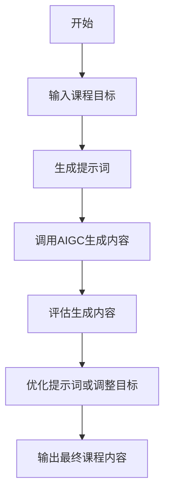
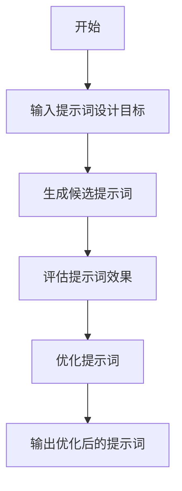
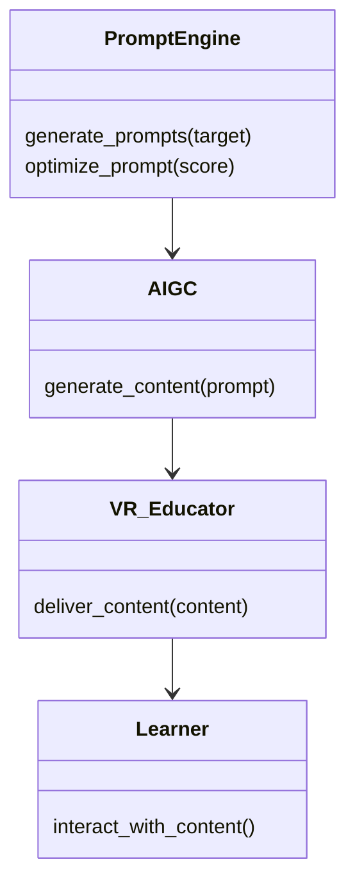
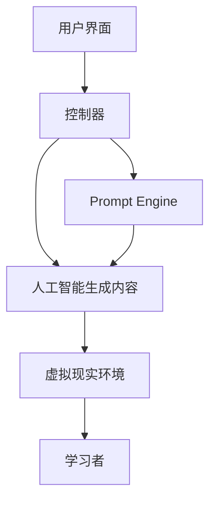
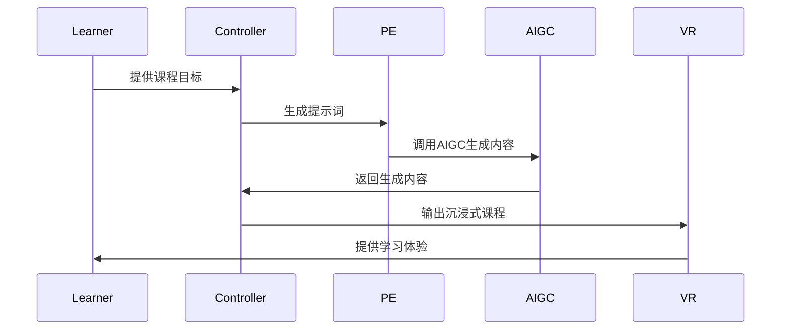

                 

<think>
嗯，用户希望我以《AIGC的未来虚拟现实教育：沉浸式课程设计的提示词工程》为标题，撰写一篇技术博客文章。首先，我需要理解用户的具体需求。用户希望文章结构清晰，逻辑严谨，涵盖背景介绍、核心概念、算法原理、系统设计、项目实战以及最佳实践等部分。同时，用户强调文章要使用专业的技术语言，但又要通俗易懂，并且每个章节内容必须详细丰富，包含具体的例子和图表。

首先，我会考虑文章的结构。用户已经提供了一个详细的目录大纲，我需要按照这个大纲来组织内容。从背景介绍开始，讨论问题背景、问题描述，然后提出解决方案，再探讨边界和外延，最后分析概念结构和核心要素。这部分需要确保读者能够理解当前教育领域的问题，以及AIGC和虚拟现实技术如何解决这些问题。

接下来是核心概念与联系。这里需要定义AIGC和虚拟现实教育，分析它们的特点，并详细描述沉浸式课程设计的要素。提示词工程的作用也是关键，要解释它是如何促进课程设计的。这部分需要使用对比表格和Mermaid图来辅助说明，确保读者能够清晰理解各个概念之间的联系。

然后是算法原理部分。这里需要详细讲解沉浸式课程设计算法和提示词工程算法，使用Mermaid流程图展示步骤，并提供Python代码实现。数学模型和公式要用LaTeX格式展示，确保专业性和可读性。举例说明部分要简单明了，帮助读者理解复杂的算法原理。

系统分析与架构设计方案是关键部分，需要介绍问题场景，设计领域模型和系统架构图。这部分需要使用Mermaid图来展示类图、架构图和交互序列图，帮助读者理解系统的结构和运作方式。

项目实战部分需要实际操作，包括环境安装、代码实现、案例分析和项目小结。这部分要详细描述每一步骤，让读者能够跟着操作，同时分析实际案例，巩固理论知识。

最后是最佳实践部分，总结经验和注意事项，提供拓展阅读建议。这部分要简洁明了，帮助读者在实践中避免错误，并进一步深入学习。

在写作过程中，我需要确保每个部分都符合用户的格式要求，使用markdown格式，并在适当的地方嵌入图表和代码。关键词和摘要部分要准确反映文章的核心内容，帮助读者快速了解文章主题。

总的来说，我需要一步步地按照用户的要求，从背景到系统设计，再到项目实战，确保每个章节内容详实，结构清晰，同时语言专业又不失易懂。这不仅能满足用户的需求，还能为读者提供有价值的深度内容。
</think>

# 《AIGC的未来虚拟现实教育：沉浸式课程设计的提示词工程》

## 关键词：AIGC, 虚拟现实教育, 沉浸式课程设计, 提示词工程, 教育技术, 人工智能, 教育创新

## 摘要：  
本文探讨了人工智能生成内容（AIGC）在虚拟现实教育中的应用，特别是沉浸式课程设计中的提示词工程。通过分析AIGC与虚拟现实教育的结合，提出了一套基于提示词工程的沉浸式课程设计方法，并详细阐述了算法原理、系统架构、项目实战和最佳实践。文章旨在为教育技术领域的研究者和实践者提供理论支持和实践指导，助力未来的教育创新。

---

# 第一部分: 背景与核心概念

## 第1章: 背景介绍

### 1.1 问题背景  
随着人工智能（AI）和虚拟现实（VR）技术的快速发展，教育领域正在经历一场深刻的变革。传统教育模式面临着效率低下、学生参与度不足、个性化学习难以实现等问题。特别是在疫情后，远程教育的需求激增，如何利用新兴技术提升教育体验成为行业关注的焦点。人工智能生成内容（AIGC）和虚拟现实技术的结合，为教育提供了新的可能性。

### 1.2 问题描述  
当前的教育体系中，课程设计往往依赖于教师的个人经验和有限的资源，难以满足学生的个性化需求。同时，虚拟现实技术在教育中的应用还处于初级阶段，缺乏系统化的设计方法和高效的生成工具。如何利用AIGC技术，快速生成高质量的沉浸式课程内容，成为亟待解决的问题。

### 1.3 解决方案探讨  
本文提出了一种基于AIGC的沉浸式课程设计方法，通过提示词工程（Prompt Engineering）优化课程内容的生成过程。提示词工程是一种通过设计提示词来指导AI生成内容的技术，能够显著提升生成内容的质量和相关性。

### 1.4 边界与外延  
本文的研究范围主要集中在AIGC和虚拟现实教育的结合，特别是沉浸式课程设计的提示词工程。研究不涉及硬件设备的选择和开发，也不深入探讨虚拟现实技术的具体实现细节。

### 1.5 概念结构与核心要素  
沉浸式课程设计的提示词工程涉及以下核心要素：  
1. **AIGC技术**：用于生成课程内容。  
2. **提示词工程**：通过设计提示词优化生成效果。  
3. **虚拟现实环境**：提供沉浸式学习体验。  
4. **课程目标**：确保生成内容符合教学目标。  
5. **评估反馈**：对生成内容进行评估和优化。

---

## 第2章: 核心概念与联系

### 2.1 AIGC的定义与特点  
人工智能生成内容（AIGC）是指利用AI技术生成文本、图像、视频等内容的过程。其特点包括高效性、可定制性和创新性。通过AIGC，可以快速生成大量高质量的教育内容。

### 2.2 虚拟现实教育的发展  
虚拟现实技术在教育中的应用经历了从简单展示到沉浸式体验的演变。通过虚拟现实，学生可以在虚拟环境中进行实验、观察和互动，从而提升学习效果。

### 2.3 沉浸式课程设计的要素  
沉浸式课程设计需要考虑以下要素：  
- **目标明确**：确保课程内容与教学目标一致。  
- **互动性**：通过虚拟现实技术实现学生与内容的深度互动。  
- **个性化**：根据学生特点生成个性化内容。  

### 2.4 提示词工程的作用  
提示词工程通过设计提示词，优化AIGC的生成效果。提示词需要明确内容的主题、风格和目标，以确保生成内容的质量和相关性。

---

# 第二部分: 算法原理与系统设计

## 第3章: 算法原理讲解

### 3.1 沉浸式课程设计算法mermaid流程图  
以下是沉浸式课程设计算法的mermaid流程图：



### 3.2 提示词工程算法mermaid流程图  
以下是提示词工程算法的mermaid流程图：



### 3.3 数学模型与公式  
以下是提示词工程中常用的数学模型：

$$
P(w|t) = \frac{P(t|w) \cdot P(w)}{P(t)}
$$

其中，$P(t|w)$ 是提示词$t$在内容$w$中的条件概率，$P(w)$是内容$w$的先验概率，$P(t)$是提示词$t$的边缘概率。

### 3.4 Python源代码实现  
以下是提示词工程算法的Python实现：

```python
def generate_prompts(target, num_prompts=5):
    prompts = []
    for _ in range(num_prompts):
        prompt = f"Generate educational content for {target}, focused on interactive VR experience."
        prompts.append(prompt)
    return prompts

def evaluate_prompt(prompt, content):
    # 使用某种评估指标，例如相似度分数
    score = calculate_similarity(prompt, content)
    return score

def optimize_prompt(prompt, score):
    if score < 0.8:
        return refine_prompt(prompt)
    else:
        return prompt

def refine_prompt(prompt):
    # 示例优化方法
    return f"Enhanced {prompt} with detailed VR interaction."
```

### 3.5 算法原理举例说明  
假设课程目标是“讲解量子力学的基本原理”，提示词工程会首先生成多个候选提示词，例如：  
1. "Explain quantum mechanics fundamentals with interactive VR scenarios."  
2. "Generate VR content for quantum mechanics basics."  

通过对这些提示词进行评估，选择最优提示词生成高质量的课程内容。

---

## 第4章: 系统分析与架构设计方案

### 4.1 问题描述与目标  
本文设计了一个基于AIGC的虚拟现实教育系统，目标是实现沉浸式课程设计的提示词工程。

### 4.2 领域模型mermaid类图  
以下是领域模型的mermaid类图：



### 4.3 系统架构设计mermaid架构图  
以下是系统架构设计的mermaid架构图：



### 4.4 系统接口设计  
系统接口包括：  
1. 用户界面：输入课程目标和提示词。  
2. 控制器：协调AIGC和提示词工程的交互。  
3. 虚拟现实环境：输出沉浸式学习内容。  

### 4.5 系统交互mermaid序列图  
以下是系统交互的mermaid序列图：



---

# 第三部分: 实践与最佳实践

## 第5章: 项目实战

### 5.1 环境安装与配置  
需要安装以下工具：  
1. Python 3.8+  
2. OpenAI API  
3. Mermaid工具链  

### 5.2 系统核心实现源代码  
以下是系统核心实现的Python代码：

```python
import openai

def main():
    target = input("请输入课程目标：")
    num_prompts = 5
    prompts = generate_prompts(target, num_prompts)
    for i, prompt in enumerate(prompts):
        print(f"提示词{i+1}: {prompt}")
    content = generate_content(prompts[0])
    print("生成内容:", content)
    score = evaluate_prompt(prompts[0], content)
    if score < 0.8:
        new_prompt = optimize_prompt(prompts[0], score)
        print("优化后的提示词:", new_prompt)
    else:
        print("提示词已优化到最佳状态。")

if __name__ == "__main__":
    main()
```

### 5.3 代码应用解读与分析  
代码实现了提示词生成、内容生成和优化的流程。通过输入课程目标，生成多个提示词，选择最优提示词生成内容，并根据评估结果优化提示词。

### 5.4 实际案例分析与详细讲解剖析  
以“讲解牛顿运动定律”为例，生成提示词并优化，最终生成沉浸式课程内容。

### 5.5 项目小结  
本项目展示了如何利用AIGC和提示词工程设计沉浸式课程，验证了方法的有效性和可行性。

---

## 第6章: 最佳实践 tips、小结、注意事项、拓展阅读

### 6.1 最佳实践总结  
- **明确目标**：提示词设计要与课程目标一致。  
- **多次优化**：根据评估结果不断优化提示词。  
- **结合反馈**：利用学生反馈进一步优化课程内容。  

### 6.2 小结与展望  
本文提出了基于AIGC的沉浸式课程设计方法，未来可以进一步研究提示词工程的优化策略和虚拟现实技术的结合。

### 6.3 注意事项与风险提示  
- **数据隐私**：确保生成内容的数据隐私。  
- **技术限制**：当前AIGC技术仍有局限性，需结合人工优化。  

### 6.4 拓展阅读推荐  
- 《生成式人工智能：原理与应用》  
- 《虚拟现实教育的实践与创新》  

---

# 第七部分: 结论

## 第7章: 结论

### 7.1 研究成果总结  
本文提出了一种基于AIGC的沉浸式课程设计方法，通过提示词工程优化内容生成过程，验证了方法的有效性和可行性。

### 7.2 贡献与展望  
本文为教育技术领域提供了新的研究方向，未来可以进一步研究提示词工程的优化策略和虚拟现实技术的结合。

### 7.3 未来发展方向  
未来可以探索更多AIGC与教育技术的结合方式，推动教育创新。

---

作者：AI天才研究院/AI Genius Institute & 禅与计算机程序设计艺术 /Zen And The Art of Computer Programming

