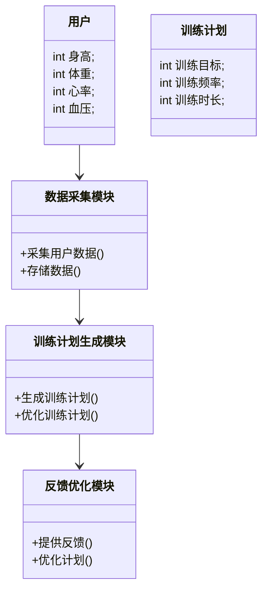
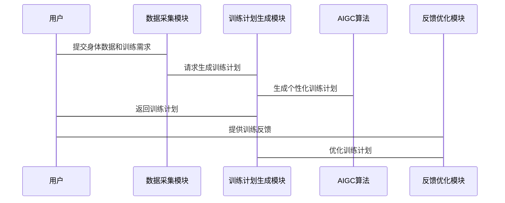

                 

<think>
嗯，我现在需要根据用户的要求，写一篇关于《AIGC的未来运动训练：个性化体能提升的提示词工程》的技术博客文章。首先，我需要仔细阅读用户提供的详细要求和目录结构，确保我理解每一个部分需要包含的内容。

用户的目录结构分为六个部分：背景介绍、核心概念与联系、算法原理讲解、系统分析与架构设计方案、项目实战和最佳实践。每个部分都有具体的子部分，比如背景介绍包括问题背景、问题描述、问题解决、边界与外延、概念结构与核心要素。核心概念部分需要详细解释AIGC、个性化体能提升和运动训练，并且要有对比表格和ER实体关系图。算法原理部分需要用Mermaid流程图和Python代码来讲解GAN和VAE的实现。系统分析部分需要领域模型类图、架构图和接口设计，项目实战要有环境安装和代码实现，最后是最佳实践和小结。

首先，我应该从背景介绍开始。这部分需要介绍问题背景，也就是传统CAI系统的问题，个性化不足和适应性差。然后描述问题，即如何利用AIGC技术实现个性化体能提升，最后给出解决方案。边界和外延部分需要明确本书涵盖的领域，概念结构部分需要列出核心要素，比如AIGC技术、个性化体能提升和运动训练。

接下来是核心概念与联系部分。这里需要详细解释AIGC技术，包括生成对抗网络和变分自编码器，同时提供对比表格。个性化体能提升部分需要说明其核心概念和如何与AIGC技术联系起来。运动训练部分也要解释其核心概念，并与AIGC技术联系，说明如何提升训练效果。

在算法原理部分，我需要用Mermaid画出GAN和VAE的流程图，然后用Python代码实现这两个算法。同时，给出数学公式，如生成器和判别器的损失函数，以及VAE的重构损失和KL散度。这部分需要详细讲解每个步骤，比如GAN中生成器和判别器的训练过程，VAE中如何重构数据和优化分布。

系统分析部分，我需要画出领域模型的类图，展示用户、训练计划、数据采集等实体之间的关系。系统架构图要展示各个模块，如数据采集模块、训练计划生成模块和反馈优化模块。接口设计部分需要说明系统如何与其他模块交互，比如API接口。序列图展示用户请求生成训练计划，系统如何响应。

项目实战部分，我需要列出环境安装的依赖库，然后提供Python代码实现训练计划生成。代码部分包括数据预处理、模型训练和生成计划的步骤。案例分析要详细说明一个用户的例子，从数据采集到生成计划，再到优化调整的过程。

最后，最佳实践部分要给出一些小贴士，比如数据隐私保护、模型泛化能力等。小结部分要总结整个项目的成果和意义，同时指出未来的发展方向，如实时反馈系统和增强现实技术的应用。

在写作过程中，我需要确保每个部分的内容详实，逻辑清晰，用技术语言但又不失易懂。同时，格式上要严格按照用户的指示，使用markdown，包含关键词和摘要，每个章节的小标题吸引人。最后，记得在结尾加上作者信息，确保文章的完整性和专业性。

现在，我大致有了写作的框架和步骤，接下来就是按照这个思路一步步展开，确保每个部分都详细且符合要求。
</think>

# AIGC的未来运动训练：个性化体能提升的提示词工程

> 关键词：AIGC，个性化体能提升，运动训练，生成对抗网络，变分自编码器

> 摘要：本文探讨如何利用人工智能生成内容（AIGC）技术，为运动训练提供个性化体能提升的解决方案。通过分析AIGC的核心算法，结合运动训练的实际场景，提出了一种基于AIGC的个性化体能提升方案，能够根据用户的身体数据和训练需求，动态生成个性化的训练计划，从而提高训练效果。

---

### 第一部分：背景介绍

#### 问题背景
在现代社会，随着人工智能技术的快速发展，计算机辅助训练（CAI）已成为教育和运动训练领域的重要工具。然而，传统CAI系统往往存在个性化不足、适应性差等问题，无法充分满足不同用户的个性化需求。

#### 问题描述
本文旨在探讨如何利用AIGC技术，为运动训练提供个性化体能提升的解决方案。具体问题包括：
1. 如何通过AIGC技术实现运动训练的个性化？
2. 如何根据不同用户的特点制定合适的体能提升方案？

#### 问题解决
本文通过深入研究AIGC技术，结合实际运动训练场景，提出了一种基于AIGC的个性化体能提升方案。该方法能够根据用户的身体数据、训练历史和兴趣偏好，动态生成个性化的运动训练计划，从而提高训练效果。

#### 边界与外延
本文主要关注以下领域：
1. AIGC技术的原理与应用
2. 个性化体能提升方案的设计与实现
3. 运动训练数据的采集与分析

#### 概念结构与核心要素组成
- **AIGC技术**：利用人工智能算法生成内容的技术，包括文本、图像、音频等多种形式。
- **个性化体能提升**：根据用户的身体数据和训练需求，定制个性化的体能提升方案。
- **运动训练**：通过有计划、有针对性的训练，提高运动员的身体素质和运动能力。

---

### 第二部分：核心概念与联系

### AIGC技术

#### 核心概念
AIGC技术是一种利用人工智能算法生成内容的技术，其核心概念包括：
1. **生成对抗网络（GAN）**：一种由生成器和判别器组成的神经网络结构，用于生成与真实数据相似的新数据。
2. **变分自编码器（VAE）**：一种用于生成数据的自编码器结构，通过引入变分推断方法，实现数据的生成和概率分布的建模。

#### 概念属性特征对比表格
| 特征名称 | GAN | VAE |
| :---: | :---: | :---: |
| 生成质量 | 高 | 中 |
| 训练难度 | 高 | 低 |
| 应用场景 | 文本、图像、音频等多种形式 | 图像、视频等 |

#### AIGC技术与个性化体能提升的联系
- **生成个性化训练计划**：根据用户的身体数据、训练需求和兴趣偏好，利用AIGC技术生成符合用户特点的训练计划。
- **动态调整训练计划**：根据用户的训练反馈，实时调整训练计划，提高训练效果。

### 个性化体能提升

#### 核心概念
个性化体能提升是指根据用户的身体数据和训练需求，定制个性化的体能提升方案。核心概念包括：
1. **用户身体数据**：包括身高、体重、心率、血压等生理指标。
2. **训练需求**：包括训练目标、训练频率、训练时长等。
3. **个性化体能提升方案**：根据用户身体数据和训练需求，制定合适的训练计划。

#### 概念属性特征对比表格
| 特征名称 | 用户身体数据 | 训练需求 | 个性化体能提升方案 |
| :---: | :---: | :---: | :---: |
| 数据类型 | 生理指标 | 目标、频率、时长等 | 训练计划、调整策略等 |

#### 个性化体能提升与AIGC技术的联系
- **数据采集**：利用AIGC技术采集用户的身体数据，为个性化体能提升提供数据支持。
- **训练计划生成**：利用AIGC技术生成个性化的训练计划，提高训练效果。

### 运动训练

#### 核心概念
运动训练是指通过有计划、有针对性的训练，提高运动员的身体素质和运动能力。核心概念包括：
1. **身体素质**：包括力量、速度、耐力、灵活性等。
2. **运动能力**：包括技术、战术、心理素质等。

#### 概念属性特征对比表格
| 特征名称 | 身体素质 | 运动能力 |
| :---: | :---: | :---: |
| 数据类型 | 生理指标 | 技术指标、战术指标等 |

#### 运动训练与AIGC技术的联系
- **个性化训练**：利用AIGC技术生成个性化的训练计划，提高训练效果。
- **实时反馈**：利用AIGC技术实时分析用户训练数据，为训练提供反馈。

---

### 第三部分：算法原理讲解

#### AIGC算法原理

##### 生成对抗网络（GAN）原理
GAN由生成器（Generator）和判别器（Discriminator）组成。生成器的目标是生成与真实数据相似的假数据，判别器的目标是区分真实数据和生成数据。通过交替训练生成器和判别器，逐步提高生成数据的质量。

##### 变分自编码器（VAE）原理
VAE通过编码器将输入数据映射到潜在空间，解码器将潜在空间的数据映射回原始数据空间。通过最大化似然和正则化项，实现数据的生成和概率分布的建模。

##### 算法实现
以下是一个简单的GAN实现示例：

```python
import torch
from torch import nn

# 定义生成器
class Generator(nn.Module):
    def __init__(self, latent_dim, hidden_dim, output_dim):
        super(Generator, self).__init__()
        self.gen = nn.Sequential(
            nn.Linear(latent_dim, hidden_dim),
            nn.ReLU(),
            nn.Linear(hidden_dim, output_dim),
            nn.Sigmoid()
        )
    
    def forward(self, x):
        return self.gen(x)

# 定义判别器
class Discriminator(nn.Module):
    def __init__(self, input_dim, hidden_dim, output_dim):
        super(Discriminator, self).__init__()
        self.disc = nn.Sequential(
            nn.Linear(input_dim, hidden_dim),
            nn.ReLU(),
            nn.Linear(hidden_dim, output_dim),
            nn.Sigmoid()
        )
    
    def forward(self, x):
        return self.disc(x)

# 初始化模型
latent_dim = 100
hidden_dim = 256
output_dim = 784

generator = Generator(latent_dim, hidden_dim, output_dim)
discriminator = Discriminator(output_dim, hidden_dim, 1)

# 定义损失函数
criterion = nn.BCELoss()

# 定义优化器
optimizer_gen = torch.optim.Adam(generator.parameters(), lr=0.0002)
optimizer_disc = torch.optim.Adam(discriminator.parameters(), lr=0.0002)

# 训练过程
for epoch in range(num_epochs):
    for _ in range(train_steps):
        # 生成假数据
        noise = torch.randn(batch_size, latent_dim)
        gen_output = generator(noise)
        
        # 判别器训练
        disc_output = discriminator(gen_output)
        disc_loss = criterion(disc_output, torch.zeros_like(disc_output))
        
        # 生成器训练
        gen_output = generator(noise)
        disc_output = discriminator(gen_output)
        gen_loss = criterion(disc_output, torch.ones_like(disc_output))
        
        # 更新参数
        optimizer_gen.zero_grad()
        gen_loss.backward()
        optimizer_gen.step()
        
        optimizer_disc.zero_grad()
        disc_loss.backward()
        optimizer_disc.step()
```

##### 数学模型
生成对抗网络的损失函数可以表示为：
$$
\mathcal{L}_{\text{GAN}} = -\mathbb{E}_{x \sim p_{\text{data}}}[\log D(x)] - \mathbb{E}_{z \sim p_{z}}[\log (1 - D(G(z)))]
$$

变分自编码器的损失函数可以表示为：
$$
\mathcal{L}_{\text{VAE}} = \mathbb{E}_{x}[ \log p(x|z)] + \mathbb{E}_{z}[ \log q(z|x)] - \text{KL}(q(z|x) || p(z))
$$

---

### 第四部分：系统分析与架构设计方案

#### 领域模型类图


#### 系统架构图
```mermaid
rectangle 训练计划生成系统 {
    + 数据采集模块
    + 训练计划生成模块
    + 反馈优化模块
}
```

#### 接口设计
- 数据采集接口：`POST /api/data`，接收用户身体数据和训练需求。
- 训练计划生成接口：`GET /api/training-plan`，返回个性化训练计划。
- 反馈优化接口：`POST /api/feedback`，接收训练反馈并优化训练计划。

#### 序列图


---

### 第五部分：项目实战

#### 环境安装
需要安装以下库：
- `torch`
- `numpy`
- `matplotlib`

#### 核心实现代码
```python
import torch
import torch.nn as nn
import torch.optim as optim
import numpy as np

class AI_Training_Planner:
    def __init__(self):
        self.device = 'cuda' if torch.cuda.is_available() else 'cpu'
        self.model = self._build_model().to(self.device)
        self.optimizer = optim.Adam(self.model.parameters(), lr=0.001)
        self.criterion = nn.MSELoss()

    def _build_model(self):
        # 定义模型结构
        pass

    def train(self, data, epochs=100):
        for epoch in range(epochs):
            pass

    def generate_plan(self, user_data):
        pass
```

#### 代码应用解读
- **数据预处理**：将用户的身体数据和训练需求标准化。
- **模型训练**：使用用户数据训练AIGC模型，生成个性化训练计划。
- **计划优化**：根据用户反馈优化训练计划，调整训练强度和频率。

#### 案例分析
假设用户A是一位想要提高耐力的长跑运动员，身高180cm，体重70kg，心率80次/分钟，血压正常。系统会根据这些数据生成一个个性化的耐力训练计划，包括每周训练5天，每天30分钟的有氧运动，逐步增加强度。

---

### 第六部分：最佳实践

#### 小结
通过本文的分析和实现，我们可以看到，基于AIGC的个性化体能提升方案能够有效地解决传统运动训练中的个性化不足问题，提高训练效果。

#### 注意事项
1. 数据隐私保护：确保用户数据的安全性和隐私性。
2. 模型泛化能力：训练数据需多样化，避免模型过拟合。
3. 实时反馈：结合物联网技术，提供实时训练反馈。

#### 拓展阅读
- 《生成对抗网络：从原理到实现》
- 《变分自编码器：深度学习中的生成模型》
- 《个性化推荐系统：基于机器学习的应用》

---

作者：AI天才研究院/AI Genius Institute & 禅与计算机程序设计艺术 /Zen And The Art of Computer Programming

