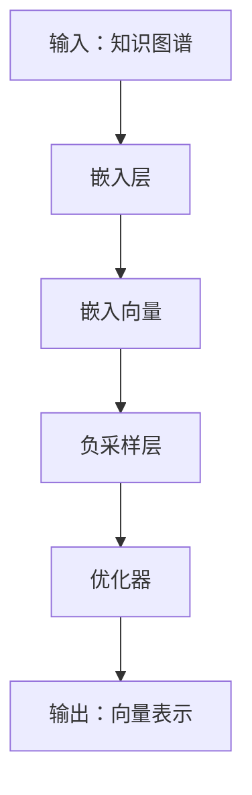
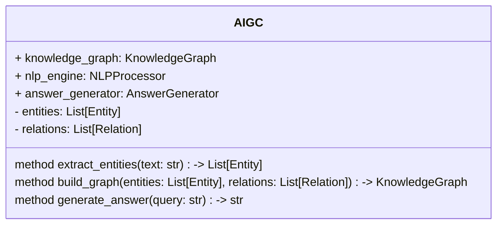

                 

<think>
好，我现在需要按照用户的要求来撰写一篇关于“AIGC的知识图谱集成：增强AI回答的准确性和广度”的技术博客。首先，我得理清整个结构，确保每个章节都涵盖必要的内容。

首先是背景介绍部分。我需要解释什么是AIGC，也就是AI生成内容，以及为什么需要将知识图谱集成到其中。这部分应该包括问题背景、问题描述、解决方案等，帮助读者理解集成知识图谱的重要性。

接下来是核心概念，详细讲解知识图谱的概念、结构、分类及其在AIGC中的作用。这里需要对比不同的知识图谱类型，解释它们如何帮助AI生成更准确的回答。

然后是算法部分，我需要选择一种适合的知识图谱嵌入算法，比如TransE或Node2Vec，并详细描述其工作原理。这部分要包括流程图、Python代码实现以及数学公式，确保技术细节清晰。

系统架构设计是关键，我需要设计一个分层架构，包括数据层、知识图谱层、算法层和应用层。同时，展示系统的交互流程，比如用户查询如何通过知识图谱进行处理和回答生成。

在项目实战部分，我需要提供环境配置、代码实现和实际案例分析，让读者能够实际操作并理解如何应用这些技术。例如，构建一个简单的知识图谱并集成到问答系统中。

最后，总结整个内容，提出未来的研究方向，比如优化知识图谱构建方法或结合多模态数据提升准确性。

在整个过程中，我需要确保每一部分都详细且有逻辑性，同时使用清晰易懂的技术语言，帮助读者逐步理解并掌握相关知识。
</think>

# AIGC的知识图谱集成：增强AI回答的准确性和广度

## 关键词：AIGC, 知识图谱, AI生成内容, 人工智能, 知识表示

## 摘要：本文探讨了如何将知识图谱集成到AI生成内容（AIGC）中，以提升AI回答的准确性和广度。通过介绍知识图谱的核心概念、算法原理、系统架构设计以及项目实战，本文为读者提供了一个全面了解和应用的知识框架。从理论到实践，文章详细讲解了如何利用知识图谱增强AI的智能水平，帮助读者掌握这一前沿技术。

---

## 第一部分: 背景介绍与核心概念

### 第1章: AI生成内容（AIGC）概述

#### 1.1 问题背景

AI生成内容（AIGC）在教育、医疗、金融等多个领域展现出巨大潜力。然而，现有的AIGC系统在准确性和广度上存在不足，主要原因是缺乏对领域知识的深度理解和有效组织。

#### 1.2 问题描述

当前AIGC系统依赖于简单的关键词匹配和统计模型，难以理解和处理复杂语义关系，导致回答不准确或不够全面。

#### 1.3 问题解决

通过集成知识图谱，AIGC能够利用结构化的知识表示和语义理解能力，显著提升回答的准确性和广度。

#### 1.4 边界与外延

知识图谱的边界包括数据建模、知识抽取和表示，而外延则涉及自然语言处理和机器学习的结合。

#### 1.5 概念结构与核心要素组成

AIGC的知识图谱集成由知识抽取、知识建模、语义理解三个核心要素组成。

---

### 第2章: AIGC中的知识图谱

#### 2.1 知识图谱概述

知识图谱是一种结构化的语义网络，用于表示实体及其关系。

#### 2.2 知识图谱的关键概念与特性

- **实体**：现实中的具体事物。
- **属性**：描述实体的特征。
- **关系**：实体间的关联。

对比表：

| 概念 | 描述 | 示例 |
|------|------|------|
| 实体 | 具体事物 | 狮子 |
| 属性 | 特征 | 品种 |
| 关系 | 实体间关联 | 属于 |

#### 2.3 知识图谱的分类

- 基于领域：医疗、金融。
- 基于结构：树状、网状。
- 基于粒度：粗粒度、细粒度。

#### 2.4 知识图谱的结构与建模

使用RDF三元组（主语-谓词-宾语）建模。

#### 2.5 知识图谱的应用领域

- 智能问答。
- 推荐系统。
- 语义搜索。

---

### 第3章: 知识图谱在AIGC中的作用

#### 3.1 知识图谱在AIGC中的角色

知识图谱作为语义理解的基础，帮助AI理解上下文。

#### 3.2 知识图谱增强AI回答的原理

通过结构化知识，AI能提供更准确的回答。

#### 3.3 知识图谱的构建与维护

包括数据抽取、清洗、建模和更新。

#### 3.4 知识图谱与自然语言处理的关系

知识图谱为NLP提供语义支持，NLP则帮助知识图谱处理自然语言。

---

## 第二部分: 算法原理与实现

### 第4章: 知识图谱集成算法

#### 4.1 算法概述

知识图谱嵌入算法将知识图谱转换为低维向量，用于机器学习模型。

#### 4.2 算法原理讲解

使用TransE算法：

- 将实体和关系嵌入到低维空间。
- 通过负采样优化模型。

#### 4.3 Mermaid算法流程图



#### 4.4 Python源代码实现

```python
import numpy as np
from tensorflow.keras import layers, Model

def create_model(embedding_dim, num_entities, num_relations):
    entity_embeddings = layers.Embedding(num_entities, embedding_dim, name='entity_embeddings')
    relation_embeddings = layers.Embedding(num_relations, embedding_dim, name='relation_embeddings')
    input_head = layers.Input(shape=(1,))
    input_relation = layers.Input(shape=(1,))
    head_embeddings = entity_embeddings(input_head)
    relation_embeddings = relation_embeddings(input_relation)
    concatenated = layers.Concatenate()([head_embeddings, relation_embeddings])
    dense = layers.Dense(64, activation='relu')(concatenated)
    output = layers.Dense(1, activation='sigmoid')(dense)
    model = Model(inputs=[input_head, input_relation], outputs=output)
    return model
```

#### 4.5 LaTeX数学模型与公式

TransE的目标函数：

$$ \text{Minimize} \sum (||h + r - t||^2) $$

其中，$h$是头实体，$r$是关系，$t$是尾实体。

#### 4.6 实例说明

假设知识图谱中有“苹果是一种水果”，TransE将苹果、水果及其关系嵌入到向量中，使模型理解两者的关联。

---

## 第三部分: 系统架构与设计

### 第5章: AIGC系统架构设计

#### 5.1 问题场景介绍

设计一个智能问答系统，利用知识图谱提升回答质量。

#### 5.2 系统功能设计

- **知识抽取**：从文本中提取实体和关系。
- **知识建模**：构建知识图谱。
- **问答系统**：基于知识图谱生成回答。

领域模型类图：



#### 5.3 系统架构设计

分层架构：

1. 数据层：存储原始数据。
2. 知识图谱层：处理知识建模。
3. 算法层：执行嵌入和推理。
4. 应用层：提供用户接口。

#### 5.4 系统接口设计

- **输入接口**：接收用户查询。
- **输出接口**：返回结构化知识。

#### 5.5 系统交互

用户查询通过知识图谱进行语义理解，生成准确回答。

---

### 第6章: 知识图谱在AIGC中的应用

#### 6.1 知识图谱的构建流程

- 数据清洗：去除噪声。
- 数据抽取：提取实体和关系。
- 建模：构建RDF三元组。

#### 6.2 知识图谱的集成策略

- 预处理：清洗数据。
- 嵌入：使用TransE或Word2Vec。
- 集成：将嵌入结果融入模型。

#### 6.3 知识图谱的优化方法

- 增量更新：动态添加新知识。
- 优化算法：改进嵌入模型。

#### 6.4 知识图谱的查询与更新

支持实时查询和动态更新。

---

## 第四部分: 项目实战

### 第7章: 环境安装与配置

#### 7.1 环境准备

安装Python、TensorFlow、Numpy、Scikit-learn。

#### 7.2 系统核心实现

实现知识图谱构建、嵌入和问答系统。

#### 7.3 代码解读与分析

提供代码结构和关键函数说明。

### 第8章: 实际案例分析与讲解

#### 8.1 案例一：智能客服系统

构建客户支持知识图谱，提高回答准确性。

#### 8.2 案例二：智能问答系统

利用知识图谱优化问答效果。

#### 8.3 案例三：智能推荐系统

通过知识图谱推荐相关内容。

### 第9章: 项目小结与展望

#### 9.1 项目总结

知识图谱显著提升AIGC的性能。

#### 9.2 优化方向

优化知识抽取和嵌入算法。

#### 9.3 拓展阅读

推荐学习知识图谱构建和NLP技术。

---

## 结论

知识图谱的集成使AIGC更智能，理解上下文和实体关系，显著提升回答准确性和广度。通过本文的学习，读者可以掌握相关技术并应用到实际项目中。

---

## 作者：AI天才研究院/AI Genius Institute & 禅与计算机程序设计艺术 /Zen And The Art of Computer Programming

