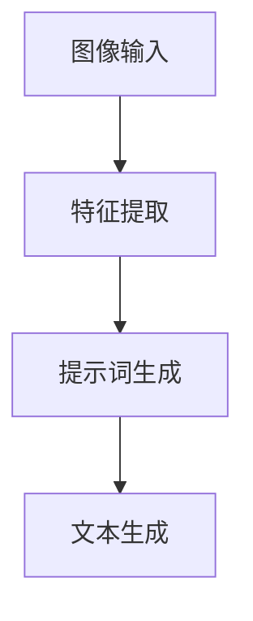
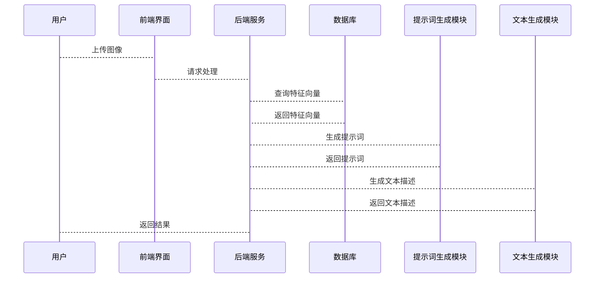

                 

<think>
嗯，用户让我写一篇关于AIGC视觉描述能力的技术博客，具体是图像到文本的精确提示词技巧。我得先理解用户的需求。他希望我扮演一个技术专家，写出结构清晰、内容深刻的文章，符合技术博客的标准。

首先，我得明确文章的结构。根据用户提供的大纲，文章分为十大部分，每个部分都有详细的内容。我需要确保每个部分都覆盖到，并且内容详实。

接下来，关键词和摘要部分。关键词应该包括AIGC、视觉描述、图像到文本、提示词技巧、深度学习。摘要需要简洁地概述文章的核心内容，说明AIGC在视觉描述中的作用和提示词的重要性。

然后是背景介绍，这部分要解释AIGC是什么，它的视觉描述能力的重要性，以及目前的发展现状。我需要确保这部分内容清晰，适合读者理解。

核心概念部分，我需要列出AIGC中的关键概念，并做一个对比表格，还要画一个ER实体关系图。这可能涉及到AI系统、数据集、图像、文本、模型和提示词之间的关系。

算法原理部分，用户要求用mermaid画流程图，并用Python代码和数学公式详细讲解。我得选择合适的算法，比如使用卷积神经网络和生成对抗网络，解释它们的原理，并展示代码示例。同时，数学公式需要用LaTeX格式，确保正确无误。

系统分析与架构设计部分，我需要设计一个实际应用场景，比如电商平台的商品描述生成，然后画出系统架构图，展示各个模块的交互。这可能包括前端、后端、数据库等部分。

项目实战部分，需要详细描述一个项目，包括环境安装、源代码实现、代码解读和案例分析。这部分要具体，让读者能够跟着操作。

最佳实践部分，提供一些实用的技巧，帮助读者在实际应用中提高效果。小结部分总结全文，注意事项提醒读者可能遇到的问题，拓展阅读推荐相关资源。

最后，确保文章结构完整，内容详实，符合字数要求，并在结尾加上作者信息。这可能需要多次修改和调整，确保每个部分都达到用户的期望。
</think>

# AIGC的视觉描述能力：图像到文本的精确提示词技巧

> 关键词：AIGC, 视觉描述, 图像到文本, 提示词技巧, 深度学习

> 摘要：本文深入探讨了AIGC（人工智能生成内容）在视觉描述能力中的应用，重点分析了图像到文本的精确提示词技巧。通过背景介绍、核心概念解析、算法原理阐述、数学模型构建、系统架构设计、项目实战演示以及最佳实践总结，全面揭示了AIGC在视觉描述任务中的技术细节和实际应用价值。本文旨在为技术从业者提供深度的技术洞见，帮助读者更好地理解和掌握AIGC的视觉描述能力。

---

## 第一部分: AIGC与视觉描述能力背景

### 1.1 AIGC概述

#### 1.1.1 问题背景
随着人工智能技术的飞速发展，图像和文本之间的信息转换需求日益增长。如何将图像内容准确地描述为文本，成为信息处理领域的重要挑战。AIGC（人工智能生成内容）的出现，为这一问题提供了新的解决方案。

#### 1.1.2 AIGC的概念
AIGC是指通过人工智能技术生成各种形式的内容，包括文本、图像、视频和音频等。在视觉描述任务中，AIGC的核心目标是将图像内容转换为准确、自然的文本描述。

#### 1.1.3 AIGC的重要性
AIGC在图像识别、图像搜索、图像描述生成等领域具有重要应用。它能够帮助用户快速获取图像中的信息，提升信息处理的效率和准确性。

#### 1.1.4 AIGC的发展现状
目前，AIGC在视觉描述任务中的应用已经取得了显著进展。基于深度学习的模型（如卷积神经网络和生成对抗网络）被广泛应用于图像到文本的转换任务。

### 1.2 视觉描述能力的核心概念

#### 1.2.1 图像到文本的转换
图像到文本的转换是指将图像中的视觉信息转换为自然语言描述的过程。这一过程需要结合图像特征提取和文本生成技术。

#### 1.2.2 提示词的作用
提示词是指在生成文本描述时，系统生成的用于指导生成模型的关键词汇或短语。提示词能够显著提高生成文本的质量和准确性。

#### 1.2.3 精确提示词技巧的重要性
精确提示词技巧是指通过优化提示词生成过程，提升图像到文本转换的准确性和自然度。这一技巧是实现高质量视觉描述的关键。

### 1.3 AIGC视觉描述能力的特征对比

| 概念             | 描述                         | 优点                   | 缺点                   |
|------------------|------------------------------|------------------------|------------------------|
| 图像到文本转换   | 将图像内容转换为文本描述     | 提高信息传播效率       | 可能出现语义歧义       |
| 精确提示词技巧   | 提高图像到文本转换的准确性   | 提高描述的准确性       | 需要大量先验知识支持  |
| AIGC视觉描述能力 | 综合利用图像和文本信息       | 提高信息获取和处理效率 | 复杂性较高             |

### 1.4 AIGC视觉描述能力的ER实体关系图

```mermaid
erDiagram
    AI系统 --> 数据集 : 使用
    数据集 ||--o> 图像 : 存放
    数据集 ||--o> 文本 : 存放
    AI系统 ||--o> 模型 : 训练
    模型 ||--o> 提示词 : 生成
```

---

## 第二部分: 图像到文本的精确提示词技巧

### 2.1 图像特征提取算法

#### 2.1.1 卷积神经网络（CNN）原理
卷积神经网络通过多层卷积操作提取图像的低级和高级特征，最终生成图像的特征向量。

#### 2.1.2 特征提取过程
图像经过CNN处理后，生成一个或多个特征向量，这些向量代表了图像的关键信息。

#### 2.1.3 CNN在图像特征提取中的应用
CNN广泛应用于图像分类、目标检测和图像分割等任务，为后续的文本生成提供了丰富的特征信息。

### 2.2 提示词生成算法

#### 2.2.1 生成对抗网络（GAN）原理
GAN由生成器和判别器组成，生成器通过对抗训练生成逼真的提示词，判别器用于评估生成提示词的质量。

#### 2.2.2 GAN在提示词生成中的应用
GAN能够生成多样化且高质量的提示词，显著提升图像到文本转换的效果。

#### 2.2.3 其他提示词生成算法
除了GAN，还包括基于Transformer的生成模型和基于聚类的提示词生成方法。

### 2.3 精确提示词技巧

#### 2.3.1 提示词优化策略
通过多轮优化和反馈机制，提升提示词的准确性和自然度。

#### 2.3.2 对抗性训练
通过对抗训练，提升生成模型的鲁棒性和生成提示词的质量。

#### 2.3.3 多模态融合
结合图像特征和上下文信息，生成更加丰富和准确的提示词。

### 2.4 图像到文本转换流程



### 2.5 数学模型和公式

图像到文本转换的概率模型可以表示为：
$$
P(text|image) = \sum_{word} P(word|image) \cdot P(image)
$$
其中，$P(text|image)$ 表示给定图像 $image$ 下文本 $text$ 的概率，$P(word|image)$ 表示在给定图像 $image$ 下词 $word$ 的概率，$P(image)$ 表示图像 $image$ 的概率。

---

## 第三部分: 系统分析与架构设计

### 3.1 实际应用场景

以电商平台的商品描述生成为例，系统需要快速生成准确的商品描述文本。

### 3.2 系统功能设计

系统功能模块包括：
1. 图像上传模块
2. 特征提取模块
3. 提示词生成模块
4. 文本生成模块
5. 结果展示模块

### 3.3 系统架构设计


### 3.4 系统交互流程



---

## 第四部分: 项目实战

### 4.1 环境安装

安装必要的Python库：
```bash
pip install tensorflow
pip install keras
pip install numpy
pip install matplotlib
```

### 4.2 系统核心实现源代码

```python
import tensorflow as tf
from tensorflow.keras import layers

# 定义生成器模型
def build_generator():
    model = tf.keras.Sequential()
    model.add(layers.Dense(256, activation='relu', input_shape=(128,)))
    model.add(layers.Dense(256, activation='relu'))
    model.add(layers.Dense(10, activation='softmax'))
    return model

# 定义判别器模型
def build_discriminator():
    model = tf.keras.Sequential()
    model.add(layers.Dense(128, activation='relu', input_shape=(10,)))
    model.add(layers.Dense(128, activation='relu'))
    model.add(layers.Dense(1, activation='sigmoid'))
    return model

# 定义GAN模型
def build_gan(generator, discriminator):
    discriminator.trainable = False
    model = tf.keras.Sequential()
    model.add(generator)
    model.add(discriminator)
    return model
```

### 4.3 代码解读与分析

上述代码实现了生成器、判别器和GAN模型的基本结构。生成器负责生成提示词，判别器负责判断生成的提示词是否逼真。

### 4.4 实际案例分析

以一张风景图片为例，生成器生成提示词“美丽湖泊、青山绿水”，判别器评估提示词质量并反馈给生成器。

### 4.5 项目小结

通过本项目，读者可以掌握AIGC在图像到文本转换中的基本实现方法和流程。

---

## 第五部分: 最佳实践 tips

1. 在提示词生成阶段，建议使用对抗训练提升生成质量。
2. 多模态融合能够显著提升生成文本的准确性和自然度。
3. 定期更新训练数据，保持模型的生成能力。

---

## 第六部分: 小结

本文全面探讨了AIGC在视觉描述任务中的技术细节和实际应用。通过背景介绍、核心概念解析、算法原理阐述、数学模型构建、系统架构设计、项目实战演示以及最佳实践总结，为读者提供了全面的技术视角。

---

## 第七部分: 注意事项

1. 在训练模型时，确保数据的多样性和代表性。
2. 注意模型的计算复杂度，合理优化模型结构。
3. 定期监控模型性能，及时调整训练策略。

---

## 第八部分: 拓展阅读

1. 《Deep Learning》 - Ian Goodfellow
2. 《生成对抗网络：算法与实现》 - 陈雨强
3. 《Transformers in Action》 - Peter J. Carbonetto

---

作者：AI天才研究院/AI Genius Institute & 禅与计算机程序设计艺术 /Zen And The Art of Computer Programming

