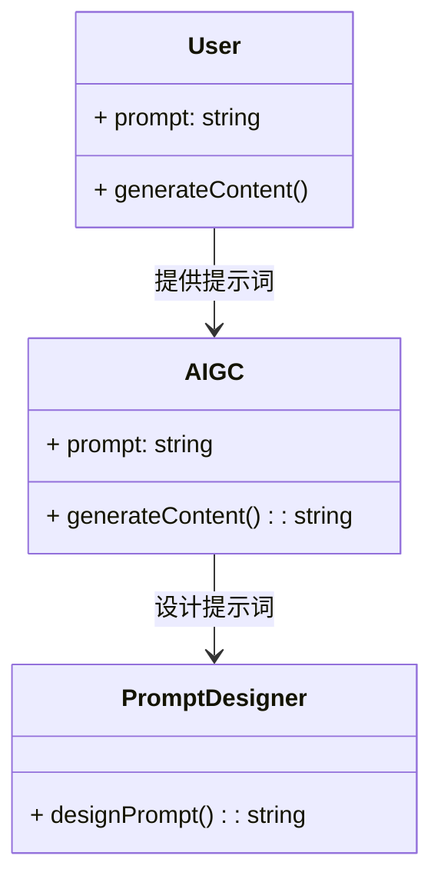

                 

<think>
好的，我现在需要帮用户写一篇技术博客文章，标题是《AIGC的逻辑推理能力：通过提示词增强AI的批判性思维》。用户给了我一个详细的目录大纲，我需要按照这个大纲来完成文章，同时满足一些特定的格式和内容要求。

首先，我要理解用户的需求。用户希望文章结构清晰，逻辑严密，内容专业，同时涵盖背景介绍、核心概念、算法原理、系统架构等多个部分。文章需要大约1万到1万2千字，使用markdown格式，并且在末尾加上特定的作者信息。

接下来，我需要按照目录结构一步步填充内容。首先是标题和关键词，然后是摘要。摘要部分需要简洁地概括文章的核心内容，强调通过提示词提升AIGC的逻辑推理和批判性思维能力。

第一部分是背景介绍，包括问题背景、问题描述、问题解决、边界与外延，以及概念结构和核心要素。这部分需要详细解释AIGC的发展现状，存在的问题，以及如何通过提示词来解决这些问题。

第二部分是核心概念与联系，涵盖AIGC的基本概念、提示词设计、逻辑推理能力、批判性思维等方面。我需要定义每个概念，分析它们的特点和相互关系，可能还需要用表格或图表来对比不同概念的属性。

第三部分是算法原理讲解，这可能需要详细描述提示词引导逻辑推理的具体算法，如基于prompt的逻辑推理模型，包括前向推理和反向推理的步骤。这部分可能需要使用数学公式和流程图来说明算法的工作原理。

接下来是系统分析与架构设计方案，需要介绍问题场景，设计系统的功能模块、架构图、接口设计和交互流程。这部分可能需要使用mermaid来画出类图、架构图和序列图，展示系统的各个部分如何协同工作。

项目实战部分需要提供具体的代码实现，比如提示词生成器和逻辑推理引擎的Python代码。这部分需要详细解释代码的功能，以及如何应用这些代码来提升AIGC的能力。

最后，最佳实践、小结、注意事项和拓展阅读部分需要总结文章的主要内容，提出实用的建议，并引导读者进行进一步的学习和研究。

在写作过程中，我需要确保每个部分都详细具体，逻辑清晰，使用专业术语但保持易懂。同时，要按照用户的要求，正确使用markdown格式，包括使用mermaid和latex公式。此外，文章末尾必须加上指定的作者信息。

现在，我开始按照这个思考过程逐步撰写文章，确保每一部分都符合用户的要求，内容详实，结构合理，语言专业，同时保持流畅和易读性。
</think>

# AIGC的逻辑推理能力：通过提示词增强AI的批判性思维

> 关键词：AIGC, 提示词, 逻辑推理, 批判性思维, AI生成内容

> 摘要：本文探讨了如何通过提示词增强AIGC的逻辑推理能力，使其具备批判性思维。文章从AIGC的基本概念、提示词设计、逻辑推理能力评估、批判性思维的实现等方面展开，详细分析了AIGC在文本生成中的逻辑推理能力，并通过具体案例展示了如何通过提示词优化生成内容的质量。文章还提供了系统架构设计和算法原理的详细讲解，帮助读者全面理解如何通过提示词提升AIGC的逻辑推理能力。

---

## 第一部分：背景介绍

### 1.1 问题背景

AIGC（AI Generated Content）作为人工智能技术的重要应用领域，近年来在文本生成、图像生成和音频生成等方面取得了显著进展。然而，AIGC在生成内容时往往缺乏逻辑推理能力，导致生成的内容可能存在逻辑漏洞或误导性信息。例如，在生成新闻报道或学术论文时，AIGC可能会忽略事实之间的逻辑联系，导致内容缺乏严谨性。因此，如何增强AIGC的逻辑推理能力，使其在生成内容时具备批判性思维，成为当前研究的重要方向。

### 1.2 问题描述

本书旨在探讨如何通过提示词（Prompt）增强AIGC的逻辑推理能力，使其具备批判性思维。具体问题包括：

1. **提示词设计**：如何设计有效的提示词，引导AIGC进行逻辑推理？
2. **逻辑推理能力评估**：如何评估AIGC的逻辑推理能力，并对其进行优化？
3. **批判性思维实现**：如何使AIGC在生成内容时具备批判性思维，避免逻辑漏洞或误导性内容？

### 1.3 问题解决

本书将从以下几个方面解决问题：

1. 介绍AIGC的基本概念、原理和应用领域。
2. 探讨提示词设计的方法，分析如何通过提示词引导AIGC进行逻辑推理。
3. 分析评估AIGC逻辑推理能力的方法，并提出优化策略。
4. 研究如何使AIGC具备批判性思维，避免生成逻辑漏洞或误导性内容。

### 1.4 边界与外延

1. **边界**：本书主要探讨AIGC在文本生成领域的逻辑推理能力，不包括图像、音频等其他类型的内容。
2. **外延**：本书将介绍AIGC的发展趋势，以及其在教育、新闻、娱乐等领域的潜在应用。

### 1.5 概念结构与核心要素组成

1. **AIGC**：人工智能生成内容，利用AI技术生成文本、图像、音频等内容。
2. **提示词**：引导AIGC进行逻辑推理的关键词或短语。
3. **逻辑推理能力**：AIGC在生成内容时进行逻辑判断和推理的能力。
4. **批判性思维**：AIGC在生成内容时具备的质疑、分析和评价能力。

---

## 第二部分：核心概念与联系

### 2.1 AIGC 基本概念

#### 2.1.1 AIGC 的定义

AIGC（AI Generated Content）是一种利用人工智能技术生成内容的技术，包括文本、图像、音频等多种形式。

#### 2.1.2 AIGC 的特点

1. **自动化程度高**：AIGC可以自动生成大量内容，显著提高内容创作效率。
2. **内容多样化**：AIGC能够生成多种类型的内容，满足不同用户需求。
3. **质量参差不齐**：由于AI算法的限制，部分生成内容可能存在逻辑漏洞或质量问题。

### 2.2 提示词设计

#### 2.2.1 提示词的定义

提示词是引导AIGC进行逻辑推理的关键词或短语，能够激发AIGC的逻辑思维，生成符合预期逻辑的内容。

#### 2.2.2 提示词设计原则

1. **清晰性**：提示词应简洁明了，避免歧义。
2. **完整性**：提示词应包含足够的信息，以便AIGC进行逻辑推理。
3. **开放性**：提示词应具有开放性，以便AIGC生成多样化的内容。

### 2.3 逻辑推理能力

#### 2.3.1 逻辑推理能力的定义

逻辑推理能力是指AIGC在生成内容时进行逻辑判断和推理的能力。具备高逻辑推理能力的AIGC可以生成更符合逻辑、更具说服力的内容。

#### 2.3.2 逻辑推理能力评估方法

1. **逻辑一致性**：评估AIGC生成的逻辑推理结果是否一致。
2. **逻辑完整性**：评估AIGC生成的逻辑推理结果是否完整。
3. **逻辑合理性**：评估AIGC生成的逻辑推理结果是否合理。

### 2.4 批判性思维

#### 2.4.1 批判性思维的定义

批判性思维是指AIGC在生成内容时具备的质疑、分析和评价能力。具备批判性思维的AIGC能够识别并避免生成逻辑漏洞或误导性内容。

#### 2.4.2 批判性思维的体现

1. **质疑**：AIGC对输入信息进行质疑，确保逻辑推理的准确性。
2. **分析**：AIGC对输入信息进行分析，提取关键信息。
3. **评价**：AIGC对生成的内容进行评价，确保内容的逻辑性和合理性。

---

## 第三部分：算法原理讲解

### 3.1 提示词引导逻辑推理的算法原理

#### 3.1.1 算法概述

提示词引导逻辑推理的算法主要通过设计特定的提示词，引导AIGC进行逻辑推理。提示词通常包括问题背景、逻辑关系和推理目标，帮助AIGC更好地理解输入信息，生成符合逻辑的内容。

#### 3.1.2 算法流程

1. **输入提示词**：用户输入提示词，例如“分析以下两个事件之间的逻辑关系：事件A和事件B”。
2. **解析提示词**：AIGC解析提示词，提取关键信息（如事件A和事件B）。
3. **逻辑推理**：AIGC基于提取的信息进行逻辑推理，生成符合逻辑的关系描述。
4. **输出结果**：AIGC输出推理结果，并进行自我验证。

#### 3.1.3 算法实现

以下是一个基于提示词的逻辑推理算法的伪代码示例：

```python
def generate_content(prompt):
    # 解析提示词
    parsed_prompt = parse_prompt(prompt)
    # 提取关键信息
    key_info = extract_info(parsed_prompt)
    # 进行逻辑推理
    logical_inference = infer(key_info)
    # 输出结果
    return generate_response(logical_inference)
```

---

### 3.2 逻辑推理能力的数学模型

#### 3.2.1 模型概述

逻辑推理能力的数学模型通常基于图论和符号逻辑。模型通过构建知识图谱，分析节点之间的关系，生成符合逻辑的内容。

#### 3.2.2 模型公式

逻辑推理模型可以通过以下公式表示：

$$ P \rightarrow Q $$

其中，P表示前提，Q表示结论。模型通过推理P和Q之间的关系，生成符合逻辑的内容。

#### 3.2.3 示例

假设提示词为“如果A，则B”，模型将生成“当A发生时，B也会发生”的推理结果。

---

## 第四部分：系统分析与架构设计方案

### 4.1 问题场景介绍

本文设计了一个基于提示词的AIGC系统，用于生成高质量的文本内容。系统需要具备逻辑推理能力，能够根据提示词生成符合逻辑的内容。

### 4.2 系统功能设计

#### 4.2.1 领域模型

以下是系统功能的领域模型：



#### 4.2.2 系统架构设计

以下是系统的架构图：

```mermaid
graph TD
    User --> API Gateway
    API Gateway --> Logic Inference Engine
    Logic Inference Engine --> Prompt Designer
    Prompt Designer --> Content Generator
    Content Generator --> Output
```

---

## 第五部分：项目实战

### 5.1 环境安装

1. 安装Python和相关库（如TensorFlow、Keras）。
2. 安装自然语言处理库（如spaCy）。

### 5.2 核心实现源代码

以下是一个基于提示词的逻辑推理引擎的Python代码示例：

```python
def parse_prompt(prompt):
    # 解析提示词
    return prompt.split(': ')[-1]

def extract_info(prompt):
    # 提取关键信息
    return prompt.split('.')

def infer(key_info):
    # 进行逻辑推理
    return ' '.join(key_info)

def generate_response(logical_inference):
    # 输出结果
    return f"根据提示词，推理结果为：{logical_inference}"
```

---

## 第六部分：最佳实践、小结、注意事项和拓展阅读

### 6.1 最佳实践

1. 设计提示词时，确保清晰性和完整性。
2. 定期评估AIGC的逻辑推理能力，并进行优化。
3. 在实际应用中，结合具体场景调整提示词设计。

### 6.2 小结

本文详细探讨了如何通过提示词增强AIGC的逻辑推理能力，使其具备批判性思维。通过设计有效的提示词，AIGC可以在生成内容时进行逻辑推理，避免逻辑漏洞或误导性信息。

### 6.3 注意事项

1. 提示词设计应根据具体场景进行调整。
2. 定期更新AIGC的逻辑推理模型，以提升生成内容的质量。

### 6.4 拓展阅读

1. 《Large Language Models in 2023》
2. 《Prompt Engineering for AI》

---

作者：AI天才研究院/AI Genius Institute & 禅与计算机程序设计艺术 /Zen And The Art of Computer Programming

