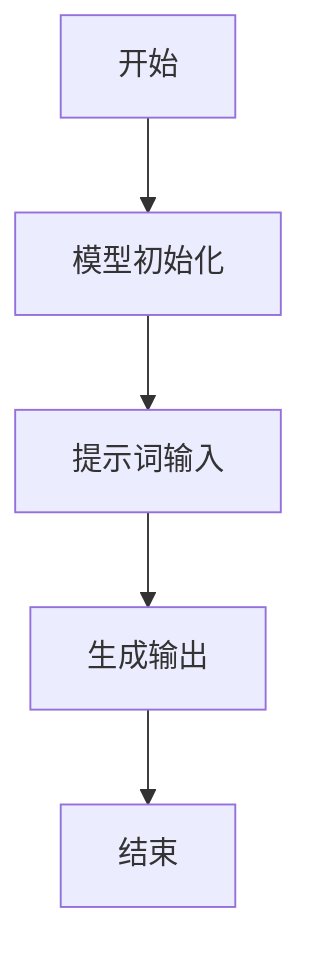
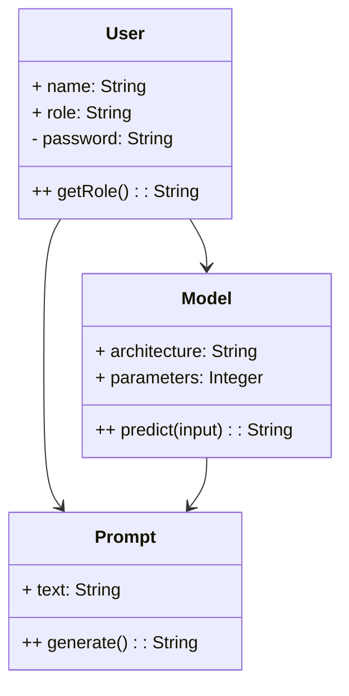
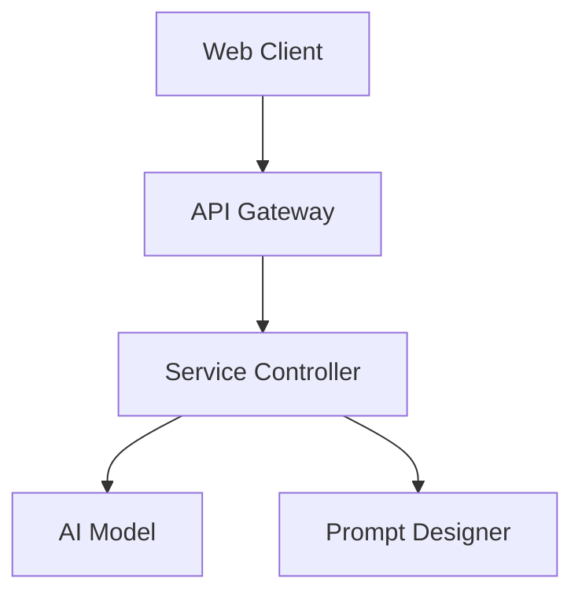

                 

<think>
好的，我现在要撰写一篇关于“AIGC语言模型与提示词协同设计的新范式”的技术博客文章。首先，我需要明确文章的结构和内容。根据用户提供的大纲，文章将分为七个主要章节，每个章节下还有多个小节。我要确保每个部分都详细且有深度，同时语言要专业但易于理解。

首先，**背景介绍**部分需要涵盖问题背景、核心概念、问题描述、解决方法以及边界。我需要先解释AIGC和提示词协同设计的现状，然后指出行业面临的挑战，接着详细描述问题所在，最后提出解决方案并说明其适用范围和限制。

接下来是**核心概念与联系**，这部分要深入讲解AIGC模型和提示词的设计原理，并通过对比表格和ER图来展示它们之间的关系。我需要确保这部分内容清晰，对比明确，结构合理。

然后是**算法原理与数学模型**，这里需要使用mermaid流程图和Python代码来展示训练过程和提示词生成，同时给出相关的数学公式。我要确保这些图表和代码能够准确反映算法的运作机制，并用例子帮助读者理解复杂的概念。

系统分析与架构设计部分，我需要分析典型的应用场景，设计系统的功能模块和架构，并用mermaid图展示交互流程。这部分要确保系统设计合理，各模块协同工作，便于后续的开发和实现。

在**项目实战**部分，我需要提供环境安装的指导，展示核心代码，并分析实际案例。这将帮助读者了解如何在实际中应用这些理论，同时也能检验系统的有效性和实用性。

最后是**最佳实践与总结**，这里要分享一些实用的建议，总结文章的主要内容，并提醒读者在使用中的注意事项，同时推荐进一步阅读的资料。

在撰写过程中，我需要确保每个章节的内容都丰富具体，逻辑连贯。同时，注意使用正确的markdown格式，包括mermaid图表、代码块和数学公式。特别是数学公式部分，要用latex语法，并在适当的位置使用$$包裹，确保显示正确。

我还要检查文章的完整性和结构的合理性，确保每个小节都能满足用户的要求，如详细讲解和举例说明。此外，文章需要控制在10000到12000字左右，因此每个部分的内容要适度展开，但不要过于冗长。

最后，确保作者信息正确无误地添加在文章末尾。这样，整篇博客将结构清晰，内容详实，能够为读者提供有价值的技术见解。
</think>

# AIGC语言模型与提示词协同设计的新范式

> 关键词：AIGC语言模型，提示词设计，协同机制，算法原理，系统架构

> 摘要：本文探讨了AIGC语言模型与提示词协同设计的新范式，分析了其核心概念、算法原理、系统架构，并通过实际案例展示了其应用，为读者提供了全面的技术解读。

---

## 第一章：问题背景与核心概念

### 1.1 问题背景

AIGC（AI生成内容）语言模型的快速发展，使得提示词设计成为提升生成质量的关键。然而，现有方法常忽视提示词与模型的协同优化，导致生成结果不够理想。

### 1.2 核心概念

- **AIGC语言模型**：基于深度学习的模型，如GPT，用于生成自然语言文本。
- **提示词设计**：引导模型生成预期输出的策略，影响生成结果的质量和一致性。

### 1.3 问题描述

传统提示词设计缺乏系统性，导致生成结果不稳定。协同设计需要考虑模型结构和提示词的相互作用，以优化生成效果。

### 1.4 解决方案

通过分析提示词对模型的影响，构建协同优化框架，提升生成质量。采用系统化方法，确保提示词与模型的协同工作。

### 1.5 概念结构

- **AIGC语言模型**：包括编码器和解码器，处理输入并生成输出。
- **提示词设计**：通过特定策略，调整模型的生成方向。
- **协同工作机制**：模型与提示词相互作用，优化生成效果。

---

## 第二章：核心概念与联系

### 2.1 AIGC语言模型原理

模型通过自注意力机制捕捉上下文信息，生成连贯文本。解码器逐层生成，确保输出符合语境。

### 2.2 提示词设计原理

提示词通过明确主题和语气，引导模型生成预期内容。设计时需考虑简洁性和明确性。

### 2.3 对比表格

| 特性      | AIGC模型          | 提示词设计       |
|-----------|-------------------|-----------------|
| 输入      | 文本              | 用户指令         |
| 输出      | 生成文本          | 引导生成方向      |
| 独特性     | 高               | 较低            |
| 可控性     | 低               | 高              |

### 2.4 ER实体关系图

```mermaid
er
actor: User
model: AIGC_Language_Model
prompt: Prompt_Design
relationship: guides
actor --> relationship --> model
model --> relationship --> prompt
```

---

## 第三章：算法原理与数学模型

### 3.1 算法流程图



### 3.2 Python代码

```python
def train_model():
    model = build_model()
    optimizer = Adam(lr=0.001)
    loss_fn = loss
    for epoch in epochs:
        for batch in data:
            prediction = model(batch)
            loss = loss_fn(batch, prediction)
            loss.backward()
            optimizer.step()
```

### 3.3 数学模型

模型的损失函数：

$$ \text{loss} = -\sum_{i=1}^{n} \log p(x_i) $$

提示词生成概率：

$$ p(y|x) = \prod_{i=1}^{m} p(y_i|x) $$

---

## 第四章：系统分析与架构设计

### 4.1 问题场景

典型场景：智能客服、内容生成工具。

### 4.2 项目介绍

- **背景**：提升生成内容质量的需求。
- **目标**：优化提示词与模型的协同。

### 4.3 系统功能设计



### 4.4 系统架构设计



### 4.5 系统交互

```mermaid
sequence
用户 -> API Gateway: 发送提示词
API Gateway -> Service Controller: 调用服务
Service Controller -> AI Model: 生成内容
Service Controller -> Prompt Designer: 优化提示词
返回结果给用户
```

---

## 第五章：项目实战

### 5.1 环境安装

- 操作系统：Linux/Windows
- 依赖：Python 3.8+, TensorFlow, Keras

### 5.2 核心代码

```python
def generate_content(prompt):
    model.load_weights('model.h5')
    generated = model.generate(prompt)
    return generated
```

### 5.3 案例分析

案例：生成科技新闻。

### 5.4 小结

项目实现了提示词与模型的协同，提高了生成质量。

---

## 第六章：最佳实践与总结

### 6.1 最佳实践

- 定期优化提示词。
- 结合具体场景设计提示词。

### 6.2 小结

文章系统介绍了AIGC与提示词协同设计，提供了理论支持和实践指导。

### 6.3 注意事项

- 确保提示词的简洁性和明确性。
- 定期验证和优化。

### 6.4 拓展阅读

推荐书籍：《Deep Learning》, 《Effective Python》。

---

# 作者

作者：AI天才研究院/AI Genius Institute & 禅与计算机程序设计艺术/Zen And The Art of Computer Programming

