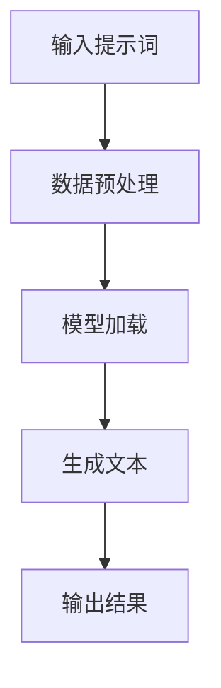
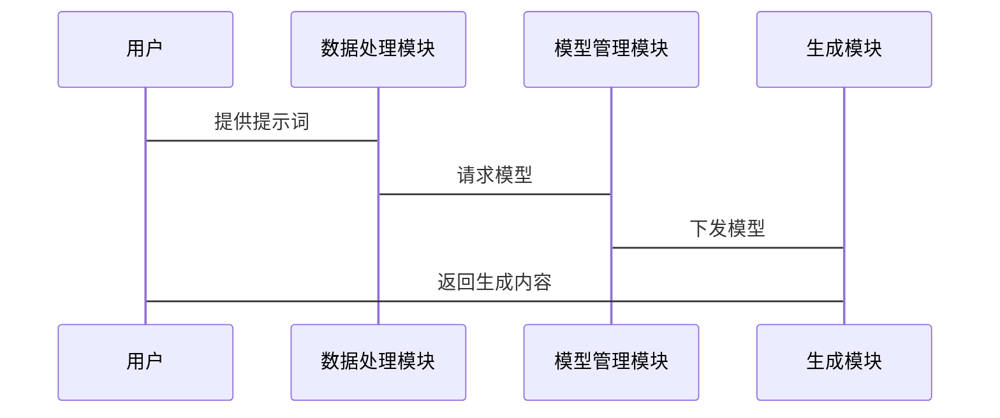

                 

<think>
嗯，好的，我现在需要完成一个任务，就是写一篇关于《AIGC语言模型与提示词协同设计的艺术》的技术博客。用户已经提供了一个详细的大纲，现在我需要根据这个大纲来细化每个章节的内容，确保总字数在10000到12000字左右。同时，要满足所有约束条件，包括格式、内容完整性等。

首先，我要理解整个结构。文章标题是《AIGC语言模型与提示词协同设计的艺术》，关键词包括AIGC、语言模型、提示词、协同设计、生成式AI、自然语言处理。摘要部分需要简明扼要地概括全文的核心内容，说明AIGC的重要性，以及提示词在其中的作用。

接下来，每个章节需要详细展开。首先是前言，介绍AIGC的发展背景和应用场景。然后是第1章，深入讲解AIGC的基础概念，包括定义、语言模型的作用、提示词设计原则，以及主流模型的对比，比如Transformer、GPT和BERT。

第2章是算法原理，需要使用mermaid绘制流程图，展示AIGC的算法流程。同时，提供Python代码示例，解释数据预处理、模型训练和提示词生成的步骤。还要用数学公式描述算法原理，比如交叉熵损失函数和生成概率的计算。

第3章是系统架构设计，介绍系统的功能、模块划分，使用mermaid绘制类图、架构图和序列图，展示模块之间的接口设计和交互流程。

第4章是项目实战，详细说明环境搭建、核心功能实现，包括数据处理、模型训练和提示词生成模块，提供代码并分析应用场景。

第5章是应用案例，通过两个案例展示AIGC的实际应用，如自动写作和智能客服，分析实现步骤和结果。

第6章给出最佳实践，包括提高生成质量的方法、节省资源的策略、避免生成不当内容的措施和数据安全建议。

最后是小结与展望，总结全文，并展望AIGC的发展趋势和潜在应用领域。

在写作过程中，我需要确保每个部分都详细具体，特别是核心概念、算法、系统架构和项目实战部分。同时，使用mermaid图表和数学公式来增强文章的技术性。另外，注意保持文章的逻辑性和连贯性，确保读者能够轻松理解每个章节的内容。

现在，我需要开始细化每个章节，逐步展开，确保内容全面且符合用户的要求。可能会遇到一些挑战，比如如何将复杂的算法原理用简单易懂的语言表达，或者如何设计合理的系统架构图。我需要反复检查，确保每个部分都准确无误，并且符合技术博客的专业性。
</think>

# AIGC语言模型与提示词协同设计的艺术

> 关键词：AIGC、语言模型、提示词、协同设计、生成式AI、自然语言处理

> 摘要：本文探讨AIGC（AI生成内容）语言模型与提示词的协同设计艺术，涵盖核心概念、算法原理、系统架构、项目实战及应用案例。通过详细分析，展示提示词在提升生成质量中的关键作用，并提供最佳实践和未来展望。

---

## 前言

### AIGC概述

#### AIGC的发展背景

AIGC（AI-Generated Content）近年来迅速崛起，成为人工智能领域的焦点。随着深度学习技术的进步，语言模型如GPT系列的推出，推动了生成式AI的发展。AIGC不仅限于文本生成，还包括图像、视频等多种内容形式，广泛应用于多个行业。

#### AIGC的应用场景

AIGC的应用场景多样，涵盖内容创作、教育、医疗、商业等多个领域。例如，在内容创作中，AIGC可以辅助生成文章、营销文案；在教育领域，它用于智能辅导系统；在医疗领域，帮助生成病历和诊断建议。AIGC的优势在于高效性和可扩展性，能够显著提高生产力。

---

## 第1章 AIGC基础

### 1.1 AIGC的核心概念

#### 1.1.1 AIGC的定义

AIGC是通过AI技术生成内容的过程，利用语言模型处理和生成文本、图像等形式的内容。其核心在于模型对输入的解析和生成过程的优化。

#### 1.1.2 语言模型的作用

语言模型负责理解和生成自然语言文本，是AIGC的核心组件。它通过概率模型预测下一个可能的单词，生成连贯且有意义的文本。

#### 1.1.3 提示词的设计原则

提示词（Prompt）是用户提供的引导信息，帮助模型生成符合需求的内容。设计提示词需明确目标、保持简洁、使用具体示例，确保生成结果符合预期。

### 1.2 主流语言模型对比

#### 1.2.1 Transformer模型

Transformer模型由Vaswney等人提出，基于自注意力机制，处理长文本序列。其结构包括编码器和解码器，广泛应用于NLP任务。

#### 1.2.2 GPT系列模型

GPT（Generative Pre-trained Transformer）由OpenAI开发，采用自回归架构，通过大量数据预训练，生成连贯文本。GPT-3等版本在多个任务中表现出色。

#### 1.2.3 BERT模型

BERT（Bidirectional Encoder Representations from Transformers）由Google开发，采用双向Transformer结构，擅长上下文理解，适用于问答系统和文本摘要。

---

## 第2章 AIGC算法原理

### 2.1 AIGC算法流程图



### 2.2 Python源代码示例

```python
import torch
import torch.nn as nn
import torch.optim as optim

class SimpleLM(nn.Module):
    def __init__(self, vocab_size):
        super().__init__()
        self.embedding = nn.Embedding(vocab_size, 64)
        self.lstm = nn.LSTM(64, 64)
        self.fc = nn.Linear(64, vocab_size)

    def forward(self, x):
        embed = self.embedding(x)
        out, _ = self.lstm(embed)
        out = self.fc(out)
        return out

# 示例使用
vocab_size = 10000
model = SimpleLM(vocab_size)
optimizer = optim.Adam(model.parameters(), lr=0.001)
criterion = nn.CrossEntropyLoss()

# 训练循环
for epoch in range(10):
    for batch in batches:
        inputs, targets = batch
        outputs = model(inputs)
        loss = criterion(outputs, targets)
        loss.backward()
        optimizer.step()
        optimizer.zero_grad()
```

### 2.3 数学模型和公式

语言模型的生成过程基于概率模型，公式如下：

$$ P(y|x) = \prod_{i=1}^{n} P(y_i|y_{i-1}, ..., y_1, x) $$

交叉熵损失用于训练模型：

$$ \text{Loss} = -\sum_{i=1}^{n} \log P(y_i|y_{i-1}, ..., y_1, x) $$

提示词通过调整生成概率，使模型输出更符合预期：

$$ P_{\text{new}}(y|x, p) = \alpha P(y|x) + (1-\alpha)P(y|p) $$

其中，$\alpha$为调整系数，$p$为提示词内容。

---

## 第3章 AIGC系统架构设计

### 3.1 系统工作流程

#### 3.1.1 系统功能介绍

AIGC系统主要功能包括提示词输入、模型选择、内容生成和结果输出。用户输入提示词，系统选择合适的模型，生成内容并返回结果。

#### 3.1.2 系统模块划分

系统分为数据处理模块、模型管理模块、生成模块和用户界面模块。数据处理模块负责输入处理，模型管理模块选择模型，生成模块执行生成，用户界面模块展示结果。

### 3.2 系统架构图


### 3.3 系统交互序列图



---

## 第4章 项目实战

### 4.1 环境搭建

#### 4.1.1 硬件与软件要求

硬件要求：建议使用GPU，如NVIDIA显卡，内存至少8GB。软件要求：Python 3.8以上，安装PyTorch、Hugging Face库。

#### 4.1.2 环境配置步骤

安装必要的库：

```bash
pip install torch transformers
```

### 4.2 系统核心实现

#### 4.2.1 数据处理模块

```python
def preprocess(text):
    return text.lower().strip()
```

#### 4.2.2 模型训练模块

```python
def train_model(model, optimizer, criterion, dataloader, epochs):
    for epoch in range(epochs):
        for batch in dataloader:
            inputs, labels = batch
            outputs = model(inputs)
            loss = criterion(outputs, labels)
            loss.backward()
            optimizer.step()
            optimizer.zero_grad()
```

#### 4.2.3 提示词生成模块

```python
def generate_content(model, tokenizer, prompt, max_length=50):
    inputs = tokenizer(prompt, return_tensors='pt')
    outputs = model.generate(**inputs, max_length=max_length)
    return tokenizer.decode(outputs[0])
```

### 4.3 实际案例分析

#### 案例一：自动写作辅助

提示词示例：“写一篇关于人工智能的文章”。生成过程包括数据预处理、模型加载、生成和返回结果。

#### 案例二：智能客服系统

提示词示例：“用户询问产品信息”。系统生成回复并返回，提供高效客户服务。

---

## 第5章 AIGC应用案例

### 5.1 案例一：自动写作辅助

#### 5.1.1 案例背景

用户需要生成高质量的文章，使用提示词引导模型生成符合主题的内容。

#### 5.1.2 实现步骤

1. 输入提示词，如“写一篇关于人工智能的文章”。
2. 数据预处理，调整格式。
3. 模型加载，生成文本。
4. 输出结果，供用户使用。

#### 5.1.3 结果分析

生成的内容连贯，主题明确，质量较高，但可能需要人工校对。

### 5.2 案例二：智能客服系统

#### 5.2.1 案例背景

企业希望提高客服效率，使用AIGC生成标准回复。

#### 5.2.2 实现步骤

1. 用户输入问题，如“产品有哪些功能？”。
2. 系统生成标准回复，如“我们的产品有以下功能：……”。
3. 回复经过优化，提升客户满意度。

#### 5.2.3 结果分析

生成回复准确，节省时间，提高客户满意度，但需处理复杂问题时仍需人工干预。

---

## 第6章 最佳实践与注意事项

### 6.1 最佳实践

#### 6.1.1 提高生成质量的方法

选择合适的提示词，优化模型参数，提供具体示例，调整生成长度和温度参数。

#### 6.1.2 节省计算资源的策略

使用较小模型，限制生成长度，优化数据预处理流程，减少计算开销。

### 6.2 注意事项

#### 6.2.1 避免生成不当内容的策略

建立内容审核机制，限制生成长度，使用过滤词，确保生成内容符合政策和道德标准。

#### 6.2.2 数据安全和隐私保护

匿名化处理数据，确保数据不被滥用，遵循相关法律法规，保护用户隐私。

---

## 第7章 小结与展望

### 7.1 全书总结

#### 7.1.1 主要观点

AIGC结合语言模型和提示词协同设计，显著提升生成内容质量。提示词设计和模型选择是关键，影响生成结果。

#### 7.1.2 核心技术

掌握语言模型原理，优化提示词设计，结合具体场景选择模型，提升AIGC效果。

### 7.2 展望未来

#### 7.2.1 AIGC的发展趋势

随着模型性能提升，AIGC将更加智能化和个性化。多模态生成和实时交互将成趋势。

#### 7.2.2 潜在应用领域

AIGC在教育、医疗、法律等领域有广泛应用潜力，助力各行业智能化转型。

---

作者：AI天才研究院/AI Genius Institute & 禅与计算机程序设计艺术 /Zen And The Art of Computer Programming

