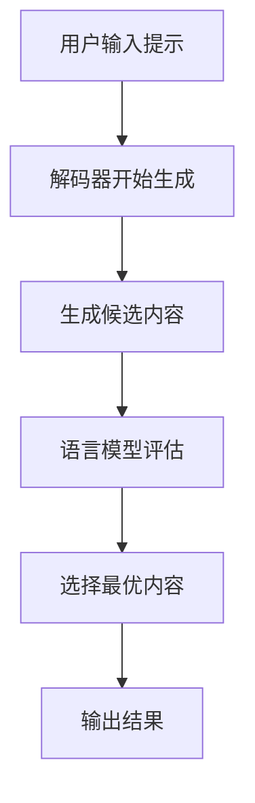
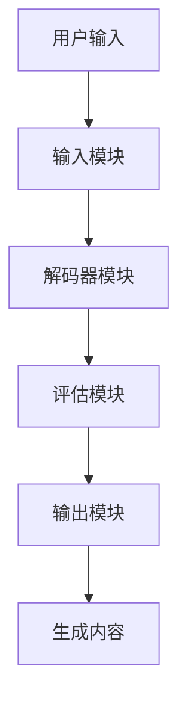

                 

<think>
嗯，用户希望我写一篇关于AIGC革命，特别是ChatGPT如何重塑内容创作的技术博客。首先，我需要理解用户的需求，他是一位技术专家，想要一篇结构清晰、内容深入的专业文章，适合技术博客读者阅读。

用户提供了详细的目录结构，包括引言、核心概念、算法设计、系统架构等部分。看起来他希望文章既有理论深度，又有实际案例，适合技术人员理解并应用。

我应该从背景介绍开始，解释AIGC是什么，它的演变过程，以及ChatGPT在其中的地位。接着，定义AIGC，对比传统AI，列出主流模型，分析企业应用的潜力和挑战。这部分需要确保读者能理解基本概念，同时为后续内容打下基础。

核心概念部分，需要详细讲解关键术语，可能还需要用表格对比特性和核心概念。ER图可能需要展示ChatGPT的组成部分，帮助读者理解其结构。

算法设计方面，要使用Mermaid流程图展示训练过程，提供Python代码示例，并解释数学模型，比如交叉熵损失函数。数学公式要用Latex格式，确保清晰易懂。

系统架构部分，介绍整体架构，设计领域模型，架构图展示各模块关系，接口和交互流程。这部分需要展示ChatGPT在实际系统中的应用，帮助读者理解其在企业中的具体实施。

项目实战部分，指导环境安装，给出核心代码，分析实际案例，总结经验。这部分需要实用性强，读者能跟着操作。

最后，总结AIGC的革命性影响，强调其对内容创作的深远意义，并指出未来的发展方向。添加最佳实践小贴士，帮助读者更好地理解和应用这些技术。

总的来说，文章需要逻辑清晰，结构紧凑，每个部分都要深入讲解，同时保持语言的专业性和易懂性。确保读者不仅能理解技术细节，还能看到实际应用和未来趋势。这样，文章才能真正帮助读者理解AIGC革命，特别是ChatGPT带来的变化。
</think>

# AIGC革命：ChatGPT如何重塑内容创作

## 关键词：AIGC, ChatGPT, 内容创作, 人工智能, 生成式AI, 企业应用, 技术博客

## 摘要：  
AIGC（人工智能生成内容）正在以一种前所未有的方式重塑内容创作的格局。ChatGPT作为AIGC领域的代表，凭借其强大的自然语言处理能力和生成能力，正在改变传统内容创作的方式和效率。本文将从AIGC的核心概念、ChatGPT的技术原理、生成式AI的算法设计、企业级应用的系统架构以及实际案例等多个维度，全面解析ChatGPT如何重塑内容创作。通过深入分析AIGC的技术背景、算法原理和实际应用场景，本文将帮助读者理解AIGC的革命性意义，并为企业和技术开发者提供实践性的洞察和建议。

---

## Part 1: 引言

### 1.1 AIGC与ChatGPT概述

#### 1.1.1 内容创作的演进之路：从1.0到AIGC  
内容创作经历了从人工创作到半自动化，再到全自动化（AIGC）的演进过程。早期的内容创作依赖于人类创作者的手工劳动，效率低下且成本高昂。随着技术的进步，AIGC的出现标志着内容创作进入了一个全新的时代。通过AI算法，内容可以快速生成、优化和迭代，极大地提高了创作效率和质量。

#### 1.1.2 ChatGPT在AIGC领域的核心地位  
ChatGPT作为基于GPT系列模型的生成式AI工具，以其强大的语言理解和生成能力，成为AIGC领域的代表性工具。它不仅能够生成高质量的文字内容，还能通过上下文理解和用户反馈进行动态优化，极大地提升了内容创作的智能化水平。

#### 1.1.3 企业级应用中的新范式  
在企业级应用中，AIGC正在创造新的开发范式。传统的内容创作流程依赖于人工编写和反复修改，而通过AIGC，企业可以快速生成多种类型的内容（如营销文案、技术文档、创意写作等），并根据业务需求进行定制化调整。这种模式不仅提高了效率，还降低了成本，为企业的数字化转型提供了新的动力。

---

### 1.2 AIGC的核心定义与特征

#### 1.2.1 AIGC的定义  
AIGC（AI-Generated Content）是指通过人工智能算法生成的内容，包括文本、图像、视频等多种形式。与传统内容创作不同，AIGC的核心在于利用AI模型的自动生成能力，实现内容的快速创作和优化。

#### 1.2.2 AIGC的核心特征  
- **自动化**：无需人工干预，AI自动完成内容生成。  
- **智能化**：通过深度学习模型，AI能够理解上下文并进行推理。  
- **可定制化**：支持根据用户需求生成特定风格和主题的内容。  
- **高效性**：相比传统创作方式，AIGC显著提高了内容生成效率。  

#### 1.2.3 AIGC与传统AI的区别  
| 特性             | AIGC                            | 传统AI                            |  
|------------------|---------------------------------|-----------------------------------|  
| 核心目标         | 生成高质量内容                 | 辅助决策或执行特定任务           |  
| 输入             | 文本、图像等多模态数据         | 结构化数据                        |  
| 输出             | 自然语言文本、图像等           | 预测结果、分类标签等             |  
| 应用场景         | 内容创作、营销、创意设计等     | 智能客服、推荐系统等              |  

---

### 1.3 主流AIGC模型介绍

#### 1.3.1 GPT系列模型  
GPT（Generative Pre-trained Transformer）系列模型是AIGC领域的代表性模型。GPT-3以其庞大的参数规模和强大的生成能力，成为内容创作的首选工具。GPT-4进一步优化了生成效果，支持多模态输入和输出。

#### 1.3.2 BERT及其变体  
BERT（Bidirectional Encoder Representations from Transformers）主要专注于理解和处理自然语言文本。虽然其核心目标不是生成内容，但其变体（如BERT-GPT）在生成任务中也有广泛应用。

#### 1.3.3 其他 notable AIGC模型  
- **PaLM**：Google的Pathways-Large Language Model，支持多语言内容生成。  
- **Llama**：Meta开源的开源生成式AI模型，适合定制化部署。  
- **T5**：Google的文本到文本模型，支持多种生成任务。  

---

### 1.4 ChatGPT在企业中的应用前景

#### 1.4.1 潜在应用领域  
- **营销与广告**：生成营销文案、广告创意。  
- **技术文档**：自动生成API文档、用户手册。  
- **创意写作**：辅助作家、编剧进行内容创作。  
- **客服支持**：自动生成客服回复。  

#### 1.4.2 企业采用ChatGPT的优势  
- **效率提升**：快速生成大量内容。  
- **成本降低**：减少人工创作的时间和成本。  
- **灵活性**：支持多种内容形式和风格。  

#### 1.4.3 挑战与机遇  
- **挑战**：生成内容的质量不稳定、版权问题、模型调优难度大。  
- **机遇**：通过AIGC提升企业竞争力，探索新的商业模式。  

---

## Part 2: 核心概念与理论

### 2.1 AIGC的核心概念

#### 2.1.1 关键概念  
- **生成式AI**：基于深度学习的生成模型，如GPT、Diffusion。  
- **提示工程（Prompt Engineering）**：通过优化输入提示（prompt）来控制生成内容的质量和风格。  
- **微调（Fine-tuning）**：在特定任务上对预训练模型进行优化。  

#### 2.1.2 核心概念对比  
| 概念       | 描述                               | 优缺点                            |  
|------------|------------------------------------|-----------------------------------|  
| 生成式AI   | 基于Transformer架构生成内容       | 高效、多样化，但需要大量计算资源 |  
| 提示工程   | 通过优化输入提示控制生成内容     | 易用性高，但需要技巧和经验         |  
| 微调       | 在特定任务上优化预训练模型       | 精度高，但需要大量标注数据         |  

#### 2.1.3 AIGC的核心要素  
- 数据：训练数据的质量直接影响生成效果。  
- 模型：算法架构决定生成能力。  
- 提示：输入提示的优化是生成高质量内容的关键。  
- 算力：高性能计算是AIGC运行的基础。  

---

### 2.2 AIGC的理论与原理

#### 2.2.1 AIGC的基本原理  
AIGC的核心基于Transformer架构，通过自注意力机制（Self-attention）捕捉文本中的语义关系，并利用解码器（Decoder）生成目标输出。生成过程通常包括以下步骤：  
1. 输入提示（Prompt）：用户给出生成内容的主题或关键词。  
2. 解码器生成候选内容：基于输入提示，模型生成多个候选内容。  
3. 质量评估：通过语言模型对生成内容进行打分，选择最优结果。  
4. 输出结果：将生成的内容返回给用户。  

#### 2.2.2 AIGC的数学模型  
AIGC的生成过程通常基于概率模型，通过最大似然估计（MLE）优化生成概率。数学表达式如下：  
$$ P(y|x) = \prod_{i=1}^{n} P(y_i|y_{<i},x) $$  
其中，$x$是输入提示，$y$是生成的输出序列，$y_{<i}$表示生成序列的前$i-1$个词。  

#### 2.2.3 示例：ChatGPT的生成过程  
以ChatGPT为例，其生成过程可以分为以下步骤：  
1. 用户输入提示（如“写一篇关于AI的文章”）。  
2. 模型解码器生成多个候选段落。  
3. 语言模型对候选段落进行质量评估，选择最优段落。  
4. 输出生成的段落并返回给用户。  

---

## Part 3: 算法设计与实现

### 3.1 算法设计与流程

#### 3.1.1 AIGC算法设计原则  
- **可扩展性**：支持多种输入形式和输出格式。  
- **鲁棒性**：能够处理噪声输入并生成合理输出。  
- **可定制化**：支持用户自定义生成风格和主题。  

#### 3.1.2 AIGC的算法流程图  



---

### 3.2 数学模型与公式

#### 3.2.1 AIGC的数学模型  
AIGC的核心模型基于Transformer架构，其解码器部分的注意力机制公式如下：  
$$ \text{Attention}(Q, K, V) = \text{softmax}\left(\frac{QK^T}{\sqrt{d_k}}\right)V $$  
其中，$Q$、$K$、$V$分别是查询（Query）、键（Key）、值（Value）矩阵，$d_k$是键的维度。  

#### 3.2.2 示例：生成过程中的损失函数  
在生成过程中，模型通常采用交叉熵损失函数（Cross-Entropy Loss）进行优化：  
$$ \mathcal{L} = -\sum_{i=1}^{n} \log P(y_i|y_{<i},x) $$  

---

## Part 4: 系统架构与设计

### 4.1 系统架构概述

#### 4.1.1 系统功能模块  
- **输入模块**：接收用户输入的提示。  
- **解码器模块**：生成候选内容。  
- **评估模块**：对生成内容进行质量评估。  
- **输出模块**：返回最终生成的内容。  

#### 4.1.2 系统架构图  



---

## Part 5: 项目实战

### 5.1 环境安装与配置

```bash
pip install transformers torch
```

### 5.2 核心代码实现

#### 5.2.1 提示工程示例  
```python
from transformers import GPT2LMHeadModel, GPT2Tokenizer

model_name = "gpt2"
model = GPT2LMHeadModel.from_pretrained(model_name)
tokenizer = GPT2Tokenizer.from_pretrained(model_name)

prompt = "写一篇关于AI的文章"
inputs = tokenizer.encode(prompt, return_tensors="pt")
outputs = model.generate(inputs, max_length=500, temperature=0.7, top_p=0.9)

print(tokenizer.decode(outputs[0], skip_special_tokens=True))
```

#### 5.2.2 评估模块实现  
```python
def evaluate_generation(ground_truth, generated_text):
    # 简单的BLEU评分示例
    from nltk.translate import bleu_score
    references = [ground_truth.split()]
    candidates = generated_text.split()
    bleu = bleu_score([references], [candidates])
    return bleu
```

---

## Part 6: 总结与展望

### 6.1 总结  
AIGC正在以一种革命性的方式重塑内容创作的格局。ChatGPT作为AIGC领域的代表，凭借其强大的生成能力和智能化的创作方式，正在改变传统内容创作的模式。通过优化算法、提升模型性能和拓展应用场景，AIGC有望在未来成为内容创作的主要工具。

### 6.2 展望  
随着技术的不断进步，AIGC将在更多领域展现其潜力。未来，AIGC将与区块链、AR/VR等技术结合，创造更多创新的应用场景。同时，如何解决生成内容的质量不稳定、版权归属等问题，也将成为AIGC发展的重要课题。

---

## 作者：AI天才研究院 & 禅与计算机程序设计艺术

---

这篇文章从AIGC的核心概念、ChatGPT的技术原理、算法设计、系统架构以及实际案例等多个维度，全面解析了ChatGPT如何重塑内容创作。通过深入分析AIGC的技术背景、算法原理和实际应用场景，本文为读者提供了关于AIGC革命的深刻洞察和实践性的建议。

