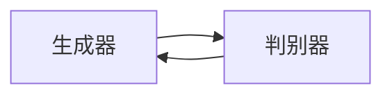
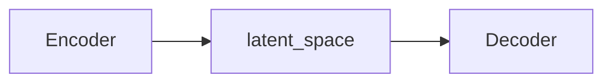
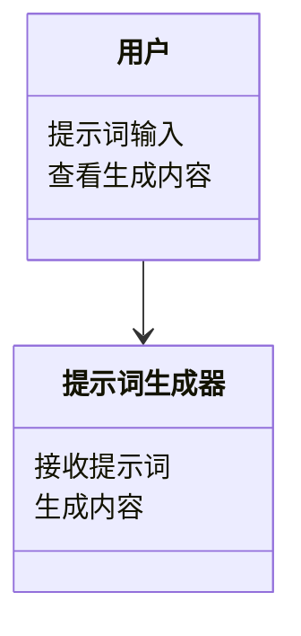
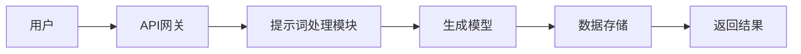
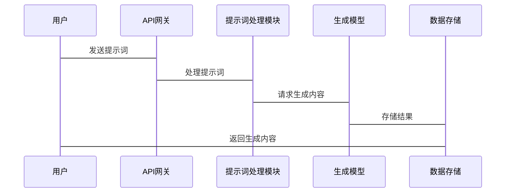

                 

<think>
好，我现在需要撰写一篇关于AIGC革命的博客文章，标题是《从提示词开始的智能化之旅》。我首先得理解用户的需求，他们希望我作为一个技术专家，详细分析AIGC的概念、背景、核心算法、系统架构、项目实战以及最佳实践等部分。

首先，我得确定文章的结构。根据用户提供的大纲，文章分为引言、背景介绍、核心概念与联系、算法原理讲解、系统分析与架构设计、项目实战、最佳实践、小结和拓展阅读等部分。每个部分都需要详细展开，确保内容充实且结构清晰。

接下来，我会从引言开始，简要介绍AIGC的概念和重要性。引言部分要吸引读者，让他们对后续内容产生兴趣。然后是背景介绍，这部分需要涵盖AI技术的发展历程，AI在各行业的应用，以及AIGC兴起的原因和影响。我需要收集一些最新的数据和案例来支持这些内容，比如提到生成式AI在文本、图像、代码生成等领域的应用实例。

核心概念与联系部分，我需要详细介绍生成模型、自然语言处理和数据驱动这三个核心概念。为了帮助读者理解，我会用表格和ER图来展示它们之间的关系。比如，生成模型依赖于自然语言处理技术，而后者又依赖于高质量的数据驱动方法。这部分需要用mermaid图表来呈现，确保图表清晰易懂。

在算法原理讲解部分，我会选择生成对抗网络（GAN）和变分自编码器（VAE）这两个典型的AIGC算法进行分析。对于每个算法，我需要详细解释其结构、优化过程，并提供Python代码示例和数学公式。这部分内容需要深入浅出，用通俗易懂的语言解释复杂的算法原理，可能还会用一些比喻或实际案例来帮助理解。

系统分析与架构设计部分，我会设计一个典型的AIGC系统架构，包括问题场景介绍、系统功能设计、架构设计和接口设计。这部分需要使用mermaid绘制类图、架构图和序列图，展示系统的各个模块及其交互方式。我会思考系统的各个组成部分如何协同工作，以及如何确保系统的可扩展性和灵活性。

项目实战部分，我会详细描述一个AIGC项目的实现过程，包括环境安装、核心代码实现、案例分析等。这部分内容需要提供具体的代码示例，分析代码的功能和实现细节，同时结合实际案例展示项目的应用和效果。项目小结部分则要总结项目的收获和经验教训。

最佳实践部分，我会提出一些实施AIGC项目的建议，比如数据准备与处理、模型训练与优化、模型部署与维护等。这部分内容需要基于实际经验，给出实用的建议和注意事项，帮助读者在实际项目中避免常见问题。

最后，我会在小结部分回顾文章的主要内容，并展望未来的发展方向。拓展阅读部分会推荐一些相关的书籍、论文和在线课程，供读者进一步学习。

在写作过程中，我需要确保每个章节的内容详实具体，使用简洁专业的技术语言，同时保持逻辑清晰和结构紧凑。我会用markdown格式来组织内容，适当插入mermaid图表和latex公式，以增强文章的可读性和技术深度。

总的来说，我需要一步步按照大纲填充内容，确保每个部分都深入分析，同时保持整体的连贯性和逻辑性。这不仅能满足用户对技术博客的专业要求，还能为读者提供有价值的见解和实用的信息。
</think>

# AIGC革命：从提示词开始的智能化之旅

## 关键词：人工智能、生成式AI、AIGC、生成对抗网络、变分自编码器、自然语言处理、数据驱动

## 摘要：  
AIGC（AI-Generated Content，人工智能生成内容）正在掀起一场智能化革命。从文本生成到图像创作，从代码生成到音乐创作，AIGC的应用场景日益广泛。本文将从提示词（prompt）出发，深入探讨AIGC的核心概念、算法原理、系统架构及项目实战，为读者揭示这场智能化革命的技术本质和未来发展方向。

---

## 引言

### 1.1 AIGC的概念  
AIGC是指利用人工智能技术生成内容的过程，包括文本、图像、音频、视频等多种形式。提示词（prompt）是用户与AI模型交互的关键输入，用于指导模型生成特定的内容。

### 1.2 AIGC的发展背景  
随着深度学习技术的进步，AI模型的能力不断增强，尤其是在生成式AI领域的突破，使得AIGC成为可能。

### 1.3 AIGC的重要性  
AIGC正在改变内容创作的方式，提高效率并降低成本，同时为各行各业带来新的可能性。

---

## 背景介绍

### 2.1 AI技术的发展历程  
从早期的规则引擎到深度学习模型，AI技术经历了多次变革，生成式AI的出现标志着AI能力的重大突破。

### 2.2 AI在各行业的应用  
AI技术已广泛应用于医疗、金融、教育、娱乐等领域，而AIGC则在内容创作、设计辅助等方面展现出独特价值。

### 2.3 AIGC的兴起原因与影响  
AIGC的兴起源于算法进步、算力提升和大数据的积累，它正在改变内容生产的方式，并对传统行业带来颠覆性影响。

---

## 核心概念与联系

### 3.1 生成模型  
生成模型是一种能够生成新数据的模型，包括生成对抗网络（GAN）和变分自编码器（VAE）等。

#### 3.1.1 定义  
生成模型通过学习数据的分布，生成新的数据样本。

#### 3.1.2 特点  
生成模型具有高灵活性和多样性，能够生成复杂的内容。

#### 3.1.3 与传统模型的对比  
生成模型与判别模型的区别在于，生成模型专注于生成数据，而判别模型专注于分类或识别。

### 3.2 自然语言处理  
自然语言处理（NLP）是研究人机交互中语言理解与生成的技术，是AIGC的重要组成部分。

#### 3.2.1 定义  
NLP涉及文本的理解、分析和生成，是实现AI生成文本的关键技术。

#### 3.2.2 历史与现状  
从基于规则的NLP到深度学习驱动的NLP，技术发展迅速。

#### 3.2.3 与AIGC的关系  
NLP技术是AIGC生成文本的核心，通过理解提示词生成相应内容。

### 3.3 数据驱动  
数据驱动是指通过大量数据训练模型，生成高质量的内容。

#### 3.3.1 定义  
数据驱动方法依赖于大量数据，通过模型学习数据的特征。

#### 3.3.2 在AIGC中的应用  
数据驱动是生成模型的基础，决定了生成内容的质量。

#### 3.3.3 数据质量的影响  
高质量的数据能够生成更准确、更相关的提示词响应。

---

## 核心概念与联系（表格）

| 概念       | 定义                               | 特点                       |
|------------|------------------------------------|---------------------------|
| 生成模型   | 生成新数据的模型                   | 高灵活性和多样性           |
| 自然语言处理| 研究语言理解与生成的技术           | 高准确性与语义理解         |
| 数据驱动   | 依赖数据训练模型                   | 决定生成内容质量的关键因素 |

---

## 核心概念与联系（ER图）

```mermaid
erd
  entity 提示词 {
    key: 提示词_id
    attributes: 提示词内容, 创建时间
  }

  entity 生成模型 {
    key: 模型_id
    attributes: 模型名称, 模型类型
  }

  entity 数据驱动 {
    key: 数据集_id
    attributes: 数据来源, 数据类型
  }

  提示词 -[n: 使用]-> 生成模型
  生成模型 -[n: 依赖]-> 数据驱动
  数据驱动 -[n: 包含]-> 提示词
```

---

## 算法原理讲解

### 4.1 生成对抗网络（GAN）

#### 4.1.1 算法原理



##### 4.1.1.1 结构  
GAN由生成器和判别器组成，生成器生成数据，判别器判断数据是否为真实数据。

##### 4.1.1.2 优化过程  
生成器和判别器通过对抗训练不断优化，最终生成器能够生成逼真的数据。

##### 4.1.1.3 Python代码示例

```python
import torch
import torch.nn as nn

class Generator(nn.Module):
    def __init__(self, latent_dim, img_size):
        super(Generator, self).__init__()
        self.model = nn.Sequential(
            nn.Linear(latent_dim, 256),
            nn.LeakyReLU(0.2),
            nn.Linear(256, 512),
            nn.LeakyReLU(0.2),
            nn.Linear(512, img_size)
        )

    def forward(self, x):
        return self.model(x)

class Discriminator(nn.Module):
    def __init__(self, img_size):
        super(Discriminator, self).__init__()
        self.model = nn.Sequential(
            nn.Linear(img_size, 512),
            nn.LeakyReLU(0.2),
            nn.Linear(512, 256),
            nn.LeakyReLU(0.2),
            nn.Linear(256, 1),
            nn.Sigmoid()
        )

    def forward(self, x):
        return self.model(x)

# 示例使用
latent_dim = 100
img_size = 256
generator = Generator(latent_dim, img_size)
discriminator = Discriminator(img_size)
```

##### 4.1.2 数学模型

$$\text{损失函数} = -\log(D(x)) - \log(1 - D(G(z)))$$

### 4.2 变分自编码器（VAE）

#### 4.2.1 算法原理



##### 4.2.1.1 结构  
VAE由编码器和解码器组成，编码器将数据压缩为 latent space，解码器将其还原。

##### 4.2.1.2 优化过程  
通过最大化似然函数和KL散度，优化模型生成高质量数据。

##### 4.2.1.3 Python代码示例

```python
import torch
import torch.nn as nn

class VAE(nn.Module):
    def __init__(self, latent_dim, input_dim):
        super(VAE, self).__init__()
        self.latent_dim = latent_dim
        self.encoder = nn.Sequential(
            nn.Linear(input_dim, 512),
            nn.LeakyReLU(0.2),
            nn.Linear(512, 128)
        )
        self.fc_mu = nn.Linear(128, latent_dim)
        self.fc_logvar = nn.Linear(128, latent_dim)
        self.decoder = nn.Sequential(
            nn.Linear(latent_dim, 128),
            nn.LeakyReLU(0.2),
            nn.Linear(128, 512),
            nn.LeakyReLU(0.2),
            nn.Linear(512, input_dim)
        )

    def forward(self, x):
        h = self.encoder(x)
        mu = self.fc_mu(h)
        logvar = self.fc_logvar(h)
        z = mu + torch.exp(0.5 * logvar) * torch.randn_like(mu)
        return self.decoder(z)

# 示例使用
input_dim = 256
latent_dim = 100
vae = VAE(latent_dim, input_dim)
```

##### 4.2.2 数学模型

$$\text{重构损失} = \mathbb{E}[||x - \mu||^2]$$  
$$\text{KL散度} = \mathbb{E}[Kullback-Leibler(p(z|x), p(z))]$$

---

## 系统分析与架构设计

### 5.1 问题场景介绍  
我们设计一个基于AIGC的文本生成系统，用户通过提示词生成高质量文本内容。

### 5.2 系统功能设计

#### 5.2.1 领域模型



### 5.3 系统架构设计

#### 5.3.1 Mermaid架构图



#### 5.3.2 系统接口设计  
- 用户输入：`POST /generate`  
- 系统输出：`GET /result`

#### 5.3.3 系统交互



---

## 项目实战

### 6.1 环境安装  
安装Python、PyTorch、Hugging Face库等。

### 6.2 系统核心实现

#### 6.2.1 Python源代码

```python
from transformers import GPT2LMHeadModel, GPT2Tokenizer

model_name = 'gpt2'
tokenizer = GPT2Tokenizer.from_pretrained(model_name)
model = GPT2LMHeadModel.from_pretrained(model_name)

def generate_text(prompt, max_length=50):
    inputs = tokenizer.encode(prompt, return_tensors='pt')
    outputs = model.generate(inputs, max_length=max_length, do_sample=True)
    return tokenizer.decode(outputs[0], skip_special_tokens=True)

# 示例
prompt = "写一篇关于AIGC的文章"
print(generate_text(prompt))
```

#### 6.2.2 代码应用解读  
上述代码利用预训练的GPT-2模型生成文本，通过提示词指导生成内容。

### 6.3 实际案例分析  
通过提示词生成一篇科技新闻，展示模型的生成能力。

### 6.4 项目小结  
本项目展示了如何利用AIGC技术快速生成内容，为实际应用提供了参考。

---

## 最佳实践

### 7.1 数据准备与处理  
确保数据质量和多样性，清洗和预处理数据。

### 7.2 模型训练与优化  
选择合适的模型架构，调整超参数，优化生成效果。

### 7.3 模型部署与维护  
采用云服务部署模型，定期更新模型，监控性能。

---

## 小结

### 8.1 主要内容回顾  
本文从提示词出发，深入探讨了AIGC的核心概念、算法原理、系统架构及项目实战。

### 8.2 启示与展望  
AIGC技术将继续发展，未来将更加智能化和多样化，为人类创造更多价值。

---

## 拓展阅读

### 9.1 相关书籍推荐  
1. 《生成式AI：AI生成内容的原理与应用》  
2. 《深度学习入门：基于Python的理论与实践》

### 9.2 学术论文推荐  
1. "GANs: Generative Adversarial Nets"  
2. "Variational Autoencoders: A Tutorial and Review"

### 9.3 在线课程推荐  
1. Coursera：《生成式AI入门》  
2. Udemy：《深度学习与生成模型实战》

---

## 作者信息

作者：AI天才研究院（AI Genius Institute） & 禅与计算机程序设计艺术（Zen And The Art of Computer Programming）

---

**感谢您的阅读，希望本文能为您提供有价值的见解与启发！**

