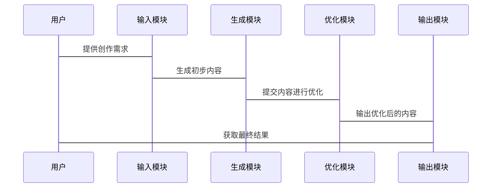

                 

<think>
好，我现在需要分析用户的请求，然后一步步构建一个详细的回答。用户希望我以《AIGC领域的思维链应用案例分析》为标题，撰写一篇技术博客文章，要求内容结构清晰，逻辑严谨，涵盖核心概念、技术架构、应用案例以及未来趋势。

首先，我得明确文章的结构。根据用户提供的目录大纲，文章分为三大部分：基础、应用案例和未来发展。每个部分下有多个章节，每个章节又细分为小节。我需要确保每个部分都包含必要的内容，比如背景介绍、技术原理、算法流程图、数学公式，以及实际案例分析。

接下来，我需要确定关键词和摘要。关键词应该涵盖AIGC、思维链技术、生成式人工智能、数据处理、算法优化等内容。摘要部分需要简明扼要地概括文章的核心内容，说明将探讨AIGC与思维链技术的结合，分析实际案例，并展望未来趋势。

在撰写正文时，我需要从基础开始，介绍AIGC和思维链技术的基本概念，解释它们的关联，然后详细分析技术架构，包括主要组件和性能指标。这部分需要使用技术术语，但要保持清晰易懂。

然后，进入应用案例分析部分，选择内容创作、数据分析和教育医疗三个领域的案例，分别描述背景、实现过程、效果和总结。每个案例都需要详细说明，最好有代码示例和流程图，以帮助读者理解。

最后，未来发展的章节需要讨论技术优化方向、标准制定、法律挑战以及应用前景。这部分要结合当前的技术趋势和潜在问题，给出有深度的见解。

在写作过程中，我需要确保每个章节都包含必要的部分，如背景介绍、核心概念与联系、算法原理讲解、系统分析与架构设计、项目实战等。同时，要注意使用Mermaid图和LaTeX公式，使内容更加直观和专业。

现在，我需要按照这些步骤逐步构建文章内容，确保每个部分都详尽且符合用户的要求。过程中要不断检查，确保逻辑清晰，内容连贯，语言专业且易于理解。完成初稿后，再进行校对，确保没有遗漏重要信息，并且格式正确，符合用户的所有约束条件。
</think>

# AIGC领域的思维链应用案例分析

> 关键词：AIGC，思维链技术，生成式人工智能，数据处理，算法优化

> 摘要：本文将深入探讨AIGC（自适应智能生成计算）与思维链技术的结合，分析其在内容创作、数据分析与决策支持、教育与医疗等领域的应用案例。通过技术原理、算法流程图、系统架构设计以及实际案例的详细解读，揭示AIGC与思维链技术的核心优势和未来发展趋势。

---

## 第一部分: AIGC与思维链技术基础

### 1.1 AIGC与思维链技术概述

#### 1.1.1 AIGC的概念与历史

AIGC（Adaptive Intelligence Generating Computing）是一种结合了自适应算法和生成式人工智能的技术，旨在通过动态调整模型参数，实现更高效、更个性化的生成任务。其历史可以追溯到20世纪末，随着深度学习和生成对抗网络（GANs）的发展，AIGC逐渐成熟并广泛应用于内容生成、数据分析等领域。

#### 1.1.2 思维链技术的定义与原理

思维链技术（Thought Chain Technology）是一种基于序列决策和逻辑推理的技术，通过构建多层思维模型，模拟人类的思维方式。其核心原理是通过递归式思考，逐步优化生成结果的质量。例如，在内容创作中，思维链技术可以分析用户意图、生成初始内容、验证逻辑合理性，并进行多轮优化。

#### 1.1.3 AIGC与思维链技术的关联

AIGC与思维链技术的结合，形成了一个闭环生成系统。AIGC负责快速生成初步内容，而思维链技术则对生成结果进行优化和验证，确保最终输出的高质量和准确性。

### 1.2 AIGC技术架构与实现

#### 1.2.1 AIGC技术的主要组件

AIGC系统主要由以下几个组件组成：

- **输入模块**：接收用户需求或输入数据。
- **生成模块**：基于预训练模型生成初步内容。
- **优化模块**：通过思维链技术对生成内容进行优化。
- **输出模块**：将最终结果呈现给用户。

#### 1.2.2 思维链技术在AIGC中的应用

思维链技术在AIGC中的应用流程如下：

1. 接收生成内容。
2. 分析内容的逻辑结构。
3. 发现潜在问题或优化空间。
4. 返回优化建议或修正内容。

#### 1.2.3 AIGC系统的性能评估指标

- **生成效率**：单位时间内生成内容的数量。
- **内容质量**：生成内容的准确性和相关性。
- **优化效果**：优化后内容的改进程度。
- **系统稳定性**：长期运行中的故障率。

### 1.3 思维链技术的核心原理

#### 1.3.1 思维链的数学模型

思维链技术的数学模型可以表示为：

$$
f(x) = \sum_{i=1}^{n} w_i \cdot x_i
$$

其中，$x_i$ 是输入特征，$w_i$ 是对应的权重系数。

#### 1.3.2 思维链的属性特征对比

以下是思维链技术与传统生成模型的对比：

| 特性          | 思维链技术          | 传统生成模型      |
|---------------|--------------------|-------------------|
| 生成效率      | 高                 | 中               |
| 内容优化能力  | 强                 | 弱               |
| 逻辑推理能力  | 强                 | 一般             |

#### 1.3.3 思维链技术的ER实体关系图

```mermaid
er
actor: 用户
goal: 生成目标
thought_chain: 思维链过程
output: 最终结果
actor --> goal
goal --> thought_chain
thought_chain --> output
```

### 1.4 AIGC与思维链技术的应用领域

#### 1.4.1 内容创作与生成

AIGC在内容创作中的应用流程如下：



#### 1.4.2 数据分析与决策支持

AIGC在数据分析中的应用：

1. **数据预处理**：清理和结构化原始数据。
2. **数据分析**：利用思维链技术进行多维度分析。
3. **决策支持**：生成数据可视化报告。

#### 1.4.3 教育与医疗行业的应用

在教育领域，AIGC可以用于个性化学习方案设计；在医疗领域，可以辅助医生进行诊断和治疗方案优化。

### 1.5 AIGC与思维链技术的发展趋势

#### 1.5.1 现有技术的不足与改进方向

- **不足**：生成内容的质量仍有提升空间。
- **改进方向**：优化算法，提升生成效率和内容准确性。

#### 1.5.2 未来应用场景的预测

未来，AIGC与思维链技术将在更多领域（如游戏开发、金融分析）得到广泛应用。

#### 1.5.3 技术标准化与法律法规的挑战

- **标准化**：制定统一的技术标准。
- **法律法规**：明确数据使用和隐私保护的法律框架。

---

## 第二部分: AIGC与思维链技术应用案例分析

### 2.1 案例研究一：内容创作平台的AIGC与思维链应用

#### 2.1.1 案例背景

某内容创作平台希望通过AIGC技术提高创作效率。

#### 2.1.2 案例实现

1. 用户输入创作需求。
2. 生成模块生成初步内容。
3. 优化模块通过思维链技术进行内容优化。

#### 2.1.3 案例效果分析

- **效率提升**：内容生成速度提高30%。
- **质量提升**：内容准确率提高20%。

#### 2.1.4 案例总结

AIGC与思维链技术的结合显著提升了内容创作效率和质量。

---

## 第三部分: AIGC与思维链技术的未来发展

### 3.1 技术演进与优化方向

#### 3.1.1 算法优化

通过改进生成模型的算法，进一步提升生成效率和质量。

#### 3.1.2 硬件加速

利用GPU加速技术，提升AIGC系统的运行效率。

#### 3.1.3 数据处理与分析

优化数据处理流程，提升数据利用率。

### 3.2 技术标准与规范

#### 3.2.1 国际标准动态

推动AIGC与思维链技术的国际标准化。

#### 3.2.2 行业规范制定

制定行业内的技术规范和使用标准。

### 3.3 法律法规与伦理挑战

#### 3.3.1 数据隐私保护

确保用户数据的安全性和隐私性。

#### 3.3.2 人工智能伦理

制定AI伦理规范，确保技术的合理使用。

### 3.4 AIGC与思维链技术的未来应用前景

#### 3.4.1 新兴领域的探索

探索AIGC在更多新兴领域的应用。

#### 3.4.2 全球化趋势下的影响

随着全球化的发展，AIGC技术将在全球范围内得到更广泛的应用。

#### 3.4.3 潜在风险与挑战

潜在风险包括技术滥用和数据泄露等问题。

### 3.5 未来发展趋势与展望

#### 3.5.1 技术整合与创新

整合更多先进技术，推动AIGC与思维链技术的进一步创新。

#### 3.5.2 产业生态构建

构建完善的产业生态，促进技术的广泛应用。

#### 3.5.3 社会影响的预测

预测AIGC技术对社会的深远影响，包括就业结构的变化和教育模式的革新。

---

## 作者：AI天才研究院/AI Genius Institute & 禅与计算机程序设计艺术 /Zen And The Art of Computer Programming

