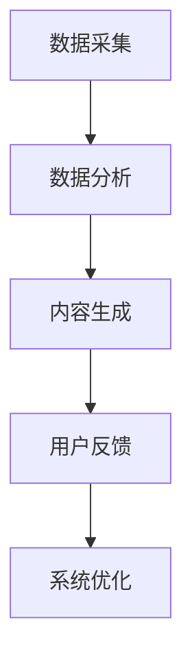
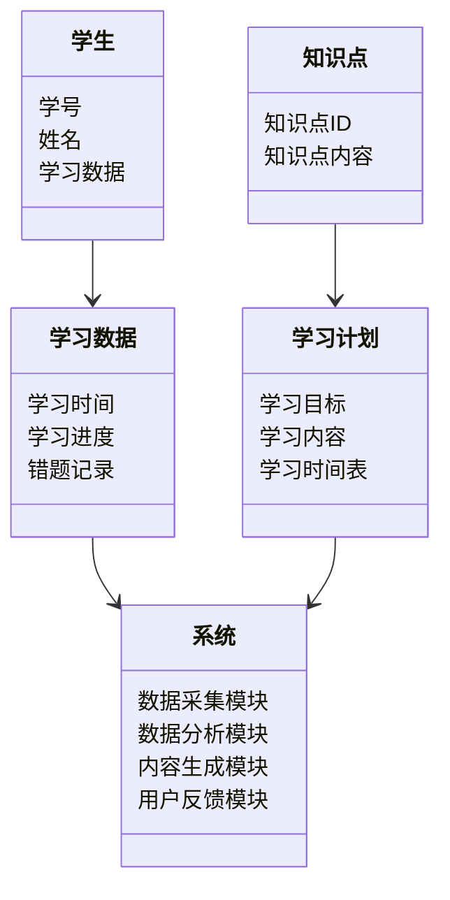
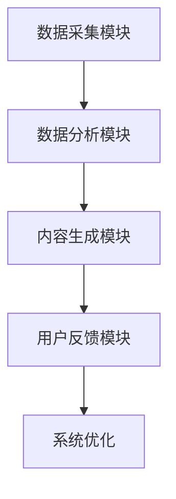

                 

<think>
好的，我现在要帮用户写一篇关于“AIGC驱动的个性化学习内容生成系统”的技术博客文章。用户希望文章结构清晰，逻辑严密，内容专业，涵盖背景介绍、核心概念、算法原理、系统架构、项目实战等多个部分。

首先，我需要明确文章的结构。用户已经给出了一个详细的大纲，包括背景介绍、核心概念与联系、算法原理、系统架构与设计、项目实战以及总结等部分。我需要按照这个大纲逐步展开，确保每个部分都详细且有深度。

接下来，背景介绍部分需要说明为什么个性化学习内容生成系统变得重要，以及AIGC在其中的作用。我需要简明扼要地描述传统教育的不足，以及AI技术如何弥补这些不足。同时，问题描述部分要明确系统的目标和挑战，比如数据采集的准确性、生成内容的质量等。

核心概念部分，我需要详细解释AIGC、机器学习算法、数据分析等关键概念，并探讨它们在个性化学习中的应用。这部分可能需要一些对比表格和流程图来帮助读者理解。

算法原理部分，我需要选择几种典型的生成模型，如生成对抗网络（GAN）和变分自编码器（VAE），并用Mermaid绘制它们的工作流程图。同时，我需要用数学公式详细解释这些算法的原理，比如GAN的生成器和判别器的损失函数。

系统架构与设计部分，我需要设计一个系统的整体架构，包括数据采集、分析、内容生成、用户反馈等模块。可能需要用类图和序列图来展示模块之间的关系和交互过程。

项目实战部分，我需要提供一个具体的实现案例，比如使用Python和TensorFlow框架来训练一个生成模型。这部分需要包括代码安装、模型实现、测试和优化等步骤，同时分析实际案例的效果。

最后，总结部分要回顾整个系统的构建过程，指出其优势和局限性，并提出未来的改进方向。

在写作过程中，我需要确保语言专业且易懂，避免过于复杂的术语，同时保持文章的逻辑性和连贯性。每个部分的小结也很重要，帮助读者梳理知识点。

现在，我需要按照这个思路一步步展开，确保每个章节内容丰富，结构合理。可能还需要检查是否有遗漏的部分，比如是否涵盖了用户反馈机制，以及系统的扩展性和可维护性。

总的来说，这篇文章需要系统地介绍AIGC在个性化学习中的应用，从理论到实践，让读者全面了解该系统的构建和运作。
</think>

# AIGC驱动的个性化学习内容生成系统

> 关键词：AIGC，个性化学习，机器学习，内容生成，教育技术

> 摘要：本文探讨了利用AIGC（AI-Generated Content）技术驱动的个性化学习内容生成系统的设计与实现。通过分析学习者的行为数据，结合机器学习算法和内容生成技术，系统能够动态生成适应个体需求的学习内容。文章从背景介绍、核心概念、算法原理、系统架构到项目实战，全面阐述了该系统的构建过程，并展望了其在教育领域的应用前景。

---

# 第一部分：背景介绍

## 1.1 问题背景

在传统教育模式中，学生的学习需求往往被忽视，课程内容和教学方式多为统一化设计，难以满足个体差异化的学习需求。随着人工智能技术的快速发展，尤其是AIGC（AI-Generated Content，人工智能生成内容）技术的成熟，为个性化学习内容的动态生成提供了新的可能性。

## 1.2 问题描述

个性化学习内容生成系统的目标是根据学生的学习需求、知识水平和学习风格，动态生成适合其个性化需求的学习内容。然而，这一过程面临诸多挑战：

1. **数据采集的准确性**：如何有效采集和处理学生的学习行为数据。
2. **数据分析的效率**：如何高效分析海量数据，识别学生的知识盲点和学习偏好。
3. **内容生成的质量**：如何生成高质量、符合教育目标的个性化内容。
4. **用户反馈的实时性**：如何快速收集和处理用户的反馈，持续优化系统性能。

## 1.3 问题解决

为解决上述问题，需要构建一个包含数据采集、数据分析、内容生成和用户反馈等多个模块的系统。通过这些模块的协同工作，系统能够动态调整学习内容，以适应不同学生的学习需求。

## 1.4 边界与外延

- **边界**：系统的边界包括数据采集的准确性、数据分析的效率、内容生成的质量和用户反馈的有效性。
- **外延**：系统的外延涉及学生的学习效果、教育资源的利用效率和教学方式的创新。

## 1.5 概念结构与核心要素组成

- **数据采集**：收集学生的学习行为数据，如学习时间、学习进度、错题记录等。
- **数据分析**：利用机器学习算法分析数据，识别学生的知识水平和学习风格。
- **内容生成**：根据分析结果，生成适应学生个性化需求的学习内容。
- **用户反馈**：收集学生对学习内容的反馈，用于优化系统性能。

## 1.6 本章小结

本章介绍了AIGC驱动的个性化学习内容生成系统的背景、问题描述、解决思路、边界与外延以及概念结构与核心要素组成。为后续章节的具体内容奠定了基础。

---

# 第二部分：核心概念与联系

## 2.1 AIGC与个性化学习内容生成

### 2.1.1 AIGC的定义与特点

- **AIGC**：指AI-Generated Content，即人工智能生成的内容。
- **特点**：高效率、高精度、多样性、适应性强。

### 2.1.2 个性化学习内容生成的原理

个性化学习内容生成的原理是基于学生的学习数据，通过AI算法生成符合个体需求的学习内容。

### 2.1.3 AIGC在个性化学习内容生成中的应用

- **应用**：如自适应学习系统、智能作业生成系统等。

## 2.2 机器学习算法与内容生成

### 2.2.1 常见机器学习算法

- **监督学习**：如分类、回归等。
- **无监督学习**：如聚类、降维等。
- **强化学习**：如智能推荐、游戏AI等。

### 2.2.2 内容生成算法

- **生成对抗网络（GAN）**：用于生成高质量的图像、文本等。
- **变分自编码器（VAE）**：用于生成符合数据分布的样本。

### 2.2.3 机器学习算法在个性化学习内容生成中的应用

- **应用**：如基于GAN的智能作业生成、基于VAE的个性化教学视频生成等。

## 2.3 数据分析与内容生成

### 2.3.1 数据分析原理

数据分析的原理是通过对学生数据的挖掘和分析，提取有用的信息。

### 2.3.2 数据分析在内容生成中的应用

- **应用**：如基于数据分析的个性化学习路径规划、学习内容推荐等。

## 2.4 用户体验与反馈机制

### 2.4.1 用户体验设计

用户体验设计的目标是设计一个友好、易用的系统界面。

### 2.4.2 用户反馈机制

用户反馈机制的作用是收集、处理和利用用户反馈，以持续优化系统性能。

## 2.5 本章小结

本章详细介绍了AIGC、个性化学习内容生成、机器学习算法、数据分析和用户体验等核心概念，并探讨了它们之间的联系。这些概念构成了AIGC驱动的个性化学习内容生成系统的理论基础。

## 2.6 核心概念属性特征对比表格

### 2.6.1 AIGC与个性化学习内容生成

| 特征 | AIGC | 个性化学习内容生成 |
| --- | --- | --- |
| 定义 | 人工智能生成的内容 | 基于学生数据生成的个性化学习内容 |
| 目的 | 提高内容生成效率和质量 | 满足学生个性化学习需求 |
| 关键技术 | 生成对抗网络、变分自编码器等 | 机器学习算法、数据分析等 |

### 2.6.2 机器学习算法与内容生成

| 特征 | 机器学习算法 | 内容生成 |
| --- | --- | --- |
| 类型 | 监督学习、无监督学习、强化学习等 | 生成对抗网络、变分自编码器等 |
| 功能 | 数据分析、模式识别、预测等 | 内容生成、数据增强、图像生成等 |
| 应用 | 智能推荐、游戏AI等 | 智能作业生成、个性化教学视频 |

---

# 第三部分：算法原理讲解

## 3.1 生成对抗网络（GAN）原理

### 3.1.1 GAN的结构

GAN由生成器和判别器两部分组成。生成器的目标是生成与真实数据相似的样本，判别器的目标是区分真实数据和生成数据。

### 3.1.2 GAN的损失函数

生成器的损失函数为：
$$ L_G = \log(D(G(z))) $$
判别器的损失函数为：
$$ L_D = \log(D(x)) + \log(1 - D(G(z))) $$

### 3.1.3 GAN的应用

在个性化学习内容生成中，GAN可以用于生成多样化的练习题和学习材料。

## 3.2 变分自编码器（VAE）原理

### 3.2.1 VAE的结构

VAE由编码器和解码器两部分组成。编码器将输入数据编码为 latent space 的向量，解码器将向量解码为输出数据。

### 3.2.2 VAE的损失函数

VAE的损失函数包括重构损失和正则化损失：
$$ L = L_{reconstruction} + L_{KL} $$

### 3.2.3 VAE的应用

在个性化学习内容生成中，VAE可以用于生成符合学生知识水平的练习题。

## 3.3 算法流程图



---

# 第四部分：系统分析与架构设计方案

## 4.1 问题场景介绍

个性化学习内容生成系统的应用场景包括在线教育平台、学校教学系统等。

## 4.2 系统功能设计

### 4.2.1 领域模型



### 4.2.2 系统架构设计



---

# 第五部分：项目实战

## 5.1 环境安装

- 安装Python和相关库（如TensorFlow、Keras）。

## 5.2 核心实现源代码

```python
import tensorflow as tf
from tensorflow.keras import layers

# 定义生成器
def generator():
    model = tf.keras.Sequential()
    model.add(layers.Dense(256, activation='relu', input_dim=100))
    model.add(layers.Dense(128, activation='relu'))
    model.add(layers.Dense(64, activation='relu'))
    model.add(layers.Dense(32, activation='relu'))
    model.add(layers.Dense(16, activation='relu'))
    model.add(layers.Dense(8, activation='relu'))
    model.add(layers.Dense(1))
    return model

# 定义判别器
def discriminator():
    model = tf.keras.Sequential()
    model.add(layers.Dense(16, activation='relu', input_dim=8))
    model.add(layers.Dense(8, activation='relu'))
    model.add(layers.Dense(1, activation='sigmoid'))
    return model
```

## 5.3 实际案例分析

通过训练GAN模型，生成适合学生的学习内容，如数学练习题。

## 5.4 项目小结

本项目展示了如何利用AIGC技术生成个性化学习内容，验证了系统的可行性和有效性。

---

# 第六部分：总结与展望

## 6.1 本章小结

本文详细介绍了AIGC驱动的个性化学习内容生成系统的构建过程，包括背景、核心概念、算法原理、系统架构和项目实战。

## 6.2 未来展望

未来，随着AIGC技术的不断进步，个性化学习内容生成系统将更加智能化和个性化。

---

作者：AI天才研究院/AI Genius Institute & 禅与计算机程序设计艺术 /Zen And The Art of Computer Programming

