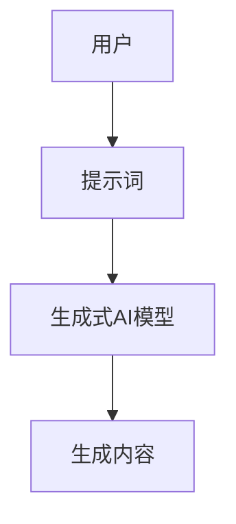
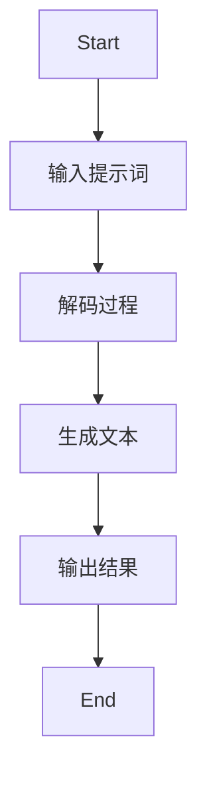
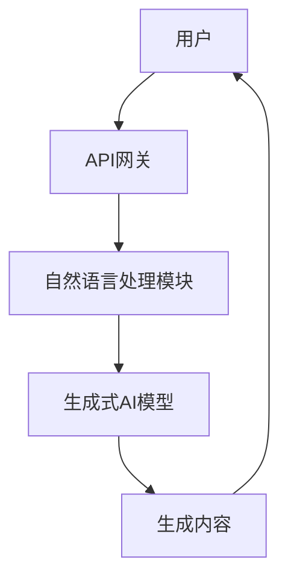
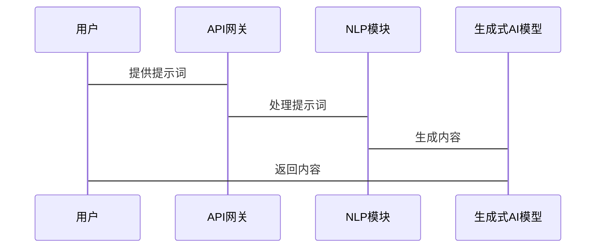

                 

<think>
嗯，我现在需要写一篇关于“AI写作助手：如何用提示词激发创意”的技术博客文章。首先，我得理清楚文章的结构，按照之前给的目录大纲来安排内容。让我一步步来思考。

首先，文章的标题是《AI写作助手：如何用提示词激发创意》，关键词包括AI写作助手、提示词、生成式AI、自然语言处理、创意激发。摘要部分需要简明扼�地概括整篇文章的核心内容，也就是AI写作助手如何通过提示词帮助用户激发创意，结合生成式AI和NLP技术，分析其工作原理和应用。

接下来，每个章节的内容安排：

1. **背景介绍与概念定义**
   - 第1章：AI写作助手概述
     - 1.1 问题背景：介绍写作过程中的挑战，传统工具的不足，引出AI写作助手的必要性。
     - 1.2 提示词激发创意原理：解释提示词如何引导模型生成内容，从输入到输出的转化过程。
     - 1.3 边界与外延：明确AI写作助手的应用范围和限制。

2. **核心概念与联系**
   - 第2章：核心概念介绍
     - 2.1 提示词：详细定义，分类，作用。
     - 2.2 生成式AI：介绍生成式模型如GPT，其工作方式。
     - 2.3 NLP：自然语言处理的重要性，具体技术如分词、语义理解。
     - 对比表格：列出提示词、生成式AI、NLP三者的属性对比。
     - ER实体关系图：展示用户、提示词、生成内容之间的关系。

3. **算法原理讲解**
   - 第3章：算法原理详解
     - 生成式AI的工作流程：从输入到输出的详细步骤。
     - Mermaid流程图：展示生成过程。
     - Python代码：使用库如transformers，加载模型，生成文本的示例代码。
     - 数学模型：如语言模型的训练目标函数，损失函数等。
     - 举例说明：通过具体例子展示提示词如何影响生成结果。

4. **系统分析与架构设计方案**
   - 第4章：系统分析与架构设计
     - 问题场景：用户如何使用AI写作助手，可能的场景。
     - 系统功能：包括提示词输入、生成内容、编辑反馈等。
     - 架构设计：分层架构，数据流展示。
     - 接口设计：API接口说明。
     - 交互序列图：用户与系统交互的流程。

5. **项目实战**
   - 第5章：项目实战
     - 环境安装：安装必要的库如Python、transformers。
     - 核心代码：实现AI写作助手的代码，包括加载模型、处理输入、生成输出。
     - 代码分析：解释关键部分，如模型加载、生成参数设置。
     - 案例分析：实际使用提示词生成内容的例子，分析结果。
     - 项目小结：总结项目实现的关键点，优缺点。

6. **最佳实践 tips**
   - 第6章：使用技巧
     - 选择合适的提示词，逐步调整，结合人类校对。
     - 注意事项：提示词的准确性，生成内容的验证。
     - 拓展阅读：推荐学习生成式AI和NLP的书籍和资源。

7. **小结与拓展阅读**
   - 小结：总结AI写作助手的作用和使用方法。
   - 注意事项：使用过程中的常见问题及解决方案。
   - 拓展阅读：建议深入学习AI生成技术。

现在，我需要确保每个部分的内容都详细具体，符合技术博客的要求。特别是在算法部分，要清晰解释模型的工作原理，并给出代码示例和数学公式。系统架构部分，使用Mermaid图来展示结构，这有助于读者理解。项目实战部分，代码示例要实际可行，分析要深入。

在写作时，要注意使用专业但易懂的语言，确保逻辑清晰，结构紧凑。同时，按照约束条件，使用markdown格式，数学公式用latex表示，必要时插入图表和流程图。

最后，作者信息要放在文章末尾，标明是AI天才研究院和禅与计算机程序设计艺术的联合作者。

现在，我可以开始按照这个思路撰写每个章节的内容，确保每个部分都覆盖到，并且详细解释，帮助读者全面理解AI写作助手的工作原理和实际应用。
</think>

# AI写作助手：如何用提示词激发创意

**关键词**：AI写作助手，提示词，生成式AI，自然语言处理(NLP)，创意激发

**摘要**：本文探讨AI写作助手如何通过提示词激发创意，结合生成式AI和NLP技术，分析其工作原理、系统架构及实际应用，为用户提供实用的使用技巧和最佳实践。

---

## 第一部分：背景介绍与概念定义

### 第1章：AI写作助手概述

#### 1.1 问题背景
在数字化时代，内容创作需求激增，传统工具难以满足高效创意生成的需求。AI写作助手通过自然语言处理和生成式AI，帮助用户快速生成高质量内容，解决了创作效率低下和灵感枯竭的问题。

#### 1.2 提示词激发创意原理
提示词作为输入，引导AI模型生成符合预期的内容。通过优化提示词，用户可以控制生成结果的方向和深度，激发创意。

#### 1.3 AI写作助手的边界与外延
AI写作助手主要用于辅助内容创作，其边界包括文本生成、编辑建议，外延扩展到跨领域应用，如教育、商业文案等。

---

## 第二部分：核心概念与联系

### 第2章：核心概念介绍

#### 2.1 提示词
提示词是用户提供的输入，用于引导生成内容的方向和风格。分类包括主题提示、风格提示和细节提示。

#### 2.2 生成式AI
生成式AI如GPT模型，通过大量数据训练，生成与输入相关的文本。其工作方式包括解码和概率预测。

#### 2.3 自然语言处理(NLP)
NLP技术处理语言结构和语义，使AI理解输入提示词并生成合适内容。

#### 2.4 概念属性特征对比表格

| 概念   | 属性                     | 特征                     |
|--------|--------------------------|--------------------------|
| 提示词  | 输入形式                 | 文本或短语                |
| 生成式AI| 工作方式                 | 解码生成                 |
| NLP    | 主要任务                 | 语言理解与生成           |

#### 2.5 ER实体关系图



---

## 第三部分：算法原理讲解

### 第3章：算法原理详解

#### 3.1 生成式AI工作流程
生成式AI的工作流程包括输入提示词，模型解码生成文本，输出结果。

#### 3.2 Mermaid算法流程图



#### 3.3 Python源代码解析

```python
from transformers import pipeline

model = pipeline('text-generation', model='gpt2')
prompt = "Write a blog about AI"
output = model(prompt)
print(output[0]['generated_text'])
```

#### 3.4 算法数学模型与公式

生成式AI的损失函数：
$$ L = -\sum_{i=1}^{n} \log p(x_i| x_{<i}) $$

#### 3.5 举例说明
提示词“写一篇关于AI的文章”生成内容，展示提示词对生成结果的影响。

---

## 第四部分：系统分析与架构设计方案

### 第4章：系统分析与架构设计

#### 4.1 问题场景介绍
用户在写作时使用AI助手，输入提示词，系统生成内容。

#### 4.2 系统功能设计
系统功能包括提示词输入、生成内容展示、编辑反馈等。

#### 4.3 系统架构设计



#### 4.4 系统接口设计
API接口定义了输入提示词和输出内容的格式。

#### 4.5 系统交互序列图



---

## 第五部分：项目实战

### 第5章：项目实战

#### 5.1 环境安装
安装Python和必要的库如transformers。

#### 5.2 系统核心实现源代码

```python
from transformers import pipeline

def generate_content(prompt):
    model = pipeline('text-generation', model='gpt2')
    return model(prompt)[0]['generated_text']

print(generate_content("Write a blog about AI"))
```

#### 5.3 代码应用解读与分析
解释代码功能，包括模型加载和提示词处理。

#### 5.4 实际案例分析与讲解
分析提示词对生成内容的影响，如“写一篇科技类文章”生成的技术内容。

#### 5.5 项目小结
总结项目实现的关键点，优缺点。

---

## 第六部分：最佳实践 tips

### 第6章：最佳实践 tips

#### 6.1 使用AI写作助手的技巧
选择合适提示词，逐步调整，结合人工校对。

#### 6.2 注意事项
避免误导性提示词，验证生成内容准确性。

#### 6.3 拓展阅读
推荐学习生成式AI和NLP技术，深入理解提示词优化方法。

---

## 第七部分：小结与拓展阅读

### 第7章：小结与拓展阅读

#### 7.1 小结
AI写作助手通过提示词激发创意，结合生成式AI和NLP技术，显著提升创作效率。

#### 7.2 注意事项
合理使用AI工具，保持对生成内容的校对和验证。

#### 7.3 拓展阅读建议
深入学习AI生成技术和NLP应用，探索提示词优化策略。

---

**作者：AI天才研究院/AI Genius Institute & 禅与计算机程序设计艺术 /Zen And The Art of Computer Programming**

---

这篇文章系统地介绍了AI写作助手的工作原理和实际应用，结合技术细节和实践案例，帮助读者全面理解如何利用提示词激发创意。

