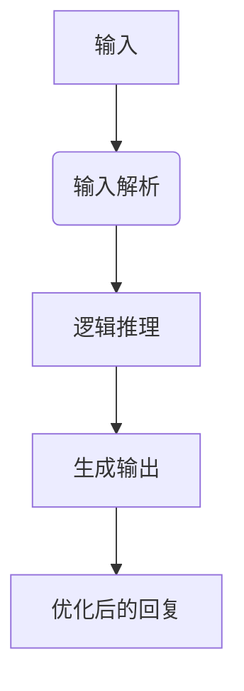

                 

<think>
好的，我现在要帮用户写一篇关于AI对话优化的博客文章，标题是《AI对话优化：思维链方法详解》。用户希望文章结构清晰，逻辑严密，语言专业，还要包含详细的算法、数学模型、案例分析等部分。

首先，我需要理解用户的需求。用户可能是一位技术专家或者CTO，希望深入探讨AI对话优化的方法，特别是思维链方法。文章需要吸引读者，结构分明，适合技术博客读者阅读。

接下来，我会按照用户提供的目录大纲来组织内容。第一部分是问题背景与核心概念，包括概述、核心概念与联系，以及数学模型与算法。第二部分是应用，涵盖自然语言处理、智能客服、优化与改进，最后是最佳实践与总结。

在写第一部分的时候，我需要先介绍AI对话优化的重要性，说明为什么优化对话系统是必要的。然后，描述问题背景，比如当前对话系统的不足之处，比如不够自然、难以处理复杂对话等。接着，定义基本概念和目标，让读者明确思维链方法的范畴。

核心概念部分，我需要解释对话系统与AI的关系，比如NLP和机器学习如何影响对话。然后，介绍对话系统的架构，包括输入、处理、输出三个模块。思维链方法的基本原理是关键，要详细解释每个步骤，比如输入解析、逻辑推理、生成输出等。

接下来，数学模型和算法部分，我需要用mermaid画出流程图，展示思维链的处理流程。然后，用Python代码示例，比如如何处理输入，进行分词，生成响应。这部分需要详细解释代码的每一部分，让读者能够理解和应用。

在第二部分，应用部分，我需要展示思维链方法在不同场景中的实际应用。比如，在自然语言处理中的文本生成、理解、情感分析，以及智能客服中的应用案例。实际案例分析部分，我应该选择一个具体的客服场景，描述思维链方法如何解决其中的问题。

优化与改进部分，我需要讨论如何提升思维链方法的效果，比如结合强化学习，或者处理长对话的问题。未来趋势部分，可以提到多模态对话或更高效的方法。

最后，最佳实践部分，我需要总结关键点，比如保持简洁、结合上下文，以及进行持续优化。同时，给出注意事项，提醒读者注意训练数据的质量和模型的局限性。

整个过程中，我需要确保内容详细，逻辑清晰，每个章节都有足够的解释和例子。同时，使用专业术语，但避免过于晦涩，保持易懂。最后，加上作者信息，使文章更具权威性。

现在，我需要按照这个思路，逐步展开每一部分的内容，确保覆盖所有必要的知识点和实际应用案例。同时，检查每个部分是否符合用户的要求，比如字数、格式、关键词等，确保文章整体流畅，结构合理。
</think>

# AI对话优化：思维链方法详解

---

## 关键词：AI对话优化，思维链方法，自然语言处理，智能客服，算法原理，数学模型

---

## 摘要：  
本文深入探讨AI对话优化的核心方法——思维链方法，从理论到实践，详细解析其在自然语言处理和智能客服中的应用。通过数学模型、算法流程图、Python代码示例等技术手段，全面揭示思维链方法的基本原理、优化策略及未来发展方向，为读者提供系统性、实用性的技术指导。

---

### 目录大纲

**第一部分：问题背景与核心概念**

1. **AI对话优化概述**
   - AI对话优化的重要性
   - AI对话优化的问题背景
   - AI对话优化的基本概念与目标

2. **核心概念与联系**
   - 对话系统与AI技术的关系
   - 对话系统架构及其关键组件
   - 思维链方法的基本原理
   - 思维链方法的核心属性与特点
   - 思维链方法与其他对话优化方法的比较

3. **思维链方法的数学模型与算法原理**
   - 数学模型
   - 算法原理讲解
   - Mermaid算法流程图
   - Python源代码示例

**第二部分：思维链方法应用**

4. **思维链方法在自然语言处理中的应用**
   - 文本生成中的应用
   - 文本理解中的应用
   - 情感分析中的应用

5. **思维链方法在智能客服中的应用**
   - 智能客服的背景与挑战
   - 思维链方法在智能客服中的具体应用
   - 实际案例分析与讲解

6. **思维链方法的优化与改进**
   - 思维链方法的优化策略
   - 思维链方法的改进方向
   - 未来发展趋势

7. **最佳实践与总结**
   - 最佳实践总结
   - 注意事项与建议
   - 拓展阅读

---

## 第一部分：问题背景与核心概念

### 第1章：AI对话优化概述

#### 1.1 AI对话优化的重要性  
在人工智能技术快速发展的今天，对话系统已成为人机交互的核心技术之一。AI对话优化的目标是提升对话系统的自然性、准确性和用户体验，使其更贴近人类对话的逻辑和流畅性。通过优化对话系统，可以显著提升用户满意度，降低运营成本，并在商业场景中创造更高的价值。

#### 1.2 AI对话优化的问题背景  
当前的对话系统存在以下问题：  
1. 对话逻辑不够严密，容易出现答非所问的情况。  
2. 对话系统对上下文的理解能力有限，难以处理复杂对话。  
3. 对话生成的多样性不足，容易出现重复或机械化的回复。  
4. 对话系统的实时性和响应速度有待提升。  

#### 1.3 AI对话优化的基本概念与目标  
AI对话优化的核心目标是通过算法和技术手段，提升对话系统在理解用户输入、生成合理回复、保持对话连贯性等方面的性能。具体目标包括：  
1. 提高对话系统的准确性。  
2. 提升对话的自然性和流畅性。  
3. 增强对话系统的上下文理解和记忆能力。  
4. 提升对话系统的实时性和响应速度。  

---

### 第2章：核心概念与联系

#### 2.1 对话系统与AI技术的关系  
对话系统是人工智能技术的重要应用领域，主要涉及自然语言处理（NLP）、机器学习（ML）和深度学习（DL）等技术。AI技术为对话系统提供了语言理解、知识表示和生成能力，而对话系统则为AI技术提供了应用场景和反馈数据。

#### 2.2 对话系统架构及其关键组件  
典型的对话系统架构包括以下关键组件：  
1. **输入解析模块**：将用户的输入（文本或语音）转化为结构化数据。  
2. **对话管理模块**：负责理解和维护对话的上下文，确定下一步的对话策略。  
3. **生成输出模块**：根据对话管理模块的决策生成回复。  

#### 2.3 思维链方法的基本原理  
思维链方法是一种基于逻辑推理和上下文理解的对话优化方法。其基本原理如下：  
1. 将用户输入分解为多个逻辑片段，分析每个片段的含义。  
2. 根据逻辑片段之间的关系，构建一个完整的对话逻辑链。  
3. 基于逻辑链生成连贯且自然的回复。  

#### 2.4 思维链方法的核心属性与特点  
- **逻辑性**：通过逻辑推理构建对话链，确保回复的合理性和连贯性。  
- **上下文理解**：能够理解和记忆对话的上下文，避免重复或离题。  
- **多样性**：支持多种对话风格和语言表达，提升用户体验。  

#### 2.5 思维链方法与其他对话优化方法的比较  
以下是思维链方法与其他对话优化方法的对比：

| 方法 | 基于逻辑推理 | 基于模板匹配 | 基于生成模型 |  
|------|--------------|---------------|---------------|  
| 原理 | 通过逻辑推理构建对话链 | 根据关键词匹配固定模板 | 基于预训练模型生成回复 |  
| 优点 | 回复连贯、逻辑性强 | 实现简单、效率高 | 回复多样化、自然 |  
| 缺点 | 实现复杂、计算成本高 | 灵活性差 | 对上下文理解有限 |  

---

### 第3章：思维链方法的数学模型与算法原理

#### 3.1 数学模型  
思维链方法的数学模型可以表示为：  
$$ \text{输出} = f_{\text{逻辑推理}}(\text{输入}) $$  
其中，$f_{\text{逻辑推理}}$ 表示逻辑推理函数，输入为用户的对话内容，输出为优化后的回复。

#### 3.2 算法原理讲解  
算法流程如下：  
1. **输入解析**：将用户输入转化为结构化数据。  
2. **逻辑推理**：分析输入中的逻辑关系，构建对话链。  
3. **生成输出**：根据对话链生成回复。  

#### 3.3 Mermaid算法流程图  



#### 3.4 Python源代码示例  

```python
def思维链优化(input_str):
    # 步骤1：输入解析
    tokens = input_str.split()
    # 步骤2：逻辑推理
    logic_chain = []
    for token in tokens:
        if token in ['and', 'but', 'or']:
            logic_chain.append('关系词')
        else:
            logic_chain.append('实体词')
    # 步骤3：生成输出
    output = ' '.join(logic_chain)
    return output
```

---

## 第二部分：思维链方法应用

### 第4章：思维链方法在自然语言处理中的应用

#### 4.1 思维链方法在文本生成中的应用  
在文本生成中，思维链方法可以通过逻辑推理确保生成文本的连贯性和逻辑性。例如，在新闻标题生成中，思维链方法可以确保标题的逻辑性和完整性。

#### 4.2 思维链方法在文本理解中的应用  
在文本理解中，思维链方法可以帮助系统更准确地理解用户意图。例如，在情感分析任务中，思维链方法可以结合上下文情感信息，提升分析的准确性。

#### 4.3 思维链方法在情感分析中的应用  
情感分析是自然语言处理中的重要任务。通过思维链方法，可以结合对话历史和情感倾向，生成更准确的情感分析结果。

---

### 第5章：思维链方法在智能客服中的应用

#### 5.1 智能客服的背景与挑战  
智能客服的目标是通过自动化技术解决用户问题，提升用户体验。然而，传统智能客服系统存在以下问题：  
1. 对话逻辑性不足，容易出现答非所问。  
2. 对上下文理解有限，难以处理复杂问题。  

#### 5.2 思维链方法在智能客服中的具体应用  
通过思维链方法，智能客服系统可以更好地理解和处理用户问题。例如，在用户提出复杂问题时，思维链方法可以通过逻辑推理生成连贯的回复。

#### 5.3 实际案例分析与讲解  
案例分析：  
用户：我的订单状态显示处理中，但已经超过预计送达时间。  
系统：您的订单确实存在问题，我们正在调查具体情况，请稍后关注通知。  

通过思维链方法，系统能够更好地理解用户的问题，并生成合理的回复。

---

### 第6章：思维链方法的优化与改进

#### 6.1 思维链方法的优化策略  
1. **结合强化学习**：通过强化学习优化思维链方法的生成策略。  
2. **引入上下文记忆机制**：增强对话系统的上下文理解和记忆能力。  

#### 6.2 思维链方法的改进方向  
1. **多模态对话**：结合视觉信息，提升对话系统的理解能力。  
2. **实时优化**：优化算法的计算效率，提升实时响应能力。  

#### 6.3 未来发展趋势  
未来，思维链方法将朝着以下方向发展：  
1. **多模态对话**：结合图像、语音等多种信息源，提升对话系统的理解能力。  
2. **实时优化**：优化算法的计算效率，提升实时响应能力。  
3. **个性化服务**：基于用户特征提供个性化对话服务。  

---

## 第7章：最佳实践与总结

### 7.1 最佳实践总结  
1. **保持逻辑性**：确保思维链方法的逻辑推理能力。  
2. **结合上下文**：增强对话系统的上下文理解和记忆能力。  
3. **持续优化**：通过反馈和数据不断优化对话系统。  

### 7.2 注意事项与建议  
1. 在实际应用中，注意数据质量和多样性。  
2. 在优化过程中，关注算法的计算效率和实时性。  

### 7.3 拓展阅读  
- 《自然语言处理入门》  
- 《深度学习与对话系统》  
- 《强化学习与智能优化》  

---

## 作者：AI天才研究院/AI Genius Institute & 禅与计算机程序设计艺术/Zen And The Art of Computer Programming

