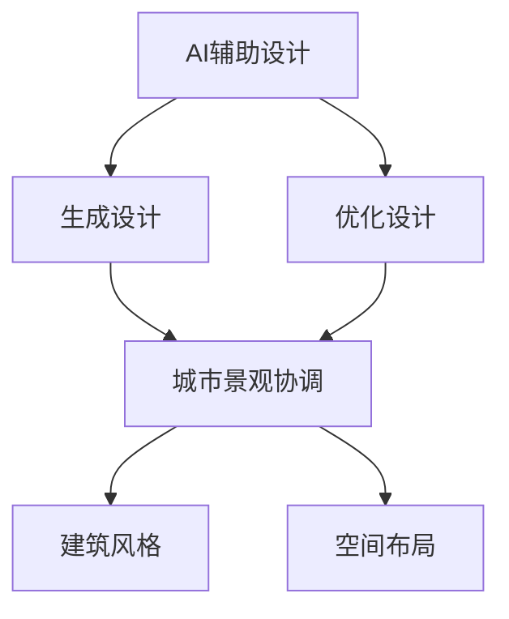
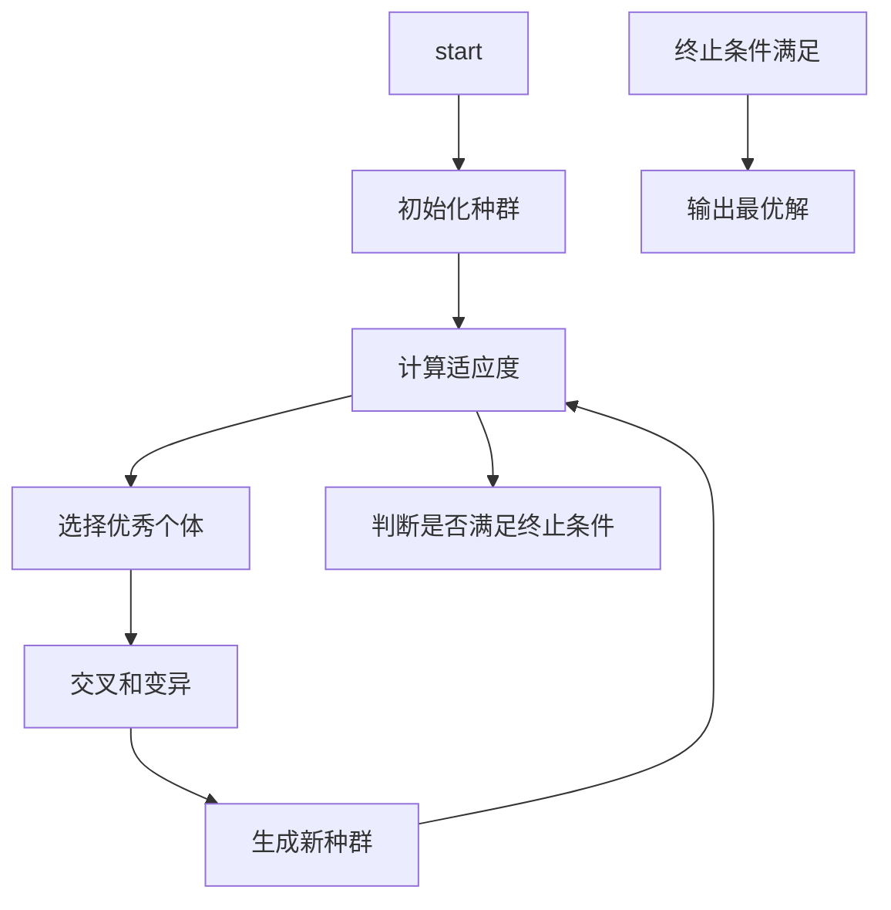
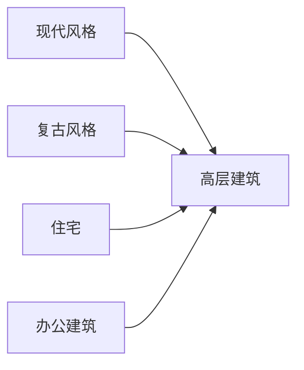
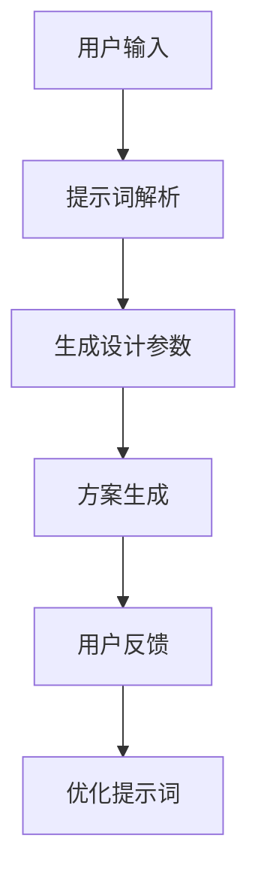

                 

<think>
嗯，我现在需要写一篇关于《AI辅助创意建筑外观设计：城市景观协调的提示词技巧》的技术博客。首先，我得理解这个主题，它涉及到AI在建筑外观设计中的应用，特别是如何通过提示词来协调城市景观。那我应该从哪些方面展开呢？

首先，我需要考虑用户的要求。用户希望文章结构清晰，逻辑严密，用专业的技术语言，并且每个部分都要详细。文章的结构已经有一个大纲，分为六个主要部分：背景介绍与核心概念、AI在建筑外观设计中的应用、基于提示词的城市景观协调、系统设计与实现、项目实战案例和未来展望。每个部分还有子部分，需要详细展开。

好的，首先，我得处理摘要部分。摘要需要简明扼要地概括文章的核心内容，包括AI在建筑外观设计中的作用，提示词技巧，以及对城市景观协调的影响。这部分应该简短，但要涵盖所有关键点。

接下来是关键词，大约5到7个。可能包括：AI辅助设计、创意建筑、城市景观协调、提示词技巧、建筑设计、AI算法、数字化设计。这些词能帮助读者快速理解文章的主题。

然后，进入正文部分。第一部分是背景介绍与核心概念。我需要详细解释AI在建筑外观设计中的背景，说明为什么AI在这个领域变得重要，以及城市景观协调的重要性。这里可能需要定义一些核心概念，比如AI辅助设计、城市景观协调，解释它们的属性和相互关系，可能还要画个ER图或者概念图来展示。

第二部分是AI在建筑外观设计中的应用。这里需要介绍AI在设计中的具体应用，比如生成设计、参数化设计和优化设计。可能需要举例说明，比如生成多样化的建筑风格，参数化调整形态，优化结构。同时，还要讲讲AI算法的数学模型，比如基于遗传算法的优化流程，用公式和mermaid流程图来解释。

第三部分是基于提示词的城市景观协调。这部分需要详细讨论提示词的作用，如何分类，比如功能提示词、风格提示词、空间提示词等。还要讲讲提示词的语义网络，如何分析提示词之间的关系，可能需要使用mermaid图来展示提示词的结构。

第四部分是系统设计与实现。这部分比较技术，需要描述系统架构，比如模块化的系统结构，功能模块的划分。可能需要画个类图，展示各模块之间的关系。此外，还需要讨论系统接口和交互设计，比如与设计师的交互流程，可能用序列图来展示。

第五部分是项目实战案例。这里需要选择一个实际的项目，详细分析设计目标、AI算法实现、系统功能展示和结果展示。通过具体案例来说明提示词如何在实际中应用，达到协调城市景观的效果。

最后是未来展望。这部分需要讨论AI在建筑外观设计中的未来发展方向，比如多模态提示词、实时协作设计、可持续性设计等，还可以提到当前技术的局限性，比如数据隐私和模型泛化能力，以及未来可能的发展趋势。

在写作过程中，我需要确保每个部分都符合逻辑，层层递进，同时保持语言的专业性和易懂性。特别是数学公式和图表的使用，要准确无误，帮助读者更好地理解内容。

可能遇到的挑战是如何将复杂的AI算法用简单易懂的方式解释出来，尤其是对非技术读者。我需要找到平衡点，既不低估读者的智能，又不过于技术化，让文章更具可读性。

此外，案例分析部分需要选择真实或虚构的案例，详细描述设计过程，展示AI如何辅助设计，提示词如何协调城市景观。这不仅能让读者理解理论，还能看到实际应用的效果。

最后，在总结部分，我要回顾整个文章，强调AI辅助设计的重要性和提示词技巧在其中的关键作用，同时指出未来的发展方向，让读者对未来充满期待。

总之，这篇文章需要全面、系统地介绍AI在建筑外观设计中的应用，特别是提示词技巧在协调城市景观中的作用，结合理论和实际案例，让读者能够全面理解并应用这些技术。
</think>

# AI辅助创意建筑外观设计：城市景观协调的提示词技巧

## 关键词：AI辅助设计、创意建筑、城市景观协调、提示词技巧、建筑设计、AI算法、数字化设计

## 摘要：  
随着人工智能技术的快速发展，AI在建筑外观设计中的应用日益广泛。本文探讨了AI如何通过提示词技术辅助创意建筑外观设计，以实现城市景观的协调统一。文章从AI辅助设计的核心概念出发，分析了提示词在城市景观协调中的关键作用，并通过具体案例展示了AI在建筑设计中的实际应用。本文旨在为建筑师和设计师提供实用的提示词技巧，以优化建筑设计过程，提升城市景观的整体美感和功能性。

---

# 第一部分：背景介绍与核心概念

## 1.1 背景介绍  
### 1.1.1 AI辅助设计的背景  
随着城市化进程的加快，建筑的设计和施工面临更高的要求。传统建筑设计依赖人工经验，效率低下且难以满足多样化的需求。AI技术的引入，为建筑设计带来了新的可能性，尤其是在创意建筑外观设计和城市景观协调方面。

### 1.1.2 城市景观协调的重要性  
城市景观协调是城市规划的重要组成部分，直接影响城市的美观和居民的生活质量。通过AI辅助设计，可以实现建筑与周围环境的和谐统一，提升城市整体形象。

## 1.2 核心概念与联系  
### 1.2.1 核心概念  
| 概念 | 描述 |  
|------|------|  
| AI辅助设计 | 利用人工智能技术辅助建筑设计的过程，包括生成设计、优化设计和模拟分析。 |  
| 城市景观协调 | 建筑与城市环境的和谐统一，包括建筑风格、尺度、材质与城市整体规划的协调。 |  

### 1.2.2 概念关系图  

---

# 第二部分：AI在建筑外观设计中的应用

## 2.1 AI辅助设计的核心算法  
### 2.1.1 基于遗传算法的优化流程  
遗传算法是一种常用的AI优化算法，通过模拟自然选择的过程，逐步优化设计方案。  

### 2.1.2 参数化设计的数学模型  
参数化设计通过调整参数生成不同的建筑形态。例如，建筑高度 \( h \) 和宽度 \( w \) 可以通过以下公式优化：  
$$ h = k \times w + c $$  
其中，\( k \) 是比例系数，\( c \) 是常数项。

## 2.2 提示词技术在设计中的应用  
### 2.2.1 提示词分类  
提示词是AI设计中的关键输入，用于指导生成特定风格的建筑。常见的提示词分类包括：  
1. 功能提示词：如“办公建筑”、“住宅”  
2. 风格提示词：如“现代风格”、“复古风格”  
3. 空间提示词：如“高层建筑”、“低层建筑”  

### 2.2.2 提示词的语义网络  
提示词的语义关系可以通过网络图表示：  

---

# 第三部分：基于提示词的城市景观协调

## 3.1 提示词的语义分析  
提示词的语义分析是实现城市景观协调的关键。通过自然语言处理技术，AI可以理解提示词之间的关系，并生成协调的设计方案。

## 3.2 提示词的权重分配  
提示词的权重影响设计结果的优先级。例如，设计一个现代风格的高层建筑，权重分配可能为：  
$$ w_{\text{现代风格}} = 0.6, \quad w_{\text{高层建筑}} = 0.4 $$

## 3.3 提示词的动态调整  
在设计过程中，提示词需要动态调整以适应城市景观的变化。例如，在生成建筑方案后，AI可以根据周围环境的反馈优化提示词。

---

# 第四部分：系统设计与实现

## 4.1 系统架构设计  
AI辅助设计系统的架构包括以下几个模块：  
1. 用户输入模块：接收提示词和设计目标  
2. 数据处理模块：解析提示词并生成设计参数  
3. 算法计算模块：执行AI算法生成设计方案  
4. 反馈优化模块：根据反馈调整提示词和设计参数  

系统架构图如下：  

## 4.2 系统功能设计  
### 4.2.1 功能模块  
- 提示词解析模块：解析用户输入的提示词并生成设计参数  
- 方案生成模块：根据设计参数生成建筑外观方案  
- 反馈优化模块：根据用户反馈优化提示词和设计参数  

### 4.2.2 功能流程图  

---

# 第五部分：项目实战案例

## 5.1 项目背景  
本案例旨在设计一个现代风格的高层办公建筑，与周边的城市景观协调统一。  

## 5.2 设计目标  
1. 建筑高度：100米  
2. 建筑风格：现代简约  
3. 空间布局：与周边绿地和道路协调  

## 5.3 AI算法实现  
基于遗传算法的优化流程：  
1. 初始化种群：生成多个建筑方案  
2. 计算适应度：评估每个方案与城市景观的协调性  
3. 选择优秀个体：保留适应度高的方案  
4. 交叉和变异：生成新的设计方案  
5. 重复优化：直到达到终止条件  

## 5.4 系统功能展示  
1. 提示词输入：现代简约、高层建筑  
2. 算法优化：生成多种现代简约风格的高层建筑方案  
3. 反馈优化：根据用户反馈调整提示词权重  

---

# 第六部分：未来展望

## 6.1 技术发展趋势  
1. 多模态提示词：结合图像、文本等多种提示信息  
2. 实时协作设计：支持多人在线协作  
3. 可持续性设计：考虑建筑的能源效率和环保性  

## 6.2 挑战与机遇  
- 挑战：数据隐私、模型泛化能力  
- 机遇：智能化设计工具、个性化建筑风格  

---

# 结语  

AI辅助创意建筑外观设计通过提示词技术实现了城市景观的协调统一，为建筑设计带来了新的可能性。未来，随着AI技术的进一步发展，建筑外观设计将更加智能化和个性化，为城市规划和建筑行业注入新的活力。

---

# 作者：AI天才研究院 & 禅与计算机程序设计艺术  

感谢您的阅读！如您有任何问题或建议，请随时与我们联系。

