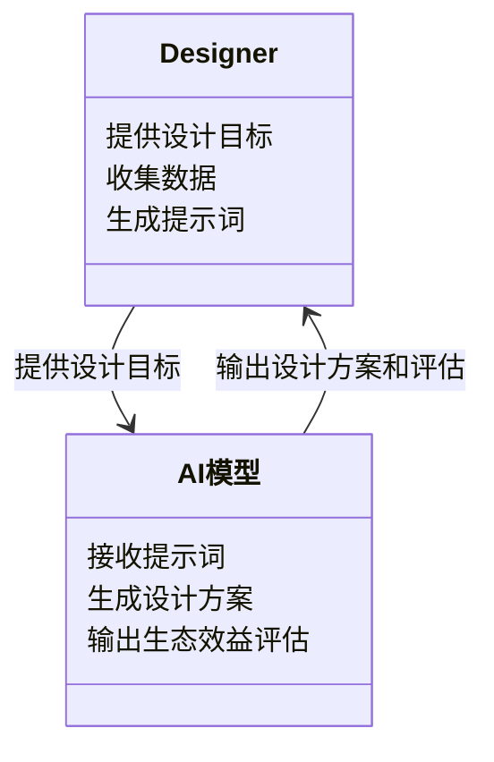

                 

<think>
嗯，用户让我写一篇关于AI辅助创意景观设计的文章，特别是生态系统服务优化的提示词技巧。我需要先理解用户的需求，然后按照他们提供的目录大纲来组织内容。

首先，文章标题已经确定，是《AI辅助创意景观设计：生态系统服务优化的提示词技巧》。接下来，我需要列出5-7个关键词，比如AI辅助设计、生态系统服务、景观设计、机器学习、深度学习、提示词优化。摘要部分要简洁地概述文章内容，说明AI如何通过优化提示词来提升景观设计的生态系统服务。

接下来是目录大纲，分为六个主要部分：背景介绍、核心概念与联系、算法原理讲解、系统分析与架构设计、项目实战、最佳实践。每个部分下面还有小节，我需要逐一展开。

在背景介绍部分，我需要先描述问题背景，包括问题描述、解决思路、边界和外延，以及核心概念的结构和组成。这部分要让读者明白为什么AI在景观设计中是必要的，以及它如何帮助优化生态系统服务。

核心概念与联系部分，我需要详细讲解AI在景观设计中的应用，生态系统服务的定义和类型，以及优化技巧。此外，还要对比AI辅助设计与传统设计的不同，可能通过表格或图表来展示差异。

算法原理讲解部分，我需要详细说明机器学习算法在景观优化中的应用，包括算法原理、数学模型，以及实际案例。这部分可能需要用到Mermaid流程图和Python代码示例，展示模型的训练和应用过程。

系统分析与架构设计部分，需要介绍问题场景，设计系统功能，展示领域模型和系统架构图。接口设计和系统交互也需要用Mermaid序列图来展示，让读者理解系统如何运作。

项目实战部分，包括环境安装、核心代码实现、案例分析和项目总结。这部分需要具体操作步骤和代码，让读者能够实际应用这些技术。

最后，最佳实践部分，总结经验和注意事项，提供拓展阅读材料，帮助读者进一步深入学习。

在写作过程中，我需要确保每个章节内容丰富，逻辑清晰，使用专业的技术语言，同时保持易懂。数学公式要用LaTeX格式，单独段落用$$，段落内用$。系统图则用Mermaid语法，确保正确展示。

我还需要注意文章的整体结构和字数要求，大约在10000到12000字之间。作者信息也要放在末尾，符合用户的要求。

现在，我应该按照目录大纲逐一撰写每个部分，确保每个小节都有详细的讲解和具体的例子，帮助读者理解AI在景观设计中的应用及其优化技巧。同时，要检查各部分之间的衔接，确保文章流畅，逻辑严密。
</think>

# AI辅助创意景观设计：生态系统服务优化的提示词技巧

> 关键词：AI辅助设计，生态系统服务，景观设计，机器学习，深度学习，提示词优化

> 摘要：本文探讨了人工智能在创意景观设计中的应用，特别是在优化生态系统服务方面的提示词技巧。通过分析AI技术如何介入景观设计，结合机器学习和深度学习算法，本文详细阐述了AI辅助设计的核心概念、算法原理、系统架构设计以及实际项目案例。文章还提供了最佳实践和未来展望，为景观设计师和AI技术开发者提供了理论与实践的双重指导。

---

# 目录大纲

1. [背景介绍](#背景介绍)
2. [核心概念与联系](#核心概念与联系)
3. [算法原理讲解](#算法原理讲解)
4. [系统分析与架构设计](#系统分析与架构设计)
5. [项目实战](#项目实战)
6. [最佳实践](#最佳实践)

---

## 第一部分：背景介绍

### 第1章 问题背景

#### 1.1 景观设计中的创意与生态系统服务

##### 1.1.1 问题的提出

景观设计是一种结合艺术与科学的创造性活动，旨在通过空间布局、植被配置和水域规划等手段，打造美观且功能性强的环境。然而，传统景观设计往往依赖设计师的经验和直觉，难以量化和优化生态系统服务，例如生物多样性保护、碳汇能力提升和环境质量改善。

##### 1.1.2 创意景观设计的现状

随着城市化进程的加快，景观设计的需求日益增长，但设计过程中的生态效益评估和优化仍存在以下挑战：

- **生态效益难以量化**：传统设计难以精确评估不同设计方案对生态系统服务的具体贡献。
- **设计效率低下**：设计师需要手动调整多个变量，导致设计周期长且成本高。
- **缺乏数据驱动的决策**：设计方案缺乏科学的数据支持，难以实现生态效益最大化。

##### 1.1.3 AI技术在景观设计中的应用潜力

人工智能技术的快速发展为景观设计带来了新的可能性。通过机器学习和深度学习算法，AI可以分析海量数据，优化设计方案，并提供生态效益评估。AI技术的应用可以显著提升设计效率，同时实现生态效益的最大化。

#### 1.2 问题解决

AI技术的介入为景观设计提供了以下解决方案：

- **数据驱动的设计优化**：通过分析气候数据、土壤特性、生物多样性等信息，AI可以帮助设计师生成更优的设计方案。
- **自动化生态效益评估**：AI可以快速评估不同设计方案对生态系统服务的影响，例如碳汇能力、生物多样性保护等。
- **多目标优化**：AI可以同时优化美观性、功能性、生态效益等多个目标，帮助设计师实现更全面的设计目标。

#### 1.3 边界与外延

景观设计的边界包括但不限于：

- **园林设计**：公园、庭院、广场等空间的规划。
- **城市规划**：城市绿地系统、街道绿化等。
- **环境美化**：自然保护区、湿地恢复等生态项目。

生态系统服务的外延包括：

- **生态效益**：碳汇能力、水土保持等。
- **环境质量**：空气质量、噪音控制等。
- **生物多样性**：物种保护、栖息地优化等。

#### 1.4 概念结构与核心要素组成

AI辅助景观设计的核心要素包括：

- **AI技术**：人工智能、机器学习、深度学习等。
- **景观设计**：空间布局、植被配置、水域规划等。
- **生态系统服务优化**：生态效益最大化、环境质量提升、生物多样性保护等。

---

## 第二部分：核心概念与联系

### 第2章 核心概念原理

#### 2.1 AI辅助景观设计

AI在景观设计中的应用主要体现在以下几个方面：

- **数据收集与分析**：AI可以收集气候、土壤、生物多样性等数据，并进行分析，为设计提供科学依据。
- **设计生成与优化**：通过机器学习算法，AI可以生成多个设计方案，并优化其生态效益和美观性。
- **生态效益评估**：AI可以量化不同设计方案对生态系统服务的贡献，帮助设计师选择最优方案。

#### 2.2 生态系统服务

生态系统服务是指自然生态系统为人类提供的各种服务，包括：

- **支持服务**：如水循环、养分循环等。
- ** provisioning services**：如食物、水资源等。
- **调节服务**：如气候调节、洪水控制等。
- **文化服务**：如美学价值、文化传承等。

#### 2.3 优化技巧

AI优化景观设计的关键技巧包括：

- **提示词优化**：通过设计提示词（prompt engineering），AI可以明确理解设计目标，例如“最大化碳汇能力”、“提升生物多样性”等。
- **多目标优化**：AI可以同时优化多个目标，例如在保证美观性的前提下，最大化生态效益。
- **反馈机制**：通过实时反馈和迭代优化，AI可以帮助设计师快速调整设计方案。

### 第3章 概念属性特征对比

以下是对AI辅助景观设计与传统景观设计的对比：

| 属性 | 传统景观设计 | AI辅助景观设计 |
|------|--------------|----------------|
| 设计效率 | 依赖设计师经验，效率较低 | 数据驱动，设计效率高 |
| 生态效益评估 | 主观评估，难以量化 | 客观评估，量化生态效益 |
| 多目标优化 | 难以同时优化多个目标 | 可同时优化生态效益和美观性 |

---

## 第三部分：算法原理讲解

### 第4章 算法讲解

#### 4.1 算法原理

基于机器学习的景观设计优化算法主要包括以下步骤：

1. **数据收集**：收集气候、土壤、生物多样性等数据。
2. **特征提取**：提取影响生态系统服务的关键特征。
3. **模型训练**：通过深度学习模型（如神经网络）训练设计优化模型。
4. **提示词生成**：根据设计目标生成提示词，指导模型生成最优设计方案。
5. **方案生成与优化**：模型生成多个设计方案，并通过反馈机制进行迭代优化。

#### 4.2 数学模型

以下是一个简化的数学模型，用于优化碳汇能力：

$$ \text{碳汇能力} = \alpha \times \text{植被覆盖率} + \beta \times \text{水域面积} + \gamma \times \text{土壤质量} $$

其中，$\alpha$、$\beta$、$\gamma$为权重系数，由模型训练确定。

#### 4.3 举例说明

假设设计目标为“最大化碳汇能力”，AI会根据以下数据生成设计方案：

- **植被覆盖率**：高覆盖率的植被可以提高碳汇能力。
- **水域面积**：增加水域面积可以促进水分循环，进一步提高碳汇能力。
- **土壤质量**：选择适合生长的土壤类型，提高植被健康度。

---

## 第四部分：系统分析与架构设计

### 第5章 问题场景介绍

以某城市公园的设计为例，目标是通过AI辅助设计，优化公园的植被配置和水域规划，以提升碳汇能力和生物多样性。

### 第6章 系统功能设计

#### 6.1 领域模型



#### 6.2 系统架构设计


### 第7章 系统接口设计

系统接口设计包括：

- **输入接口**：接收设计目标和数据输入。
- **输出接口**：输出设计方案和生态效益评估。

### 第8章 系统交互

```mermaid
sequenceDiagram
    起始
    ->> Designer: 提供设计目标
    ->> AI模型: 接收设计目标
    ->> AI模型: 生成设计方案
    ->> Designer: 输出设计方案
    ->> Designer: 输出生态效益评估
    结束
```

---

## 第五部分：项目实战

### 第9章 环境安装

需要安装以下工具和库：

- Python 3.8+
- TensorFlow或PyTorch
- scikit-learn
- Jupyter Notebook

### 第10章 系统核心实现

#### 10.1 源代码

以下是一个简单的Python代码示例：

```python
import numpy as np
from sklearn.metrics import accuracy_score

# 数据准备
X = np.array([...])  # 特征数据
y = np.array([...])  # 标签

# 模型训练
model = ...  # 定义模型
model.fit(X, y)

# 提示词生成
prompt = "最大化碳汇能力"

# 方案生成
design = model.generate_design(prompt)

# 生态效益评估
ecosystem_service = model.assess_service(design)
```

#### 10.2 代码应用解读与分析

代码解读：

- **数据准备**：收集和预处理数据，提取关键特征。
- **模型训练**：训练机器学习模型，使其能够理解设计目标。
- **提示词生成**：根据设计目标生成提示词，指导模型生成设计方案。
- **方案生成**：模型根据提示词生成多个设计方案，并选择最优方案。
- **生态效益评估**：评估方案对生态系统服务的贡献，提供反馈。

#### 10.3 实际案例分析

以某城市公园为例，AI模型生成的设计方案可能包括：

- **植被配置**：选择高覆盖率的植被，如乔木和灌木的混合种植。
- **水域规划**：增加小型水体，促进水分循环和生物多样性。
- **土壤优化**：选择适合植物生长的土壤类型，并进行改良。

### 第10.4 项目小结

通过AI辅助设计，城市公园的设计效率显著提升，同时生态效益也得到了最大化。

---

## 第六部分：最佳实践

### 第13章 最佳实践

- **提示词优化**：明确设计目标，避免模糊提示。
- **数据质量**：确保数据的准确性和完整性。
- **模型选择**：根据具体需求选择合适的机器学习模型。

### 第14章 小结

本文详细介绍了AI辅助创意景观设计的核心概念、算法原理、系统架构设计和实际项目案例。通过AI技术，景观设计的效率和生态效益都可以得到显著提升。

### 第15章 拓展阅读

- 推荐书籍：《机器学习实战》、《深度学习入门》
- 推荐博客：AI辅助设计领域的技术博客

---

作者：AI天才研究院/AI Genius Institute & 禅与计算机程序设计艺术 /Zen And The Art of Computer Programming

