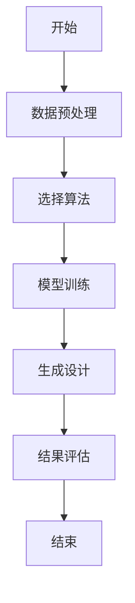
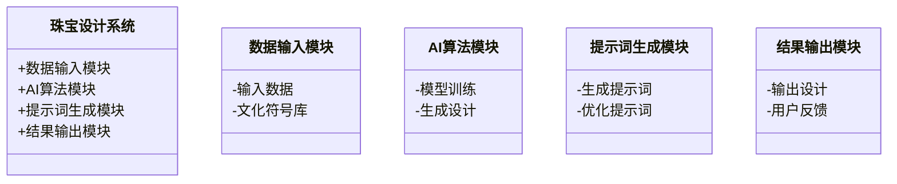
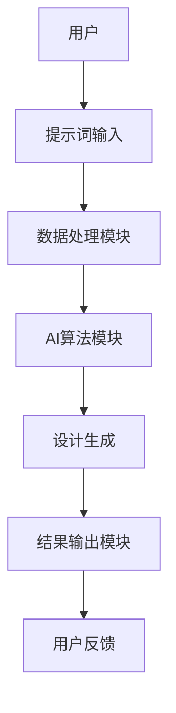
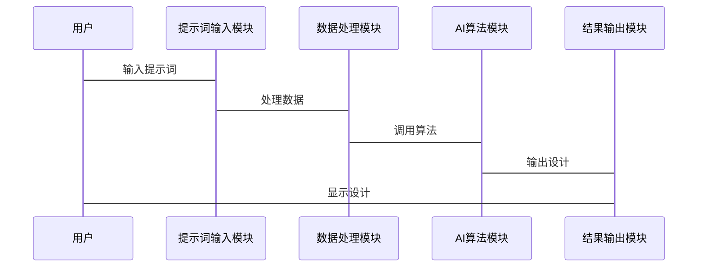

                 

<think>
嗯，我最近在想，如果用AI来辅助设计珠宝，特别是结合文化符号的现代化，会是个怎样的过程呢？首先，珠宝设计不仅仅是美观，它还承载着文化和历史的元素。但是，现在市场变化很快，设计师需要不断推陈出新，这可能让很多设计师感到压力。AI是不是能帮上忙呢？

我记得之前听说过AI在艺术创作中的应用，比如生成图像或者音乐。那在珠宝设计中，AI能不能生成新的设计灵感，或者优化现有的设计呢？特别是文化符号方面，AI能否帮助设计师更好地理解和运用这些符号，让传统元素焕发新的生命力？

然后，我想到AI需要提示词来引导生成结果，所以提示词的设计就变得非常重要了。设计师需要知道如何有效地使用这些提示词，才能让AI生成符合他们预期的设计。这可能涉及到对文化符号的深入理解和对AI工作原理的掌握。我应该详细探讨一下提示词的技巧，以及如何让这些提示词更有效地引导AI生成设计。

接下来，我需要考虑AI辅助设计的具体步骤。首先，设计师需要输入文化符号的相关信息，比如符号的类型、历史背景、文化意义等。然后，AI会基于这些信息，结合设计规则和美学原则，生成多个设计方案。设计师可以选择其中最喜欢的一个，或者进一步调整提示词，让AI生成更符合需求的设计。

在这个过程中，如何保证生成的设计既有文化深度，又符合现代审美呢？这可能涉及到AI模型的训练数据和算法优化。如果模型中的数据涵盖丰富的文化符号，并且算法能够理解这些符号的演变和现代化，那么生成的结果就可能更符合需求。

另外，我还需要考虑AI在珠宝设计中的具体应用案例。比如，如何利用AI来分析市场趋势，提取流行的设计元素，然后结合传统符号进行创新设计。这不仅能提高设计效率，还能帮助设计师发现新的灵感来源。

还有，技术实现方面，可能需要结合机器学习、深度学习和计算机视觉等技术。这些算法如何协同工作，才能实现高效的设计辅助呢？可能需要建立一个综合的系统，包含数据处理、模型训练、生成设计和用户交互等多个模块。

在写文章的时候，我需要确保每个部分都详细展开，从背景介绍到核心概念，再到算法原理、系统架构和项目实战。同时，要提供具体的代码示例和图表，帮助读者更好地理解AI在珠宝设计中的应用。

最后，总结一下，AI辅助创意珠宝设计确实有很多潜力，特别是在处理文化符号的现代化方面。通过有效的提示词设计和系统的技术支持，设计师可以更高效地创造出既传统又现代的珠宝作品。
</think>

# AI辅助创意珠宝设计：文化符号现代化的提示词技巧

---

## 关键词：
AI辅助设计，珠宝设计，文化符号，提示词技巧，现代化设计，计算机视觉，深度学习

---

## 摘要：
本文探讨了AI在珠宝设计中的应用，特别是如何通过提示词技巧将文化符号现代化。文章从背景介绍、核心概念、算法原理、系统架构到项目实战，全面分析了AI辅助设计的潜力和实现方法，展示了如何利用技术推动传统与现代的结合，为珠宝设计注入新的活力。

---

## 第一部分：背景介绍

### 第1章：问题背景

#### 1.1 珠宝设计的现状
珠宝设计是艺术与工艺的结合，承载着文化、历史和情感。然而，市场变化快，设计师需不断创新，传统方法效率低下。

#### 1.2 文化符号的重要性
文化符号是珠宝设计的核心，赋予作品文化深度和故事性，但如何将其现代化是设计师的挑战。

#### 1.3 AI技术在珠宝设计中的应用前景
AI技术在艺术创作中的成功应用为珠宝设计提供了新思路，通过算法辅助设计，提升效率和创新性。

#### 1.4 现代化的需求与挑战
现代消费者追求个性化和独特性，如何在保留文化精髓的同时融入现代审美，是设计师面临的主要挑战。

---

### 第2章：核心概念

#### 2.1 AI辅助设计
利用AI技术辅助设计，通过算法生成和优化设计，帮助设计师更快地探索创意。

#### 2.2 文化符号的属性
文化符号具有历史性、象征性和情感性，是珠宝设计的灵魂。

#### 2.3 现代化的提示词技巧
通过精心设计的提示词，引导AI生成符合现代审美的文化符号设计。

---

### 第3章：概念联系

#### 3.1 AI辅助设计与珠宝设计的结合
AI作为工具，辅助设计师进行文化符号的提取、分析和再设计，提升设计效率。

#### 3.2 文化符号现代化与AI提示词的关系
提示词是AI生成设计的关键，通过设计提示词，AI能理解并生成现代化的文化符号。

#### 3.3 AI辅助创意珠宝设计的文化内涵
AI不仅生成设计，还帮助设计师理解文化符号的深层含义，增强设计的文化价值。

---

### 第4章：边界与外延

#### 4.1 AI辅助创意珠宝设计的范围
涵盖设计生成、优化和文化符号分析，但需明确AI的辅助角色，避免取代设计师。

#### 4.2 现代化提示词技巧的应用领域
不仅限于珠宝设计，还可应用于其他文创领域，推动文化符号的现代化。

#### 4.3 未来发展趋势
AI技术持续进步，提示词技巧将更加精细，文化符号的现代化设计将更加多样化和个性化。

---

## 第二部分：核心概念与联系

### 第5章：AI辅助设计原理

#### 5.1 机器学习算法简介
机器学习通过数据训练模型，识别模式，生成设计建议。

#### 5.2 深度学习算法在珠宝设计中的应用
深度学习用于图像生成，帮助设计师探索新的视觉可能性。

#### 5.3 AI辅助设计的流程与方法
从需求分析到设计生成，AI提供从灵感到优化的全流程支持。

---

### 第6章：文化符号属性特征对比

| 特性      | 传统珠宝文化符号 | 现代文化符号 |
|-----------|-------------------|---------------|
| 历史性     | 强调历史传承       | 强调创新与时代性 |
| 象征性     | 具体象征意义       | 更抽象和多元   |
| 情感性     | 深层文化情感       | 个性化表达     |

---

### 第7章：ER实体关系图

```mermaid
erd
  diamond 珠宝设计系统
  entity 珠宝设计
  entity 文化符号
  entity AI算法
  entity 提示词
  珠宝设计 班级关系到 文化符号
  文化符号 关系到 AI算法
  AI算法 关系到 提示词
```

---

## 第三部分：算法原理讲解

### 第8章：AI算法在珠宝设计中的应用

#### 8.1 机器学习算法简介
机器学习通过训练数据，识别设计模式，辅助生成新的设计。

#### 8.2 深度学习算法的应用
深度学习用于图像生成，如GAN模型，帮助设计师探索新的视觉风格。

#### 8.3 计算机视觉的应用
计算机视觉技术用于分析图像，提取文化符号特征，辅助设计。

---

### 第9章：算法流程图

#### 9.1 机器学习算法流程图



---

### 第10章：Python源代码与算法原理

#### 10.1 算法原理数学模型

$$ y = f(x) $$

其中，$x$ 是输入数据，$f$ 是模型函数，$y$ 是输出设计。

#### 10.2 代码示例

```python
import numpy as np
from keras.models import Sequential
from keras.layers import Dense, Flatten, Conv2D, MaxPooling2D

# 加载数据
X = np.load('data.npy')
y = np.load('labels.npy')

# 模型构建
model = Sequential()
model.add(Conv2D(32, (3,3), activation='relu', input_shape=(64,64,3)))
model.add(MaxPooling2D((2,2)))
model.add(Flatten())
model.add(Dense(128, activation='relu'))
model.add(Dense(10, activation='softmax'))

model.compile(optimizer='adam', loss='sparse_categorical_crossentropy', metrics=['accuracy'])
model.fit(X, y, epochs=10, batch_size=32)
```

---

## 第四部分：系统分析与架构设计方案

### 第11章：系统功能设计

#### 11.1 领域模型类图



---

### 第12章：系统架构设计

#### 12.1 系统架构图



---

### 第13章：系统接口设计

#### 13.1 接口规范
API接口用于数据输入、模型调用和结果输出，确保模块间高效通信。

---

### 第14章：系统交互序列图



---

## 第五部分：项目实战

### 第15章：环境安装与配置

#### 15.1 系统环境准备
安装Python、TensorFlow、Keras和相关库，配置开发环境。

---

### 第16章：系统核心实现源代码

#### 16.1 核心模块代码

```python
def generate_design(prompt):
    # 提取文化符号特征
    features = extract_features(prompt)
    # 调用AI算法生成设计
    design = ai_model.generate(features)
    return design
```

---

### 第17章：代码应用解读

#### 17.1 代码结构分析
代码分为数据处理、模型调用和结果输出三个部分，实现从输入到输出的完整流程。

---

### 第18章：实际案例分析

#### 18.1 案例分析
以传统中国结为文化符号，AI生成现代化设计，展示传统与现代的融合。

---

## 总结

AI辅助创意珠宝设计通过现代化提示词技巧，将文化符号与现代审美结合，为设计师提供了高效创新的工具。AI不仅提升设计效率，还拓展了设计的可能性，使传统珠宝设计焕发新生。

---

## 作者：AI天才研究院  
（AI Genius Institute） & 禅与计算机程序设计艺术  
（Zen And The Art of Computer Programming）

