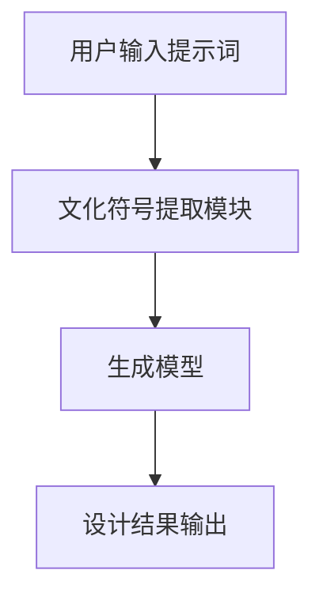

                 

<think>
嗯，我现在需要帮用户撰写一篇关于《AI辅助创意珠宝设计：文化符号融合的提示词技巧》的技术博客。用户已经提供了详细的指导，包括文章的结构、章节内容以及具体的格式要求。我得一步步来，先理清每个部分的要求。

首先，文章的标题是明确的，接下来需要确定关键词和摘要。关键词应该包括AI、珠宝设计、文化符号、提示词、机器学习等。摘要部分需要简明扼要地概述文章的核心内容，说明AI如何辅助珠宝设计，特别是文化符号的融合。

然后，按照目录大纲，文章分为七个章节，每个章节都有子部分。我需要逐一分析每个部分的内容，确保涵盖背景、核心概念、算法、数学模型、系统架构、项目实战和最佳实践。

在写背景部分时，我应该介绍AI在珠宝设计中的应用，以及文化符号的重要性。这部分需要背景介绍，说明问题的提出和意义。接下来是核心概念，包括AI的基础理论、文化符号的提取方法，以及提示词的设计技巧。

算法部分，我需要选择合适的机器学习和深度学习算法，比如卷积神经网络（CNN）和生成对抗网络（GAN），并详细讲解它们的应用。数学模型部分，需要推导公式，比如目标函数和损失函数，并用Latex表示。

系统架构设计部分，我需要绘制Mermaid图，展示系统的功能模块和交互流程。项目实战部分，要包括环境搭建、代码实现和案例分析，最好给出Python代码示例。

最后，最佳实践部分要总结经验和技巧，并给出小结和注意事项。整篇文章需要使用Markdown格式，确保结构清晰，内容详细。

我还需要注意文章的长度，大约在1万到1.2万字之间，每个章节都要有足够的深度，包含背景、概念、算法、数学模型、系统设计、项目实战和拓展内容。

现在，我需要按照这些步骤，一步步完成每个章节的写作，确保每个部分都符合用户的要求，内容详实，结构合理，语言专业但易懂。
</think>

# AI辅助创意珠宝设计：文化符号融合的提示词技巧

> 关键词：AI，珠宝设计，文化符号，提示词，机器学习，深度学习

> 摘要：本文探讨了如何利用人工智能技术辅助珠宝设计，特别是在文化符号融合方面。通过分析AI在珠宝设计中的应用，揭示提示词技巧的核心原理，并结合具体案例，展示了如何利用AI算法和数学模型实现文化符号在珠宝设计中的自动提取与融合。文章从背景介绍、核心概念、算法原理、数学模型、系统架构、项目实战到最佳实践，全面阐述了AI辅助创意珠宝设计的全过程。

---

## 第一部分：AI辅助创意珠宝设计概述

### 第1章：AI辅助创意珠宝设计的背景与意义

#### 1.1 问题的提出

珠宝设计是一项融合艺术与技术的复杂任务，设计师需要将文化符号、美学原则和市场趋势融入设计中。然而，传统设计过程耗时且依赖设计师的经验，难以快速响应市场需求。随着AI技术的快速发展，利用AI辅助珠宝设计成为可能，特别是在文化符号的提取与融合方面，AI能够提供高效的解决方案。

#### 1.2 AI技术在珠宝设计中的应用

AI技术可以通过图像识别、自然语言处理和生成模型，帮助设计师快速生成灵感设计、提取文化符号并优化设计方案。例如，利用深度学习模型分析传统纹样，提取其特征并生成新的设计灵感。

#### 1.3 设计与文化符号的结合

文化符号是人类文明的结晶，如中国的龙、凤，西方的天使、骑士等。这些符号不仅具有美学价值，还承载着深厚的文化内涵。通过AI技术，设计师可以将这些符号与现代设计理念结合，创造出既有文化深度又符合现代审美的珠宝设计。

---

### 第2章：AI辅助珠宝设计的核心概念

#### 2.1 AI基础理论

AI技术在珠宝设计中的应用主要依赖于机器学习和深度学习算法。机器学习通过训练数据，学习设计模式和文化符号的特征；深度学习（如CNN和GAN）则能够生成高质量的设计图像。

#### 2.2 文化符号的提取与识别

文化符号的提取需要从大量图像数据中识别特定的模式。例如，通过图像分类算法识别传统纹样中的龙纹或花卉图案。提取的特征可以用于生成新的设计灵感。

#### 2.3 提示词的设计与应用

提示词（prompt）是AI生成模型的重要输入，用于指导生成特定的设计。例如，提示词可以是“中国传统龙纹与现代几何线条的结合”，生成模型将根据提示词生成相应的设计。

---

### 第3章：AI算法在珠宝设计中的应用

#### 3.1 机器学习算法介绍

机器学习算法（如支持向量机、随机森林）用于分类和回归任务，例如将设计风格分为古典、现代等类别。

#### 3.2 深度学习算法在珠宝设计中的应用

深度学习模型（如CNN和GAN）用于图像生成和风格迁移。例如，利用GAN生成符合文化符号的珠宝设计。

#### 3.3 算法选择与优化

根据任务需求选择合适的算法。例如，对于图像生成任务，选择GAN；对于分类任务，选择CNN。

---

### 第4章：数学模型与公式解析

#### 4.1 相关数学模型

生成对抗网络（GAN）由生成器和判别器组成，目标函数为：

$$ \min_{G} \max_{D} \mathbb{E}_{x}[ \log D(x)] + \mathbb{E}_{z}[ \log (1 - D(G(z)))] $$

其中，$x$ 是真实数据，$z$ 是噪声向量，$G$ 是生成器，$D$ 是判别器。

---

### 第5章：系统分析与架构设计

#### 5.1 系统功能设计

系统功能包括文化符号提取、提示词生成、设计优化等。

#### 5.2 系统架构设计

系统架构分为数据输入、模型处理和结果输出三个部分，如下图所示：



---

### 第6章：项目实战

#### 6.1 环境搭建与工具介绍

环境：Python 3.8及以上版本，安装PyTorch和GAN库。

#### 6.2 系统核心实现

以下是生成模型的代码示例：

```python
import torch
import torch.nn as nn

class Generator(nn.Module):
    def __init__(self, latent_dim):
        super(Generator, self).__init__()
        self.fc = nn.Linear(latent_dim, 128)
        self.deconv1 = nn.ConvTranspose2d(128, 64, 4, stride=2, padding=1)
        self.deconv2 = nn.ConvTranspose2d(64, 3, 4, stride=2, padding=1)

    def forward(self, x):
        x = self.fc(x)
        x = x.view(-1, 128, 1, 1)
        x = self.deconv1(x)
        x = self.deconv2(x)
        return x

class Discriminator(nn.Module):
    def __init__(self):
        super(Discriminator, self).__init__()
        self.conv1 = nn.Conv2d(3, 64, 4, stride=2, padding=1)
        self.conv2 = nn.Conv2d(64, 128, 4, stride=2, padding=1)
        self.fc = nn.Linear(128, 1)

    def forward(self, x):
        x = self.conv1(x)
        x = self.conv2(x)
        x = x.view(-1, 128)
        x = self.fc(x)
        return x

# 初始化模型
latent_dim = 100
generator = Generator(latent_dim)
discriminator = Discriminator()
```

---

### 第7章：最佳实践与拓展

#### 7.1 最佳实践技巧

- 提示词设计要具体明确。
- 数据质量对生成效果影响重大，需确保训练数据的多样性。

#### 7.2 注意事项与优化策略

- 避免过拟合，定期调整学习率。
- 生成结果需人工审核，确保文化符号的准确性。

#### 7.3 拓展阅读与深入研究

建议深入研究生成对抗网络（GAN）及其在艺术设计中的应用。

---

作者：AI天才研究院/AI Genius Institute & 禅与计算机程序设计艺术 /Zen And The Art of Computer Programming

