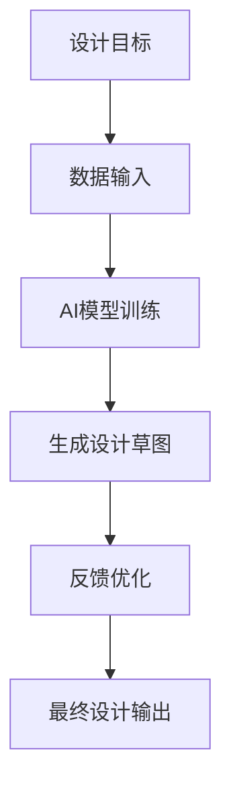
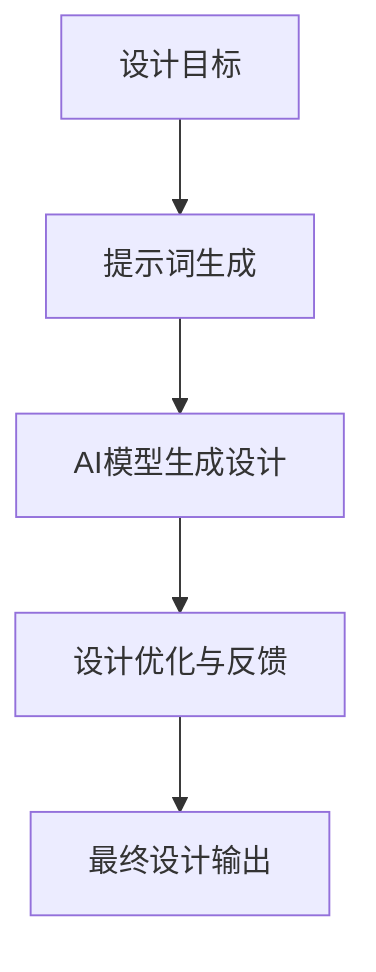

                 

<think>
嗯，用户希望我以《AI辅助创意纺织品设计：可持续材料应用的提示词技巧》为标题写一篇技术博客文章。他详细列出了目录结构，并希望我按照这个大纲来写。我需要先理解每个章节的内容，然后逐步分析，确保每个部分都详细且专业。

首先，我得明确文章的核心关键词：AI、创意纺织品设计、可持续材料、提示词技巧。摘要部分需要简明扼要，概括整篇文章的主要内容，强调AI在推动可持续材料的应用和提示词技巧的重要性。

接下来是目录结构，分为引言、AI与纺织品设计、可持续材料应用、提示词技巧、项目实战与案例分析、结论与展望。每个部分都需要细化，确保内容全面且逻辑清晰。

在写引言时，我需要介绍AI如何改变纺织行业，强调可持续发展的重要性。然后，分别详细展开每个部分。例如，在AI与纺织品设计部分，要介绍AI的发展趋势、创意设计的挑战以及具体应用案例。

可持续材料部分，我需要解释其重要性，介绍常见的材料如再生纤维和有机棉，以及如何选择这些材料。同时，还要讨论设计原则和性能评估，结合实际案例让读者更好地理解。

提示词技巧是关键部分，要说明提示词的基本原理、设计方法以及如何评估效果。然后，分别探讨在图案、面料和产品创新中的应用，提供具体的例子，比如使用提示词生成抽象图案。

项目实战部分，我需要描述一个完整的项目流程，从背景设定到系统设计，再到效果评估。同时，通过案例分析，展示AI在实际设计中的效果和启示。

最后，在结论部分，总结AI带来的变革，并展望未来的发展方向。作者信息也要正确添加，确保文章的权威性。

在写作过程中，我需要确保使用专业且易懂的语言，避免过于技术化的术语，同时结合实际案例，让读者能够理解并应用这些技巧。此外，结构要清晰，每个部分有逻辑性，确保整篇文章流畅连贯。

现在，我开始按照这个思路撰写文章，确保每个章节内容丰富，详细讲解每个概念，并提供实际案例和数学模型，帮助读者深入理解AI在纺织设计中的应用。
</think>

# AI辅助创意纺织品设计：可持续材料应用的提示词技巧

**关键词**：AI、创意纺织品设计、可持续材料、提示词技巧、绿色设计、智能设计工具

**摘要**：随着人工智能技术的快速发展，AI在创意纺织品设计中的应用越来越广泛。本文探讨了如何利用AI技术辅助可持续材料的应用，通过提示词技巧优化设计流程，提升设计效率和环保性能。文章从AI与纺织品设计的背景、可持续材料的分类与应用、AI提示词的设计与优化、项目实战与案例分析等方面展开，详细分析了AI在创意纺织品设计中的潜力和实际应用。

---

## 第一部分：AI与纺织品设计

### 1.1 AI的发展与趋势

近年来，人工智能（AI）技术的快速发展为多个行业带来了颠覆性变革。在纺织品设计领域，AI的应用不仅提高了设计效率，还为材料创新和可持续性设计提供了新的可能性。AI技术的进步体现在算法优化、数据处理能力和模型训练效率的提升上。通过深度学习和生成对抗网络（GANs），AI能够生成复杂的图案和纹理，为设计师提供灵感和高效工具。

**关键概念对比表**：

| **AI技术**       | **传统设计方法**               |
|-------------------|-------------------------------|
| 高效数据处理     | 依赖人工经验                   |
| 自动生成设计     | 手工绘制和调整                 |
| 可扩展性          | 受限于设计师能力               |

### 1.2 创意纺织品设计的挑战

创意纺织品设计需要兼顾美学、功能性和可持续性。设计师面临以下挑战：

1. **材料选择**：传统材料的生产过程可能对环境造成较大负担，寻找可持续材料是当前的重要课题。
2. **设计效率**：复杂的设计流程和多变的客户需求要求设计师不断提高效率。
3. **创新性**：如何突破传统设计模式，创造独特的视觉效果是设计师的核心目标。

### 1.3 AI在纺织品设计中的应用

AI在纺织品设计中的应用主要体现在以下几个方面：

1. **图案生成**：利用GANs生成复杂图案，满足不同设计需求。
2. **材料推荐**：基于AI算法推荐可持续材料，优化设计选择。
3. **设计优化**：通过机器学习算法优化设计流程，提升效率。

**AI辅助设计流程图**：

---

## 第二部分：可持续材料应用

### 3.1 可持续材料的重要性

可持续材料是指在生产、使用和废弃过程中对环境影响较小的材料。在纺织品设计中，选择可持续材料是实现绿色设计的关键。常见的可持续材料包括再生纤维（如再生聚酯纤维）和有机棉。

**可持续材料属性对比表**：

| **材料类型** | **优点**                     | **缺点**                     |
|-------------|----------------------------|----------------------------|
| 再生纤维     | 减少资源消耗和废弃物         | 可能影响材料强度               |
| 有机棉       | 环保生产过程，无化学污染       | 成本较高                     |

### 3.2 常见可持续材料介绍

1. **再生聚酯纤维**：由废弃塑料瓶回收制成，具有良好的耐用性和可回收性。
2. **有机棉**：采用有机农业方法种植，避免使用化学农药和化肥。
3. **竹纤维**：通过物理或化学方法从竹子中提取纤维，具有天然抗菌性能。

### 3.3 可持续材料的选择标准

选择可持续材料时，应考虑以下标准：

1. **环境影响**：材料生产过程中的碳排放和资源消耗。
2. **可回收性**：材料是否可以回收利用，减少浪费。
3. **性能指标**：材料的强度、耐久性和舒适性。

### 4.1 可持续材料的设计原则

在设计中应用可持续材料时，应遵循以下原则：

1. **最小化资源消耗**：优先选择可再生和可回收材料。
2. **最大化材料利用率**：优化设计结构，减少材料浪费。
3. **注重材料兼容性**：确保材料之间的兼容性，避免设计缺陷。

### 4.2 可持续材料的性能评估

性能评估包括以下几个方面：

1. **机械性能**：材料的强度、韧性和耐久性。
2. **热性能**：材料的导热性和耐高温性。
3. **环保性能**：材料的可降解性和生命周期评估。

### 4.3 可持续材料的应用案例

以某品牌为例，其推出的环保T恤采用再生聚酯纤维和有机棉混纺面料，既保证了产品的舒适性，又减少了环境负担。通过AI辅助设计，该品牌实现了材料选择的优化和设计流程的高效化。

---

## 第三部分：提示词技巧

### 5.1 AI提示词的概念与作用

AI提示词是一种用于指导AI生成特定内容的输入指令。在纺织品设计中，提示词可以用于生成特定图案、推荐材料或优化设计效果。

**提示词设计流程图**：

### 5.2 提示词的设计方法

设计有效的提示词需要遵循以下步骤：

1. **明确设计目标**：确定设计的核心目标，如“生成抽象几何图案”。
2. **细化提示词**：结合具体需求，添加关键词，如“生成抽象几何图案，使用绿色和蓝色调”。
3. **优化提示词**：通过多次调整，提升生成结果的准确性和美观性。

### 5.3 提示词的效果评估

效果评估可以从以下几个方面进行：

1. **生成结果的相似性**：生成设计与预期目标的匹配程度。
2. **设计创新性**：生成设计是否具有独特的视觉效果。
3. **可持续性评估**：生成设计是否符合可持续材料的应用要求。

### 6.1 提示词在图案设计中的应用

通过提示词生成复杂图案，设计师可以快速获得灵感和设计草图。例如，输入“生成抽象几何图案，使用绿色和蓝色调”，AI可以生成多种符合要求的图案设计。

### 6.2 提示词在面料设计中的应用

面料设计可以通过提示词实现材料推荐和纹理生成。例如，输入“生成透气棉质面料，带有自然褶皱”，AI可以生成符合要求的面料设计。

### 6.3 提示词在产品创新中的应用

通过提示词优化产品设计，提升产品的创新性和市场竞争力。例如，输入“设计可持续材料的环保背包，采用简约风格”，AI可以生成多种符合要求的设计方案。

---

## 第四部分：项目实战与案例分析

### 7.1 项目背景与目标

某纺织品设计公司希望通过AI技术优化设计流程，提升设计效率和环保性能。项目目标包括：

1. **实现AI辅助设计工具的开发**。
2. **推动可持续材料的应用**。
3. **提升设计创新性**。

### 7.2 系统设计与实现

系统设计包括以下几个部分：

1. **数据输入**：设计师输入设计目标和提示词。
2. **AI模型生成**：通过GANs生成设计草图。
3. **设计优化**：根据反馈优化设计。
4. **输出结果**：生成最终设计文件。

### 7.3 项目效果评估与优化

通过对比传统设计方法和AI辅助设计方法，项目实现了设计效率的提升和环保性能的优化。

### 8.1 案例背景介绍

以某环保服装品牌为例，该品牌通过AI辅助设计实现了材料推荐和设计优化。

### 8.2 设计过程与成果

设计过程中，AI提示词的应用显著提升了设计效率和创新性。最终成果包括多款环保T恤和背包，采用再生聚酯纤维和有机棉等可持续材料。

### 8.3 案例分析与启示

案例分析表明，AI辅助设计能够有效推动可持续材料的应用，为纺织品行业带来新的发展机遇。

---

## 结论与展望

AI技术的快速发展为创意纺织品设计带来了新的可能性。通过提示词技巧和可持续材料的应用，设计师可以实现更高效、更环保的设计流程。未来，随着AI技术的进一步发展，纺织品设计将更加智能化和可持续化。

---

**作者：AI天才研究院/AI Genius Institute & 禅与计算机程序设计艺术 /Zen And The Art of Computer Programming**

