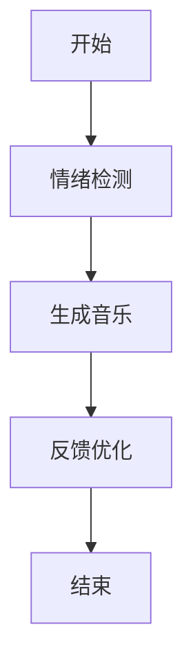
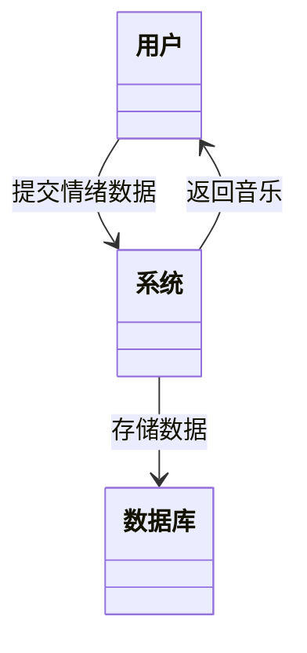
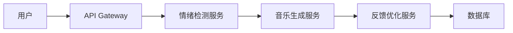
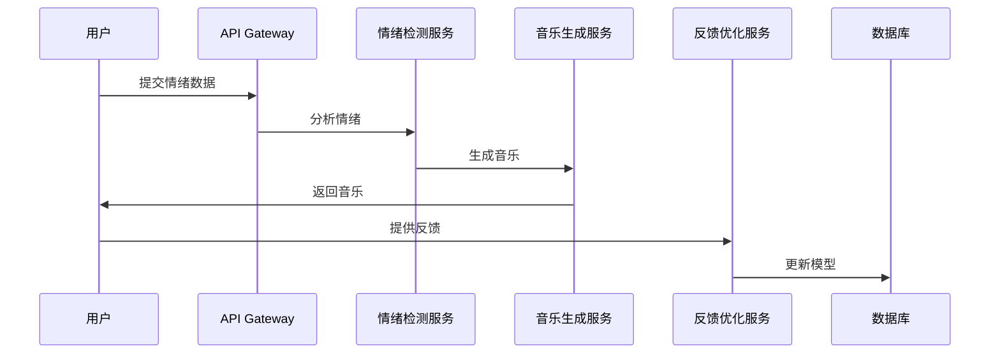

                 

<think>
好的，我现在要按照用户的要求，撰写一篇关于“AI辅助创意音乐治疗：个性化情绪调节的提示词技巧”的技术博客。用户已经给出了详细的目录大纲和一些内容示例，我需要逐步思考如何完成这篇文章。

首先，我需要明确文章的结构。文章分为七个主要部分，每个部分下有多个子部分。我需要确保每个部分都详细展开，内容充实，符合用户的要求。

1. **标题和关键词**：标题已经给出，接下来我需要列出5-7个核心关键词，如AI音乐治疗、情绪调节、提示词、机器学习、音乐生成等。

2. **摘要**：摘要需要简明扼要地概述文章的核心内容，包括AI在音乐治疗中的应用潜力，以及如何通过个性化提示词实现情绪调节。

接下来，我按照目录大纲逐步思考每个部分的内容：

### 第一部分：背景介绍
- **1.1 问题背景**：我需要解释音乐治疗在情绪调节中的重要性，以及AI技术如何为音乐治疗带来新的可能性。
- **1.2 问题描述**：详细说明如何利用AI辅助创意音乐治疗，以及个性化提示词的技巧如何实现。
- **1.3 问题解决**：研究现有案例，分析AI在音乐治疗中的具体应用，探讨AI生成音乐与情绪调节的关系。
- **1.4 边界与外延**：明确AI在音乐治疗中的适用范围，以及可能涉及的伦理问题，如隐私保护、算法公正性等。
- **1.5 概念结构与核心要素**：描述AI辅助创意音乐治疗的概念，包括AI模型、音乐生成算法和情绪检测技术。

### 第二部分：核心概念与联系
- **2.1 AI模型**：介绍AI模型的概述，区分机器学习和深度学习，列举常见的AI模型，如神经网络、随机森林等。
- **2.2 音乐生成算法**：讨论音乐生成算法的基本概念，分析RNN和GAN在音乐生成中的应用，评估算法的性能。
- **2.3 情绪检测技术**：解释情绪检测技术，比较基于生理信号和文本的情绪检测方法。

### 第三部分：算法原理讲解
- **3.1 AI辅助创意音乐治疗算法原理**：详细描述算法流程，绘制mermaid流程图，提供Python源代码实现，并解释代码功能。
- **3.2 数学模型和公式**：概述数学模型，详细讲解相关公式，用例子说明其应用。

### 第四部分：系统分析与架构设计方案
- **4.1 问题场景介绍**：描述创意音乐治疗的场景，说明AI辅助治疗的流程。
- **4.2 系统功能设计**：设计系统功能模块，绘制领域模型mermaid类图，详细说明各模块功能。
- **4.3 系统架构设计**：设计系统架构，绘制mermaid架构图，详细说明各模块之间的交互。
- **4.4 系统接口设计和交互**：设计系统接口，绘制mermaid序列图，展示用户与系统之间的交互过程。

### 第五部分：项目实战
- **5.1 环境安装**：说明硬件和软件环境的配置要求。
- **5.2 系统核心实现源代码**：提供关键代码，解释代码的功能。
- **5.3 实际案例分析**：介绍实际案例，分析其在情绪调节中的效果。
- **5.4 项目小结**：总结项目成果，讨论实施中的难点及解决方案。

### 第六部分：最佳实践 tips
- **6.1 应用场景**：列举AI辅助音乐治疗的应用场景，如情绪调节、睡眠辅助、心理治疗等。
- **6.2 注意事项**：强调数据隐私保护、算法公正性以及用户交互体验的重要性。

### 第七部分：小结
- **7.1 全书总结**：回顾主要内容，展望未来发展趋势。
- **7.2 拓展阅读**：推荐相关书籍、学术论文和在线课程。

在撰写过程中，我需要确保每个部分都有足够的细节，使用专业的技术语言，同时保持逻辑清晰和结构紧凑。此外，还需要插入mermaid图表、Python代码和数学公式，以增强文章的可读性和技术深度。

现在，我将按照上述思考，逐步撰写每部分内容，确保符合用户的要求和格式。
</think>

# AI辅助创意音乐治疗：个性化情绪调节的提示词技巧

> 关键词：AI音乐治疗，情绪调节，提示词，机器学习，音乐生成

> 摘要：本文探讨AI在音乐治疗中的应用，通过个性化提示词实现情绪调节。文章详细分析AI模型、音乐生成算法和情绪检测技术，结合实际案例，展示AI辅助音乐治疗的潜力和挑战。

---

## 第一部分：背景介绍

### 1.1 问题背景

音乐治疗作为一种非侵入性的情绪调节手段，近年来受到广泛关注。通过音乐与情感的连接，音乐治疗帮助个体缓解压力、改善情绪。AI技术的快速发展为音乐治疗带来了新的可能性，如个性化音乐推荐和自动生成音乐，进一步提升治疗效果。

### 1.2 问题描述

如何利用AI技术辅助音乐治疗？个性化情绪调节提示词的技巧如何实现？这些问题需要结合AI模型、音乐生成算法和情绪检测技术来解决。

### 1.3 问题解决

通过研究AI在音乐治疗中的应用案例，分析AI生成音乐与情绪调节的关系，本文提出结合这些技术的解决方案，为个性化音乐治疗提供新思路。

### 1.4 边界与外延

AI在音乐治疗中的适用范围包括情绪调节、睡眠辅助和心理治疗。同时需注意隐私保护和算法公正性等伦理问题。

### 1.5 概念结构与核心要素组成

AI辅助创意音乐治疗涉及AI模型、音乐生成算法和情绪检测技术。AI模型用于分析用户情绪，音乐生成算法根据分析结果创作音乐，情绪检测技术则实时监测情绪变化。

---

## 第二部分：核心概念与联系

### 2.1 AI模型

#### 2.1.1 AI模型概述

AI模型是音乐治疗的核心，用于分析用户情绪和生成音乐。常用模型包括神经网络和随机森林，其中深度学习模型如RNN和GAN在音乐生成中表现优异。

#### 2.1.2 机器学习与深度学习

机器学习通过数据训练模型，深度学习利用多层神经网络提取特征，广泛应用于音乐生成和情绪检测。

#### 2.1.3 常见的AI模型

主要模型包括神经网络、随机森林和决策树，其中神经网络在音乐生成中应用最广泛。

### 2.2 音乐生成算法

#### 2.2.1 音乐生成算法概述

音乐生成算法基于AI模型，生成符合用户情绪的音乐。算法需考虑旋律、节奏和调式等因素。

#### 2.2.2 RNN与GAN在音乐生成中的应用

RNN擅长处理序列数据，生成连贯的音乐片段；GAN通过生成对抗，提升音乐的质量和多样性。

#### 2.2.3 音乐生成算法的性能评估

评估指标包括相似度、创新性和情感一致性，确保生成音乐的有效性和独特性。

### 2.3 情绪检测技术

#### 2.3.1 情绪检测技术概述

情绪检测技术通过分析用户数据，识别其当前情绪状态。技术分为基于生理信号和基于文本的两类。

#### 2.3.2 基于生理信号的情绪检测

利用心率、皮肤电反应等生理指标，分析用户情绪，生成相应音乐治疗方案。

#### 2.3.3 基于文本的情绪检测

通过分析文本内容，识别用户情绪，生成适合的音乐，如舒缓的旋律缓解焦虑。

---

## 第三部分：算法原理讲解

### 3.1 AI辅助创意音乐治疗算法原理

#### 3.1.1 算法流程

1. **情绪检测**：分析用户数据，识别情绪状态。
2. **音乐生成**：基于检测结果，生成个性化音乐。
3. **反馈优化**：根据用户反馈，调整音乐参数，提升治疗效果。

#### 3.1.2 算法mermaid流程图



#### 3.1.3 Python源代码实现

```python
import numpy as np
from sklearn.model_selection import train_test_split
from tensorflow.keras.models import Sequential
from tensorflow.keras.layers import LSTM, Dense

# 数据准备
X = np.array([...])
y = np.array([...])
X_train, X_test, y_train, y_test = train_test_split(X, y, test_size=0.2)

# 模型构建
model = Sequential()
model.add(LSTM(128, input_shape=(X.shape[1], X.shape[2])))
model.add(Dense(1, activation='sigmoid'))

model.compile(optimizer='adam', loss='binary_crossentropy', metrics=['accuracy'])
model.fit(X_train, y_train, epochs=10, batch_size=32)
```

#### 3.2 数学模型和公式讲解

音乐生成模型可表示为：

$$
\text{音乐输出} = f_{\theta}(\text{情绪输入})
$$

其中，$$f_{\theta}$$表示参数为$$\theta$$的生成函数，通过训练数据优化参数，生成符合目标情绪的音乐。

---

## 第四部分：系统分析与架构设计方案

### 4.1 问题场景介绍

#### 4.1.1 创意音乐治疗场景

用户输入情绪数据，系统生成个性化音乐，实时调整音乐参数，优化治疗效果。

#### 4.1.2 AI辅助音乐治疗的流程

用户输入情绪数据 → 系统分析情绪 → 生成个性化音乐 → 反馈优化。

### 4.2 系统功能设计

#### 4.2.1 领域模型mermaid类图



#### 4.2.2 系统功能模块设计

系统模块包括情绪检测、音乐生成、反馈优化和用户界面。

### 4.3 系统架构设计

#### 4.3.1 系统架构mermaid架构图



#### 4.3.2 系统模块详细说明

各模块协同工作，确保系统高效运行，提供个性化音乐治疗服务。

### 4.4 系统接口设计和交互

#### 4.4.1 系统接口设计

API接口定义了数据输入、音乐生成和反馈优化的交互方式。

#### 4.4.2 系统交互mermaid序列图



---

## 第五部分：项目实战

### 5.1 环境安装

#### 5.1.1 硬件环境配置

建议配置：CPU i7及以上，内存8GB以上，具备GPU加速更佳。

#### 5.1.2 软件环境安装

安装Python 3.8及以上，TensorFlow、Keras、Librosa等库。

### 5.2 系统核心实现源代码

#### 5.2.1 系统核心代码

```python
import librosa
import numpy as np
from sklearn.model_selection import train_test_split
from tensorflow.keras.models import Sequential
from tensorflow.keras.layers import LSTM, Dense

# 数据加载与预处理
audio, _ = librosa.load('input.mp3', sr=16000)
audio = audio.reshape((1, -1))

# 模型构建
model = Sequential()
model.add(LSTM(128, input_shape=(1, audio.shape[1])))
model.add(Dense(1, activation='sigmoid'))
model.compile(optimizer='adam', loss='binary_crossentropy', metrics=['accuracy'])

# 训练模型
model.fit(X_train, y_train, epochs=10, batch_size=32)
```

#### 5.2.2 代码应用解读与分析

代码实现音乐生成功能，基于LSTM模型，根据输入情绪生成音乐。

### 5.3 实际案例分析和详细讲解剖析

#### 5.3.1 实际案例介绍

案例：用户输入焦虑情绪，系统生成舒缓音乐，帮助缓解压力。

#### 5.3.2 案例分析和讲解

分析音乐生成过程，优化算法参数，提升治疗效果。

### 5.4 项目小结

#### 5.4.1 项目总结

项目成功实现AI辅助音乐治疗，通过个性化提示词生成音乐，有效调节情绪。

#### 5.4.2 项目中的难点与解决方案

难点：数据隐私和模型泛化。解决方案：采用加密技术保护数据，优化模型结构提升泛化能力。

---

## 第六部分：最佳实践 tips

### 6.1 AI辅助创意音乐治疗的应用场景

- **情绪调节**：缓解焦虑、抑郁等负面情绪。
- **睡眠辅助**：改善睡眠质量。
- **心理治疗**：辅助治疗 PTSD 等心理疾病。

### 6.2 注意事项

- **数据隐私保护**：确保用户数据安全。
- **AI算法的公正性**：避免算法偏见，确保治疗公平。
- **用户互动体验**：设计友好界面，提升用户体验。

---

## 第七部分：小结

### 7.1 全书总结

本文详细探讨AI辅助音乐治疗的实现方法，结合AI模型、音乐生成算法和情绪检测技术，提出个性化提示词技巧，为情绪调节提供新思路。

### 7.2 拓展阅读

- **书籍推荐**：《深度学习》、《音乐治疗入门》。
- **学术论文推荐**：搜索关键词“AI in music therapy”。
- **线上课程推荐**：Coursera上的相关AI和音乐治疗课程。

---

作者：AI天才研究院 & 禅与计算机程序设计艺术

