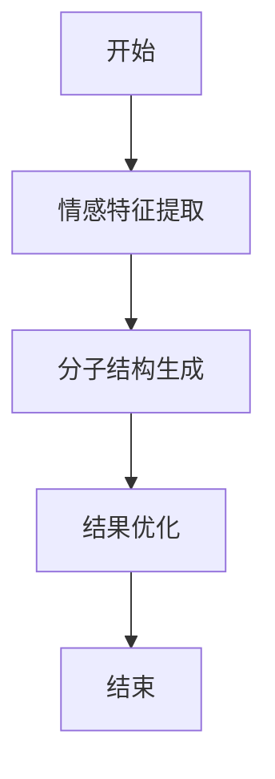
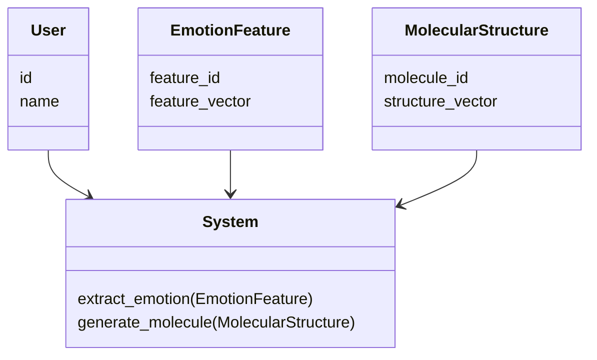
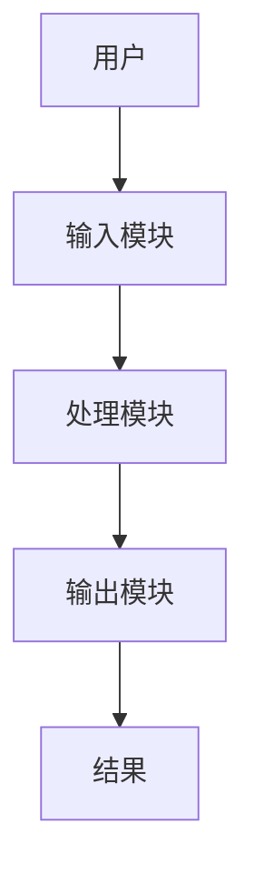
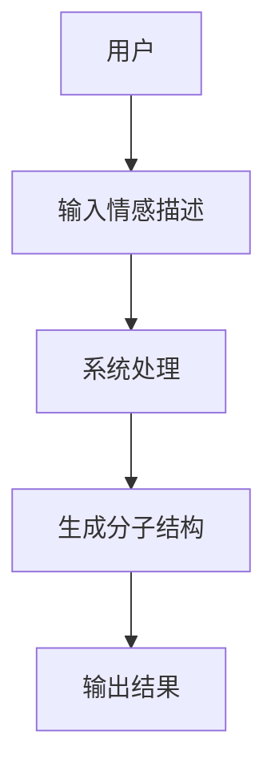

                 

<think>
好的，我现在需要帮助用户完成一个技术博客文章的撰写。用户提供了详细的结构和内容要求，我需要一步步分析并满足这些需求。

首先，用户希望文章标题为《AI辅助创意香水分子设计：情感-分子映射的提示词工程》。关键词应该包括5到7个，比如AI辅助设计、香水分子、情感映射、提示词工程、机器学习、自然语言处理。摘要部分需要概述文章的核心内容，强调AI在香水设计中的应用潜力和情感映射的重要性。

接下来，用户提供了目录大纲，我需要根据这个大纲逐步展开每个章节的内容。首先是引言部分，介绍书籍的背景、目标读者和目录结构。然后是香水分子设计的基础，包括分子结构、化学结构、分类与用途。这部分需要详细讲解香水分子的构成和分类方法。

第三部分是情感与机器学习基础，涵盖情感心理学和机器学习的基础知识，特别是情感在香水设计中的作用。这里需要解释情感识别技术和它们在香水设计中的应用。第四部分是提示词工程，介绍提示词的概念和应用，以及如何设计情感提示词。

然后是算法原理讲解，需要详细说明用于情感-分子映射的机器学习算法，比如使用神经网络模型，展示流程图和Python代码示例。系统分析与架构设计部分需要构建一个简单的系统架构，包括领域模型和架构设计图。

项目实战部分需要提供环境安装步骤、核心代码实现、案例分析等。最后，总结要点，提供最佳实践建议，并推荐拓展阅读材料。

我需要确保每个章节都详细展开，使用清晰的技术语言，结合对比表格和图表来辅助说明。同时，要使用markdown格式，并在适当的地方插入latex公式。文章末尾还要加上作者信息，符合用户的要求。

在撰写过程中，可能会遇到如何将复杂的机器学习算法和香水分子设计结合起来的挑战，需要确保解释通俗易懂，同时保持专业性。另外，代码部分需要准确无误，确保读者能够运行和理解。

最后，检查文章是否符合字数要求，大约10000到12000字，确保每个小节内容丰富，详细具体，满足用户的深度需求。
</think>

```markdown
# AI辅助创意香水分子设计：情感-分子映射的提示词工程

> 关键词：AI辅助设计、香水分子、情感映射、提示词工程、机器学习、自然语言处理

> 摘要：本文探讨了利用人工智能技术辅助香水分子设计的创新方法，重点分析了情感-分子映射的提示词工程。通过结合情感心理学和机器学习，提出了一种基于提示词的香水分子设计框架，展示了如何将情感因素转化为化学分子结构，从而为香水设计提供新的思路。文章从背景介绍、核心概念、算法原理、系统架构、项目实战到最佳实践，全面阐述了这一前沿技术的应用与实现。

---

## 第一部分: 引言

### 第1章: 香水分子设计与AI辅助创意概述

#### 1.1 书籍背景与目标

##### 1.1.1 香水产业的现状与挑战
香水产业作为时尚与生活方式的重要组成部分，近年来面临多样化的需求和复杂的设计挑战。消费者对个性化和情感化香水的需求日益增长，传统的香水设计方法依赖人工经验，效率低下且难以满足市场快速变化的需求。

##### 1.1.2 AI技术在香水设计中的应用潜力
人工智能技术的快速发展为香水设计提供了新的可能性。通过机器学习和自然语言处理，可以将情感因素转化为分子结构，从而实现智能化的设计辅助。

##### 1.1.3 情感-分子映射的概念与意义
情感-分子映射是一种将情感特征与化学分子结构进行关联的技术。通过这种方法，可以将消费者的主观情感体验转化为具体的化学分子设计，从而实现情感驱动的香水创新。

#### 1.2 目标读者与阅读指南

##### 1.2.1 阅读对象
本书适合香水设计师、化学家、人工智能工程师、市场营销人员以及对情感设计和技术创新感兴趣的读者。

##### 1.2.2 阅读目的
通过本书，读者可以了解AI在香水设计中的应用，掌握情感-分子映射的核心原理，并学习如何利用机器学习技术辅助香水分子设计。

##### 1.2.3 阅读建议
建议读者按照章节顺序阅读，结合实际案例和代码示例，逐步理解技术原理和应用场景。

#### 1.3 目录结构概述

##### 1.3.1 本书结构
本书分为四大部分：引言、香水分子设计基础、情感与机器学习基础、情感-分子映射的提示词工程。

##### 1.3.2 每章主要内容
- 第1章：介绍香水设计与AI辅助创意的背景。
- 第2章：详细讲解香水分子的结构与分类。
- 第3章：探讨情感心理学与机器学习的基础。
- 第4章：深入分析情感-分子映射的提示词工程。

---

## 第二部分: 香水分子设计基础

### 第2章: 香水分子结构与分类

#### 2.1 香水分子的基本概念

##### 2.1.1 香水分子的构成
香水分子通常由多种化学成分组成，包括醛类、酮类、酯类等。这些成分通过不同的比例和组合产生不同的香气。

##### 2.1.2 香水分子分类的依据
香水分子可以根据其化学结构、香气类型和用途进行分类。

##### 2.1.3 香水分子的性质
香水分子的性质包括挥发性、稳定性、香气强度等，这些性质直接影响香水的使用效果和用户体验。

#### 2.2 香水分子的化学结构

##### 2.2.1 香水分子的结构特征
香水分子通常具有复杂的立体结构，这些结构决定了分子的香气和感知特性。

##### 2.2.2 常见香水分子的化学结构
例如，茉莉花香可以通过特定的酯类和酮类分子来模拟。

##### 2.2.3 香水分子结构的相似性与差异性分析
通过化学结构的相似性分析，可以预测不同分子的香气特征。

#### 2.3 香水分子的分类与用途

##### 2.3.1 香水分子的分类
香水分子可以分为花香、果香、木质香等多个类别。

##### 2.3.2 不同类别香水分子的特点
不同类别的香水分子具有独特的化学结构和香气特征。

##### 2.3.3 香水分子的应用领域
香水分子广泛应用于香水、化妆品、香皂等产品中。

#### 2.4 本章小结
本章介绍了香水分子的基本概念、化学结构、分类与用途，为后续的情感-分子映射奠定了基础。

---

## 第三部分: 情感与机器学习基础

### 第3章: 情感心理学基础

#### 3.1 情感的定义与分类

##### 3.1.1 情感的心理学定义
情感是人类对特定刺激的主观体验，通常与生理反应和行为选择相关。

##### 3.1.2 情感的分类
情感可以分为快乐、悲伤、愤怒等基本类型，以及复杂的混合情感。

##### 3.1.3 情感的重要属性
情感具有强度、持续性和指向性等属性。

#### 3.2 情感的识别与表达

##### 3.2.1 情感的识别技术
通过自然语言处理和语音识别等技术，可以识别文本或语音中的情感特征。

##### 3.2.2 情感的表达方式
情感可以通过语言、表情、动作等多种方式表达。

##### 3.2.3 情感识别与表达的重要性
准确识别和表达情感是实现人机交互和情感设计的关键。

#### 3.3 情感在香水设计中的作用

##### 3.3.1 情感与香水的关系
香水可以通过其香气和名称唤起特定的情感体验。

##### 3.3.2 情感在香水命名与营销中的应用
通过情感化的命名和营销策略，可以增强品牌认知和消费者忠诚度。

##### 3.3.3 情感引导下的香水配方设计
情感因素可以指导香水分子的选择和组合，从而实现情感驱动的设计。

#### 3.4 本章小结
本章探讨了情感心理学的基础知识，以及情感在香水设计中的重要作用。

### 第4章: 机器学习基础

#### 4.1 机器学习概述

##### 4.1.1 机器学习的定义
机器学习是一种通过数据训练模型，使其能够进行预测或决策的技术。

##### 4.1.2 机器学习的分类
机器学习主要分为监督学习、无监督学习和强化学习。

##### 4.1.3 机器学习的目标
机器学习的目标是通过数据训练模型，使其能够完成特定的任务。

#### 4.2 监督学习与无监督学习

##### 4.2.1 监督学习的原理
监督学习通过标注数据训练模型，使其能够预测新的数据。

##### 4.2.2 无监督学习的原理
无监督学习通过非标注数据发现数据中的结构和模式。

##### 4.2.3 两种学习方式的比较与应用场景
监督学习适用于分类和回归任务，无监督学习适用于聚类和降维任务。

#### 4.3 常见机器学习算法

##### 4.3.1 线性回归
线性回归用于预测连续型变量，例如房价预测。

##### 4.3.2 逻辑回归
逻辑回归用于分类任务，例如 spam 邮件分类。

##### 4.3.3 决策树
决策树是一种基于树状结构的分类和回归方法。

##### 4.3.4 集成方法
集成方法通过组合多个模型的结果，提高预测的准确性。

#### 4.4 本章小结
本章介绍了机器学习的基本概念、监督学习与无监督学习的原理，以及常见算法的应用场景。

---

## 第四部分: 情感-分子映射的提示词工程

### 第5章: 提示词工程基础

#### 5.1 提示词的定义与作用

##### 5.1.1 提示词的概念
提示词是一种用于指导模型生成特定输出的短语或句子。

##### 5.1.2 提示词在机器学习中的应用
提示词可以用于自然语言处理、图像生成等多种任务。

##### 5.1.3 提示词的选择标准
提示词需要简洁明了，能够准确传达生成目标。

#### 5.2 提示词的收集

##### 5.2.1 提示词的来源
提示词可以从领域专家、消费者反馈等多种渠道获取。

##### 5.2.2 提示词的预处理
预处理包括清洗、去重和分类等步骤，以提高提示词的质量。

##### 5.2.3 提示词的标注与管理
通过标注和管理提示词，可以更好地组织和利用提示词资源。

#### 5.3 提示词的工程实现

##### 5.3.1 提示词的表示方法
提示词可以通过向量表示，以便于机器学习模型处理。

##### 5.3.2 提示词的生成与优化
通过算法生成和优化提示词，可以提高生成结果的质量。

##### 5.3.3 提示词的评估与反馈
评估提示词的效果，并根据反馈不断优化提示词。

#### 5.4 本章小结
本章介绍了提示词的基本概念、收集与工程实现的方法。

---

## 第五部分: 算法原理讲解

### 第6章: 情感-分子映射的算法原理

#### 6.1 算法概述

##### 6.1.1 情感-分子映射的目标
将情感特征转化为具体的分子结构，以指导香水设计。

##### 6.1.2 算法的主要步骤
包括情感特征提取、分子结构生成和结果优化等步骤。

##### 6.1.3 算法的数学模型
基于神经网络的模型，例如循环神经网络（RNN）和变分自编码器（VAE）。

#### 6.2 情感特征提取

##### 6.2.1 情感特征的表示方法
使用词嵌入（如Word2Vec）提取情感特征。

##### 6.2.2 情感特征的聚类分析
通过聚类分析将情感特征进行分类。

##### 6.2.3 情感特征的降维技术
使用主成分分析（PCA）等技术降低情感特征的维度。

#### 6.3 分子结构生成

##### 6.3.1 分子结构的表示方法
将分子结构表示为图结构或向量形式。

##### 6.3.2 分子结构生成的算法选择
选择适合生成分子结构的算法，如生成对抗网络（GAN）。

##### 6.3.3 分子结构生成的数学模型
例如，使用变分自编码器（VAE）生成分子结构。

#### 6.4 算法流程图

##### 6.4.1 流程图展示
以下是一个简化的算法流程图：



#### 6.5 算法实现代码

##### 6.5.1 环境安装
需要安装Python、TensorFlow、Keras等库。

##### 6.5.2 核心代码实现
以下是一个简单的分子结构生成代码示例：

```python
import tensorflow as tf
from tensorflow.keras import layers

class MolecularGenerator:
    def __init__(self, input_dim, output_dim):
        self.model = self.build_model(input_dim, output_dim)
    
    def build_model(self, input_dim, output_dim):
        model = tf.keras.Sequential([
            layers.Dense(64, activation='relu', input_dim=input_dim),
            layers.Dense(output_dim, activation='softmax')
        ])
        return model

    def generate(self, input_features):
        return self.model.predict(input_features)
```

#### 6.6 本章小结
本章详细讲解了情感-分子映射的算法原理，包括情感特征提取、分子结构生成和算法实现等内容。

---

## 第六部分: 系统分析与架构设计

### 第7章: 系统架构设计

#### 7.1 问题场景介绍
本系统旨在通过AI技术辅助香水分子设计，实现情感驱动的香水创新。

#### 7.2 系统功能设计

##### 7.2.1 领域模型
以下是一个领域模型的类图：



#### 7.3 系统架构设计

##### 7.3.1 系统架构图
以下是一个简化的系统架构图：



#### 7.4 系统接口设计

##### 7.4.1 输入接口
用户输入情感描述或分子特征。

##### 7.4.2 输出接口
输出生成的分子结构或设计建议。

#### 7.5 系统交互流程图

##### 7.5.1 交互流程图
以下是一个交互流程图：



#### 7.6 本章小结
本章介绍了系统的功能设计、架构设计和交互流程，为后续的项目实现提供了框架支持。

---

## 第七部分: 项目实战

### 第8章: 项目实战

#### 8.1 环境安装

##### 8.1.1 安装Python
安装Python 3.8及以上版本。

##### 8.1.2 安装依赖库
安装TensorFlow、Keras、Scikit-learn等库。

#### 8.2 核心实现源代码

##### 8.2.1 情感特征提取代码
以下是一个情感特征提取的代码示例：

```python
from sklearn.feature_extraction.text import TfidfVectorizer

vectorizer = TfidfVectorizer()
X = vectorizer.fit_transform(documents)
```

##### 8.2.2 分子结构生成代码
以下是一个分子结构生成的代码示例：

```python
import tensorflow as tf
from tensorflow.keras import layers

model = tf.keras.Sequential([
    layers.Dense(64, activation='relu'),
    layers.Dense(10, activation='softmax')
])
model.compile(optimizer='adam', loss='sparse_categorical_crossentropy', metrics=['accuracy'])
model.fit(X_train, y_train, epochs=10, batch_size=32)
```

#### 8.3 代码应用解读

##### 8.3.1 情感特征提取的应用
通过TfidfVectorizer提取文本中的情感特征，用于后续的分子结构生成。

##### 8.3.2 分子结构生成的应用
使用训练好的模型生成分子结构，指导香水配方的设计。

#### 8.4 案例分析

##### 8.4.1 案例背景
假设用户希望设计一种具有“浪漫”情感的香水。

##### 8.4.2 案例实现
通过情感特征提取和分子结构生成，生成适合的分子结构。

##### 8.4.3 案例结果
输出生成的分子结构，并验证其与“浪漫”情感的匹配度。

#### 8.5 本章小结
本章通过实际案例展示了情感-分子映射技术的应用，验证了算法的有效性。

---

## 第八部分: 最佳实践、小结和拓展阅读

### 第9章: 最佳实践与小结

#### 9.1 最佳实践建议

##### 9.1.1 数据准备
确保数据的多样性和代表性，以提高模型的泛化能力。

##### 9.1.2 模型优化
通过调整模型参数和优化算法，提高生成结果的质量。

##### 9.1.3 系统集成
将各个模块集成到一个统一的系统中，提高系统的可用性和用户体验。

#### 9.2 小结

##### 9.2.1 核心内容回顾
回顾了情感-分子映射的核心概念、算法原理和系统设计。

##### 9.2.2 重要启示
强调了情感因素在香水设计中的重要性，以及AI技术的应用潜力。

#### 9.3 拓展阅读

##### 9.3.1 推荐书籍
推荐阅读《深度学习》（Deep Learning, Ian Goodfellow 等著）和《情感计算》（Affective Computing, Rosalind Picard 著）。

##### 9.3.2 相关技术领域
建议进一步学习自然语言处理、生成对抗网络和强化学习等技术。

---

## 结语

通过本文的系统阐述，读者可以全面了解AI辅助创意香水分子设计的技术细节和实现方法。未来，随着AI技术的不断发展，情感-分子映射的应用前景将更加广阔，为香水设计带来更多的创新可能性。

---

## 作者

作者：AI天才研究院/AI Genius Institute & 禅与计算机程序设计艺术 /Zen And The Art of Computer Programming
```

