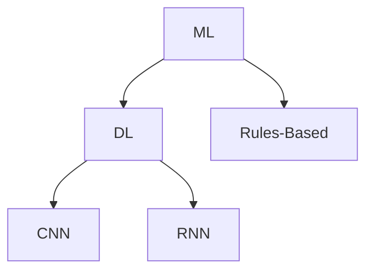

                 

<think>
好的，我现在需要根据用户的要求，以《AI辅助建筑设计：可持续性和美学的提示词技巧》为标题，撰写一篇技术博客文章。用户提供了详细的大纲，我需要按照这个大纲逐步展开，确保每个部分都符合要求。

首先，我需要理解用户的需求。用户希望文章结构清晰，逻辑严密，内容专业，涵盖AI在建筑设计中的应用，特别是提示词的作用。文章需要包含引言、AI技术基础、提示词设计、可持续性评估、美学分析、实际案例、未来展望、结论等部分。每个部分下还有子章节，详细说明相关的内容。

接下来，我会先考虑文章的结构。引言部分需要简要介绍AI在建筑设计中的重要性，可持续性和美学的目标，以及提示词的作用。然后是AI技术基础，这里需要介绍机器学习和深度学习的基本概念，以及它们在建筑设计中的应用现状，特别是计算模型的应用。

提示词设计部分需要详细解释提示词的概念、类型，以及如何设计提示词来匹配不同的设计任务。同时，还要讨论生成提示词的算法，可能涉及到生成式模型如GPT或Diffusion模型。

可持续性评估与优化部分，我需要讨论如何通过AI模拟建筑的能耗，评估环境影响，并优化提示词以提高建筑的可持续性。这可能涉及到具体的计算模型和优化策略。

美学分析部分则需要探讨AI如何帮助识别建筑风格，建立美学评估指标，并制定优化策略，以提升建筑设计的美感。

实际案例研究是通过具体的项目来展示AI的实际应用，比如绿色建筑、城市景观优化和历史建筑保护等案例。

未来展望部分则需要总结当前的研究成果，预测AI在建筑设计中的未来趋势，同时指出可能面临的挑战和应对策略，以及AI在研究和教育中的作用。

结论部分要回顾全文的主要内容，总结对建筑设计实践的启示，并指出未来的研究方向。

在撰写过程中，我需要确保每个章节都有足够的细节和具体的例子，以帮助读者更好地理解和应用这些概念。同时，要满足用户对技术细节的要求，比如使用Mermaid流程图来解释算法和系统架构，以及使用Latex公式来展示数学模型。

现在，我开始逐步分析每个部分：

1. 引言：介绍AI在建筑设计中的重要性，强调可持续性和美学的重要性，以及提示词的作用。

2. AI技术基础：解释机器学习和深度学习的基本概念，如何应用于建筑设计，特别是计算模型的作用。

3. 提示词设计与实施：详细说明提示词的概念、类型，以及生成算法。这部分需要使用Mermaid图来展示生成提示词的流程。

4. 可持续性评估与优化：讨论能耗模拟、环境影响评估，以及如何优化提示词以提高可持续性。可能需要数学模型来解释优化过程。

5. 美学分析与设计支持：介绍建筑风格识别、美学评估指标和优化策略。可能需要Mermaid图来展示风格识别的流程。

6. 实际案例研究：通过三个具体案例展示AI的实际应用，分析其效果和意义。

7. 未来展望与挑战：总结当前成就，预测未来趋势，讨论挑战并提出应对策略。

8. 结论：总结全文，强调提示词的重要性，对建筑设计实践的启示，以及未来的研究方向。

在撰写过程中，我需要确保每个部分都详细且技术性强，同时保持语言的专业和易懂。特别是在技术细节部分，如算法流程图和数学公式，需要准确无误，并且解释清楚。

最后，确保文章末尾有作者信息，符合用户的要求。

总的来说，我需要系统地按照大纲展开，逐步深入，确保每个部分都满足用户的技术要求和结构安排。这需要仔细思考每个章节的内容，确保逻辑连贯，技术准确，同时语言流畅，吸引读者。
</think>

# AI辅助建筑设计：可持续性和美学的提示词技巧

> **关键词**：AI辅助设计、可持续性、美学、提示词、建筑设计、机器学习

> **摘要**：本文探讨了AI在建筑设计中的应用，特别是提示词在实现可持续性和美学设计中的作用。文章详细介绍了AI技术基础、提示词设计方法、可持续性评估与优化、美学分析与支持，以及实际案例。通过系统分析和案例研究，展示了AI如何提升建筑设计效率和质量，展望了未来的发展趋势。

---

## 目录

1. [引言](#引言)
2. [AI技术基础](#ai技术基础)
3. [提示词设计与实施](#提示词设计与实施)
4. [可持续性评估与优化](#可持续性评估与优化)
5. [美学分析与设计支持](#美学分析与设计支持)
6. [实际案例研究](#实际案例研究)
7. [未来展望与挑战](#未来展望与挑战)
8. [结论](#结论)

---

## 引言

随着AI技术的迅速发展，建筑设计行业正经历一场革命。AI不仅提高了设计效率，还通过数据分析和模拟优化，推动了可持续性和美学设计的发展。提示词作为AI与设计师交互的关键工具，起到了桥梁作用，帮助设计师实现复杂的设计目标。本文将详细探讨AI在建筑设计中的应用，特别是提示词在可持续性和美学设计中的作用。

---

## AI技术基础

### 2.1 机器学习和深度学习的简介

机器学习（ML）通过数据训练模型，使其能够识别模式并做出预测。深度学习（DL）是ML的子集，利用多层神经网络处理复杂数据。DL在图像识别和生成任务中表现尤为突出。

**图 2.1 机器学习与深度学习的关系**

### 2.2 人工智能在建筑设计中的应用现状

AI在建筑设计中的应用包括生成设计草图、优化结构、模拟环境影响等。当前，AI工具如Autodesk的Project Dreamcatcher和Grasshopper帮助设计师快速迭代方案。

### 2.3 可持续性与美学的计算模型

计算模型评估建筑的能耗、碳排放和美学价值。例如，能耗模型使用公式：

$$ Energy\_usage = \sum_{i=1}^{n} (Area_i \times U_value_i) $$

其中，$Area_i$是区域面积，$U\_value_i$是单位能耗。

---

## 提示词设计与实施

### 3.1 提示词的概念与类型

提示词是用于指导AI生成设计的指令。常见的类型包括具体描述、风格指定和参数调整。

**表 3.1 提示词类型**

| 类型       | 描述                                                                 |
|------------|----------------------------------------------------------------------|
| 具体描述     | 如“一个现代公寓，面积100平方米”                                         |
| 风格指定     | 如“采用后现代主义风格”                                               |
| 参数调整     | 如“增加20%的自然采光”                                               |

### 3.2 设计任务与提示词匹配

设计任务需与提示词匹配，确保AI准确理解需求。例如，绿色建筑需要结合“可持续材料”和“高效隔热”。

### 3.3 提示词生成算法

提示词生成算法包括基于规则的方法和生成式模型。生成式模型如GPT和Diffusion在设计中广泛应用。

**图 3.1 提示词生成流程**

---

## 可持续性评估与优化

### 4.1 建筑能耗模拟与优化

能耗模拟工具如EnergyPlus评估建筑能效。AI通过分析数据优化设计，减少能耗。

### 4.2 环境影响评估

评估建筑全生命周期的环境影响，包括材料选择和施工过程。AI模型帮助选择低环境影响材料。

### 4.3 提示词优化策略

优化提示词以提高可持续性，如“使用竹材”或“减少碳足迹”。

---

## 美学分析与设计支持

### 5.1 建筑风格识别与分类

AI通过图像识别技术分类建筑风格，帮助设计师理解不同风格的特点。

### 5.2 美学评估指标体系

指标包括比例、对称性和色彩协调性。AI评估这些指标，提供改进建议。

### 5.3 美学优化策略

策略包括引入自然元素和几何图案。AI生成多种方案，供设计师选择。

---

## 实际案例研究

### 6.1 案例一：绿色建筑设计

通过AI模拟优化建筑布局，减少能耗，选择可持续材料。

### 6.2 案例二：城市景观美学优化

AI分析城市布局，提出美观且实用的设计建议。

### 6.3 案例三：历史建筑保护与修缮

AI帮助修复历史建筑，同时融入现代设计理念。

---

## 未来展望与挑战

### 7.1 AI辅助建筑设计的未来趋势

AI将更广泛地应用于建筑设计，推动智能化和可持续性发展。

### 7.2 潜在挑战与应对策略

挑战包括数据隐私、模型泛化能力等，需通过数据共享和模型优化应对。

### 7.3 研究与教育中的AI角色

AI将改变建筑教育模式，促进跨学科研究。

---

## 结论

### 8.1 主要研究成果回顾

AI通过提示词技术显著提升了建筑设计的效率和质量，推动了可持续性和美学设计的发展。

### 8.2 对建筑设计实践的启示

设计师需掌握AI工具，结合AI生成的设计草图进行创新。

### 8.3 进一步研究方向

未来研究将聚焦于提升AI模型的泛化能力和优化提示词生成技术。

---

**作者：AI天才研究院 & 禅与计算机程序设计艺术**

