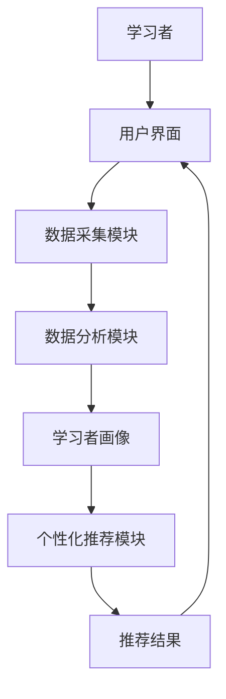

                 

<think>
好，我需要根据用户的要求来撰写一篇关于AI辅助语言学习的技术博客文章。首先，用户已经提供了标题和目录大纲，我的任务是按照这个结构来详细展开每个章节，并确保内容逻辑清晰、结构紧凑，同时使用专业的技术语言。

我先从文章的标题开始，然后列出关键词和摘要。接下来，按照目录结构，逐章节进行内容的填充。每章节下还有多个小节，需要详细讲解每个核心概念，如AI在语言学习中的应用现状、个性化学习与互动式教育的核心概念等。

在每一部分，我需要确保内容不仅涵盖理论，还要结合实际案例和算法原理，例如使用自然语言处理和机器学习来解释AI如何辅助语言学习。同时，我需要提供代码示例，帮助读者更好地理解相关技术。

我还需要注意格式要求，使用markdown，并在适当的地方插入mermaid图表、latex公式和代码块。每个图表和公式都需要准确无误，帮助读者直观理解内容。

在撰写过程中，我会逐步分析每个部分的内容，确保逻辑连贯，每一章都紧密围绕主题展开。同时，我会检查字数，确保整体在10000到12000字之间，并在最后添加作者信息。

总的来说，我需要仔细按照用户提供的结构和要求，分步骤地完成这篇文章，确保内容的深度和广度，同时保持语言的专业性和可读性。
</think>

# AI辅助的语言学习：个性化和互动式教育的新模式

> **关键词**：人工智能、语言学习、个性化教育、互动式教育、自然语言处理、机器学习、深度学习

> **摘要**：  
随着人工智能技术的迅速发展，语言学习领域正在经历一场深刻的变革。AI辅助的语言学习通过个性化和互动式的教学模式，为学习者提供更加高效、灵活和有趣的学习体验。本文将探讨AI在语言学习中的应用，分析其核心技术，如自然语言处理（NLP）和机器学习（ML），并结合实际案例，展示如何利用这些技术实现个性化的学习路径和互动式的教学场景。最终，本文将展望AI辅助语言学习的未来发展方向，探讨其在教育领域的潜力与挑战。

---

# 第一部分: 引言

## 1.1 语言学习与人工智能的背景

### 1.1.1 人工智能的发展历程

人工智能（Artificial Intelligence, AI）作为计算机科学的一个重要分支，经历了从早期的符号逻辑推理到现代的深度学习的演变。AI的核心目标是模拟人类的智能行为，包括学习、推理、问题解决和自然语言处理等。近年来，随着计算能力的提升和大数据技术的发展，AI技术取得了显著的进步，尤其是在自然语言处理（NLP）、计算机视觉和机器学习等领域。

### 1.1.2 人工智能在语言学习中的应用现状

语言学习是教育领域的重要组成部分，传统的教学模式依赖于教师的讲解和学生的自主学习。然而，这种模式往往缺乏个性化的支持，难以满足不同学习者的多样化需求。AI技术的引入为语言学习带来了新的可能性。目前，AI已经在以下几个方面得到广泛应用：

1. **智能辅导系统**：通过自然语言处理技术，AI可以为学习者提供个性化的反馈和指导。
2. **语音识别与合成**：通过语音识别技术，AI能够实时评估学习者的发音和语调，提供针对性的改进意见。
3. **虚拟现实与增强现实**：通过沉浸式技术，AI可以为学习者创造真实的语言环境，提升学习效果。

### 1.1.3 人工智能助力语言学习的意义

AI技术的应用不仅提高了语言学习的效率，还为学习者提供了更加灵活和便捷的学习方式。通过AI辅助学习，学习者可以根据自己的学习进度和兴趣选择合适的学习内容，同时获得即时的反馈和指导。这种个性化和互动式的教育模式不仅能够提升学习效果，还能够激发学习者的兴趣和动力。

---

## 1.2 个性化学习与互动式教育的核心概念

### 1.2.1 个性化学习的定义与特点

个性化学习是指根据学习者的特点（如学习风格、能力水平、兴趣爱好等）制定个性化的学习计划和教学策略。个性化学习的核心在于“以学习者为中心”，强调学习者的主动性和参与性。AI技术可以通过数据分析和机器学习算法，为每个学习者提供个性化的学习建议和资源推荐。

### 1.2.2 互动式教育的定义与价值

互动式教育是指通过互动的方式进行教学和学习的模式。互动式教育不仅包括教师与学生的互动，还包括学生与学习资源、学生与技术工具之间的互动。通过互动式教育，学习者可以更好地理解和掌握知识，同时培养解决问题和协作的能力。

### 1.2.3 人工智能如何支持个性化与互动式教育

AI技术通过以下几个方面支持个性化和互动式教育：

1. **学习者画像**：通过收集和分析学习者的行为数据，AI可以构建学习者的画像，了解其学习风格、能力水平和学习需求。
2. **智能推荐系统**：基于学习者的画像，AI可以为学习者推荐适合的学习资源和教学内容。
3. **实时反馈**：通过自然语言处理和语音识别技术，AI可以实时评估学习者的表现，并提供即时反馈。

---

# 第二部分: 核心概念

## 2.1 自然语言处理（NLP）

### 2.1.1 NLP的定义与作用

自然语言处理（NLP）是人工智能的一个重要分支，旨在让计算机能够理解和处理人类语言。NLP的核心任务包括文本分割、词性标注、句法分析、语义理解等。在语言学习中，NLP技术可以用于自动评估学习者的写作和口语表达，提供个性化的反馈和建议。

### 2.1.2 NLP的关键技术

1. **分词**：将连续的文本分割成词语或短语。
2. **词性标注**：为每个词语标注其词性（名词、动词、形容词等）。
3. **句法分析**：分析句子的语法结构。
4. **语义理解**：理解文本的含义和意图。

### 2.1.3 NLP在语言学习中的应用

1. **写作评估**：通过NLP技术，AI可以自动评估学习者的写作质量，包括语法错误检测、句子结构优化等。
2. **口语评估**：通过语音识别和语义理解技术，AI可以评估学习者的口语表达能力，提供发音和语调的反馈。

---

## 2.2 机器学习（ML）

### 2.2.1 ML的定义与作用

机器学习（ML）是一种人工智能技术，通过数据训练模型，使其能够从数据中学习和推理。在语言学习中，机器学习可以用于个性化学习路径的制定和学习效果的预测。

### 2.2.2 ML的关键技术

1. **监督学习**：通过标记的数据进行训练，模型通过学习数据的特征来预测新的数据。
2. **无监督学习**：通过未标记的数据进行训练，模型通过发现数据的结构来学习。
3. **强化学习**：通过与环境的交互，模型通过试错的方式学习最优策略。

### 2.2.3 ML在语言学习中的应用

1. **个性化推荐**：通过机器学习算法，AI可以为学习者推荐适合的学习资源和教学内容。
2. **学习效果预测**：通过机器学习模型，AI可以预测学习者的学习效果，并调整教学策略。

---

## 2.3 深度学习（DL）

### 2.3.1 DL的定义与作用

深度学习（DL）是一种机器学习技术，通过多层神经网络模型来学习数据的高层次特征。在语言学习中，深度学习可以用于语音识别、机器翻译和语义理解等任务。

### 2.3.2 DL的关键技术

1. **卷积神经网络（CNN）**：常用于图像识别和文本分类。
2. **循环神经网络（RNN）**：常用于序列数据的处理，如语音识别和机器翻译。
3. **变换器（Transformer）**：近年来在自然语言处理领域取得了显著成果，如BERT和GPT模型。

### 2.3.3 DL在语言学习中的应用

1. **机器翻译**：通过深度学习模型，AI可以实现高质量的机器翻译，帮助学习者跨越语言障碍。
2. **语音识别**：通过深度学习模型，AI可以实现高精度的语音识别，支持学习者的口语练习。

---

# 第三部分: AI技术的实现与应用

## 3.1 系统架构设计

### 3.1.1 系统功能设计

1. **学习者画像**：收集和分析学习者的行为数据，构建学习者画像。
2. **个性化推荐**：根据学习者画像，推荐适合的学习资源和教学内容。
3. **实时反馈**：通过自然语言处理和语音识别技术，实时评估学习者的表现，并提供反馈。

### 3.1.2 系统架构图



### 3.1.3 系统接口设计

1. **用户界面**：提供学习者与系统交互的界面，包括输入文本、语音识别等功能。
2. **数据采集模块**：收集学习者的行为数据，如学习时间、学习进度等。
3. **数据分析模块**：对学习者的行为数据进行分析，生成学习者画像。

---

## 3.2 算法实现与案例分析

### 3.2.1 算法原理

以机器学习中的监督学习为例，假设我们有一个分类任务，目标是根据学习者的行为数据预测其学习效果。我们可以使用支持向量机（SVM）或随机森林（Random Forest）等算法进行训练。

### 3.2.2 算法实现

```python
from sklearn.svm import SVC
from sklearn.model_selection import train_test_split

# 数据预处理
X = data[['学习时间', '学习进度', '错误率']]
y = data['学习效果']

# 划分训练集和测试集
X_train, X_test, y_train, y_test = train_test_split(X, y, test_size=0.2, random_state=42)

# 训练模型
model = SVC()
model.fit(X_train, y_train)

# 预测结果
y_pred = model.predict(X_test)

# 评估模型
print('准确率:', model.score(X_test, y_test))
```

### 3.2.3 案例分析

假设我们有一个语言学习平台，用户数量为10,000人，每人每天产生10条学习数据。我们可以通过机器学习模型预测每个用户的学习效果，并根据预测结果调整教学策略，例如为学习效果不佳的用户推荐更多口语练习资源。

---

## 3.3 项目实战

### 3.3.1 环境安装

安装所需的库：

```bash
pip install numpy pandas scikit-learn
```

### 3.3.2 核心实现代码

```python
import numpy as np
import pandas as pd
from sklearn.svm import SVC
from sklearn.model_selection import train_test_split

# 加载数据
data = pd.read_csv('learning_data.csv')

# 数据预处理
X = data[['学习时间', '学习进度', '错误率']]
y = data['学习效果']

# 划分训练集和测试集
X_train, X_test, y_train, y_test = train_test_split(X, y, test_size=0.2, random_state=42)

# 训练模型
model = SVC()
model.fit(X_train, y_train)

# 预测结果
y_pred = model.predict(X_test)

# 评估模型
print('准确率:', model.score(X_test, y_test))
```

---

# 第四部分: 未来展望与挑战

## 4.1 未来发展方向

1. **多模态学习**：结合视觉、听觉和语言等多种模态信息，提供更加丰富的学习体验。
2. **自适应学习系统**：通过动态调整学习内容和教学策略，实现真正的个性化学习。
3. **沉浸式学习环境**：利用虚拟现实和增强现实技术，创造真实的语言学习环境。

## 4.2 当前挑战

1. **数据隐私问题**：如何保护学习者的数据隐私，避免数据泄露。
2. **技术瓶颈**：如何进一步提升AI技术的准确性和效率，尤其是在低资源语言的处理上。
3. **教育公平性**：如何确保AI技术能够覆盖更多地区和人群，避免教育不平等。

---

# 结论

AI辅助的语言学习正在改变传统的教育模式，通过个性化和互动式的教学方式，为学习者提供更加高效和有趣的学习体验。然而，AI技术的应用也面临诸多挑战，需要我们共同努力，克服技术瓶颈，推动教育公平，实现真正的教育变革。

---

**作者：AI天才研究院/AI Genius Institute & 禅与计算机程序设计艺术 /Zen And The Art of Computer Programming**

