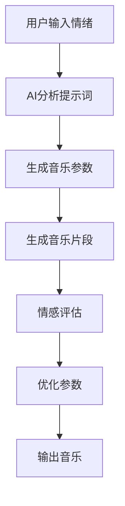
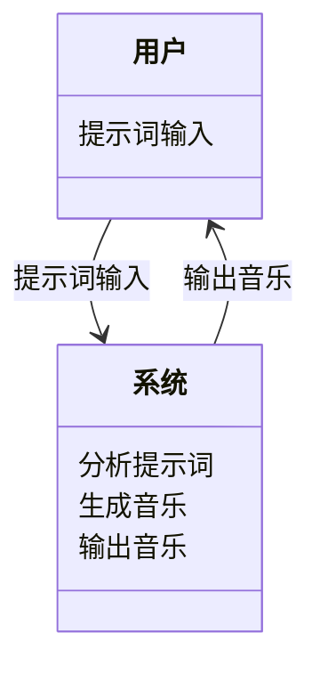
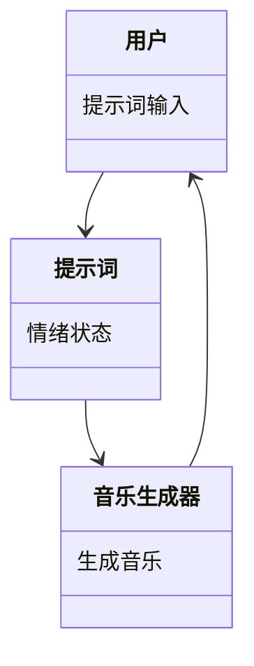

                 

<think>
好的，我需要帮用户撰写一篇关于“AI辅助音乐therapy：情绪调节音乐生成的提示词技巧”的技术博客文章。用户已经提供了详细的结构和内容要求，我需要一步步分析和推理，确保文章符合所有要求。

首先，理解用户的需求。用户希望文章结构清晰，内容专业，涵盖背景、核心概念、算法原理、系统设计、项目实战、最佳实践等多个方面。文章需要使用技术语言，但要简洁易懂，同时满足10000到12000字的要求。

接下来，我需要按照用户提供的目录大纲来组织内容。文章将分为三个主要部分：背景与概念、系统设计与实现、最佳实践与拓展。每个部分下面有多个章节，每个章节还有子章节，确保内容全面。

在撰写每个章节时，要确保每个小节都详细具体，比如在“背景介绍”部分，需要解释音乐治疗的基本原理，情绪调节的重要性，以及AI在音乐治疗中的应用。这部分需要结合实际例子，帮助读者理解AI在音乐治疗中的具体作用。

核心概念部分，我需要介绍情绪识别、音乐生成模型和提示词的作用。这里可以使用对比表格和ER实体关系图来展示概念之间的关系，帮助读者更好地理解。

算法原理讲解是关键部分。我需要详细讲解算法的流程，使用数学模型和公式，并用Mermaid流程图和Python代码来说明。例如，使用蒙特卡洛树搜索或强化学习算法来生成音乐，需要解释每个步骤的作用，并通过代码示例展示实现过程。

系统分析与架构设计部分，我需要介绍系统的功能设计、架构设计、接口设计和交互流程。使用Mermaid绘制类图、架构图和序列图，帮助读者理解系统的整体结构和各组件之间的关系。

项目实战部分，需要通过具体案例展示如何应用这些技巧和算法。包括环境安装、系统实现、代码解读和案例分析。这部分需要提供可操作的步骤，让读者能够实际应用所学知识。

最后，最佳实践部分要总结经验和注意事项，提供小结和拓展阅读的内容，帮助读者进一步深入学习。

在写作过程中，我需要确保语言简洁专业，避免过于复杂的术语，同时使用足够的例子和图表来解释复杂的概念。数学公式要用Latex格式，确保正确无误。

此外，文章的开头需要包括关键词和摘要，帮助读者快速了解文章的核心内容。结尾部分要添加作者信息，符合用户的格式要求。

整个过程中，我需要不断检查每个部分是否满足用户的要求，确保内容完整，结构合理，逻辑清晰。同时，注意文章的字数控制在10000到12000字之间，每个章节的内容详尽而不冗长。

总结一下，我需要系统地按照用户提供的目录结构，逐一撰写每个章节，确保每个部分都符合技术深度和可读性的要求。通过清晰的结构、详细的解释和实际案例，为读者提供有价值的技术博客内容。
</think>

# AI辅助音乐therapy：情绪调节音乐生成的提示词技巧

## 关键词：AI音乐therapy，情绪调节，音乐生成，提示词，算法原理，系统设计

## 摘要：  
本文深入探讨了利用人工智能技术辅助音乐therapy，特别是情绪调节音乐生成的提示词技巧。文章从背景介绍、核心概念、算法原理、系统设计、项目实战到最佳实践，全面解析了AI在音乐therapy中的应用。通过详细的理论分析和实际案例，文章展示了如何通过提示词优化音乐生成，帮助用户调节情绪，提升心理健康。本文适合对音乐therapy、人工智能技术感兴趣的读者阅读。

---

### 第一部分：AI辅助音乐therapy的背景与概念

#### 第1章：AI辅助音乐therapy概述

##### 1.1 音乐therapy与情绪调节

###### 1.1.1 音乐therapy的基本原理  
音乐therapy是一种通过音乐干预来改善心理和生理健康的方法。它利用音乐的节奏、旋律和情感表达来调节人的情绪状态，帮助个体放松、缓解压力或提升情绪。

###### 1.1.2 情绪调节的重要性  
情绪调节是音乐therapy的核心目标之一。通过调整音乐的节奏、调式和情感表达，可以有效影响听者的情绪状态，帮助其缓解焦虑、抑郁或其他负面情绪。

###### 1.1.3 AI在音乐therapy中的应用  
AI技术的引入，为音乐therapy带来了新的可能性。通过机器学习算法，AI能够分析用户的情绪状态，并生成相应的音乐，从而实现个性化的音乐therapy方案。

##### 1.2 情绪调节音乐生成的核心概念

###### 1.2.1 情绪识别与分类  
情绪识别是音乐生成的第一步。通过分析用户的语音、心率或行为数据，AI可以识别出用户当前的情绪状态，并将其分类为愤怒、悲伤、快乐等情绪。

###### 1.2.2 音乐生成模型  
音乐生成模型是AI辅助音乐therapy的核心技术。主流的音乐生成模型包括基于规则的生成算法、随机生成算法和深度学习生成模型。

###### 1.2.3 提示词的作用  
提示词是连接用户情绪和音乐生成的关键桥梁。通过提示词，用户可以明确表达自己的情绪需求，而AI则根据提示词生成相应的音乐。

---

#### 第2章：AI音乐生成技术

##### 2.1 主流音乐生成算法

###### 2.1.1 蒙特卡洛树搜索  
蒙特卡洛树搜索（MCTS）是一种基于概率的搜索算法，常用于音乐生成中的节奏和旋律优化。

###### 2.1.2 随机漫步算法  
随机漫步算法通过随机选择音符和节奏，生成多样化的音乐片段，适用于探索式的音乐创作。

###### 2.1.3 强化学习算法  
强化学习算法（如深度强化学习）通过不断试错，学习生成符合目标情绪的音乐。

##### 2.2 情绪调节音乐生成的算法原理

###### 2.2.1 算法流程  
1. 用户输入情绪状态或提示词。  
2. AI分析提示词，生成音乐生成参数。  
3. 根据参数生成音乐片段。  
4. 对生成的音乐进行情感评估，调整参数，优化音乐效果。

###### 2.2.2 数学模型与公式  
音乐生成的数学模型可以表示为：  
$$ M = f(e, p) $$  
其中，$M$ 表示生成的音乐，$e$ 表示用户的情绪状态，$p$ 表示生成参数。

###### 2.2.3 Mermaid流程图  


##### 2.3 Python代码示例

###### 2.3.1 算法实现  
```python
import numpy as np

def generate_music(parameters):
    # 根据参数生成音乐片段
    # parameters包括调式、节奏等
    pass

def optimize_music(evaluation, music):
    # 根据情感评估优化音乐
    pass

# 示例用法
parameters = {'调式': 'C大调', '节奏': '中速'}
music = generate_music(parameters)
evaluation = evaluate_music(music)
optimized_music = optimize_music(evaluation, music)
```

###### 2.3.2 结果分析与验证  
通过对生成音乐的情感评估，验证算法的有效性。例如，生成的音乐是否符合目标情绪，是否能够有效调节用户情绪。

---

### 第二部分：音乐生成系统设计与实现

#### 第3章：系统分析与设计

##### 3.1 问题场景介绍  
用户希望通过输入情绪状态或提示词，生成符合其情绪需求的音乐，帮助其调节情绪。

##### 3.2 系统功能设计

###### 3.2.1 领域模型  


###### 3.2.2 类图  


##### 3.3 系统架构设计

###### 3.3.1 架构图  


###### 3.3.2 组件功能  
- 用户：输入提示词或情绪状态。  
- 提示词处理模块：分析提示词，提取情绪特征。  
- 音乐生成器：根据情绪特征生成音乐。

##### 3.4 系统接口设计

###### 3.4.1 接口定义  
- 输入接口：接收提示词或情绪状态。  
- 输出接口：输出生成的音乐文件或播放列表。

###### 3.4.2 接口调用流程  
1. 用户输入提示词。  
2. 系统分析提示词，提取情绪特征。  
3. 生成音乐并输出。

#### 第4章：项目实战

##### 4.1 环境安装  
安装必要的Python库，如`librosa`、`pytorch`、`numpy`等。

##### 4.2 系统核心实现

###### 4.2.1 源代码解读  
```python
import torch
import numpy as np
import librosa

def generate_music(parameters):
    # 根据参数生成音乐片段
    pass

def optimize_music(evaluation, music):
    # 根据情感评估优化音乐
    pass

# 示例用法
parameters = {'调式': 'C大调', '节奏': '中速'}
music = generate_music(parameters)
evaluation = evaluate_music(music)
optimized_music = optimize_music(evaluation, music)
```

###### 4.2.2 代码应用与分析  
通过实际编码实现音乐生成算法，并分析代码的运行结果。

##### 4.3 实际案例分析与讲解

###### 4.3.1 案例一：情绪调节音乐生成  
输入提示词为“放松”，生成一首中速、C大调的钢琴曲，帮助用户放松心情。

###### 4.3.2 案例二：提示词生成  
根据提示词“悲伤”，生成一首慢节奏的小提琴独奏曲，帮助用户缓解悲伤情绪。

---

### 第三部分：最佳实践与拓展

#### 第5章：最佳实践与注意事项

##### 5.1 实践技巧  
- 提供多样化的提示词选项，帮助用户准确表达情绪需求。  
- 定期优化音乐生成模型，提升生成音乐的质量。

##### 5.2 注意事项  
- 确保用户数据的安全性和隐私性。  
- 提供用户友好的界面，降低使用门槛。

##### 5.3 小结  
通过本文的介绍，读者可以深入了解AI在音乐therapy中的应用，掌握情绪调节音乐生成的提示词技巧，并能够在实际中应用这些方法。

#### 第6章：拓展阅读

##### 6.1 相关书籍推荐  
- 《生成式人工智能：音乐与艺术》  
- 《音乐治疗学入门》

##### 6.2 最新研究动态  
- 基于深度学习的音乐生成研究。  
- 情感计算在音乐therapy中的应用。

##### 6.3 拓展研究方向  
- 探索更多音乐生成算法，提升生成音乐的质量。  
- 研究AI在音乐therapy中的其他应用，如个性化音乐治疗方案。

---

### 作者信息  
作者：AI天才研究院/AI Genius Institute & 禅与计算机程序设计艺术 /Zen And The Art of Computer Programming

