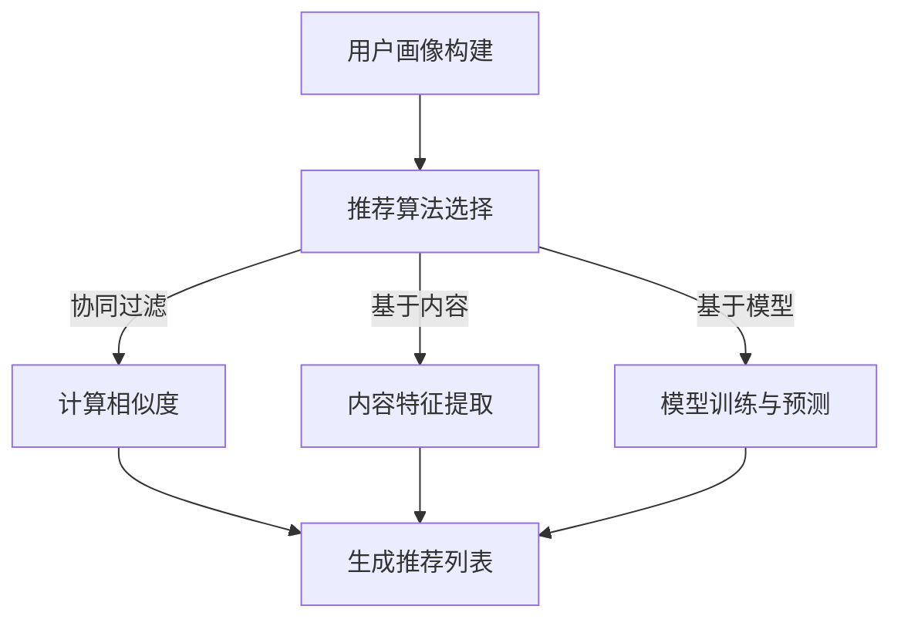
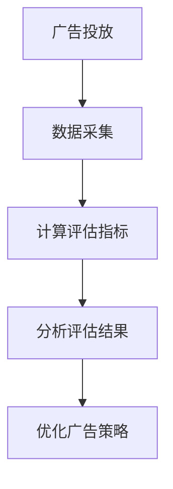
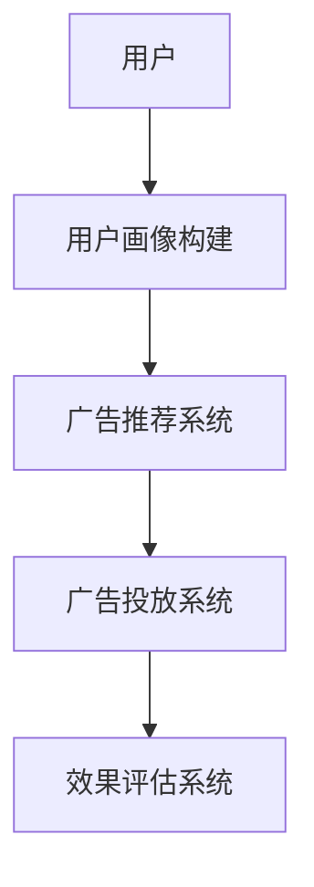

                 

<think>
嗯，我需要帮助用户撰写一篇关于“AI驱动的个性化广告系统效果评测”的技术博客文章。用户已经提供了一个详细的目录结构，包括各个章节的内容。我需要按照这个结构一步步分析，确保每个部分都详细且符合要求。

首先，我应该从背景介绍开始。这部分包括问题背景和核心概念。问题背景部分，我需要解释为什么传统广告投放方式不够，以及AI如何解决这些问题。核心概念部分，需要定义个性化广告、效果评估等术语，并通过表格和ER图来展示它们之间的关系。

接下来是技术原理部分。这里要详细讲解系统架构设计、推荐算法以及效果评估的方法。推荐算法部分，我需要列出协同过滤、基于内容的推荐和基于模型的推荐，并绘制相应的流程图。效果评估部分，需要介绍常用的指标和评估方法，同样用流程图来说明。

然后是系统设计与实现。这部分包括系统功能设计、架构设计、接口设计和项目实战。在项目实战中，我需要写出代码，并进行分析。可能还需要选择一个具体的广告推荐系统作为例子，展示代码结构和实现细节。

最后是小结部分，总结文章的主要内容和未来的发展方向。同时，还要加上最佳实践的建议和注意事项，帮助读者更好地理解和应用这些技术。

在写作过程中，我要确保使用专业但易懂的语言，结构清晰，逻辑严谨。每个部分都要详细展开，确保读者能够跟随思路一步步理解AI在广告系统中的应用和效果评测方法。

另外，我需要特别注意数学公式的正确使用，使用LaTeX格式，并且在合适的地方嵌入。流程图和表格要准确反映系统结构和概念关系。同时，代码部分要简洁明了，方便读者理解和运行。

总的来说，我需要系统性地分析每个部分，确保文章内容全面、结构合理，同时保持语言的专业性和可读性。这样才能写出一篇高质量的技术博客，满足用户的需求。
</think>

# AI驱动的个性化广告系统效果评测

> 关键词：个性化广告，AI驱动，效果评估，推荐算法，广告系统架构

摘要：本文详细探讨了AI驱动的个性化广告系统在效果评测方面的应用。首先介绍了问题背景和核心概念，接着分析了系统的技术原理，包括推荐算法和效果评估方法。然后从系统设计与实现的角度，详细讲解了系统架构、接口设计和项目实战。最后，总结了AI驱动个性化广告系统的优缺点，并提出了改进建议和未来研究方向。

---

## 第一部分: 背景介绍

### 第1章: 问题背景

#### 1.1 问题提出

**问题描述**：在当前互联网广告市场中，广告主和广告平台面临个性化广告投放的挑战。传统广告投放方式难以满足用户对个性化体验的需求，同时，广告效果评估也存在困难。

**问题解决**：引入AI驱动的个性化广告系统，通过大数据分析和机器学习技术，实现广告内容的个性化推荐，并评估广告投放效果。

#### 1.2 边界与外延

**边界**：主要研究AI驱动的个性化广告系统在广告投放效果评测方面的应用。

**外延**：探讨个性化广告系统的技术架构、算法原理以及实际案例。

### 第2章: 核心概念

#### 2.1 核心概念原理

**AI驱动的个性化广告系统**：基于人工智能技术，实现广告内容个性化推荐和效果评估的系统。

**个性化广告**：根据用户的兴趣、行为和历史数据，定制化推送广告。

**效果评估**：对广告投放结果进行数据分析和评估，以优化广告策略。

#### 2.2 概念属性特征对比表格

| 概念        | 特征1   | 特征2   | 特征3   |
|-------------|---------|---------|---------|
| AI驱动的个性化广告系统 | 大数据驱动 | 机器学习 | 用户个性化推荐 |
| 个性化广告   | 用户兴趣 | 用户行为 | 广告内容定制 |
| 效果评估     | 数据分析 | 指标分析 | 广告优化 |

#### 2.3 ER实体关系图架构

```mermaid
erDiagram
    User ||--|{ Ad}: 发起广告请求
    User ||--|{ Click}: 广告点击
    Ad ||--|{ Advertiser}: 广告主
    Ad ||--|{ Platform}: 广告平台
```

---

## 第二部分: 技术原理

### 第3章: AI驱动的个性化广告系统原理

#### 3.1 系统架构设计

**系统功能设计**：用户画像构建、广告推荐、广告投放、效果评估。

**系统架构设计**：数据采集与处理、推荐算法、广告投放与监控、效果评估。

**系统接口设计和系统交互**：用户与广告系统交互接口、广告平台与推荐系统的接口、数据交换格式。

#### 3.2 推荐算法

**推荐算法原理**：基于协同过滤、基于内容的推荐、基于模型的推荐。

**算法流程图**：



#### 3.3 效果评估

**评估指标**：点击率、转化率、广告收益。

**评估方法**：A/B测试、多变量测试、实际案例分析。

**效果评估流程图**：



---

## 第三部分: 系统设计与实现

### 第4章: 系统设计与实现

#### 4.1 系统功能设计

**用户画像构建**：采集用户行为数据，构建用户画像。

**广告推荐**：根据用户画像，推荐个性化广告。

**广告投放**：将推荐广告推送给用户。

**效果评估**：评估广告投放效果。

#### 4.2 系统架构设计

**系统架构图**：



#### 4.3 系统接口设计和系统交互

**用户与广告系统交互接口**：用户请求广告、接收广告推荐。

**广告平台与推荐系统的接口**：广告平台推送广告数据、推荐系统获取广告数据。

**数据交换格式**：JSON、XML等。

#### 4.4 项目实战

**环境安装**：配置开发环境，安装相关软件。

**系统核心实现源代码**：

```python
# 示例代码：用户画像构建
def build_user_profile(users):
    profiles = {}
    for user in users:
        profile = {
            'age': user['age'],
            'interests': user['interests'],
            'behavior': user['behavior']
        }
        profiles[user['id']] = profile
    return profiles

# 示例代码：协同过滤算法
def collaborative_filtering(user_profile, item_profile):
    # 计算相似度
    similarity_matrix = {}
    for u in user_profile:
        for v in user_profile:
            if u != v:
                similarity = cosine_similarity(user_profile[u], user_profile[v])
                similarity_matrix[u][v] = similarity
    return similarity_matrix

# 示例代码：广告推荐
def recommend_ads(users, ads, similarity_matrix):
    recommendations = {}
    for user in users:
        similar_users = [v for v in similarity_matrix[user] if similarity_matrix[user][v] > 0.5]
        recommended_ads = []
        for ad in ads:
            count = 0
            for su in similar_users:
                if ad in su['liked_ads']:
                    count += 1
            if count > 2:
                recommended_ads.append(ad)
        recommendations[user['id']] = recommended_ads
    return recommendations
```

**代码应用解读与分析**：上述代码展示了用户画像构建、协同过滤算法和广告推荐的具体实现。用户画像构建函数将用户的基本信息和行为数据转化为可分析的格式。协同过滤算法计算用户之间的相似度，用于推荐相似用户的喜欢广告。广告推荐函数基于相似度和用户偏好生成推荐列表。

---

## 小结

AI驱动的个性化广告系统通过大数据分析和机器学习技术，实现了广告的精准投放和效果评估。本文详细介绍了系统的背景、核心概念、技术原理、系统设计与实现，并通过实际案例分析了系统的优势和挑战。未来的研究可以进一步优化推荐算法，提高广告效果评估的准确性，以更好地满足广告主和用户的需求。

---

## 最佳实践 tips

1. 在实际应用中，建议结合实时数据流处理技术，以提高广告推荐的实时性。
2. 注意用户隐私保护，确保数据处理符合相关法律法规。
3. 定期更新用户画像和广告内容，以适应市场变化和用户需求。

---

## 作者

作者：AI天才研究院/AI Genius Institute & 禅与计算机程序设计艺术 /Zen And The Art of Computer Programming

