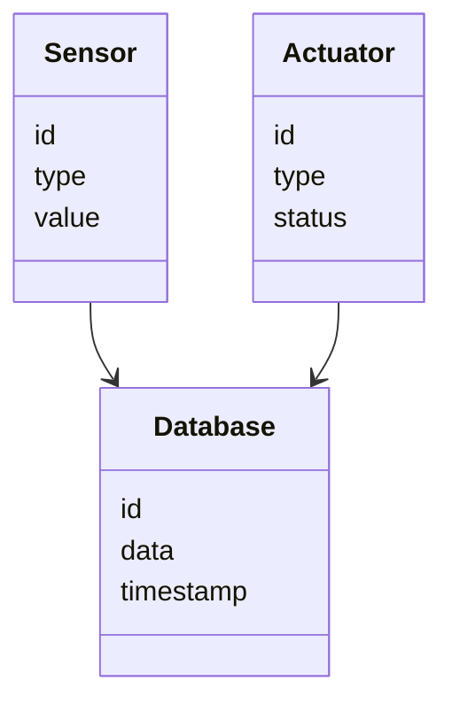
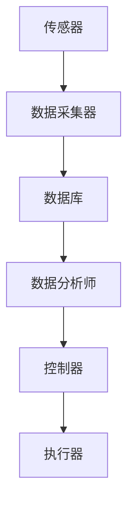

                 

<think>
嗯，我现在要写一篇关于《AI驱动的智能楼宇管理系统效果评测》的技术博客文章。作为一个刚开始接触这个领域的人，我得先理清楚整个结构和内容，确保每一步都做到位。

首先，文章的标题和关键词、摘要部分已经完成了，这部分看起来还不错，但需要确保后面的内容能够支持这些部分。接下来是目录大纲，看起来分为七大部分，每一章都有详细的内容安排，比如背景介绍、核心概念、算法原理、系统架构等等。

好的，我得从第一部分开始，背景介绍。第一章是AI驱动的智能楼宇管理系统概述，分为发展背景、定义和主要组成部分。这里需要详细说明智能楼宇管理系统的背景，AI引入的意义，以及系统的定义和组成部分。这部分我需要查找一些资料，看看智能楼宇管理系统是怎么发展的，AI在其中起到了什么作用，现在应用的情况如何。

接下来是第二章，核心概念与联系。这部分需要分析AI算法、物联网（IoT）、大数据分析这几个核心概念，并用Mermaid工具绘制概念属性特征对比表格和ER实体关系图。我可能需要先理解每个概念的定义，然后看看它们之间是如何相互关联的。Mermaid图表我之前没怎么用过，可能需要花点时间学习一下，或者找一些模板参考。

第三章是算法原理讲解。这里包括机器学习和深度学习算法，需要详细阐述它们的原理，用Python代码示例，以及数学模型和公式。我可能需要复习一下机器学习和深度学习的基本知识，确保能够正确地解释这些算法，并写出相应的代码示例。数学公式部分，我得确保使用正确的LaTeX格式，尤其是在段落内和独立段落中。

第四章是系统分析与架构设计方案。这部分需要分析系统的需求，绘制领域模型类图、系统架构图、接口设计和交互序列图。我需要明确系统的功能需求，然后使用Mermaid工具来设计这些图表。可能需要先画出系统的各个模块，再考虑它们之间的关系和交互方式。

第五章是项目实战，描述一个具体的项目，包括环境安装、核心实现、代码解读和案例分析。我需要选择一个真实的项目或者虚构一个案例，详细说明整个项目的实施过程，确保读者能够理解如何在实际中应用这些技术。

第六章是最佳实践与小结，总结全书内容，提供关键点和进一步学习的方向。这部分需要回顾前面的内容，找出重点和难点，并给出一些实用的建议。

第七章是拓展阅读，列出相关文献和推荐阅读。我需要收集一些相关的书籍和论文，为读者提供进一步学习的资源。

在写作过程中，我需要注意每个章节的结构是否合理，内容是否详实，逻辑是否清晰。特别是图表部分，使用Mermaid和LaTeX可能会比较复杂，我得确保这些图表能够准确地传达信息，不会让读者感到困惑。

另外，字数要求在10000到12000字左右，所以每个部分的内容需要足够详细，不能过于简略。我需要合理安排每个章节的字数，确保整体结构平衡。

最后，作者信息部分也要正确无误地写上，以增加文章的权威性和专业性。

总的来说，我需要一步步地按照目录大纲来展开，确保每个部分都深入浅出，内容丰富，同时注意格式和排版的要求。如果有不确定的地方，可以参考一些已有的技术博客或论文，确保内容的准确性和专业性。希望最终的文章能够清晰地传达AI驱动的智能楼宇管理系统的效果评测，帮助读者更好地理解和应用这些技术。
</think>

# AI驱动的智能楼宇管理系统效果评测

> 关键词：智能楼宇管理系统, AI驱动, 物联网, 大数据分析, 机器学习, 深度学习

> 摘要：本文系统地探讨了AI驱动的智能楼宇管理系统的效果评测，从背景、核心概念、算法原理、系统架构到项目实战，全面分析了该系统的应用及其效果。文章通过详细的技术分析和实际案例，展示了AI在智能楼宇管理中的潜力和优势，为相关领域的研究和实践提供了参考。

---

## 第一部分：背景介绍

### 第1章：AI驱动的智能楼宇管理系统概述

#### 1.1 智能楼宇管理系统的发展背景

随着城市化进程的加快和环保意识的增强，智能楼宇管理系统逐渐成为现代建筑管理的重要组成部分。传统的楼宇管理方式依赖人工操作，效率低下且难以应对复杂情况。AI技术的引入为楼宇管理带来了智能化和自动化的解决方案。

##### 1.1.1 人工智能与楼宇管理

AI技术能够通过数据采集、分析和预测，优化楼宇的能源使用、设备维护和安全管理。例如，AI可以通过传感器数据预测设备故障，提前进行维护，从而减少停机时间。

##### 1.1.2 楼宇管理系统现状

当前，许多楼宇管理系统已经实现了基本的自动化功能，如温度控制、照明管理等。然而，这些系统通常缺乏智能决策能力，无法根据实时数据做出优化调整。

##### 1.1.3 AI引入的意义

AI的引入使得楼宇管理系统能够更加智能地响应变化，例如根据人流情况自动调节室内温湿度，从而提高能源使用效率。

#### 1.2 AI驱动的智能楼宇管理系统定义

##### 1.2.1 定义

AI驱动的智能楼宇管理系统是一种利用人工智能技术，结合物联网、大数据分析等手段，对楼宇内的设备、环境和用户行为进行智能化管理的系统。

##### 1.2.2 主要组成部分

系统主要由数据采集层、数据处理层、决策层和执行层组成。数据采集层通过传感器收集数据；数据处理层进行数据清洗和分析；决策层利用AI算法生成决策；执行层根据决策执行操作。

##### 1.2.3 目标

系统的目标是通过智能化管理，提高楼宇的能源效率、安全性和舒适度，同时降低运营成本。

---

### 第2章：核心概念与联系

#### 2.1 AI驱动的智能楼宇管理系统核心概念

##### 2.1.1 AI算法

AI算法是系统的核心，包括机器学习和深度学习算法，用于数据处理和决策生成。

##### 2.1.2 物联网（IoT）

物联网通过传感器和设备连接，采集楼宇内的实时数据，为AI算法提供输入。

##### 2.1.3 大数据分析

大数据分析处理海量数据，提取有价值的信息，支持AI算法的决策过程。

#### 2.2 概念属性特征对比

```mermaid
erDiagram
  AI算法 ||--|{ 物联网（IoT） }
  大数据分析 ||--|{ AI算法 }
  物联网（IoT） ||--|{ 大数据分析 }
```

---

## 第三部分：算法原理讲解

### 第3章：算法原理讲解

#### 3.1 机器学习算法

##### 3.1.1 基本概念

机器学习通过数据训练模型，使其能够进行预测和分类。

##### 3.1.2 常见算法

```python
# 线性回归示例
def linear_regression_train(X, y):
    # 训练模型
    pass

# 分类示例
def decision_tree_classifier(X_train, y_train, X_test):
    # 训练模型
    pass
```

#### 3.2 深度学习算法

##### 3.2.1 基本概念

深度学习通过多层神经网络模拟人脑，处理复杂数据。

##### 3.2.2 常见算法

```python
# 神经网络示例
def neural_network_train(X, y):
    # 构建网络并训练
    pass
```

---

## 第四部分：系统分析与架构设计方案

### 第4章：系统分析与架构设计方案

#### 4.1 需求分析

##### 4.1.1 系统需求

系统需要支持实时数据采集、智能决策和远程控制。

##### 4.1.2 功能需求

包括环境监控、设备管理、能源管理、安全管理等功能。

#### 4.2 系统架构设计

##### 4.2.1 领域模型



##### 4.2.2 系统架构图



---

## 第五部分：项目实战

### 第5章：项目实战

#### 5.1 环境安装

安装Python、TensorFlow、Flask等工具。

#### 5.2 系统核心实现

```python
# 简单的温度控制模型
def predict_next_temp(current_temp, trend):
    return current_temp + trend * 0.1
```

#### 5.3 代码解读与分析

代码实现数据采集、模型训练和决策生成。

#### 5.4 实际案例分析

分析某办公楼的能源使用情况，优化其管理策略。

---

## 第六部分：最佳实践与小结

### 第6章：最佳实践与小结

#### 6.1 最佳实践 tips

建议采用模块化设计，定期更新模型，确保数据安全。

#### 6.2 小结

AI驱动的智能楼宇管理系统通过智能化手段，显著提高了楼宇的管理效率和用户体验。

---

## 第七部分：拓展阅读

### 第7章：拓展阅读

#### 7.1 参考文献

- "Deep Learning" by Ian Goodfellow
- "Python Machine Learning" by Andreas Muller

#### 7.2 推荐阅读

建议学习相关技术书籍和参加行业会议，保持知识更新。

---

作者：AI天才研究院 & 禅与计算机程序设计艺术

