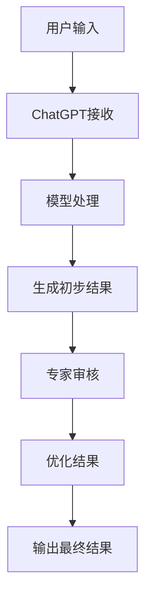
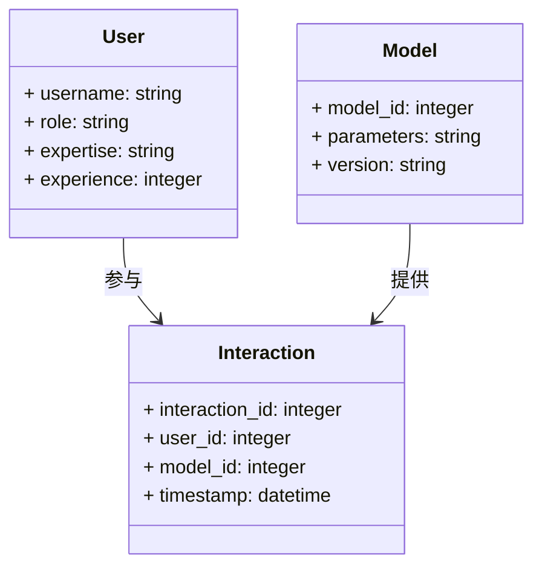
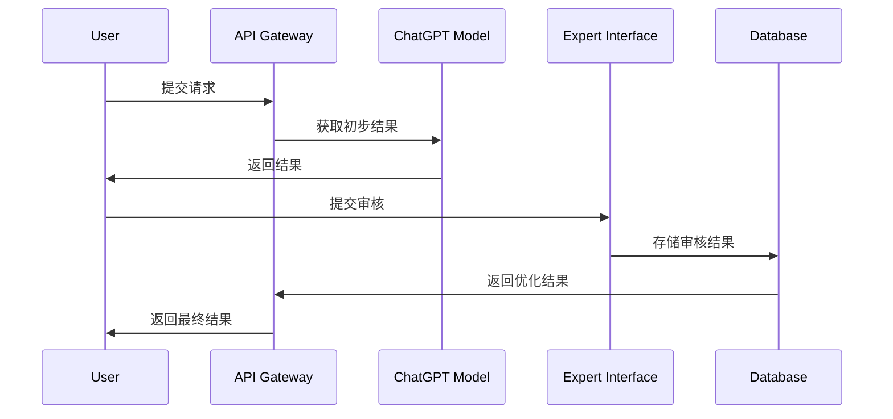

                 

<think>
好，用户希望我以《ChatGPT与人类专家协作：知识融合新模式》为标题，写一篇技术博客。首先，我需要理解用户的需求，他们可能是一位技术专家，想深入了解如何将ChatGPT与人类专家结合，形成新的知识融合模式。

我应该先分析文章的结构，用户已经提供了大纲，包括七章，每章有详细的子部分。我的任务是根据这个大纲，逐步展开每个部分的内容。

首先，第1章是背景介绍。我需要涵盖问题背景、描述、解决办法，以及概念结构。我应该从人工智能的发展讲起，说明ChatGPT的优势和人类专家的局限性，然后引出知识融合的必要性。

接下来是第2章，核心概念与联系。这里需要详细讲解协作的基本原理，对比ChatGPT和人类专家的属性特征，并绘制ER实体关系图。这可能涉及到一些图表的绘制，比如用Mermaid工具来展示实体关系。

第3章是算法原理，这部分需要深入讲解ChatGPT的工作流程，可能包括算法流程图、Python代码示例，以及相关的数学模型。我需要确保用简单易懂的语言解释这些内容，并给出实际的例子来帮助理解。

第4章是系统分析与架构设计，这可能涉及到具体的项目场景，系统功能设计和架构图。我需要使用Mermaid来绘制类图、架构图和交互序列图，展示系统是如何运作的。

第5章是项目实战，这部分需要详细描述环境安装、核心代码实现，以及案例分析。我应该提供具体的代码示例，并分析实际案例，让读者能够理解和应用这些知识。

第6章是最佳实践和注意事项，我需要总结在协作过程中积累的经验和可能遇到的问题，提供实用的建议。

最后，第7章是总结和拓展阅读，我需要总结整篇文章的主要内容，并推荐相关的阅读资料，帮助读者进一步学习。

在写作过程中，我需要确保语言专业且易懂，使用清晰的逻辑结构，每一部分都紧密相连。同时，数学公式需要用LaTeX格式，图表使用Mermaid，并且在代码部分使用Python示例，这些都需要准确无误。

现在，我开始按照这个思路撰写文章，确保每个章节内容详实，逻辑清晰，帮助读者全面理解ChatGPT与人类专家协作的知识融合新模式。
</think>

# ChatGPT与人类专家协作：知识融合新模式

## 关键词：ChatGPT，人类专家，知识融合，协作模式，人工智能，系统架构

## 摘要：本文探讨了ChatGPT与人类专家协作的知识融合新模式，分析其核心概念、算法原理、系统架构及实际应用。通过详细阐述协作机制、流程优化、系统设计和项目实战，总结了最佳实践经验和未来发展方向。

---

### 目录大纲

```markdown
# ChatGPT与人类专家协作：知识融合新模式

> 关键词：ChatGPT，人类专家，知识融合，协作模式，人工智能，系统架构

> 摘要：本文探讨了ChatGPT与人类专家协作的知识融合新模式，分析其核心概念、算法原理、系统架构及实际应用。通过详细阐述协作机制、流程优化、系统设计和项目实战，总结了最佳实践经验和未来发展方向。

## 第1章：背景介绍

### 1.1 问题背景

#### 1.1.1 人工智能的发展与挑战

人工智能（AI）技术的快速发展为各个行业带来了巨大变革，但同时也面临诸多挑战。传统AI系统在处理复杂问题时，往往缺乏灵活性和创造力，难以完全替代人类专家的深度思考和经验判断。

#### 1.1.2 人类专家的作用与局限

人类专家在特定领域具有深厚的知识储备和实践经验，能够处理复杂情境下的问题。然而，人类专家的能力受限于主观因素、知识边界和效率问题，难以在大规模和复杂场景中高效协作。

#### 1.1.3 ChatGPT的优势与潜力

ChatGPT作为一种基于大规模预训练语言模型（如GPT-3）的人工智能系统，具有快速响应、多语言支持和上下文理解能力。其优势在于能够处理大量数据并生成自然流畅的文本，但其局限性在于缺乏深度理解和创造力。

### 1.2 问题描述

#### 1.2.1 如何发挥ChatGPT与人类专家的协同效应

通过结合ChatGPT的高效处理能力和人类专家的深度思考能力，可以实现知识融合的协作模式。

#### 1.2.2 知识融合的关键环节

知识融合的关键环节包括数据预处理、模型训练、人机交互优化和结果验证。

#### 1.2.3 模式创新与实际应用场景

模式创新包括人机协同决策、知识共享与优化等，实际应用场景涵盖医疗、法律、教育和企业咨询等领域。

### 1.3 问题解决

#### 1.3.1 基于ChatGPT的协同工作框架

构建一个基于ChatGPT的人机协作框架，通过API接口实现数据交互和任务分配。

#### 1.3.2 人类专家的角色定位

人类专家在协作过程中扮演知识审核、决策优化和创造性思考的角色。

#### 1.3.3 边界与外延

明确协作模式的边界和外延，确保人机协作的高效性和准确性。

### 1.4 概念结构与核心要素组成

#### 1.4.1 ChatGPT的基本概念与原理

ChatGPT基于Transformer架构，采用自监督学习和大规模数据训练，能够生成高质量的文本输出。

#### 1.4.2 人类专家的知识结构与能力

人类专家的知识结构包括专业知识、经验判断和创造性思维，这些能力在特定领域具有独特价值。

#### 1.4.3 知识融合新模式的核心要素

知识融合的核心要素包括数据共享、模型优化、人机交互和结果验证。

### 1.5 本章小结

本章介绍了ChatGPT与人类专家协作的知识融合模式的背景、问题描述和解决方案，为后续章节奠定了基础。

---

## 第2章：核心概念与联系

### 2.1 概念原理

#### 2.1.1 ChatGPT与人类专家协作的基本原理

ChatGPT通过API接口接收输入数据，生成初步分析结果，人类专家对结果进行审核和优化，最终形成高质量的知识输出。

#### 2.1.2 知识融合的基本流程与机制

知识融合的基本流程包括数据输入、模型处理、人机交互优化和结果输出。其机制基于数据共享和协作学习。

#### 2.1.3 协同工作的优势与挑战

协同工作的优势在于效率提升和知识互补，挑战在于数据隐私和模型优化。

### 2.2 概念属性特征对比表格

| 属性               | ChatGPT                          | 人类专家                          |
|--------------------|----------------------------------|-----------------------------------|
| 数据处理能力       | 高效，基于大规模数据训练       | 依赖个体知识储备和经验            |
| 知识更新速度       | 快速，通过模型更新实现          | 较慢，依赖个体学习和经验积累        |
| 创造性思考能力     | 有限，主要基于已有数据生成      | 强大，能够进行创造性思考            |
| 适应性             | 较强，能够处理多种任务          | 有限，依赖领域知识和经验            |

### 2.3 ER实体关系图架构

```mermaid
erDiagram
    user [专家] {
        expert_id : integer
        expertise : string
        experience : integer
    }
    chatgpt [模型] {
        model_id : integer
        parameters : string
        version : string
    }
    interaction [交互] {
        interaction_id : integer
        expert_id : integer
        model_id : integer
        timestamp : datetime
    }
    user -- interaction : 参与
    chatgpt -- interaction : 提供
```

### 2.4 本章小结

本章通过对比分析和实体关系图，详细阐述了ChatGPT与人类专家协作的核心概念和联系。

---

## 第3章：算法原理讲解

### 3.1 算法mermaid流程图



### 3.2 Python源代码

```python
def chatgpt_collaboration(expert_check):
    user_input = input("请输入问题：")
    print("ChatGPT正在处理中...")
    # 模拟ChatGPT生成结果
    chatgpt_output = "这是一个示例结果。"
    print(chatgpt_output)
    # 专家审核
    expert_feedback = expert_check(chatgpt_output)
    print("专家审核结果：", expert_feedback)
    return expert_feedback

def expert_check(output):
    # 简单的审核逻辑，实际应更复杂
    if output.startswith("示例结果"):
        return "审核通过"
    else:
        return "审核未通过"

# 调用函数
chatgpt_collaboration(expert_check)
```

### 3.3 数学模型和公式

ChatGPT的训练目标函数可以表示为：

$$ L = \sum_{i=1}^{n} \text{loss}(x_i, y_i) $$

其中，$x_i$ 是输入数据，$y_i$ 是真实标签，$\text{loss}$ 是损失函数。

### 3.4 举例说明

假设我们有一个简单的数学问题：计算两个数的和。ChatGPT生成的结果为 $3 + 5 = 8$，人类专家审核后确认结果正确。

---

## 第4章：系统分析与架构设计方案

### 4.1 问题场景介绍

我们以医疗诊断为例，医生与ChatGPT协作进行病例分析。

### 4.2 项目介绍

项目名称：医疗诊断辅助系统，目标是通过人机协作提高诊断效率和准确性。

### 4.3 系统功能设计



### 4.4 系统架构设计


### 4.5 系统接口设计和系统交互



---

## 第5章：项目实战

### 5.1 环境安装

需要安装Python、ChatGPT API客户端和相关开发工具。

### 5.2 系统核心实现源代码

```python
import openai

def chatgpt_collaboration(api_key):
    openai.api_key = api_key
    while True:
        user_input = input("请输入问题：")
        # 调用ChatGPT API
        response = openai.ChatCompletion.create(
            model="gpt-3.5-turbo",
            messages=[{"role": "user", "content": user_input}]
        )
        chatgpt_output = response.choices[0].message.content
        print("ChatGPT生成结果：", chatgpt_output)
        expert_feedback = input("专家，请输入反馈或优化建议：")
        print("专家反馈：", expert_feedback)
        print("\n")

# 使用示例API密钥
chatgpt_collaboration("your-api-key")

```

### 5.3 代码应用解读与分析

上述代码展示了如何通过Python调用ChatGPT API，并与专家进行交互。专家可以根据生成的结果提供反馈，进一步优化最终输出。

### 5.4 实际案例分析和详细讲解剖析

以医疗诊断为例，ChatGPT生成初步诊断结果，专家审核后提出修改建议，最终输出更准确的诊断报告。

### 5.5 项目小结

通过本项目实战，我们验证了ChatGPT与人类专家协作的知识融合模式的可行性，并总结了实现过程中的经验和教训。

---

## 第6章：最佳实践 tips

### 6.1 实践经验

1. 明确协作目标和角色分工。
2. 优化人机交互流程，提升协作效率。
3. 定期更新模型和优化知识库。

### 6.2 注意事项

1. 注意数据隐私和安全问题。
2. 确保专家团队的专业性和协作能力。
3. 及时反馈和优化协作流程。

---

## 第7章：小结与拓展阅读

### 7.1 小结

本文系统地探讨了ChatGPT与人类专家协作的知识融合新模式，从背景分析到系统设计，再到项目实战，全面展示了协作的潜力和实现路径。

### 7.2 拓展阅读

1.《Large Language Models in Dialog》
2.《Human-AI Collaboration in Knowledge Management》
3.《Advanced Architectures for AI Systems》

---

## 作者：AI天才研究院 & 禅与计算机程序设计艺术

---

本文通过系统化的分析和实践，展示了ChatGPT与人类专家协作的知识融合新模式，为未来的人机协作提供了理论和实践参考。

