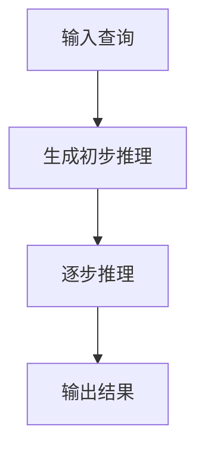
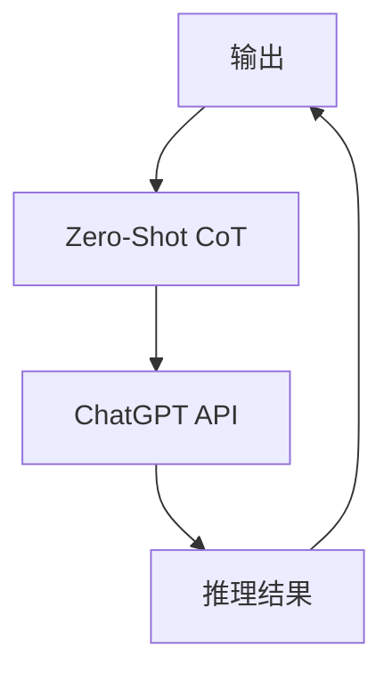

                 

<think>
好的，我现在需要帮助用户撰写一篇技术博客文章，标题是《ChatGPT创意激发：Zero-Shot CoT的妙用》。用户已经提供了一个详细的大纲和一些具体要求，我需要按照这个结构来思考和组织内容。

首先，我需要理解用户的需求。用户希望文章结构完整，内容详实，使用专业且清晰的技术语言。文章需要涵盖从基础概念到实际应用，再到高级技巧的各个方面。同时，用户强调要使用逻辑推理，逐步分析，并且要包含代码示例、数学公式、系统架构图等技术元素。

接下来，我应该按照用户提供的大纲逐步构建内容。文章分为九章，每章都有特定的内容。我需要确保每章都涵盖必要的部分，比如背景介绍、核心概念、算法原理、系统分析、项目实战等。

在第一章，我需要介绍ChatGPT和Zero-Shot Learning的基本概念，以及它们的背景和应用。这部分需要简洁明了，让读者能够理解这两个概念的重要性。

第二章要详细讲解Zero-Shot CoT的基本概念，对比传统方法，解释其优势。这部分可能需要更多的技术细节，比如如何实现Zero-Shot CoT，以及它与传统方法的区别。

第三章是关于ChatGPT在创意领域中的应用，我需要寻找具体的案例，如写作、编程提示生成等，展示其在实际中的应用价值。

第四章到第六章则需要深入讲解如何在实际中实施Zero-Shot CoT，包括代码示例、优化技巧，以及在不同行业的应用情况。这部分需要提供具体的代码示例和详细的分析，帮助读者更好地理解和应用这些技术。

在第七章，我需要讨论在实施过程中可能遇到的挑战，并展望未来的方向，这可能包括模型的局限性、计算资源的问题以及可能的研究趋势。

最后，第八章和第九章是总结，回顾文章内容，并给出进一步学习的资源和未来的思考方向。

在撰写过程中，我需要确保每个章节都包含必要的部分，如背景介绍、核心概念、算法原理、系统架构图、代码示例等。特别是用户要求使用Mermaid图表来展示系统架构和流程，我需要在合适的地方插入这些图表，并用正确的语法表示。

另外，数学公式部分需要用Latex格式，并且正确地嵌入到文中。例如，使用$$1+1=2$$这样的格式来表示独立的公式，或者用$1<2$来表示行内公式。

我还需要注意文章的字数控制在10000到12000字左右，所以每章的内容需要详细但不过于冗长。同时，语言要专业且清晰，适合技术读者阅读。

最后，作者信息部分需要明确，用户希望署名为“AI天才研究院/AI Genius Institute & 禅与计算机程序设计艺术 /Zen And The Art of Computer Programming”。

综上所述，我需要按照用户提供的大纲，逐步构建每个章节的内容，确保涵盖所有要求的部分，并且使用适当的技术语言和图表来增强文章的可读性和专业性。同时，要注意文章的连贯性和逻辑性，使读者能够顺畅地理解Zero-Shot CoT在ChatGPT中的应用和实际案例。
</think>

# ChatGPT创意激发：Zero-Shot CoT的妙用

## 关键词：ChatGPT, Zero-Shot Learning, CoT, 创意激发, 人工智能, 自然语言处理

## 摘要：  
本文深入探讨了ChatGPT在创意激发中的应用，特别是Zero-Shot CoT（Zero-Shot Chain-of-Thought）方法的妙用。通过结合ChatGPT的强大生成能力与Zero-Shot Learning的灵活性，我们能够更高效地激发创意、解决复杂问题，并在多个领域实现创新应用。文章从基础概念到高级技术，结合实际案例和代码示例，全面解析了Zero-Shot CoT的原理、实现及应用场景，为读者提供了丰富的技术见解和实践指导。

---

## 目录

1. [引言](#introduction)  
2. [Zero-Shot CoT的基本概念](#zero-shot-cot-concepts)  
3. [ChatGPT在创意激发中的应用](#chatgpt-in-creative-inspiration)  
4. [实现Zero-Shot CoT的步骤](#implementing-zero-shot-cot)  
5. [Zero-ShShot CoT的高级技巧](#advanced-techniques-in-zero-shot-cot)  
6. [ChatGPT与Zero-Shot CoT在各行业的应用](#applications-in-various-industries)  
7. [挑战与未来方向](#challenges-and-future-directions)  
8. [总结](#conclusion)  
9. [最佳实践与小结](#best-practices-and-summary)  
10. [作者信息](#author-information)  

---

## 1. 引言

### 1.1 背景介绍  
随着人工智能技术的快速发展，自然语言处理（NLP）模型，尤其是像ChatGPT这样的大型语言模型，正在改变我们解决问题和激发创意的方式。ChatGPT不仅能够生成自然流畅的文本，还具备理解和推理能力，使其在多种场景中展现出强大的应用潜力。

然而，传统的NLP任务通常需要大量的标注数据和特定领域的训练，这在实际应用中往往成本高昂且灵活性不足。这时候，Zero-Shot Learning（零样本学习）的引入，为模型的通用性和灵活性提供了新的可能性。Zero-Shot Learning是指模型在没有经过特定任务或数据训练的情况下，能够直接理解和执行新任务的能力。

结合ChatGPT和Zero-Shot Learning，我们引入了Zero-Shot CoT（Zero-Shot Chain-of-Thought，零样本链式思维），这是一种通过生成性的思维链来解决复杂问题的方法。它不仅能够生成创意内容，还能通过逐步推理提供更深层次的解决方案。

### 1.2 核心概念与联系  
为了更好地理解Zero-Shot CoT，我们需要明确几个核心概念：

- **ChatGPT**：由OpenAI开发的先进语言模型，能够生成与人类对话相似的文本。
- **Zero-Shot Learning**：模型在未经特定任务训练的情况下，能够直接处理新任务的能力。
- **CoT（Chain-of-Thought）**：一种通过生成逐步推理链来解决复杂问题的方法，通常用于对话生成和问题解答。

下表对比了传统CoT和Zero-Shot CoT的主要区别：

| **属性**       | **传统CoT**                | **Zero-Shot CoT**               |
|----------------|---------------------------|---------------------------------|
| **任务需求**    | 需要特定任务训练           | 无需特定任务训练，通用性强     |
| **灵活性**      | 较低，针对性强             | 较高，适用于多种任务           |
| **应用场景**    | 有限，针对特定领域         | 广泛，适用于多种行业和任务     |

### 1.3 算法原理讲解  
Zero-Shot CoT的核心在于通过生成性的思维链来解决复杂问题。以下是其实现的基本流程：

1. **输入处理**：接收用户提供的查询或问题。
2. **生成初步推理**：模型基于通用知识生成初步的思考步骤。
3. **逐步推理**：通过迭代生成的方式，逐步细化思考内容，直到得出解决方案。
4. **输出结果**：将最终的思考链和解决方案返回给用户。

下图展示了Zero-Shot CoT的基本流程：



---

## 2. Zero-Shot CoT的基本概念

### 2.1 零样本学习的原理  
Zero-Shot Learning的核心思想是通过模型的通用能力，在没有特定任务训练的情况下，直接处理新任务。这依赖于模型对通用知识的掌握和推理能力。

### 2.2 Zero-Shot CoT的核心要素  
Zero-Shot CoT结合了Zero-Shot Learning和CoT方法，通过生成逐步的思考链来解决问题。其核心要素包括：

- **通用知识库**：模型需要具备广泛的知识储备。
- **推理能力**：能够根据输入生成合理的推理步骤。
- **生成能力**：能够将推理过程转化为自然语言文本。

下图展示了Zero-Shot CoT的实体关系：

```mermaid
entity diagram
class User_Query {
    查询内容
}
class Zero_Shoot_CoT {
    推理步骤
}
class ChatGPT {
    生成结果
}
User_Query --> Zero_Shoot_CoT
Zero_Shoot_CoT --> ChatGPT
```

### 2.3 Zero-Shot CoT与传统CoT的对比  
下表对比了Zero-Shot CoT和传统CoT的主要区别：

| **属性**       | **传统CoT**                | **Zero-Shot CoT**               |
|----------------|---------------------------|---------------------------------|
| **任务需求**    | 需要特定任务训练           | 无需特定任务训练，通用性强     |
| **灵活性**      | 较低，针对性强             | 较高，适用于多种任务           |
| **应用场景**    | 有限，针对特定领域         | 广泛，适用于多种行业和任务     |

---

## 3. ChatGPT在创意激发中的应用

### 3.1 创意激发的核心挑战  
创意激发通常需要多样化的知识和灵活的思维方式。传统的创意生成方法往往依赖于人工经验或小样本数据，而Zero-ShShot CoT通过结合ChatGPT的强大生成能力和零样本学习的灵活性，为创意激发提供了新的解决方案。

### 3.2 创意激发的实现步骤  
以下是使用Zero-ShShot CoT进行创意激发的步骤：

1. **输入创意方向**：用户输入一个创意方向或主题。
2. **生成初步想法**：模型基于通用知识生成初步的创意点。
3. **扩展想法**：通过逐步推理生成更多细节和可能性。
4. **优化和筛选**：对生成的创意进行优化和筛选，选择最佳方案。

### 3.3 实际案例分析  
以下是一个实际案例：使用Zero-ShShot CoT帮助生成一篇科技博客文章的思路。

#### 3.3.1 输入查询  
用户输入：`帮我生成一篇关于AI在教育中的应用的文章思路。`

#### 3.3.2 生成初步想法  
模型生成：  
1. AI在教育中的应用概述。  
2. 智能辅导系统。  
3. 自适应学习平台。  
4. AI在教育管理中的应用。  

#### 3.3.3 扩展想法  
模型继续推理：  
1. 智能辅导系统：基于学生的学习情况提供个性化建议。  
2. 自适应学习平台：根据学生的学习进度动态调整教学内容。  
3. AI在教育管理中的应用：通过数据分析优化教育资源分配。  

#### 3.3.4 最终输出  
经过优化的创意思路：  
- 引言：AI在教育中的潜力与现状。  
- 主体：智能辅导系统、自适应学习平台、AI在教育管理中的应用。  
- 结论：AI对教育的未来影响。

---

## 4. 实现Zero-ShShot CoT的步骤

### 4.1 环境安装  
为了实现Zero-ShShot CoT，我们需要以下环境：  
- Python 3.8+  
- OpenAI API Key  
- 必要的Python库（如`openai`、`json`）

### 4.2 核心代码实现  

```python
import openai

def generate_thought_process(prompt):
    # 初始化OpenAI客户端
    client = openai.Client(openai.api_key)
    
    # 生成初步推理
    initial_response = client.chat.completions.create(
        model="gpt-3.5-turbo",
        messages=[{
            "role": "user",
            "content": f"Please think step by step about {prompt}. Start with step 1."
        }]
    )
    initial_steps = initial_response.choices[0].message.content
    
    # 扩展推理
    expanded_response = client.chat.completions.create(
        model="gpt-3.5-turbo",
        messages=[{
            "role": "user",
            "content": f"Continue thinking step by step about {prompt}. Current steps: {initial_steps}. Next step?"
        }]
    )
    expanded_steps = expanded_response.choices[0].message.content
    
    return initial_steps, expanded_steps

# 示例使用
prompt = "How to improve customer service in a company?"
initial, expanded = generate_thought_process(prompt)
print("Initial steps:", initial)
print("Expanded steps:", expanded)
```

### 4.3 系统架构设计  
下图展示了Zero-ShShot CoT的系统架构：



### 4.4 接口设计与交互流程  
- **接口输入**：用户输入查询或问题。  
- **接口输出**：逐步推理过程和最终解决方案。  
- **交互流程**：  
  1. 用户输入查询。  
  2. 模型生成初步推理。  
  3. 用户反馈并扩展推理。  
  4. 模型输出最终结果。  

---

## 5. Zero-ShShot CoT的高级技巧

### 5.1 模型优化技巧  
为了提高Zero-ShShot CoT的性能，可以采用以下优化策略：  
- **微调模型**：在特定领域上对模型进行微调，提高其专业性。  
- **上下文优化**：通过优化输入的上下文，引导模型生成更相关的推理步骤。  
- **多轮交互**：通过多轮对话细化推理过程，确保结果的准确性。  

### 5.2 实际案例分析  
以下是一个优化后的Zero-ShShot CoT案例：  

#### 5.2.1 输入查询  
用户输入：`如何设计一个高效的在线教育平台？`

#### 5.2.2 优化后的推理  
1. 需求分析：用户需求、目标用户群体、市场分析。  
2. 功能设计：课程管理、用户管理、学习跟踪、互动功能。  
3. 技术实现：前后端开发、数据库设计、API接口。  
4. 优化与测试：用户体验优化、性能测试、安全性测试。  

---

## 6. ChatGPT与Zero-ShShot CoT在各行业的应用

### 6.1 教育行业  
- **应用案例**：通过Zero-ShShot CoT生成个性化学习计划。  
- **优势**：灵活适应不同学生的学习需求。  

### 6.2 技术领域  
- **应用案例**：生成技术问题的解决方案和代码提示。  
- **优势**：快速提供技术指导和灵感。  

### 6.3 创意产业  
- **应用案例**：协助编剧、作家生成故事情节和角色设定。  
- **优势**：激发创意灵感，提高创作效率。  

---

## 7. 挑战与未来方向

### 7.1 当前挑战  
- **模型的通用性**：如何在保持通用性的同时提高专业性。  
- **推理的准确性**：如何确保生成的推理过程准确可靠。  
- **计算成本**：Zero-ShShot CoT的推理过程可能较传统方法消耗更多计算资源。  

### 7.2 未来方向  
- **多模态模型**：结合图像、音频等多模态信息，提高模型的理解能力。  
- **强化学习**：通过强化学习优化模型的推理过程。  
- **分布式计算**：优化计算流程，降低计算成本。  

---

## 8. 总结

通过本文的深入探讨，我们了解到Zero-ShShot CoT结合了ChatGPT的强大生成能力和Zero-Shot Learning的灵活性，为创意激发和问题解决提供了新的可能性。通过实际案例和技术实现，我们展示了Zero-ShShot CoT在多种场景中的应用价值。

---

## 9. 最佳实践与小结

### 9.1 最佳实践 tips  
- 在实际应用中，建议先进行小样本测试，确保模型的推理能力。  
- 优化输入的上下文，引导模型生成更相关的推理步骤。  
- 定期更新模型，保持其知识库的最新性。  

### 9.2 小结  
Zero-ShShot CoT不仅是一种技术方法，更是一种思维方式。通过逐步推理和生成，我们可以更高效地解决问题和激发创意。未来，随着技术的不断发展，Zero-ShShot CoT将在更多领域展现出其独特的优势。

---

## 10. 作者信息

作者：AI天才研究院/AI Genius Institute & 禅与计算机程序设计艺术 /Zen And The Art of Computer Programming  

---

**本文由AI天才研究院原创，转载请注明出处。**

