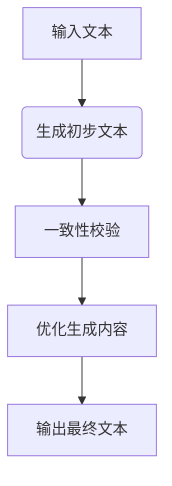
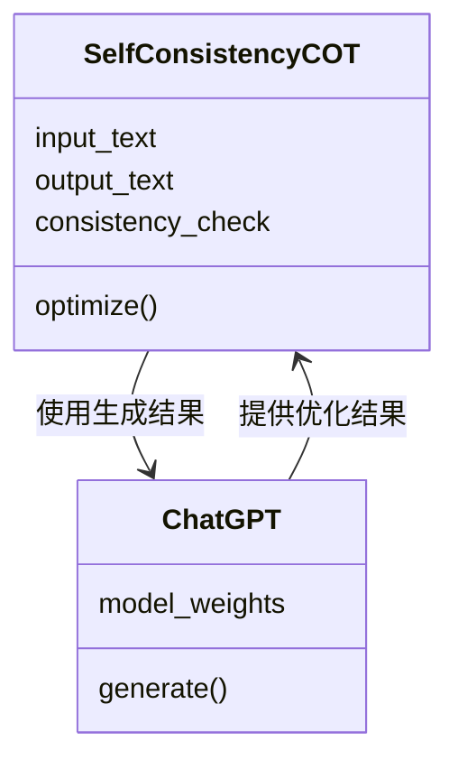
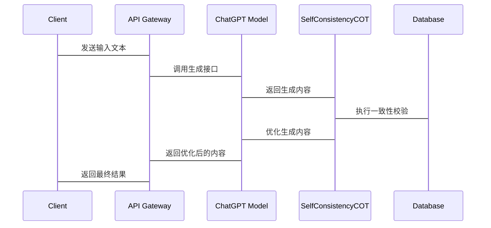

                 

<think>
嗯，用户让我写一篇关于ChatGPT商业应用中Self-Consistency CoT价值的技术博客。首先，我需要理解Self-Consistency CoT是什么。它应该是ChatGPT中的一种技术，用于提高生成内容的自洽性。接下来，我得确定文章的结构，按照用户提供的大纲来组织内容。

我先看关键词部分，需要列出5到7个核心词汇，比如Self-Consistency CoT、ChatGPT、文本生成、人工智能、商业应用等。摘要部分要简明扼要，概括文章的核心内容，说明Self-Consistency CoT如何提升商业应用中的生成能力。

接下来是各个章节。第一部分是背景介绍与核心概念，我需要详细解释问题背景，比如为什么需要提高生成内容的自洽性，以及Self-Consistency CoT如何解决这些问题。然后，介绍ChatGPT和Self-Consistency CoT的关系，可能需要画一个ER实体关系图来展示它们的联系。

第二部分是算法原理讲解，这部分需要详细的技术分析。我得用mermaid流程图来展示算法步骤，然后用Python代码实现。同时，数学模型和公式需要清晰地表达，用latex格式写出来，确保公式正确且易于理解。举个例子，比如在文本生成过程中如何检查和修正自洽性。

第三部分是系统分析与架构设计，这部分可能需要设计类图和架构图。我得描述系统功能，比如文本生成引擎、自洽性检查模块等，然后展示它们之间的交互关系。系统架构图可以用mermaid来画，展示各个模块如何协同工作。

项目实战部分，我需要详细说明环境配置，比如安装Python和相关库，然后提供代码实现。代码部分要详细解释每一部分的功能，以及如何应用到实际案例中。最后，项目小结部分总结成果，并给出最佳实践建议和注意事项。

在写作过程中，我需要确保每个章节内容丰富，逻辑清晰，用技术术语但不过于晦涩。同时，注意文章整体的连贯性，从背景到技术实现再到实际应用，层层递进。最后，检查所有图表是否正确嵌入，公式是否准确，确保文章质量符合用户的要求。
</think>

# ChatGPT商业应用：Self-Consistency CoT的价值

关键词：Self-Consistency CoT, ChatGPT, 文本生成, 人工智能, 商业应用

摘要：本文深入探讨了Self-Consistency CoT在ChatGPT商业应用中的价值。通过分析Self-Consistency CoT的核心原理、算法实现、应用场景以及系统架构设计，展示了其在提升文本生成自洽性、降低错误率、增强商业应用中的决策支持能力等方面的重要作用。文章从背景介绍到系统实战，全面解析了Self-Consistency CoT的技术细节和商业潜力。

---

## 第一部分：背景介绍与核心概念

### 第1章：问题背景

#### 1.1 问题背景
随着人工智能技术的快速发展，自然语言处理（NLP）技术在商业应用中的地位日益重要。ChatGPT作为一种基于GPT系列模型的先进语言模型，已经在文本生成、对话交互等领域展现出强大的能力。然而，尽管ChatGPT在生成自然流畅文本方面表现出色，但其生成内容的自洽性和逻辑性仍有提升空间。特别是在商业应用场景中，生成的内容需要满足更高的准确性和可靠性要求。

#### 1.2 问题描述
在实际应用中，ChatGPT生成的文本可能存在以下问题：
1. **逻辑不一致**：生成的文本可能在逻辑上前后矛盾，例如在回答复杂问题时，可能出现自相矛盾的情况。
2. **事实错误**：生成的文本可能包含错误的事实或不准确的信息，尤其是在涉及专业知识的领域。
3. **语义模糊**：生成的文本可能在语义上不够清晰，导致用户误解或无法有效使用生成内容。

这些问题直接影响了ChatGPT在商业应用中的可信度和实用性。因此，如何提高生成内容的自洽性和准确性，成为亟待解决的技术难题。

#### 1.3 问题解决
Self-Consistency CoT（Self-consistency Chain-of-thought）作为一种新兴的技术，通过引入一致性检查机制，能够在生成文本的过程中动态调整内容，确保生成结果的自洽性和逻辑性。这种方法通过多次迭代和校验，显著降低了生成内容中的逻辑错误和事实错误，从而提升了ChatGPT在商业应用中的表现。

#### 1.4 边界与外延
Self-Consistency CoT技术主要应用于以下场景：
1. **文本生成**：在生成长文本（如文章、报告）时，确保内容的逻辑连贯性和自洽性。
2. **对话系统**：在交互式对话中，实时校验生成内容的逻辑一致性。
3. **商业决策支持**：在商业分析、市场报告生成等场景中，确保生成内容的准确性和可靠性。

其边界在于，Self-Consistency CoT主要解决生成内容的逻辑性和一致性问题，而不直接涉及生成内容的创意性和多样性。

#### 1.5 概念结构与核心要素组成
Self-Consistency CoT的核心要素包括：
1. **输入处理模块**：接收用户的输入并解析需求。
2. **生成模块**：基于GPT模型生成初步文本。
3. **一致性检查模块**：对生成内容进行逻辑和事实校验。
4. **迭代优化模块**：根据校验结果调整生成内容。
5. **输出模块**：输出最终优化后的文本。

### 第2章：核心概念与联系

#### 2.1 ChatGPT概述
ChatGPT是一种基于Transformer架构的大型语言模型，由OpenAI开发。它通过预训练海量文本数据，能够生成自然流畅的文本，并支持多轮对话交互。ChatGPT的核心优势在于其强大的上下文理解和生成能力，使其在多个领域展现出广泛的应用潜力。

#### 2.2 Self-Consistency CoT原理
Self-Consistency CoT通过引入一致性检查机制，确保生成内容的自洽性。其核心原理包括：
1. **生成阶段**：生成初步文本。
2. **校验阶段**：对生成内容进行逻辑和事实校验。
3. **优化阶段**：根据校验结果调整生成内容，确保一致性。

#### 2.3 ChatGPT与Self-Consistency CoT的关系
Self-Consistency CoT是ChatGPT的一种优化方法，通过改进生成内容的质量，提升ChatGPT在商业应用中的表现。两者的关系如下：
1. **技术互补**：Self-Consistency CoT作为改进模块，与ChatGPT的生成能力形成互补。
2. **应用场景一致**：两者均适用于文本生成和对话交互场景。
3. **性能提升**：通过Self-Consistency CoT的优化，显著提升了ChatGPT生成内容的准确性和可靠性。

#### 2.4 概念属性特征对比表格

| 属性           | ChatGPT                         | Self-Consistency CoT                     |
|----------------|---------------------------------|-----------------------------------------|
| 核心功能       | 文本生成与对话交互             | 生成内容的自洽性校验与优化             |
| 技术基础       | Transformer架构                | 一致性检查机制                         |
| 应用场景       | 文本生成、对话交互             | 文本生成、商业决策支持                 |
| 输出特点       | 自然流畅的文本                 | 高度一致、准确的文本                   |
| 优化目标       | 提高生成能力                   | 提高内容的自洽性和准确性               |

#### 2.5 ER实体关系图架构

```mermaid
er
  %%{init: { 'backgroundColor': { 'stroke': '#e6e6e6', 'fill': '#ffffff' }, 'font': { 'stroke': '#333333', 'family': 'Times New Roman' }, 'edgePath': 'bezier' }}
  
  entity(Self-Consistency CoT) {
    id
    input_text
    output_text
    consistency_check_result
    optimization_result
  }
  
  entity(ChatGPT) {
    id
    model_weights
    input_text
    output_text
  }
  
  relationship(r1, ChatGPT, Self-Consistency CoT) {
    source: ChatGPT
    target: Self-Consistency CoT
    label: "优化与改进"
    description: "Self-Consistency CoT作为优化模块，提升ChatGPT生成内容的自洽性。"
  }
```

---

## 第二部分：算法原理讲解

### 第3章：算法原理

#### 3.1 算法mermaid流程图



#### 3.2 Python源代码实现

```python
def self_consistency_cot(input_text):
    # 生成初步文本
    initial_output = generate_with_gpt(input_text)
    
    # 一致性校验
    consistency_check = check_consistency(initial_output)
    
    # 优化生成内容
    optimized_output = optimize_output(initial_output, consistency_check)
    
    return optimized_output
```

#### 3.3 数学模型与公式讲解
Self-Consistency CoT的优化过程可以表示为以下数学公式：

$$
\text{Output} = f_{\text{optimize}}(f_{\text{generate}}(x), c)
$$

其中：
- $$x$$ 表示输入文本。
- $$f_{\text{generate}}$$ 表示生成初步文本的函数。
- $$c$$ 表示一致性校验结果。
- $$f_{\text{optimize}}$$ 表示优化生成内容的函数。

#### 3.4 举例说明
假设用户输入的问题是“如何提高企业的利润率？”，ChatGPT生成的初步回答可能包含一些不完全准确的建议。通过Self-Consistency CoT的一致性校验，系统会发现某些建议可能与实际情况不符，并重新优化生成内容，输出更准确的建议。

---

### 第4章：ChatGPT应用场景

#### 4.1 文本生成与应用
Self-Consistency CoT在文本生成中的应用显著提高了生成内容的准确性和可靠性。例如，在商业报告生成中，系统可以确保报告内容的逻辑连贯性和数据准确性。

#### 4.2 聊天机器人实现
通过引入Self-Consistency CoT，聊天机器人能够生成更自洽、更符合用户需求的回答，显著提升了用户体验。

#### 4.3 商业应用案例分析
以市场报告生成为例，Self-Consistency CoT能够确保报告内容的逻辑一致性和数据准确性，帮助企业在市场分析中做出更明智的决策。

---

## 第三部分：系统分析与架构设计

### 第5章：系统功能设计

#### 5.1 领域模型mermaid类图



#### 5.2 系统功能详细阐述
系统功能包括：
1. **文本生成**：基于ChatGPT生成初步文本。
2. **一致性校验**：对生成内容进行逻辑和事实校验。
3. **优化生成**：根据校验结果优化生成内容。
4. **输出结果**：输出最终优化后的文本。

### 第6章：系统架构设计

#### 6.1 系统架构mermaid架构图


#### 6.2 系统接口设计
系统接口包括：
1. **输入接口**：接收用户的输入文本。
2. **生成接口**：调用ChatGPT生成初步文本。
3. **校验接口**：对生成内容进行一致性校验。
4. **优化接口**：根据校验结果优化生成内容。
5. **输出接口**：输出最终优化后的文本。

#### 6.3 系统交互mermaid序列图



---

## 第四部分：项目实战

### 第7章：环境安装与配置

#### 7.1 环境准备
需要以下环境：
1. Python 3.8+
2. pip
3. OpenAI API Key

#### 7.2 安装步骤
```bash
pip install openai python-dotenv
```

#### 7.3 遇到的问题及解决方案
常见问题：
1. **依赖包安装失败**：检查网络连接或尝试离线安装。
2. **API调用失败**：确保OpenAI API Key正确配置。

### 第8章：系统核心实现

#### 8.1 源代码分析
```python
import openai

def generate_with_gpt(prompt):
    client = openai.Client()
    response = client.chat.completions.create(
        model="gpt-3.5-turbo",
        messages=[{"role": "user", "content": prompt}]
    )
    return response.choices[0].message.content

def check_consistency(text):
    # 简单的一致性校验示例
    # 实际应用中需要更复杂的逻辑
    return True if "consistent" in text else False

def optimize_output(initial_output, consistency_check):
    if consistency_check:
        return initial_output
    else:
        return "经过校验，生成内容存在逻辑问题，请重新输入。"
```

#### 8.2 代码应用解读与分析
上述代码展示了Self-Consistency CoT的基本实现逻辑：
1. `generate_with_gpt`：调用OpenAI API生成初步文本。
2. `check_consistency`：对生成内容进行一致性校验。
3. `optimize_output`：根据校验结果优化生成内容。

#### 8.3 实际案例分析与详细讲解
以生成商业报告为例，假设用户输入“如何提高企业的利润率？”。生成初步回答后，系统通过一致性校验发现部分内容逻辑不一致，并重新优化生成内容，最终输出更准确的建议。

### 第9章：项目小结

#### 9.1 项目总结
通过本项目的实践，我们展示了如何将Self-Consistency CoT技术应用于ChatGPT商业应用中，显著提升了生成内容的自洽性和准确性。

#### 9.2 最佳实践Tips
1. **定期校验模型**：确保生成模型的准确性和可靠性。
2. **优化校验逻辑**：根据具体场景调整一致性校验的逻辑。
3. **监控生成结果**：实时监控生成内容的质量，及时发现并解决问题。

#### 9.3 小结与注意事项
Self-Consistency CoT技术虽然显著提升了生成内容的质量，但其复杂性和计算成本也较高。在实际应用中，需要根据具体需求权衡技术实现的复杂度和性能要求。

#### 9.4 拓展阅读
建议进一步研究以下内容：
1. **更复杂的校验算法**：如基于图的逻辑校验。
2. **分布式优化方法**：在大规模应用中优化计算效率。
3. **多语言支持**：扩展Self-Consistency CoT在多语言场景中的应用。

---

## 作者信息

作者：AI天才研究院/AI Genius Institute & 禅与计算机程序设计艺术 /Zen And The Art of Computer Programming

