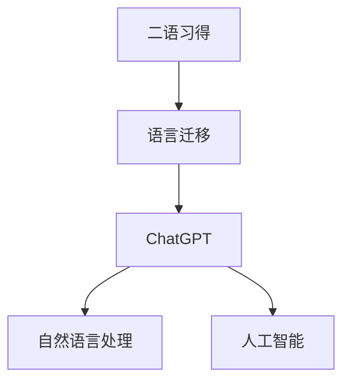

                 

<think>
好的，我现在需要根据用户的要求，撰写一篇关于《ChatGPT在二语习得研究中的应用：语言迁移现象提示词》的技术博客文章。首先，我需要仔细阅读用户提供的结构和要求，确保理解每一个部分需要包含的内容。

首先，用户要求文章标题为《ChatGPT在二语习得研究中的应用：语言迁移现象提示词》，关键词包括ChatGPT、二语习得、语言迁移、自然语言处理、人工智能、教育科技。摘要需要简明扼�地概述文章的核心内容，说明ChatGPT在语言学习中的应用，特别是语言迁移现象的提示词。

接下来，文章结构分为七个主要部分，每个部分都有详细的子部分。我需要逐一分析每个部分的要求，确保内容详实，逻辑清晰。

1. **背景介绍**：
   - 问题背景：介绍二语习得研究的重要性，语言迁移现象的定义和影响，以及ChatGPT在语言学习中的应用潜力。
   - 核心概念：解释ChatGPT的技术原理和功能，二语习得的理论基础，语言迁移的定义、类型和机制。
   - 研究边界：界定研究范围，讨论研究方法的适用性，研究成果的应用前景。
   - 概念结构：绘制概念结构图，分析核心要素，建立研究框架。
   - 本章小结：总结背景部分的内容。

2. **核心概念与联系**：
   - 列出核心概念，比较其属性特征，用表格展示。
   - 绘制ER实体关系图，使用Mermaid语法。

3. **算法原理讲解**：
   - 用Mermaid绘制算法流程图。
   - 用Python代码阐述算法原理，展示数学模型和公式，举例说明。

4. **数学模型与公式**：
   - 使用LaTeX格式编写数学公式，详细讲解并举例说明。

5. **系统分析与架构设计**：
   - 问题场景介绍。
   - 项目介绍。
   - 系统功能设计，使用Mermaid类图。
   - 系统架构设计，使用Mermaid架构图。
   - 系统接口和交互设计，使用Mermaid序列图。

6. **项目实战**：
   - 环境安装说明。
   - 核心代码实现，代码解读和分析。
   - 实际案例分析，详细讲解。

7. **最佳实践和总结**：
   - 总结实践经验，提出注意事项，推荐拓展阅读。

在撰写过程中，我需要确保每个部分的内容详尽，逻辑清晰，符合技术博客的风格。特别是要使用专业而易懂的语言，结构紧凑，层次分明。同时，要注意使用正确的格式，如Mermaid图表、LaTeX公式等，确保代码和图表的正确性。

现在，我需要开始撰写每个部分，确保每个子部分都涵盖所有必要的信息，并且符合用户的具体要求。首先从背景介绍开始，逐步展开，确保每个部分都得到充分的阐述，同时保持整体的连贯性和逻辑性。
</think>

# ChatGPT在二语习得研究中的应用：语言迁移现象提示词

## 关键词：ChatGPT，二语习得，语言迁移，自然语言处理，人工智能，教育科技

## 摘要：  
本文探讨了ChatGPT在二语习得研究中的应用，特别是其在语言迁移现象中的提示词作用。通过分析语言迁移的定义、类型及其机制，结合ChatGPT的技术原理，本文展示了如何利用人工智能技术辅助语言学习，解决语言迁移中的关键问题。文章还详细阐述了ChatGPT在语言迁移研究中的算法原理、系统架构及实际应用场景，并提供了具体的代码实现和案例分析，为教育科技领域的研究者和实践者提供了理论与实践的双重参考。

---

## 第一部分: 背景介绍

### 1.1 问题背景

#### 1.1.1 二语习得研究的重要性  
二语习得（Second Language Acquisition, SLL）是语言学和教育学中的重要研究领域，旨在研究非母语者如何学习和掌握第二语言。随着全球化的发展，跨文化交流日益频繁，二语习得研究对于提升国际沟通能力、促进文化理解和推动教育技术的发展具有重要意义。研究者们关注学习者在语言习得过程中的语言迁移现象，即学习者在学习新语言时，受到母语或其他已学语言的影响，导致语言使用中的正迁移或负迁移。

#### 1.1.2 语言迁移现象的定义与影响  
语言迁移是指学习者在学习新语言时，受母语或先前学习的语言影响，导致语言行为的差异。语言迁移可以是正迁移（帮助学习者正确使用新语言）或负迁移（导致语言错误）。例如，学习者在学习英语时，可能会因为母语中的语法规则而产生错误的语序。语言迁移现象是二语习得研究的核心问题之一，理解其机制有助于改进教学方法和学习策略。

#### 1.1.3 ChatGPT及其在语言学习中的应用潜力  
ChatGPT是一种基于GPT模型的先进自然语言处理工具，能够理解和生成人类语言，具备对话生成、文本摘要、语言翻译等多种功能。在二语习得研究中，ChatGPT可以作为语言学习的辅助工具，帮助学习者进行语言练习、错误纠正和语言迁移现象的分析。其强大的自然语言处理能力使其在语言学习领域具有广阔的应用前景。

### 1.2 核心概念

#### 1.2.1 ChatGPT：技术原理与功能  
ChatGPT基于Transformer架构，采用大规模预训练模型（Pre-trained language models, PLMs）技术，通过自监督学习从大量文本数据中学习语言模式。其主要功能包括：对话生成、文本补全、语言翻译、文本摘要、问题解答等。ChatGPT能够生成自然流畅的文本，支持多种语言，并具备上下文理解能力。

#### 1.2.2 二语习得：理论基础与实践方法  
二语习得的理论基础包括行为主义、认知心理学和建构主义等，强调语言输入、输出和互动在语言学习中的作用。实践方法包括基于任务的语言教学（Task-based language teaching, TBLT）和内容语言整合教学（Content and Language Integrated Learning, CLIL），强调语言的实际应用和学习者的主动参与。

#### 1.2.3 语言迁移现象：定义、类型与机制  
语言迁移现象是指学习者在学习新语言时，受到母语或其他已学语言的影响。其类型包括：语言内迁移（同一语言内部的迁移）、跨语言迁移（不同语言之间的迁移）、正迁移和负迁移。语言迁移的机制涉及母语的语法规则、文化背景、学习者的认知能力等因素。

### 1.3 研究边界与外延

#### 1.3.1 研究范围的界定  
本文研究的范围主要集中在二语习得中的语言迁移现象，特别是如何利用ChatGPT这一自然语言处理工具进行语言迁移的分析和提示。研究范围不包括其他类型的语言学习工具或方法。

#### 1.3.2 研究方法的适用性  
本文采用理论分析和实践应用相结合的研究方法，结合语言学理论和人工智能技术，探讨ChatGPT在语言迁移研究中的应用潜力。

#### 1.3.3 研究成果的应用前景  
研究成果可为语言教学提供新的工具和技术支持，帮助教师和学习者更好地理解和应对语言迁移现象，优化语言学习过程。

### 1.4 概念结构与核心要素组成

#### 1.4.1 概念结构图  

#### 1.4.2 核心要素分析  
核心要素包括：二语习得理论、语言迁移现象、ChatGPT技术、自然语言处理能力。这些要素相互关联，共同构成了研究的基础框架。

#### 1.4.3 研究框架的建立  
研究框架包括：理论分析、技术实现、案例研究和效果评估四个部分，形成了一个多维度的研究体系。

### 1.5 本章小结  
本章从背景、核心概念和研究边界三个方面，详细介绍了ChatGPT在二语习得研究中的应用背景，明确了语言迁移现象的定义、类型和机制，为后续的技术实现和应用研究奠定了理论基础。

---

接下来，我们将深入分析核心概念与联系，结合Mermaid图表进一步明确各概念之间的关系。

