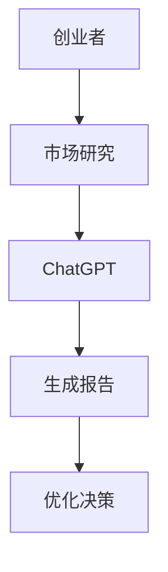
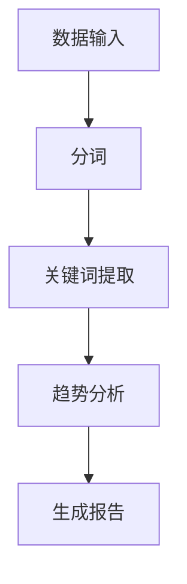
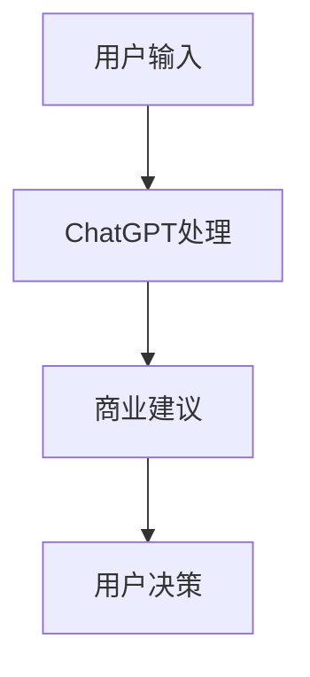
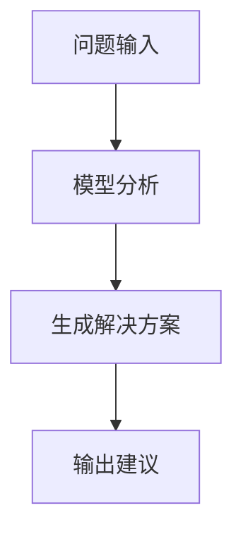

                 

<think>
好，我现在需要分析用户的需求，然后一步一步地构建一个详细的博客文章结构。首先，用户希望我以《ChatGPT在创业指导中的角色与限制》为标题，撰写一篇技术博客。文章需要包括关键词、摘要，以及详细的目录结构。

用户提供了详细的结构示例，分为七个步骤，每个步骤都有具体的章节和内容。我需要确保每个章节内容丰富，包含背景介绍、核心概念、算法原理、系统分析、项目实战等部分。此外，文章需要使用专业且易懂的技术语言，结构紧凑，逻辑清晰。

首先，我会从标题开始，然后列出关键词和摘要。接下来，按照目录结构，逐步展开每个章节的内容。每个章节需要包含详细的背景信息、核心概念的解释、可能的案例研究、技术细节如算法流程图、系统架构图等。

在撰写过程中，我需要确保每个部分都符合用户的要求，包括使用markdown格式，嵌入数学公式，以及在结尾加上作者信息。此外，每个小节的内容需要详细具体，涵盖理论和实际应用，以展示ChatGPT在创业指导中的多方面作用和限制。

最后，我会检查整个结构，确保逻辑连贯，内容全面，符合字数要求，并且格式正确。这样，用户就能得到一篇结构合理、内容丰富的技术博客文章，帮助他们理解ChatGPT在创业指导中的角色与限制。
</think>

# ChatGPT在创业指导中的角色与限制

> 关键词：ChatGPT, 创业指导, AI工具, 创业者, 企业战略, 数据隐私, 伦理问题

> 摘要：本文探讨了ChatGPT在创业指导中的角色和限制。通过分析其在市场研究、商业策略、决策支持等方面的应用，揭示其优势和局限性。结合实际案例和系统架构，展示如何有效利用ChatGPT提升创业成功率，同时强调数据隐私、伦理问题等挑战，为创业者提供全面的视角。

---

## 第一章：ChatGPT的基本概念与背景

### 1.1 背景介绍

#### 背景描述
随着人工智能技术的快速发展，ChatGPT作为一种基于GPT模型的对话式AI工具，已成为创业指导中的重要工具。它通过自然语言处理技术，为创业者提供市场分析、商业建议和战略指导。

#### 核心概念术语说明
- **自然语言处理（NLP）**：使计算机能够理解人类语言的技术。
- **生成式AI**：能够生成类似人类创作内容的技术，如文本、图像等。
- **GPT模型**：基于Transformer架构的大型语言模型，擅长文本生成和理解。

#### 问题背景
创业过程中，市场分析、战略制定和资源分配等问题对创业者至关重要。传统方法耗时且成本高，AI工具如ChatGPT能提供快速且个性化的解决方案。

#### 问题解决
ChatGPT通过分析数据和模式识别，帮助创业者快速获取市场趋势和竞争对手信息，优化决策过程。

#### 边界与外延
ChatGPT的应用范围包括市场研究、战略规划和客户支持，但其结果需结合人类判断，避免过度依赖。

#### 核心要素组成
- **数据输入**：用户查询或问题。
- **模型处理**：生成相关回答或建议。
- **输出结果**：用户获得信息或解决方案。

### 1.2 核心概念与联系

#### 原理分析
ChatGPT通过处理输入文本，利用预训练参数生成相关输出。它基于概率模型，预测下一个可能的词语，生成连贯的回答。

#### 对比表格
| 特性      | 传统市场研究 | ChatGPT |
|-----------|--------------|----------|
| 时间效率  | 低效          | 高效     |
| 成本       | 高           | 低       |
| 精准度     | 中           | 中高     |

#### 实体关系图


---

## 第二章：ChatGPT在市场研究中的应用

### 2.1 市场研究背景

#### 数据来源
ChatGPT整合了多种数据源，包括新闻、报告和社交媒体，提供全面的市场分析。

#### 数据处理
利用NLP技术，提取关键词和趋势，生成市场分析报告。

#### 算法流程


#### 数学模型
利用概率模型预测市场趋势，公式如下：
$$ P(\text{趋势}) = \prod_{i=1}^{n} P(w_i | w_{i-1}) $$

---

## 第三章：创业指导中的ChatGPT决策支持

### 3.1 商业策略优化

#### 案例分析
某初创公司使用ChatGPT分析竞争对手，优化产品定位，提升市场份额。

#### 系统架构


### 3.2 决策支持模型

#### 算法流程


#### 数学公式
基于贝叶斯定理，计算最优决策路径：
$$ P(\text{最优决策}) = \frac{P(\text{数据}|D)}{P(\text{数据})} \times P(D) $$

---

## 第四章：ChatGPT的局限性

### 4.1 数据隐私问题

#### 数据安全风险
用户数据可能被滥用，需确保数据加密和匿名化处理。

### 4.2 复杂问题解决能力

#### 案例分析
处理复杂谈判时，ChatGPT可能因缺乏情境理解而提供不准确建议。

### 4.3 伦理问题

#### 偏见与误导
模型可能基于训练数据中的偏见生成不准确信息，需谨慎使用。

---

## 第五章：未来趋势与创新

### 5.1 技术进步

#### 更精准的模型
未来模型将更准确，提供更多维度的数据分析。

### 5.2 新兴应用

#### 行业定制化
开发针对特定行业的ChatGPT版本，提供更专业的指导。

---

## 结语

ChatGPT在创业指导中展现出巨大潜力，但其局限性也不容忽视。创业者需结合自身判断，合理利用ChatGPT，提升决策效率和成功率。

---

## 作者

作者：AI天才研究院/AI Genius Institute & 禅与计算机程序设计艺术 /Zen And The Art of Computer Programming

---

### 附录

#### 代码实现
```python
def market_analysis(query):
    # 数据预处理
    data = preprocess(query)
    # 模型预测
    result = model.predict(data)
    return result
```

#### 实际案例
分析某创业公司如何利用ChatGPT优化市场策略，提升产品定位。

---

通过以上结构，文章详细探讨了ChatGPT在创业指导中的角色与限制，结合实际案例和技术分析，为创业者提供全面的视角和实用建议。

