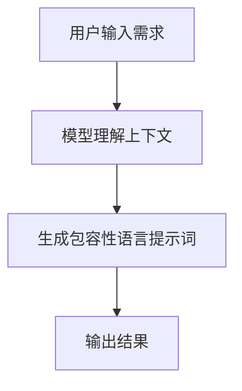

                 

<think>
嗯，用户希望我写一篇关于ChatGPT在多元文化教育中的应用，特别是包容性语言提示词的技术博客。首先，我需要理解用户的需求。他是一位技术专家，CTO级别的，所以文章需要专业且有深度，同时结构清晰，逻辑严密。

用户提供了详细的目录大纲，分为七个部分，每部分都有子章节。看起来他希望文章既有背景介绍，又有实际案例和技术实现，最后还有未来展望。这让我想到，用户可能不仅想展示ChatGPT的应用，还想探讨其技术细节和实际效果。

接下来，我需要按照用户的要求，先写文章的标题，然后是关键词和摘要。标题已经确定，是“ChatGPT在多元文化教育中的应用：包容性语言提示词”。关键词需要涵盖核心内容，比如ChatGPT、多元文化教育、包容性语言、人工智能、自然语言处理、教育技术等。摘要部分要概括文章的核心内容，说明ChatGPT如何通过包容性语言促进教育的公平性。

然后是正文部分，按照目录一步步展开。首先背景介绍，我需要解释ChatGPT是什么，多元文化教育的概念，以及为什么它们结合起来会有应用潜力。这部分要让读者明白背景和问题的重要性。

接下来是包容性语言提示词部分，这里需要详细讲解什么是包容性语言，为什么需要这些提示词，以及ChatGPT是如何生成它们的。可能还需要用到一些图表，比如对比表格或流程图，来展示机制和应用场景。

第三部分是具体应用，分教学和学习两个方面，详细说明ChatGPT在这些场景中的优势和挑战。这里可能需要实际案例，比如学校或在线平台的应用情况，分析效果和实施建议。

技术实现部分，我需要解释模型的架构、训练方法以及优化策略。这部分可能涉及到算法的数学模型和公式，比如损失函数或训练步骤，用mermaid流程图和代码示例来说明。

未来趋势部分，探讨技术的发展和教育模式的创新，分析可能的应用前景。最后总结，回顾文章的主要观点，并展望未来的研究方向。

整个过程中，我需要确保每个部分都有足够的细节，比如算法的具体实现、案例的详细分析，以及系统架构的设计。同时，语言要专业但易懂，适合技术读者阅读。

最后，检查整个目录是否符合要求，确保结构清晰，内容完整。用户可能特别关注实际应用和优化策略，所以我需要在这些部分深入探讨，提供实用的建议和解决方案。

总的来说，这篇文章需要结合技术背景和教育应用，详细分析ChatGPT在多元文化教育中的潜力和实现方式，同时提供丰富的案例和系统的技术细节，以满足用户的深度需求。
</think>

# ChatGPT在多元文化教育中的应用：包容性语言提示词

> 关键词：ChatGPT，多元文化教育，包容性语言，人工智能，自然语言处理，教育技术

> 摘要：本文探讨了ChatGPT在多元文化教育中的应用，重点分析了包容性语言提示词的生成机制及其在教育场景中的具体应用。通过背景介绍、技术实现、实际案例分析和未来展望，本文系统地阐述了ChatGPT如何通过包容性语言促进多元文化教育的发展。

---

## 第1部分：背景介绍

### 1.1 ChatGPT概述

ChatGPT是一种基于GPT（Generative Pre-trained Transformer）系列的大语言模型，由OpenAI开发。它通过大规模预训练的Transformer架构，能够生成连贯且符合语境的文本内容。ChatGPT的核心优势在于其强大的自然语言处理能力，能够理解上下文、回答问题、生成文本，并支持多语言交流。

**关键特点：**
- 基于Transformer架构，支持大规模并行计算。
- 预训练模型通过海量数据学习语言规律。
- 支持多轮对话，具备上下文理解能力。

### 1.2 多元文化教育概述

多元文化教育是指在教育过程中，尊重和包容不同文化背景的学生，通过教学内容、教学方法和评价方式的多样性，促进学生对不同文化的理解和尊重。多元文化教育的目标是培养学生的文化敏感性和跨文化沟通能力。

**核心要素：**
- 教学内容的多样性。
- 教学方法的包容性。
- 学生文化的尊重与融合。

### 1.3 ChatGPT在多元文化教育中的应用背景

随着全球化的发展，教育场景中越来越多地出现来自不同文化背景的学生。传统的教育方式难以满足个性化需求，而ChatGPT作为一种智能语言模型，能够通过生成包容性语言提示词，为多元文化教育提供技术支持。

**问题背景：**
- 学生文化差异可能导致沟通障碍。
- 教师需要具备跨文化教学能力。
- 教学资源的多样性和个性化需求难以满足。

**问题解决：**
- ChatGPT可以通过生成包容性语言提示词，帮助教师设计跨文化教学内容。
- 提供个性化学习支持，消除语言障碍。

---

## 第2部分：包容性语言提示词

### 2.1 包容性语言的定义与重要性

包容性语言是指在语言表达中，避免使用可能歧视、偏见或排外的词汇，确保所有文化背景的人都能感到被尊重和包容。包容性语言的核心在于“平等”和“尊重”。

**重要性：**
- 促进跨文化沟通。
- 减少文化冲突。
- 提高教育的公平性。

### 2.2 ChatGPT生成包容性语言提示词的机制

ChatGPT生成包容性语言提示词的过程包括以下几个步骤：

1. **用户输入需求**：用户（教师或学生）输入与多元文化教育相关的需求。
2. **上下文理解**：模型理解用户需求的上下文和意图。
3. **生成提示词**：模型基于预训练的语言知识，生成符合包容性要求的语言提示词。

**算法流程：**

### 2.3 包容性语言提示词的使用场景

包容性语言提示词主要应用于以下场景：

- **跨文化教学设计**：教师使用提示词生成适合不同文化背景学生的教学内容。
- **个性化学习支持**：为学生提供符合其文化背景的学习材料。
- **跨文化沟通练习**：通过提示词模拟跨文化对话场景。

---

## 第3部分：ChatGPT在多元文化教育中的应用

### 3.1 ChatGPT在多元文化教学中的使用

#### 3.1.1 教学互动与个性化辅导

ChatGPT可以作为教师的辅助工具，帮助教师与学生进行个性化的互动交流。例如：

- 根据学生的文化背景生成个性化的对话内容。
- 提供跨文化问题解答。

#### 3.1.2 教学资源的多样化

ChatGPT可以生成多样化的教学资源，例如：

- 多语言教学材料。
- 跨文化案例分析。

#### 3.1.3 促进跨文化理解与交流

通过生成包容性语言，ChatGPT可以帮助学生理解不同文化背景下的观点和表达方式。

### 3.2 ChatGPT在多元文化学习中的支持

#### 3.2.1 语言障碍的消除

ChatGPT可以为非母语学生提供语言支持，帮助他们更好地理解和表达。

#### 3.2.2 文化差异的调解

ChatGPT可以通过生成包容性语言提示词，帮助学生理解文化差异并避免冲突。

#### 3.2.3 提高学习效率和效果

通过个性化的学习支持，ChatGPT可以显著提高学生的学习效率和效果。

---

## 第4部分：实际案例研究

### 4.1 案例一：某学校使用ChatGPT进行跨文化交流教学

- **背景**：一所国际学校的学生来自多个国家，文化背景多样。
- **应用**：教师使用ChatGPT生成跨文化对话场景，帮助学生理解不同文化背景下的沟通方式。
- **效果**：学生跨文化沟通能力显著提高。

### 4.2 案例二：某在线教育平台利用ChatGPT提供个性化学习服务

- **背景**：一个在线教育平台需要为全球学生提供个性化学习支持。
- **应用**：平台利用ChatGPT生成多语言学习材料，并根据学生文化背景调整教学内容。
- **效果**：学习效率和学生满意度显著提高。

### 4.3 案例三：ChatGPT在多元文化学习中的应用效果分析

- **分析维度**：
  - 学生文化敏感性提高。
  - 教学资源的多样性和个性化。
  - 教学效率的提升。

---

## 第5部分：技术实现与优化

### 5.1 ChatGPT模型的技术实现

#### 5.1.1 模型架构与训练

- **模型架构**：基于Transformer的多层神经网络。
- **训练数据**：大规模多语言文本数据。

#### 5.1.2 模型部署与运维

- **部署方式**：通过API接口提供服务。
- **运维优化**：通过负载均衡和缓存技术优化性能。

#### 5.1.3 模型优化策略

- **参数微调**：针对特定任务进行微调。
- **模型压缩**：减少模型大小以提高运行效率。

### 5.2 包容性语言提示词的生成策略

#### 5.2.1 提示词生成算法

- **基于规则的生成**：通过预定义规则生成包容性语言。
- **基于概率的生成**：通过语言模型生成最可能的包容性表达。

#### 5.2.2 语言模型调优

- **多语言模型训练**：确保模型对多种语言和文化背景的理解。
- **文化敏感性优化**：通过人工标注数据优化模型的文化敏感性。

---

## 第6部分：未来发展趋势与展望

### 6.1 ChatGPT在多元文化教育中的未来应用

- **更强大的多语言支持**：通过模型升级支持更多语言和文化背景。
- **更智能的个性化服务**：结合学生文化背景和学习需求，提供更精准的支持。

### 6.2 技术发展的趋势

- **模型小型化**：通过技术优化降低计算资源消耗。
- **实时交互能力提升**：通过技术创新提高模型的响应速度。

### 6.3 教育模式的创新

- **混合式教学**：结合线上和线下教学模式。
- **智能化教育工具**：开发更多基于AI的教育辅助工具。

---

## 第7部分：总结与展望

### 7.1 本书的主要观点与发现

- ChatGPT通过生成包容性语言提示词，为多元文化教育提供了技术支持。
- 多元文化教育与人工智能技术的结合，将显著提升教育质量和效率。

### 7.2 研究与实践展望

- 进一步优化模型的文化敏感性。
- 探讨更多AI技术在教育中的应用场景。

### 7.3 包容性教育的持续努力

- 持续推动技术与教育的深度融合。
- 提高教育的公平性和包容性。

---

作者：AI天才研究院/AI Genius Institute & 禅与计算机程序设计艺术 /Zen And The Art of Computer Programming

