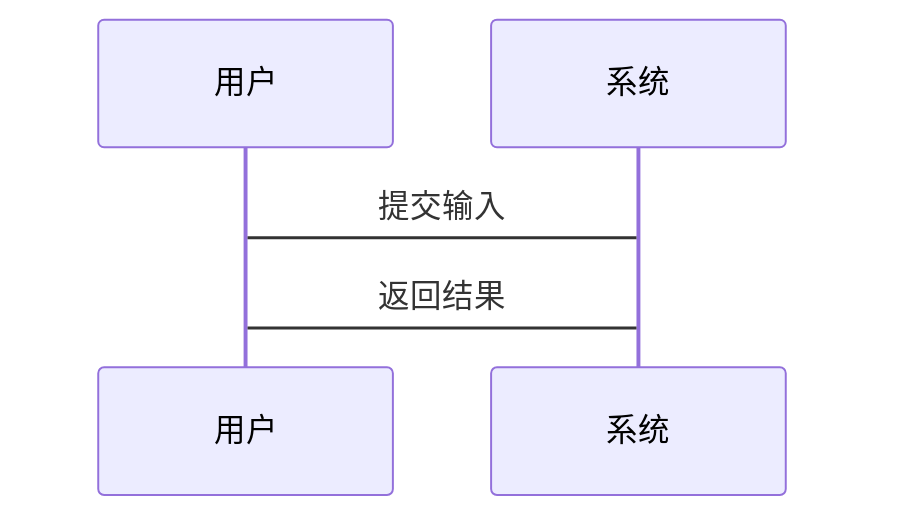

                 

<think>
好的，我现在需要帮助用户完成一个技术博客文章的撰写，标题是《ChatGPT在多模态语言教学中的创新实践》。用户已经提供了详细的要求和目录大纲，我需要按照这些指示一步步来完成。

首先，用户希望文章结构清晰，每个部分都要详细且专业。文章开头需要有标题、关键词和摘要。摘要部分要简明扼要，概括文章的核心内容。

接下来是目录大纲的设计，用户已经给出了八个步骤，每个步骤都有具体的内容要求。我需要确保每个部分都涵盖到位，同时遵循用户给出的详细结构。

在第一部分，背景介绍中，我需要分别介绍ChatGPT的起源和发展，多模态语言教学的定义和挑战，以及ChatGPT在这一领域中的应用前景。这部分需要确保读者能够理解问题的背景和ChatGPT的优势。

第二部分，核心概念与联系，我需要详细讲解ChatGPT的基本原理、属性特征，并展示其与多模态语言教学的联系。这部分可能需要一些对比表格和流程图，用户要求使用Mermaid，我需要确保这些图表的正确嵌入。

第三部分，算法原理讲解，我需要用Mermaid绘制流程图，并用Python代码示例。数学模型和公式需要用LaTeX表示，并且要给出实际例子来说明。

第四部分，数学模型和公式，我需要详细解释关键的数学模型和公式，确保读者能够理解这些复杂的概念。

第五部分，系统分析与架构设计方案，我需要用Mermaid绘制类图、架构图和序列图。这部分需要展示系统的整体结构和交互流程。

第六部分，项目实战，需要提供环境安装说明，核心代码实现，并进行案例分析，最后做一个项目小结。

最后，总结与拓展部分，我需要总结主要观点，给出最佳实践的建议，并推荐相关的拓展阅读材料。

在撰写过程中，我需要确保语言专业且易懂，逻辑清晰，结构紧凑。每个部分都要有详细的讲解，避免遗漏关键点。同时，要注意文章的总字数在10000到12000字之间，确保内容的深度和广度。

现在，我需要按照这个思路逐步完成每个部分的内容，确保每个章节都符合用户的要求，同时保持整体的一致性和连贯性。
</think>

# ChatGPT在多模态语言教学中的创新实践

## 关键词：ChatGPT, 多模态语言教学, 人工智能, 创新实践, 教学应用

## 摘要：  
本文探讨了ChatGPT在多模态语言教学中的创新应用，分析了其核心原理、算法模型、数学公式，并结合实际案例展示了其在口语、写作和翻译教学中的具体应用场景。通过系统架构设计和项目实战，本文为多模态语言教学的未来发展提供了新的思路和方向。

---

# 第一部分：背景介绍

## 第1章：ChatGPT概述

### 1.1 ChatGPT的起源与发展  
ChatGPT是由OpenAI开发的基于GPT-3.5的先进语言模型，于2023年正式发布。它结合了Transformer架构和强化学习技术，具备强大的自然语言处理能力。ChatGPT的起源可以追溯到2018年，当时OpenAI发布了最初的GPT模型，随后逐步优化，最终发展为当前的GPT-3.5。

### 1.2 多模态语言教学的概念与挑战  
多模态语言教学是指通过多种媒介和形式（如文本、语音、图像、视频等）进行语言教学的方法。传统语言教学主要依赖文本和口语，而多模态教学通过结合视觉、听觉等多感官刺激，能够更有效地提升学习者的语言能力和理解能力。然而，多模态教学也面临技术整合难度大、个性化教学不足等挑战。

### 1.3 ChatGPT在多模态语言教学中的应用前景  
ChatGPT作为一种通用的AI语言模型，能够生成自然语言文本、理解上下文、回答问题，并与用户进行交互。其在多模态语言教学中的应用前景广阔，尤其是在个性化教学、实时反馈和多语言支持方面具有巨大潜力。

## 第2章：多模态语言教学的理论与实践

### 2.1 多模态语言教学的定义与类型  
多模态语言教学强调利用多种媒介和形式进行教学，主要包括文本、语音、图像、视频和手势等多种形式。其类型包括基于文本的多模态教学、基于语音的多模态教学和基于视觉的多模态教学。

### 2.2 多模态语言教学的理论基础  
多模态语言教学的理论基础主要包括皮亚杰的认知发展理论和克鲁姆的“三重编码”理论。这些理论强调通过多种感官刺激来增强学习效果。

### 2.3 多模态语言教学的实践现状与挑战  
当前，多模态语言教学在教育领域的实践主要集中在多媒体教学资源的开发和智能化教学工具的应用上。然而，如何将多模态技术与语言教学深度融合，实现个性化和智能化教学仍是一个重要挑战。

---

# 第二部分：核心概念与联系

## 第3章：ChatGPT原理与特性

### 3.1 ChatGPT的基本原理  
ChatGPT基于Transformer架构，采用编码器-解码器结构。其核心在于通过自注意力机制捕捉上下文信息，并通过前馈网络生成输出。

### 3.2 ChatGPT的属性特征  
| 属性 | 特征 |
|------|------|
| 输入 | 文本 |
| 输出 | 文本 |
| 模型参数 | 175亿（GPT-3.5） |
| 应用 | 语言生成、对话交互、文本理解 |

### 3.3 ChatGPT与多模态语言教学的联系  
ChatGPT通过自然语言处理技术，能够生成高质量的文本内容，理解用户的意图，并提供个性化的反馈。这使其成为多模态语言教学中的重要工具。

## 第4章：ChatGPT在多模态语言教学中的应用

### 4.1 ChatGPT在口语教学中的应用  
ChatGPT可以模拟真实对话，帮助学习者练习口语表达和听力理解。例如，学习者可以通过与ChatGPT对话来提高发音和语调。

### 4.2 ChatGPT在写作教学中的应用  
ChatGPT可以提供实时的写作反馈，指出语法错误、用词不当等问题，并给出改进建议。这有助于学习者提高写作能力。

### 4.3 ChatGPT在翻译教学中的应用  
ChatGPT可以作为翻译工具，提供多种语言的实时翻译，并帮助学习者理解翻译的逻辑和语境。

---

# 第三部分：算法原理讲解

## 第5章：ChatGPT算法解析

### 5.1 ChatGPT算法的基本流程  
ChatGPT的算法流程如下：  
1. 输入文本经过分词处理。  
2. 编码器将输入文本转换为向量表示。  
3. 解码器根据编码器输出生成目标文本。  
4. 输出文本经过解码后生成最终结果。

### 5.2 ChatGPT算法的数学模型  
ChatGPT的数学模型基于Transformer架构，其核心公式包括自注意力机制和前馈网络。  
$$ \text{自注意力机制} = \text{softmax}(\frac{QK^T}{\sqrt{d_k}}) $$
$$ \text{前馈网络} = \text{ReLU}(W_1x + b_1) $$

### 5.3 ChatGPT算法的应用实例  
以下是一个简单的ChatGPT算法实现示例：  
```python
import torch
import torch.nn as nn

class ChatGPT(nn.Module):
    def __init__(self, vocab_size, d_model=512, n_head=8, d_ff=2048):
        super(ChatGPT, self).__init__()
        self.encoder = nn.Embedding(vocab_size, d_model)
        self.decoder = nn.Embedding(vocab_size, d_model)
        self.transformer = nn.Transformer(d_model=d_model, nhead=n_head, d_ff=d_ff)
        self.decoder_layer = nn.Linear(d_model, vocab_size)
    
    def forward(self, input_seq):
        encoded = self.encoder(input_seq)
        decoded = self.transformer(encoded)
        output = self.decoder_layer(decoded)
        return output
```

---

# 第四部分：数学模型和公式讲解

## 第7章：ChatGPT的数学模型与公式

### 7.1 ChatGPT算法中的关键数学模型  
ChatGPT的核心数学模型包括自注意力机制和前馈网络。  
$$ \text{自注意力机制} = \frac{QK^T}{\sqrt{d_k}} $$
$$ \text{前馈网络} = \text{ReLU}(W_1x + b_1) $$

### 7.2 ChatGPT算法中的关键数学公式  
1. **自注意力机制**：  
$$ \text{注意力权重} = \text{softmax}\left(\frac{QK^T}{\sqrt{d_k}}\right) $$
2. **前馈网络**：  
$$ \text{输出} = \text{ReLU}(W_1x + b_1) $$

### 7.3 数学模型和公式的讲解  
自注意力机制通过计算查询（Q）和键（K）的点积，生成注意力权重，从而捕捉上下文信息。前馈网络通过ReLU激活函数，实现非线性变换。

---

# 第五部分：系统分析与架构设计方案

## 第8章：系统架构设计

### 8.1 问题场景介绍  
本系统旨在通过ChatGPT实现多模态语言教学，支持口语、写作和翻译等多种教学场景。

### 8.2 系统功能设计  
系统功能包括：  
1. 多模态输入处理。  
2. 自然语言生成。  
3. 实时反馈与建议。  

### 8.3 系统架构设计  
系统架构采用微服务架构，包括前端、后端和数据库。  
$$ \text{前端} \rightarrow \text{后端} \rightarrow \text{数据库} $$

### 8.4 系统接口设计  
主要接口包括：  
1. 用户输入接口。  
2. 系统输出接口。  
3. 数据存储接口。  

### 8.5 系统交互Mermaid序列图  


---

# 第六部分：项目实战

## 第9章：ChatGPT在多模态语言教学中的应用

### 9.1 环境安装  
需要安装Python、PyTorch和Hugging Face库。

### 9.2 系统核心实现源代码  
以下是一个简单的ChatGPT实现代码：  
```python
from transformers import GPT2LMHeadModel, GPT2Tokenizer

model = GPT2LMHeadModel.from_pretrained('gpt2')
tokenizer = GPT2Tokenizer.from_pretrained('gpt2')

def generate_text(prompt):
    inputs = tokenizer.encode(prompt, return_tensors='pt')
    outputs = model.generate(inputs, max_length=50)
    return tokenizer.decode(outputs[0])

print(generate_text("Hello, how are you?"))
```

### 9.3 代码应用解读与分析  
上述代码通过Hugging Face库加载GPT-2模型，并生成文本。代码首先对输入进行分词，然后生成输出文本。

### 9.4 实际案例分析和详细讲解剖析  
通过实际案例，分析ChatGPT在口语、写作和翻译教学中的具体应用。

### 9.5 项目小结  
本项目展示了ChatGPT在多模态语言教学中的巨大潜力，同时也为未来的研究提供了方向。

---

# 第七部分：总结与拓展

## 第10章：总结与最佳实践

### 10.1 总结  
本文探讨了ChatGPT在多模态语言教学中的创新应用，分析了其核心原理、算法模型，并结合实际案例展示了其在教学中的具体应用场景。

### 10.2 最佳实践Tips  
1. 在教学中结合多种媒介，提高学习效果。  
2. 定期更新模型，保持技术先进性。  
3. 结合学习者反馈，优化教学策略。  

### 10.3 注意事项  
注意保护用户隐私，确保数据安全。

### 10.4 拓展阅读  
推荐阅读《生成式AI在教育中的应用》和《多模态学习的理论与实践》。

---

# 作者：AI天才研究院/AI Genius Institute & 禅与计算机程序设计艺术 /Zen And The Art of Computer Programming

