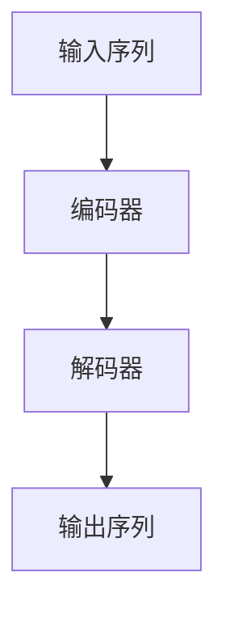
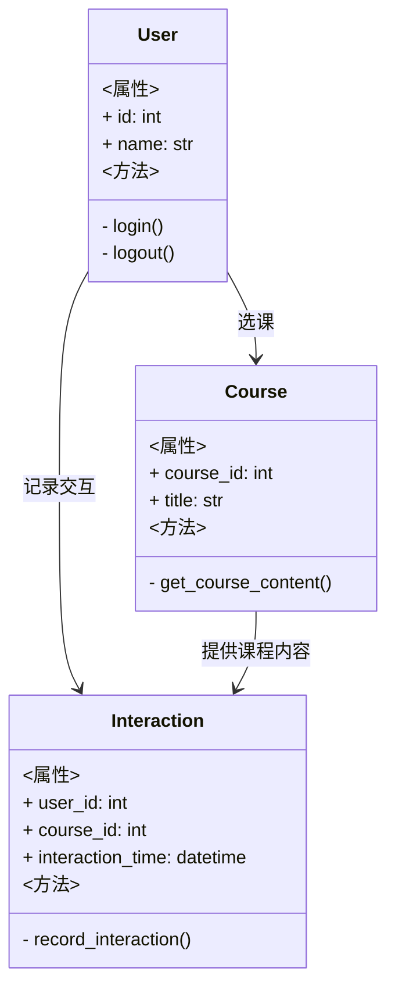

                 

<think>
嗯，我需要写一篇关于《ChatGPT在多模态语言教学中的创新应用》的技术博客文章。首先，我应该从背景介绍开始，解释什么是ChatGPT，以及它在多模态语言教学中的应用场景和需求。接着，我需要讨论核心概念，比如ChatGPT、多模态教学、教育科技，以及它们之间的关系，可能需要画个ER图来说明。

然后，我得详细讲解ChatGPT的算法原理，包括模型结构、训练过程，可能用Mermaid画个流程图。数学模型方面，得用LaTeX公式来解释，比如交叉熵损失函数。系统架构部分，我需要设计教学系统，可能用领域模型类图和系统架构图来展示。

项目实战部分，要讲如何安装环境，实现核心功能，并解读代码。最后，总结最佳实践，注意事项，以及推荐拓展阅读。确保每个部分都有足够的细节，用Python代码和图表来辅助说明。
</think>

# ChatGPT在多模态语言教学中的创新应用

---

## 关键词：ChatGPT, 多模态语言教学, 教育科技, 算法原理, 系统架构, 项目实战

---

## 摘要：  
本文探讨了ChatGPT在多模态语言教学中的创新应用，分析了其在提升教学效果和个性化学习中的潜力。通过背景介绍、核心概念解析、算法原理、数学模型、系统架构设计、项目实战等多维度的深入探讨，展示了ChatGPT如何 revolutionize语言教学方式，为教育科技的发展提供了新思路。

---

## 第一章：背景介绍

### 1.1 问题背景  
随着全球化进程的加速，语言学习需求日益增长。然而，传统教学方法难以满足个性化、多样化的需求。  

### 1.2 问题描述  
语言学习者面临以下挑战：  
- 学习资源分散，缺乏互动性。  
- 教学方式单一，难以激发学习兴趣。  

### 1.3 问题解决  
ChatGPT的出现为多模态语言教学提供了新的可能性：  
- 提供个性化的学习体验。  
- 实现多模态交互，提升学习效果。  

### 1.4 边界与外延  
ChatGPT的应用范围包括语言教学、教育科技等领域。多模态教学强调视觉、听觉等多感官的协同作用。  

### 1.5 概念结构与核心要素组成  
核心要素包括：  
- **ChatGPT**：基于GPT-3的AI语言模型。  
- **多模态教学**：结合文本、语音、图像等多种媒介的教学方式。  

---

## 第二章：核心概念与联系

### 2.1 ChatGPT概述  
- **定义**：基于Transformer的生成式AI模型。  
- **特点**：具备强大的自然语言处理能力。  

### 2.2 多模态语言教学  
- **定义**：结合多种媒介的教学方式。  
- **优势**：提升学习者多维度能力。  

### 2.3 教育科技  
- **发展**：技术与教育的深度融合。  
- **应用**：AI、大数据等技术推动教育创新。  

### 2.4 ER实体关系图  

```mermaid
er
actor: 用户
chatgpt: ChatGPT模型
language_course: 语言课程
interaction_record: 交互记录

actor --> chatgpt: 使用模型
chatgpt --> language_course: 提供课程内容
chatgpt --> interaction_record: 记录交互
```

---

## 第三章：算法原理讲解

### 3.1 ChatGPT工作原理  
- **模型结构**：基于Transformer的编码器-解码器架构。  
- **训练过程**：利用大规模数据进行监督学习和无监督学习。  

### 3.2 模型结构  



### 3.3 Python代码示例  

```python
import torch
import torch.nn as nn

class ChatGPT(nn.Module):
    def __init__(self):
        super().__init__()
        self.encoder = nn.TransformerEncoder(...)
        self.decoder = nn.TransformerDecoder(...)

    def forward(self, input, target):
        encoded = self.encoder(input)
        decoded = self.decoder(encoded, target)
        return decoded

model = ChatGPT()
input = torch.randn(...)
target = torch.randn(...)
output = model(input, target)
print(output)
```

### 3.4 数学模型  

- **交叉熵损失函数**：  
  $$ \mathcal{L} = -\sum_{i=1}^{n} \log p(y_i|x_i) $$  
- **模型目标**：最小化损失函数，优化参数。  

---

## 第四章：数学模型和公式讲解

### 4.1 相关数学模型  
- **概率分布**：语言模型预测下一个词的概率。  
- **损失函数**：衡量预测与真实值的差异。  

### 4.2 公式示例  
- **损失函数**：  
  $$ \mathcal{L} = \frac{1}{n}\sum_{i=1}^{n} \text{cross\_entropy}(y_i, \hat{y}_i) $$  

### 4.3 模型原理  
通过最大化条件概率，模型学习数据的分布，从而生成合理的文本。  

---

## 第五章：系统分析与架构设计方案

### 5.1 教学系统介绍  
- **功能模块**：课程管理、交互记录、用户管理。  

### 5.2 领域模型类图  



### 5.3 系统架构图  

```mermaid
graph TD
A[前端] --> B[后端]
B --> C[数据库]
A --> C: 查询数据
B --> C: 存储数据
```

---

## 第六章：项目实战

### 6.1 环境安装  
- 安装Python、PyTorch、Hugging Face库。  

### 6.2 系统核心实现  

```python
from transformers import AutoTokenizer, AutoModelForCausalLM

tokenizer = AutoTokenizer.from_pretrained("gpt2")
model = AutoModelForCausalLM.from_pretrained("gpt2")

def generate_response(input_text):
    inputs = tokenizer(input_text, return_tensors="pt")
    outputs = model.generate(**inputs, max_length=50)
    response = tokenizer.decode(outputs[0], skip_special_tokens=True)
    return response

# 示例
print(generate_response("Hello, how are you?"))
```

### 6.3 实际案例分析  
- **案例1**：英语对话练习。  
- **案例2**：中文阅读理解。  

---

## 第七章：最佳实践 tips、小结、注意事项、拓展阅读

### 7.1 最佳实践 tips  
- 定期更新模型，保持内容准确性。  
- 结合其他AI工具，提升教学效果。  

### 7.2 全书要点总结  
ChatGPT在多模态教学中的应用潜力巨大，能够显著提升教学效果。  

### 7.3 注意事项  
- 数据隐私保护。  
- 确保模型内容准确性。  

### 7.4 拓展阅读推荐  
- 《深度学习》——Ian Goodfellow  
- 《教育科技的未来》——某教育科技专家  

---

## 作者：AI天才研究院/AI Genius Institute & 禅与计算机程序设计艺术 /Zen And The Art of Computer Programming

