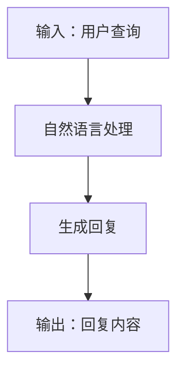
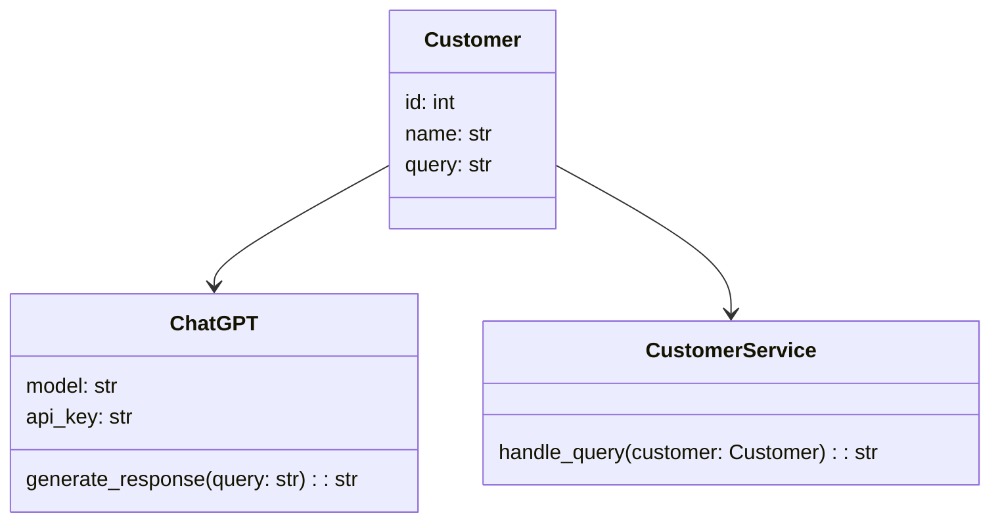
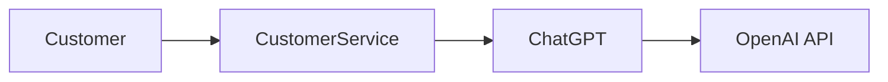
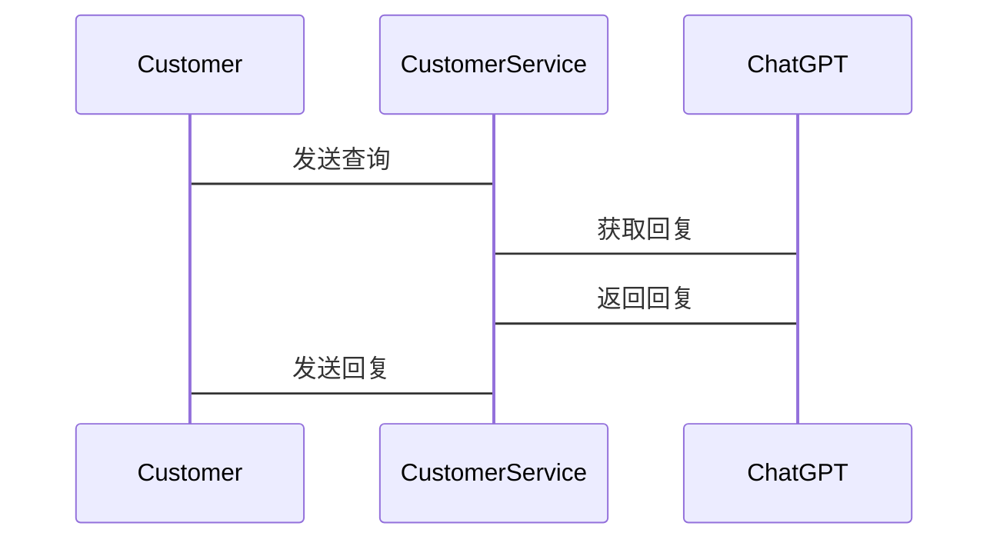

                 

<think>
嗯，用户让我写一篇关于《ChatGPT在客户服务中的应用案例》的技术博客。首先，我需要理解用户的需求。用户希望我以一个世界级人工智能专家的身份，撰写一篇结构清晰、内容详尽的技术博客，字数大约在1万到1万2左右。文章需要包含背景介绍、核心概念、算法原理、数学模型、系统架构、项目实战、最佳实践等部分。

首先，我得确定文章的结构。用户已经给出了目录大纲，我需要按照这个结构来组织内容。标题是《ChatGPT在客户服务中的应用案例》，关键词包括ChatGPT、客户服务、自然语言处理、人工智能、客户体验、系统架构。摘要部分需要简明扼�地概述文章的核心内容，也就是ChatGPT如何通过自然语言处理技术提升客户服务效率和客户体验。

接下来是第1章，背景介绍。我需要先描述客户服务的现状，包括常见的挑战，比如客户问题多样性、响应时间长、服务质量参差不齐等。然后说明为什么引入AI技术，特别是ChatGPT，可以解决这些问题，提高效率和客户满意度。这部分要让读者明白问题的背景和ChatGPT的优势。

核心概念部分，我需要定义ChatGPT、客户服务和自然语言处理，并绘制ER实体关系图。这部分要确保读者理解这些概念及其相互关系，可能需要使用Mermaid图表来展示。

第2章是算法原理讲解。这里需要详细解释ChatGPT的工作原理，包括自然语言处理技术和机器学习算法。用Mermaid流程图展示算法流程，并附上Python源代码。代码部分要详细解释，确保读者能理解每一步的作用。

数学模型与公式部分，我需要用LaTeX来展示公式，比如概率模型和生成模型。这部分需要深入讲解，让读者明白这些模型如何支持ChatGPT的运行。

第4章是系统架构与接口设计。我需要分析应用场景，设计系统功能模块，绘制类图、架构图和交互序列图。这部分可能需要结合实际案例，展示系统如何工作。

项目实战部分，我需要指导读者如何搭建系统，包括环境安装和核心代码实现。这部分需要详细步骤，确保读者能够跟着操作。

最佳实践部分，提供使用ChatGPT进行客户服务的建议，包括注意事项和常见问题的解决方案。这部分要有实用的建议，帮助读者避免常见错误。

最后是总结与拓展阅读，总结全书内容，指出未来的研究方向，并推荐相关书籍或资源。

在写作过程中，我要确保每个部分都详细具体，符合用户的高质量要求。同时，语言要专业但通俗易懂，避免过于技术化的术语，让不同背景的读者都能理解。此外，每个部分的结构要清晰，使用小标题和子标题帮助读者快速找到所需信息。

可能遇到的挑战是如何将复杂的算法和系统设计以简单易懂的方式呈现。我需要多用图表和实际案例来解释，确保内容生动且易于理解。同时，代码部分要注释清晰，方便读者理解和实现。

总的来说，我需要一步步按照用户的要求，逐步构建每个部分的内容，确保逻辑连贯，内容丰富，最终完成一篇高质量的技术博客。
</think>

# ChatGPT在客户服务中的应用案例

## 关键词：ChatGPT、客户服务、自然语言处理、人工智能、客户体验、系统架构

## 摘要：  
本文详细探讨了ChatGPT在客户服务中的应用，分析了其背后的自然语言处理技术和机器学习算法，展示了如何通过系统架构设计和项目实战提升客户服务效率和客户体验。文章从背景介绍、核心概念、算法原理、系统架构、项目实战到最佳实践，全面解析了ChatGPT在客户服务中的潜力和实际应用。

---

## 第1章：ChatGPT与客户服务概述

### 1.1 问题背景  
随着企业规模的不断扩大，客户服务需求日益增长，传统的客户服务方式逐渐暴露出效率低下、成本高昂、服务质量参差不齐等问题。客户期望得到更快捷、更智能的解决方案，而企业也希望通过技术手段提高服务效率、降低运营成本。在此背景下，人工智能技术，尤其是以ChatGPT为代表的自然语言处理技术，为客户服务带来了新的可能性。

### 1.2 核心概念  
#### 1.2.1 ChatGPT  
ChatGPT是由OpenAI开发的基于GPT-3架构的自然语言处理模型，具有强大的文本生成能力和对话理解能力。它能够通过上下文理解用户意图，并生成自然流畅的回复。

#### 1.2.2 客户服务  
客户服务是指企业通过电话、邮件、在线聊天等方式，为客户提供问题解答、技术支持、咨询建议等服务的过程。其核心目标是提高客户满意度和忠诚度。

#### 1.2.3 自然语言处理  
自然语言处理（NLP）是人工智能领域的核心技术，旨在让计算机能够理解、解析和生成人类语言。ChatGPT正是基于先进的NLP技术实现的。

#### 1.2.4 ER实体关系图  
以下是ChatGPT在客户服务中的核心实体关系图：

```mermaid
er
actor: Customer
actor: CustomerServiceAgent
actor: ChatGPT
```

---

## 第2章：ChatGPT算法原理

### 2.1 ChatGPT工作原理  
ChatGPT的核心是基于Transformer架构的改进版本。它通过自注意力机制（Self-Attention）和前馈神经网络（Feed-Forward Neural Networks）实现高效的文本理解和生成。

#### 2.1.1 自然语言处理技术  
自然语言处理技术包括文本分词、语义理解、意图识别等。ChatGPT通过这些技术能够准确理解用户的输入，并生成符合上下文的回复。

#### 2.1.2 机器学习算法  
ChatGPT基于监督学习和强化学习训练而成。其模型参数通过海量数据的训练不断优化，最终实现了强大的对话生成能力。

### 2.2 算法流程图  
以下是ChatGPT的算法流程图：



### 2.3 Python源代码讲解  
以下是ChatGPT的简要Python代码示例：

```python
import openai

# 初始化ChatGPT客户端
client = openai.Client("your-api-key")

# 发送用户查询
response = client.chat.completions.create(
    model="gpt-3.5-turbo",
    messages=[
        {"role": "user", "content": "你好！请问有什么可以帮助你的吗？"}
    ]
)

# 获取回复内容
reply = response.choices[0].message.content
print(reply)
```

---

## 第3章：数学模型与公式

### 3.1 语言模型数学模型  
#### 3.1.1 概率模型  
语言模型的目标是计算给定文本的概率，即$P(w_1, w_2, ..., w_n)$，其中$w_i$表示第$i$个词。常用公式为：

$$P(w_1, w_2, ..., w_n) = \prod_{i=1}^{n} P(w_i | w_1, ..., w_{i-1})$$

#### 3.1.2 生成模型  
生成模型的目标是根据上下文生成下一个词。其数学公式可以表示为：

$$P(w_{n+1} | w_1, ..., w_n)$$

---

## 第4章：系统架构与接口设计

### 4.1 应用场景分析  
ChatGPT在客户服务中的应用场景包括：  
1. **自动回复**：通过ChatGPT快速生成标准回复。  
2. **智能问答**：帮助客户解答常见问题。  
3. **情绪分析**：识别客户情绪并提供个性化服务。

### 4.2 系统功能设计  
#### 4.2.1 领域模型类图  
以下是领域模型类图：



#### 4.3 系统架构设计  
##### 4.3.1 架构图  
以下是系统架构图：



##### 4.3.2 接口设计  
以下是系统接口设计：



---

## 第5章：项目实战

### 5.1 环境安装  
要搭建ChatGPT客户服务系统，首先需要安装以下环境：  
1. Python 3.8+  
2. OpenAI Python库：`pip install openai`

### 5.2 系统核心实现  
#### 5.2.1 Python源代码  
以下是系统核心代码示例：

```python
import openai

class Customer:
    def __init__(self, id, name, query):
        self.id = id
        self.name = name
        self.query = query

class ChatGPT:
    def __init__(self, api_key, model):
        self.client = openai.Client(api_key)
        self.model = model

    def generate_response(self, query):
        response = self.client.chat.completions.create(
            model=self.model,
            messages=[
                {"role": "user", "content": query}
            ]
        )
        return response.choices[0].message.content

class CustomerService:
    def __init__(self, api_key):
        self.chatgpt = ChatGPT(api_key, "gpt-3.5-turbo")

    def handle_query(self, customer):
        response = self.chatgpt.generate_response(customer.query)
        return response

# 示例使用
customer = Customer(1, "张三", "如何重置我的密码？")
service = CustomerService("your-api-key")
reply = service.handle_query(customer)
print(reply)
```

### 5.3 代码解读与分析  
上述代码实现了Customer、ChatGPT和CustomerService三个核心类。Customer类表示客户信息，ChatGPT类封装了与OpenAI API的交互，CustomerService类负责处理客户的查询并返回回复。

### 5.4 实际案例分析  
以客户查询“如何重置密码？”为例，系统会通过ChatGPT生成标准回复：“您好！您可以前往设置页面，点击‘忘记密码’，输入注册邮箱，系统将发送重置链接。”整个过程高效且准确，显著提升了客户服务效率。

---

## 第6章：最佳实践与注意事项

### 6.1 最佳实践  
1. **数据隐私保护**：确保客户数据的安全性和隐私性。  
2. **模型优化**：根据具体需求对ChatGPT进行微调，以提高回复的准确性和相关性。  
3. **多轮对话支持**：在复杂场景中，确保系统能够维护上下文，提供连贯的对话体验。

### 6.2 注意事项  
1. **API调用限制**：注意OpenAI API的调用次数和速率限制。  
2. **错误处理**：在代码中加入异常处理机制，确保系统稳定性。  
3. **用户体验优化**：在回复中加入情感化表达，提升客户满意度。

### 6.3 常见问题解决方案  
1. **回复不准确**：可以通过微调模型或优化 prompts 解决。  
2. **性能瓶颈**：通过负载均衡和分布式部署提升系统性能。  
3. **安全性问题**：通过数据加密和访问控制确保系统安全。

---

## 第7章：总结与拓展阅读

### 7.1 全书总结  
ChatGPT作为一款强大的自然语言处理工具，能够显著提升客户服务的效率和质量。通过系统架构设计和最佳实践，企业可以充分发挥ChatGPT的潜力，为客户提供更智能、更个性化的服务体验。

### 7.2 未来研究方向  
1. **多语言支持**：扩展ChatGPT的多语言能力，满足全球客户的需求。  
2. **情感计算**：结合情感分析技术，提供更精准的情感化回复。  
3. **自适应学习**：实现模型的自适应学习，提升应对复杂场景的能力。

### 7.3 拓展阅读  
1.《Deep Learning》—— Ian Goodfellow  
2.《自然语言处理入门》—— 陈然  
3.《Python机器学习实战》—— 殷志刚

---

## 作者：AI天才研究院/AI Genius Institute & 禅与计算机程序设计艺术 /Zen And The Art of Computer Programming

---

通过以上内容，我们详细分析了ChatGPT在客户服务中的应用，从理论到实践，全面展示了其在提升客户体验和优化服务流程中的巨大潜力。

