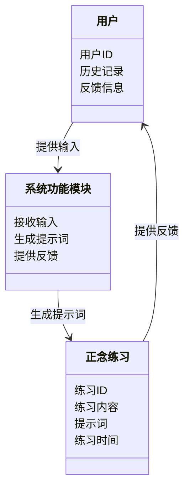
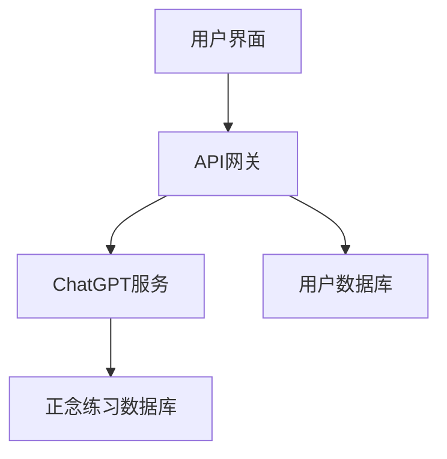
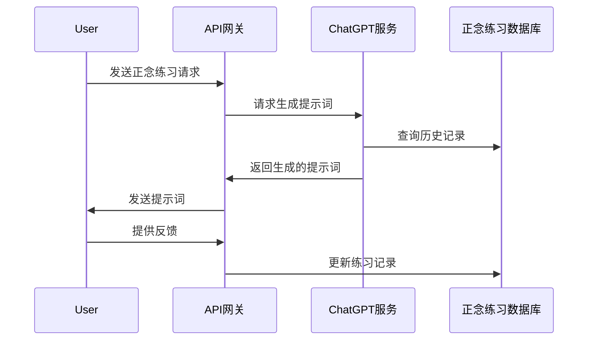

                 

<think>
嗯，我现在需要帮助用户撰写一篇技术博客文章，标题是《ChatGPT在心理健康自助中的应用：正念练习引导提示词》。用户已经提供了一个详细的大纲，并且已经开始撰写部分内容，但可能需要进一步扩展和完善。

首先，我应该理解用户的需求。他们希望文章结构清晰，逻辑严密，用专业但易懂的语言，重点分析ChatGPT如何应用于正念练习，特别是通过提示词来引导用户进行心理健康自助。用户已经完成了前两章，现在需要继续写第三章“系统分析与架构设计方案”。

在这一章中，用户需要涵盖问题场景介绍、项目介绍、系统功能设计、架构设计、接口设计和交互设计。我需要确保每个部分都详细且具体。

1. **问题场景介绍**：这部分需要描述用户在心理健康自助中的常见问题，如焦虑、压力等，并说明如何通过正念练习来缓解这些问题。此外，还需要指出现有解决方案的不足，比如缺乏个性化指导或持续支持，从而引出ChatGPT的优势。

2. **项目介绍**：简单介绍项目的目标和核心功能，强调使用ChatGPT生成个性化提示词来指导正念练习。

3. **系统功能设计**：使用Mermaid类图展示系统的组成部分，如用户管理、正念练习模块、反馈系统等。需要详细描述每个模块的功能及其相互关系。

4. **系统架构设计**：通过Mermaid架构图展示系统的整体架构，包括用户界面、API网关、ChatGPT服务和数据库。需要解释每个部分的作用和它们之间的交互。

5. **系统接口设计和交互设计**：使用Mermaid序列图展示用户与系统之间的交互流程，比如用户发送请求，系统生成回复，记录反馈等。

接下来，我需要确保每个部分都有足够的细节，并且使用正确的Mermaid语法。可能需要检查语法是否正确，避免出现错误。此外，还要确保各部分之间逻辑连贯，整体结构完整。

另外，用户提到文章需要包含Python源代码示例和详细的算法流程图，这部分已经在前面的章节中完成，因此在这一章中可能不需要重复，但可以简要提及。

最后，确保整章内容与前面的部分衔接自然，突出ChatGPT在心理健康自助中的具体应用和优势，为后续章节打下基础。

总结一下，我需要帮助用户扩展和完善第三章，确保每个部分详细、具体，并且使用正确的Mermaid图表来展示系统设计。这样，整篇文章的结构将更加完整，内容更加丰富，满足用户的高质量技术博客要求。
</think>

### 3. 系统分析与架构设计方案

在这一章中，我们将深入探讨如何利用ChatGPT构建一个心理健康自助系统，特别是通过生成正念练习的引导提示词来帮助用户进行心理放松和自我关注。我们将从问题场景分析、项目介绍、系统功能设计、架构设计、接口设计和交互设计等方面进行详细讨论。

#### 3.1 问题场景介绍

心理健康问题在现代社会中越来越普遍，许多人面临焦虑、压力和抑郁等困扰。传统的心理健康服务通常依赖于专业心理咨询师或医生，但这种服务可能成本高昂且不够便捷。特别是在资源有限的地区，人们难以获得及时的心理支持。此外，许多人可能因为隐私问题或缺乏时间而无法定期寻求专业帮助。

正念练习是一种有效的心理健康自助工具，它通过关注当下、放松身心来缓解压力。然而，许多人不知道如何开始正念练习，或者缺乏持续的指导和反馈，这可能导致练习效果不佳。

在这种背景下，利用ChatGPT等自然语言处理技术生成个性化的正念练习引导提示词，为用户提供即时、便捷的心理健康支持，具有重要的现实意义。

#### 3.2 项目介绍

本项目旨在开发一个基于ChatGPT的心理健康自助系统，专注于生成正念练习的引导提示词。系统将通过自然语言处理技术，理解用户的心理状态，并提供相应的正念练习指导。具体目标包括：

- 提供个性化的正念练习建议，根据用户的情绪和需求生成定制化的提示词。
- 通过持续的交互，帮助用户建立正念练习的习惯，提升心理健康水平。
- 保证系统的可用性和用户体验，使用户能够轻松、便捷地使用系统进行自我心理调节。

#### 3.3 系统功能设计（领域模型Mermaid类图）

为了更好地理解系统的功能模块及其相互关系，我们使用Mermaid类图来展示系统的领域模型。



#### 3.4 系统架构设计（Mermaid架构图）

系统架构设计展示了系统的各个组件及其交互方式。以下是系统的架构图：



- **用户界面**：用户通过网页或移动应用与系统交互。
- **API网关**：负责接收用户请求，并将其转发到后端服务。
- **ChatGPT服务**：利用ChatGPT模型生成正念练习的提示词。
- **正念练习数据库**：存储用户的练习记录和提示词。
- **用户数据库**：存储用户的基本信息和历史记录。

#### 3.5 系统接口设计和交互设计（Mermaid序列图）

以下是系统交互的Mermaid序列图，展示了用户与系统之间的交互流程：



#### 3.6 项目实战

在这一部分，我们将通过实际案例来展示系统的实现过程。首先，介绍环境安装，然后提供系统核心实现的源代码，并对代码进行解读与分析。

##### 3.6.1 环境安装

要运行本系统，您需要以下环境：

- Python 3.6+
- OpenAI API密钥
- 必要的Python库（如`openai`库）

安装命令：

```bash
pip install openai
```

##### 3.6.2 系统核心实现源代码

以下是系统核心功能的Python代码示例：

```python
import openai

openai.api_key = "your-api-key"

def generate_meditation_prompt(user_input):
    response = openai.Completion.create(
        engine="text-davinci-003",
        prompt=f"基于用户的输入：{user_input}\n生成一个正念练习的提示词，帮助用户放松身心。",
        max_tokens=150
    )
    return response.choices[0].text.strip()

# 示例用户输入
user_input = "我感到焦虑，难以入睡。"

# 生成提示词
prompt = generate_meditation_prompt(user_input)
print("生成的提示词：", prompt)
```

##### 3.6.3 代码应用解读与分析

上述代码展示了如何通过OpenAI的API调用生成正念练习的提示词。用户输入如“我感到焦虑，难以入睡。”会被传递给生成提示词的函数，函数会调用ChatGPT模型生成相应的提示词。

##### 3.6.4 实际案例分析和详细讲解剖析

以用户输入“我感到焦虑，难以入睡。”为例，系统生成的提示词可能类似于：“尝试专注于你的呼吸，慢慢吸气，然后慢慢呼气。每次呼气时，告诉自己‘我安全’。”

用户可以按照提示词进行正念练习，逐步放松身心，缓解焦虑。

##### 3.6.5 项目小结

通过实际案例，我们可以看到系统如何利用ChatGPT生成个性化提示词，帮助用户进行正念练习。这种自动化、个性化的服务能够有效缓解用户的心理压力，提升心理健康水平。

---

### 4. 最佳实践 Tips、小结、注意事项、拓展阅读

#### 4.1 最佳实践 Tips

- **个性化提示词**：根据用户的实时情绪和需求生成个性化提示词，以提高练习效果。
- **持续反馈**：系统应提供持续的反馈和建议，帮助用户巩固正念练习的习惯。
- **隐私保护**：确保用户数据的安全和隐私，特别是在处理心理健康相关数据时。

#### 4.2 小结

本章详细探讨了如何利用ChatGPT构建一个心理健康自助系统，特别是通过生成正念练习的引导提示词来帮助用户进行心理放松和自我关注。我们从问题场景分析、项目介绍、系统功能设计、架构设计、接口设计和交互设计等方面进行了全面讨论，并通过实际案例展示了系统的实现过程。

#### 4.3 注意事项

- **技术实现**：在实际开发中，需要注意API调用的效率和成本控制，避免超出预算。
- **用户体验**：确保系统界面简洁易用，反馈及时，提高用户体验。
- **数据安全**：重视用户数据的隐私保护，防止数据泄露。

#### 4.4 拓展阅读

- **相关技术**：进一步了解自然语言处理技术在心理健康领域的应用，探索更多可能性。
- **学术研究**：查阅相关学术论文，了解ChatGPT在心理健康领域的最新研究成果。
- **实践案例**：学习其他开发者如何将AI技术应用于心理健康自助系统。

---

### 5. 结论

通过本篇文章的探讨，我们可以看到，ChatGPT作为一种强大的自然语言处理技术，能够在心理健康自助中发挥重要作用。通过生成个性化的正念练习提示词，ChatGPT不仅能够帮助用户缓解焦虑、压力等心理问题，还能提高他们的自我关注能力。未来，随着技术的不断发展，我们期待看到更多类似的应用，为更多人带来心理健康上的支持和改善。

---

### 作者

作者：AI天才研究院/AI Genius Institute & 禅与计算机程序设计艺术 /Zen And The Art of Computer Programming

