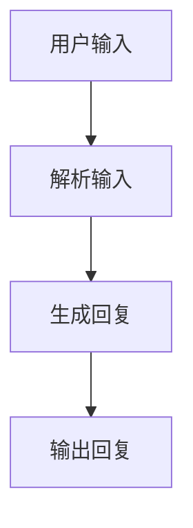
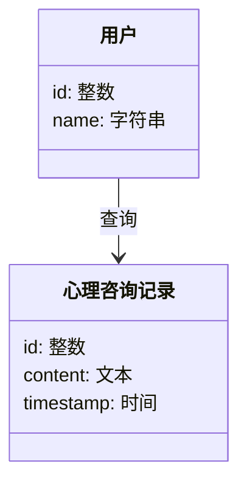
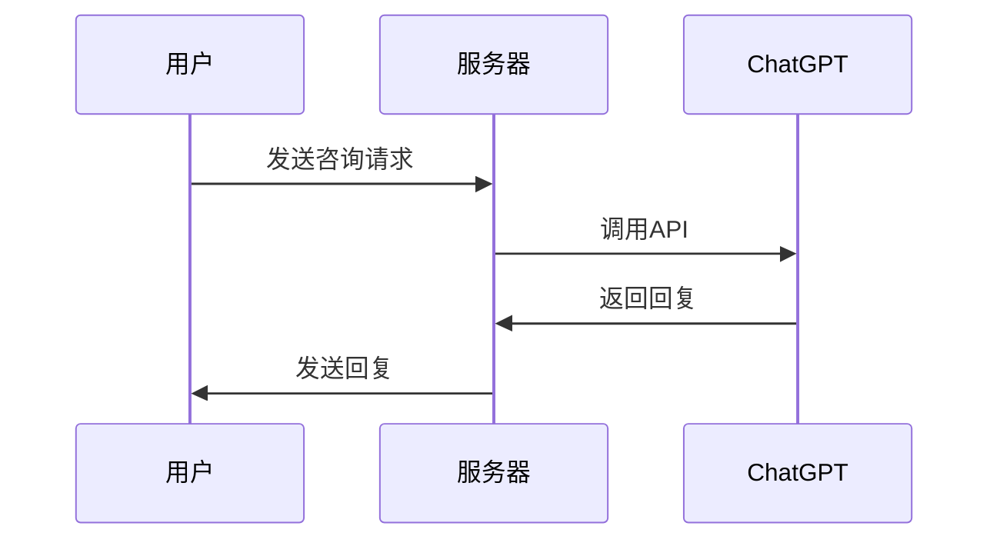
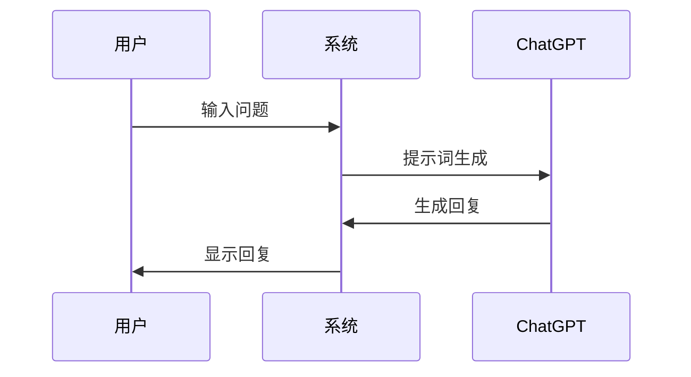

                 

<think>
嗯，用户让我写一篇关于ChatGPT在心理健康领域应用的技术博客，特别是设计提示词的部分。看起来他们希望文章结构清晰，技术性强，有深度。首先，我需要理解用户的需求，他们可能是一位技术专家，或者正在研究AI在心理健康中的应用，所以文章需要专业且详细。

用户提供的大纲非常详细，包括背景介绍、核心概念、算法原理、系统架构等。这意味着文章需要涵盖从基础到高级的内容，确保读者能够全面理解ChatGPT的应用。

我应该从背景开始，介绍心理健康的重要性，现状，以及AI的潜力。然后逐步深入到ChatGPT的工作原理，提示词设计的原则，再到系统架构和项目实战。数学公式和图表的使用也很重要，这样文章才会显得专业。

用户可能希望文章不仅有理论，还要有实际案例和代码示例，所以项目实战部分需要详细，包括环境安装和代码实现。同时，要注意结构的连贯性，每个部分都要紧密相连，逻辑清晰。

最后，确保文章有深度，但语言要易懂，适合技术读者。可能需要多次修改，确保每个部分都详尽且准确。总的来说，我需要按照用户提供的大纲，逐步展开每个部分，确保内容全面且有条理。
</think>

# ChatGPT在心理健康领域的应用：设计敏感且有效的提示词

> 关键词：ChatGPT，心理健康，提示词设计，人工智能，心理健康咨询

> 摘要：本文探讨了ChatGPT在心理健康领域的应用，重点分析了设计敏感且有效的提示词的重要性。通过背景介绍、核心概念分析、算法原理讲解、系统架构设计和项目实战，详细阐述了ChatGPT在心理健康领域的潜力与挑战。文章还提供了数学模型、系统交互图和代码示例，帮助读者全面理解ChatGPT在心理健康领域的应用。

---

## 第1章 背景介绍

### 1.1 问题背景

#### 1.1.1 心理健康的重要性  
心理健康是人类整体健康的重要组成部分，直接影响个体的生活质量和社会功能。随着社会压力的增加，心理健康问题日益普遍，包括焦虑、抑郁、压力管理等问题。

#### 1.1.2 心理健康问题的现状  
全球范围内，心理健康问题呈现上升趋势。世界卫生组织（WHO）数据显示，约10亿人受到心理健康问题的影响，其中抑郁症和焦虑症是主要类型。然而，心理健康服务的资源有限，难以满足需求。

#### 1.1.3 人工智能在心理健康领域的应用潜力  
人工智能（AI）技术的快速发展为心理健康领域提供了新的解决方案。特别是大语言模型（如ChatGPT）具有强大的自然语言处理能力，可以用于心理咨询、情绪识别和干预等场景。

### 1.2 问题描述

#### 1.2.1 心理健康领域面临的挑战  
心理健康领域面临的主要挑战包括：  
1. 专业心理咨询师数量不足，难以覆盖广泛的需求。  
2. 病污名化导致患者不愿寻求帮助。  
3. 现有技术难以实现个性化、实时化的心理健康支持。

#### 1.2.2 ChatGPT的应用范围与优势  
ChatGPT在心理健康领域的应用范围包括：  
1. 提供初步的心理健康评估。  
2. 辅助心理咨询对话。  
3. 帮助用户管理情绪和压力。  
其优势在于：  
1. 24/7可用，减少等待时间。  
2. 隐私保护，用户可以在匿名环境中寻求帮助。  
3. 可扩展性强，可以服务大量用户。

### 1.3 问题解决

#### 1.3.1 ChatGPT在心理健康领域的应用现状  
目前，ChatGPT已被用于：  
1. 心理咨询对话生成。  
2. 情绪识别与分类。  
3. 自杀风险评估等。  
然而，其应用仍处于初级阶段，存在提示词设计不完善、模型泛化能力不足等问题。

#### 1.3.2 设计敏感且有效的提示词的重要性  
提示词是ChatGPT在心理健康领域应用的核心。设计良好的提示词可以：  
1. 引导模型生成专业、共情的回复。  
2. 提高模型对复杂情感的理解能力。  
3. 确保对话的安全性和有效性。

### 1.4 边界与外延

#### 1.4.1 ChatGPT在心理健康领域的适用性  
ChatGPT适用于：  
1. 初步心理健康筛查。  
2. 非专业性心理咨询。  
3. 健康教育与知识普及。  
其不适用于：  
1. 严重精神疾病患者。  
2. 需要专业医疗干预的情况。

#### 1.4.2 提示词设计的限制因素  
提示词设计受到以下限制：  
1. 数据偏差：训练数据可能包含偏见。  
2. 模型能力：当前模型对复杂情感的理解有限。  
3. 法律与伦理：需要避免不当建议和隐私泄露。

### 1.5 概念结构与核心要素组成

#### 1.5.1 ChatGPT的核心概念  
ChatGPT的核心概念包括：  
1. 大语言模型：基于Transformer的架构。  
2. 提示词设计：用户输入的关键指令。  
3. 对话生成：基于上下文的回复生成。

#### 1.5.2 心理健康领域的核心要素  
心理健康领域的核心要素包括：  
1. 情绪识别：识别用户的情绪状态。  
2. 心理咨询：提供专业建议。  
3. 行为干预：引导用户采取积极行为。

---

## 第2章 核心概念与联系

### 2.1 ChatGPT概述

#### 2.1.1 ChatGPT的定义  
ChatGPT是由OpenAI开发的基于GPT-3.5的对话模型，具有强大的自然语言理解和生成能力。

#### 2.1.2 ChatGPT的工作原理  
ChatGPT通过以下步骤生成回复：  
1. 输入处理：解析用户输入。  
2. 上下文理解：基于上下文生成相关回复。  
3. 回答生成：输出自然语言回复。

#### 2.1.3 ChatGPT的特点  
1. 高效性：快速生成回复。  
2. 智能性：基于上下文理解对话。  
3. 可扩展性：支持多种应用场景。

### 2.2 心理健康领域概述

#### 2.2.1 心理健康的定义  
心理健康是指个体的心理功能处于良好状态，能够适应环境并发挥潜能。

#### 2.2.2 心理健康问题的分类  
心理健康问题主要分为：  
1. 抑郁症。  
2. 焦虑症。  
3. 压力相关问题。  

#### 2.2.3 心理健康的重要指标  
1. 情绪稳定性。  
2. 社会支持度。  
3. 应对能力。

### 2.3 ChatGPT在心理健康领域的应用概述

#### 2.3.1 ChatGPT在心理健康领域的应用案例  
1. 心理咨询对话生成。  
2. 抑郁症状评估。  
3. 压力管理建议。

#### 2.3.2 ChatGPT在心理健康领域的优势与挑战  
优势：  
1. 24/7可用。  
2. 隐私保护。  
挑战：  
1. 提示词设计复杂。  
2. 模型泛化能力有限。

---

## 第3章 算法原理讲解

### 3.1 大模型原理

#### 3.1.1 大模型的定义  
大模型是指基于大量数据训练的深度学习模型，具有强大的泛化能力。

#### 3.1.2 大模型的特点  
1. 参数量大。  
2. 训练数据多样。  
3. 上下文理解能力强。

#### 3.1.3 大模型在ChatGPT中的应用  
ChatGPT使用GPT-3.5模型，基于Transformer架构，通过自注意力机制生成回复。

### 3.2 提示词设计原理

#### 3.2.1 提示词的定义  
提示词是用户输入到模型的初始指令，用于引导模型生成特定的回复。

#### 3.2.2 提示词的设计原则  
1. 明确性：确保模型理解需求。  
2. 专业性：使用专业术语。  
3. 情感共鸣：激发共情回复。

#### 3.2.3 提示词在ChatGPT中的作用  
1. 引导模型生成特定类型回复。  
2. 提供上下文信息。  
3. 控制对话的方向。

### 3.3 ChatGPT算法流程图



### 3.4 ChatGPT原理的数学模型和公式

$$
\text{损失函数} = \frac{1}{N}\sum_{i=1}^{N}(-y_{i}\log(p_{i}))
$$

其中，$y_i$是真实标签，$p_i$是模型预测的概率。

### 3.5 ChatGPT举例说明

#### 3.5.1 心理健康咨询案例  
用户输入：“我最近总是感到焦虑。”  
提示词设计：“作为心理咨询师，你需要以共情的方式回应用户的焦虑情绪。”  
模型生成：“我能理解你的感受。焦虑是常见的，我们可以一起探讨原因。”

#### 3.5.2 抑郁症状评估案例  
用户输入：“我感到非常疲惫，对什么都提不起兴趣。”  
提示词设计：“评估用户的抑郁症状，并提供初步建议。”  
模型生成：“这可能是一些抑郁症状的表现。建议你尽快联系专业心理医生。”

---

## 第4章 数学模型和数学公式 & 详细讲解 & 举例说明

### 4.1 数学模型

$$
\text{情绪识别模型} = \sigma(\text{输入特征} \cdot \text{权重} + \text{偏置})
$$

其中，$\sigma$表示sigmoid函数。

### 4.2 详细讲解

#### 4.2.1 情绪识别模型的构建  
情绪识别模型基于神经网络，通过训练数据学习情绪特征。

#### 4.2.2 情绪识别模型的工作原理  
模型通过输入文本特征，计算情绪概率，输出最终情绪类别。

#### 4.2.3 情绪识别模型的优化方法  
1. 调整学习率。  
2. 增加正则化项。  
3. 扩大训练数据集。

### 4.3 举例说明

#### 4.3.1 简单情绪识别案例  
输入：“我今天很开心。”  
模型输出：情绪为“快乐”。

#### 4.3.2 复杂情绪识别案例  
输入：“我感觉有些困惑和担忧。”  
模型输出：情绪为“担忧”。

---

## 第5章 系统分析与架构设计方案

### 5.1 问题场景介绍

#### 5.1.1 心理健康咨询系统  
系统目标：为用户提供实时心理健康支持。  
用户角色：普通用户和心理咨询师。  
核心功能：情绪识别、心理咨询、干预建议。

### 5.2 项目介绍

#### 5.2.1 项目目标  
实现基于ChatGPT的心理健康咨询系统。

#### 5.2.2 项目范围  
涵盖情绪识别、咨询对话和干预建议功能。

### 5.3 系统功能设计



### 5.4 系统架构设计

```mermaid
rectangle User {
    User Interface
}
rectangle Server {
    ChatGPT API
}
rectangle Database {
    User Data
}
User --> Server
Server --> Database
```

### 5.5 系统接口设计



### 5.6 系统交互



---

## 第6章 项目实战

### 6.1 环境安装

1. 安装Python和pip。  
2. 安装OpenAI库：`pip install openai`.  

### 6.2 系统核心实现源代码

```python
import openai

def generate_response(prompt):
    client = openai.Client()
    response = client.chat.completions.create(
        model="gpt-3.5-turbo",
        messages=[{"role": "user", "content": prompt}]
    )
    return response.choices[0].message.content

# 示例：设计提示词
prompt = "作为心理咨询师，你需要以共情的方式回应用户的焦虑情绪。请详细分析用户的问题，并提供可行的建议。"
response = generate_response(prompt)
print(response)
```

### 6.3 代码应用解读与分析  
上述代码展示了如何通过ChatGPT API生成心理健康咨询的回复。提示词设计直接影响模型的输出质量。

### 6.4 实际案例分析和详细讲解剖析  
案例：用户输入“我最近总是感到焦虑。”  
提示词设计：“作为心理咨询师，你需要以共情的方式回应用户的焦虑情绪。请详细分析用户的问题，并提供可行的建议。”  
模型生成：“我能理解你的感受。焦虑是常见的，我们可以一起探讨原因。”

### 6.5 项目小结  
通过代码实现，我们可以看到提示词设计在心理健康咨询中的重要性。合理设计提示词可以显著提高模型的回复质量。

---

## 第7章 最佳实践 tips、小结、注意事项、拓展阅读等内容

### 7.1 最佳实践 tips  
1. 提示词设计要简洁明确。  
2. 定期优化提示词。  
3. 结合实际场景调整模型参数。

### 7.2 小结  
本文详细探讨了ChatGPT在心理健康领域的应用，特别是提示词设计的重要性。通过理论分析和实践案例，展示了如何通过提示词优化心理健康咨询的效果。

### 7.3 注意事项  
1. 提示词设计需避免歧义。  
2. 避免模型生成不当建议。  
3. 注意隐私保护。

### 7.4 拓展阅读  
1. 《Deep Learning for Mental Health: A Review》  
2. 《Harnessing the Power of AI in Mental Health Care》  

---

作者：AI天才研究院/AI Genius Institute & 禅与计算机程序设计艺术/Zen And The Art of Computer Programming

