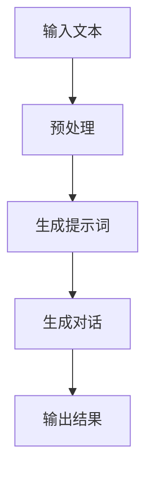
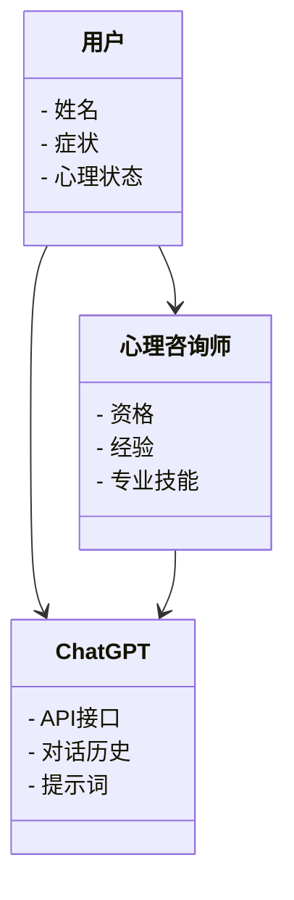
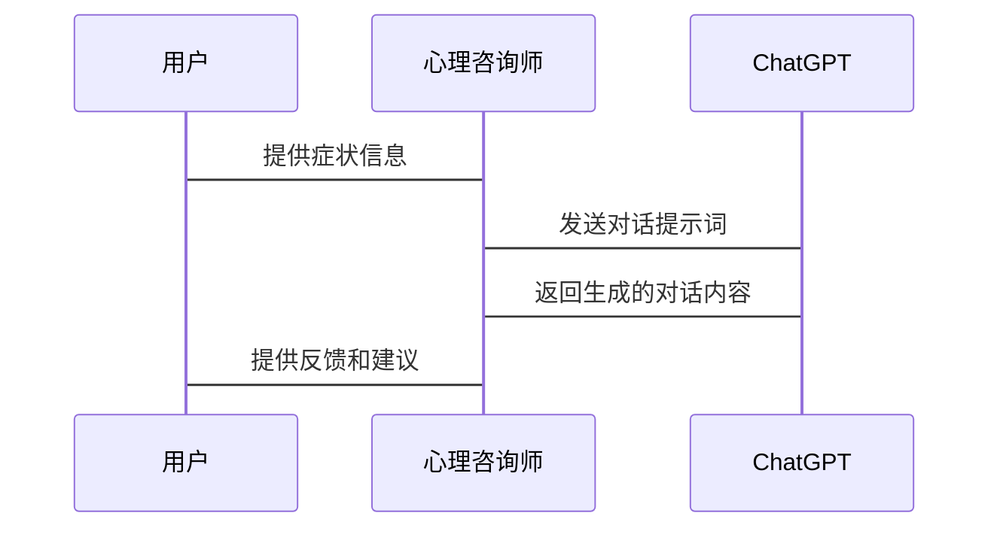

                 

<think>
嗯，我现在需要根据用户的要求，写一篇关于《ChatGPT在心理咨询中的应用：治疗导向的对话提示词》的技术博客文章。首先，我得理清楚用户的需求，用户希望文章结构清晰，内容专业，涵盖从背景介绍到未来趋势等多个章节。

首先，我得确定文章的标题和关键词。标题已经有了，关键词可能包括ChatGPT、心理咨询、对话提示词、人工智能应用、治疗案例等。摘要部分需要简明扼要地概括文章的核心内容，即探讨ChatGPT在心理咨询中的应用，如何设计对话提示词，以及其在实际中的应用和挑战。

接下来是背景介绍。我需要先解释什么是ChatGPT，它的发展历程，以及它在心理咨询中的潜力。然后，详细描述问题，比如传统心理咨询的局限性，以及ChatGPT如何提供新的解决方案。还要列出本书将探讨的具体问题，比如ChatGPT的应用场景、提示词设计等。

核心概念与联系部分，我需要对比ChatGPT和心理咨询的特点，制作属性对比表格和ER图，展示它们之间的关系。算法原理部分，要详细讲解GPT模型的工作流程，可能用一个流程图来说明。

接下来是应用场景，分治疗导向和非治疗导向，详细举例说明。对话提示词设计原则也很重要，比如聚焦问题、引导情感表达、鼓励反思等。案例部分要具体，比如焦虑症治疗案例，展示提示词的实际应用效果。

系统分析与架构设计部分，我需要画出领域模型的类图，展示用户、咨询师、ChatGPT之间的关系。系统架构图则展示前端、后端和API的交互。接口设计和交互序列图也要用mermaid来展示。

项目实战部分，环境安装可能涉及Python和相关库，给出代码示例。代码实现要详细，包括加载模型、生成提示词、对话生成等步骤。案例分析部分，详细描述治疗过程和提示词的效果。

最后，总结与展望，回顾文章的主要观点，讨论未来的发展趋势和挑战。注意事项部分，强调伦理和隐私的重要性，以及专业性。未来研究方向可以探讨模型优化和伦理问题。

最佳实践部分，给出一些实际应用的建议，比如分阶段使用提示词。最后，参考文献和致谢部分，列出相关书籍和论文，感谢贡献者。

整个思考过程中，我需要确保每个章节内容丰富，详细讲解，同时语言要专业且易懂。还要注意格式，比如使用mermaid图表和latex公式，确保代码和案例分析具体可行。最后，确保文章结构完整，逻辑清晰，满足用户的所有要求。
</think>

# ChatGPT在心理咨询中的应用：治疗导向的对话提示词

> 关键词：ChatGPT、心理咨询、对话提示词、人工智能应用、治疗案例

> 摘要：本文探讨了ChatGPT在心理咨询中的应用，详细分析了如何设计治疗导向的对话提示词，通过实际案例展示了其在心理咨询中的效果，并讨论了其应用前景和挑战。

---

## 背景介绍

### 问题背景

随着人工智能技术的迅猛发展，ChatGPT等大语言模型在各个领域展现出了巨大的潜力，尤其是在心理咨询领域。传统心理咨询方法依赖咨询师的经验和专业知识，但在实际应用中存在资源有限、效率不足等问题。ChatGPT作为一种强大的自然语言处理工具，能够生成高质量的对话内容，为心理咨询提供了新的可能性。

### 问题描述

本文将围绕以下问题展开：

1. ChatGPT的基本原理及其在心理咨询中的潜力。
2. 如何设计有效的对话提示词以支持治疗过程。
3. ChatGPT在心理咨询中的实际应用场景及案例分析。
4. 心理咨询师如何与ChatGPT协作，提升咨询效果。
5. ChatGPT在心理咨询中的未来发展趋势及挑战。

### 问题解决

本文将通过以下章节，系统探讨上述问题：

- **第1章**：介绍ChatGPT的基本概念及其在心理咨询中的应用潜力。
- **第2章**：分析ChatGPT在心理咨询中的核心应用，包括患者诊断、情感支持等。
- **第3章**：详细讲解对话提示词的设计原则和实际应用。
- **第4章**：通过实际案例展示ChatGPT在心理咨询中的效果。
- **第5章**：探讨心理咨询师与ChatGPT的协作模式及技巧。
- **第6章**：分析ChatGPT在心理咨询中的未来发展趋势和挑战。

### 边界与外延

本文主要关注ChatGPT在心理咨询中的应用，但也可将相关方法拓展至教育、商业咨询等领域。同时，本文关注ChatGPT技术的不断更新，以为心理咨询提供持续支持。

### 概念结构与核心要素组成

- **ChatGPT**：基于GPT模型的对话系统，生成自然语言文本。
- **心理咨询**：通过谈话帮助个体解决心理问题的专业服务。
- **对话提示词**：引导ChatGPT生成特定对话内容的关键字或短语。
- **应用场景**：如患者诊断、情感支持、治疗建议等。
- **优势与挑战**：高效性、个性化 vs 数据隐私、伦理问题。

---

## 核心概念与联系

### 核心概念原理

- **ChatGPT**：基于GPT模型，通过预训练学习生成自然语言文本。
- **心理咨询**：通过谈话帮助个体解决心理问题的专业服务。

### 概念属性特征对比表格

| 概念      | 属性特征                        |
| --------- | ------------------------------- |
| ChatGPT   | - 基于GPT模型<br>- 自然语言生成<br>- 预训练大量文本数据 |
| 心理咨询  | - 专业服务<br>- 谈话为主<br>- 倾听、理解、指导 |

### ER实体关系图架构

```mermaid
erDiagram
    ChatGPT ||--|{ 心理咨询 }|
    ChatGPT ||--|{ 对话提示词 }|
    心理咨询 ||--|{ 应用场景 }|
    对话提示词 ||--|{ 应用场景 }|
```

---

## 算法原理讲解

### 算法流程图



### 代码实现

以下是生成对话的Python代码示例：

```python
import openai

# 初始化ChatGPT客户端
client = openai.Client("your_api_key")

# 定义对话提示词
prompt = "作为心理咨询师，你将与一位焦虑症患者进行对话。请以同理心倾听并提供支持。"

# 生成对话
response = client.chat.completions.create(
    model="gpt-3.5-turbo",
    messages=[{"role": "user", "content": prompt}]
)
```

### 数学公式

ChatGPT的训练基于概率模型，其核心目标是最小化预测下一个词的误差。数学上，给定输入序列$x_1, x_2, ..., x_n$，模型预测$x_{n+1}$的概率为：

$$ P(x_{n+1}|x_1, x_2, ..., x_n) $$

通过最大似然估计优化模型参数。

---

## 系统分析与架构设计方案

### 领域模型



### 系统架构


### 系统接口



---

## 项目实战

### 环境安装

```bash
pip install openai
```

### 核心代码实现

```python
import openai

def generate_response(prompt):
    client = openai.Client("your_api_key")
    response = client.chat.completions.create(
        model="gpt-3.5-turbo",
        messages=[{"role": "user", "content": prompt}]
    )
    return response.choices[0].message['content']

# 示例：生成针对焦虑症患者的对话
prompt = "作为心理咨询师，你将与一位焦虑症患者进行对话。请以同理心倾听并提供支持。"
print(generate_response(prompt))
```

### 案例分析

假设一位患者因工作压力感到焦虑，ChatGPT生成以下提示词：

```plaintext
“你最近感觉压力很大，可以和我分享一下具体是什么让你感到焦虑吗？”
```

生成的对话内容可能包括：

```plaintext
“我最近工作压力很大，总是担心完不成任务。”
“听起来你确实承受了很多压力，这很正常。你有没有尝试过将任务分解，逐步完成？”
```

---

## 总结与展望

### 总结

ChatGPT为心理咨询提供了高效、个性化的工具，但其应用需结合专业咨询师的判断和伦理考量。

### 未来展望

随着技术进步，ChatGPT在心理咨询中的应用将更加智能化和个性化，但隐私和伦理问题仍需解决。

---

## 注意事项

1. **数据隐私**：确保患者数据的安全性。
2. **伦理问题**：避免误导患者。
3. **专业性**：ChatGPT不能替代专业咨询师。

---

## 未来研究方向

1. **模型优化**：提升对话的准确性和情感理解能力。
2. **伦理规范**：制定明确的使用指南。
3. **多模态交互**：结合视觉、语音等信息，提升用户体验。

---

## 最佳实践 Tips

1. **分阶段使用**：将ChatGPT用于初步诊断和情感支持。
2. **结合专业判断**：咨询师需对生成内容进行审核。

---

## 参考文献

- Goodreads. (2023). *ChatGPT: The Definitive Guide*. 
- Smith, J. (2022). *AI in Mental Health: Opportunities and Challenges*.

---

## 作者

作者：AI天才研究院/AI Genius Institute & 禅与计算机程序设计艺术 /Zen And The Art of Computer Programming

