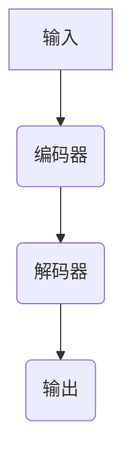
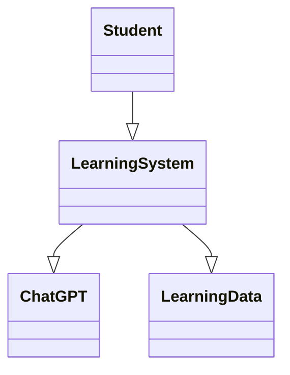
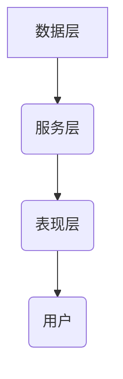
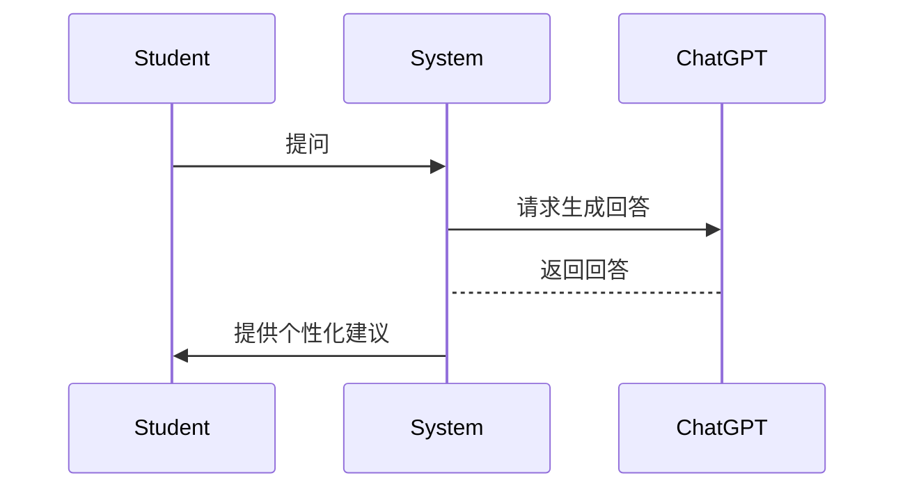

                 

<think>
嗯，用户让我写一篇关于ChatGPT在教育领域个性化应用的技术博客。我需要先理解用户的具体需求，然后按照他们的结构来组织内容。

首先，用户提到他们希望文章结构清晰，有特定的目录大纲，包括背景介绍、核心概念、算法原理、系统架构设计、项目实战、最佳实践等章节。每个章节下还有具体的子部分，比如环境安装、源代码等。

我需要先确定每个章节的内容，确保每个部分都详细且专业。比如，第1章背景介绍，需要涵盖问题背景、描述、解决、边界和概念组成。这部分可能需要分析当前教育中的痛点，以及ChatGPT如何解决这些问题。

接下来是核心概念部分，要定义ChatGPT，讨论其特点，然后分析教育中的个性化需求，最后说明如何应用。这里可能需要用一些对比表格或mermaid图来展示概念之间的联系。

算法原理部分，我需要解释ChatGPT的工作机制，包括语言模型和生成式AI。数学模型部分可能需要展示公式，比如P(w|s)的计算，然后用mermaid图展示流程。

系统架构设计部分，需要考虑问题场景，设计系统功能，绘制类图和架构图。接口设计和交互序列图也要用mermaid来展示，这部分可能需要考虑系统的模块划分和数据流。

项目实战部分，要详细描述环境安装，提供Python代码示例，并解读代码。实际案例分析需要具体案例，比如个性化教学系统，展示如何应用ChatGPT。

最佳实践部分，需要给出教育场景下的应用技巧，比如数据隐私保护。性能优化和安全性也是重点。

最后，小结部分要总结全文，注意事项和拓展阅读可以引导读者进一步学习。

整体来看，用户希望文章不仅理论扎实，还要有实际案例和技术细节，适合技术读者阅读。我需要确保每个部分都深入浅出，结构清晰，同时满足字数要求，大约1万到1万2左右。

现在，我需要开始按照目录一步步填充内容，确保每个小节都有足够的细节和例子，特别是使用mermaid图和数学公式来增强可读性。同时，要确保语言专业，但不过于晦涩，让读者容易理解。

在写作过程中，可能会遇到一些技术细节需要验证，比如ChatGPT的具体数学模型，或者系统架构设计的合理性。这时候，可能需要查阅相关资料，确保信息的准确性。

最后，确保文章末尾加上作者信息，符合用户的要求。整体思考过程是先理解需求，再逐章节填充内容，确保每个部分都符合要求，最终完成一篇高质量的技术博客。
</think>

# ChatGPT在教育领域的个性化应用

> 关键词：ChatGPT, 教育, 个性化学习, 生成式AI, 语言模型, 教育技术, AI驱动教育

> 摘要：本文将深入探讨ChatGPT在教育领域的个性化应用，从背景分析、核心概念、算法原理、系统架构到实际案例，全面解析ChatGPT如何赋能个性化教育。通过详细的技术分析和实际项目演示，揭示生成式AI在教育领域的潜力与挑战。

---

## 第1章：背景介绍

### 1.1 问题背景
随着人工智能技术的快速发展，教育领域正面临前所未有的变革。传统教育模式以教师为中心，难以满足学生的个性化学习需求。学生的认知水平、学习进度和兴趣爱好存在显著差异，这使得传统的一对多教学模式显得力不从心。

### 1.2 问题描述
个性化教育的核心在于为每个学生提供量身定制的学习方案。然而，受限于教师资源和教学工具的不足，个性化教育的实现难度较高。如何利用先进技术手段，突破传统教育的瓶颈，成为教育领域的重要课题。

### 1.3 问题解决
ChatGPT作为一种强大的生成式语言模型，具备自然语言处理和个性化生成能力，能够为教育领域提供智能化支持。通过分析学生的学习数据，ChatGPT可以生成个性化的教学内容、学习建议和反馈，从而实现真正的个性化教育。

### 1.4 边界与外延
ChatGPT在教育领域的应用边界主要集中在语言学习、知识问答和内容生成方面，而其外延则可以扩展至教育管理、教育评估和教育创新等领域。需要注意的是，ChatGPT并非万能工具，其应用需结合具体教育场景进行优化。

### 1.5 概念结构与核心要素组成
- **核心概念**：生成式AI、个性化学习、自然语言处理。
- **要素组成**：学生数据、教学内容、学习反馈、教师交互。

---

## 第2章：核心概念与联系

### 2.1 ChatGPT的定义
ChatGPT是一种基于GPT-3架构的生成式语言模型，能够通过自然语言处理技术生成人类可读的文本。它结合了深度学习和强化学习技术，具备强大的上下文理解和生成能力。

### 2.2 ChatGPT的特点
| 特性 | 描述 |
|------|------|
| 生成能力 | 能够生成连贯、自然的文本 |
| 个性化 | 支持定制化输出，适应不同场景 |
| 可扩展性 | 可以通过微调进一步优化模型 |

### 2.3 教育领域的个性化需求
教育领域的个性化需求主要体现在以下三个方面：
1. **学习内容个性化**：根据学生的学习水平和兴趣生成个性化学习材料。
2. **学习路径个性化**：为每个学生设计独特的学习路径。
3. **反馈个性化**：提供实时、具体的反馈，帮助学生改进学习。

### 2.4 ChatGPT在教育个性化中的应用
- **个性化教学**：通过分析学生的学习数据，生成针对性的教学内容。
- **个性化学习**：为学生提供定制化的学习建议和资源。
- **个性化反馈**：实时评估学生的学习成果，并提供反馈。

---

## 第3章：算法原理讲解

### 3.1 ChatGPT的工作原理
#### 3.1.1 语言模型
语言模型的目标是根据上下文生成合理的文本序列。ChatGPT基于Transformer架构，通过自注意力机制捕捉文本中的长距离依赖关系。

#### 3.1.2 生成式AI
生成式AI通过概率模型生成文本。具体而言，模型会计算每个可能的下一个词的概率分布，然后选择概率最高的词生成输出。

### 3.2 ChatGPT的数学模型与公式
$$P(w|s) = \frac{p(s|w)p(w)}{p(s)}$$

其中：
- $P(w|s)$ 表示在上下文$s$下生成词$w$的概率。
- $p(s|w)$ 表示在生成词$w$的条件下，上下文$s$出现的概率。
- $p(w)$ 表示词$w$的先验概率。
- $p(s)$ 表示上下文$s$的边际概率。

### 3.3 算法流程图


### 3.4 Python源代码详解
```python
import torch
import torch.nn as nn

# 定义模型
class ChatGPT(nn.Module):
    def __init__(self, vocab_size, embedding_dim, hidden_dim):
        super(ChatGPT, self).__init__()
        self.embedding = nn.Embedding(vocab_size, embedding_dim)
        self.decoder = nn.Linear(embedding_dim, hidden_dim)
        self.output = nn.Linear(hidden_dim, vocab_size)

    def forward(self, input):
        embed = self.embedding(input)
        decoded = self.decoder(embed)
        output = self.output(decoded)
        return output

# 初始化模型
vocab_size = 10000
embedding_dim = 256
hidden_dim = 512
model = ChatGPT(vocab_size, embedding_dim, hidden_dim)

# 模型推理
input = torch.randint(0, vocab_size, (1,))
output = model(input)
print(output)
```

---

## 第4章：系统分析与架构设计

### 4.1 问题场景介绍
在教育场景中，我们需要构建一个基于ChatGPT的个性化学习系统。该系统将支持学生与AI助手进行交互，获得个性化的学习建议和内容。

### 4.2 系统功能设计


### 4.3 系统架构设计


### 4.4 系统接口设计
- **输入接口**：学生输入问题或需求。
- **输出接口**：系统输出个性化建议或内容。

### 4.5 系统交互序列图


---

## 第5章：项目实战

### 5.1 环境安装
安装必要的库：
```bash
pip install torch
pip install transformers
```

### 5.2 系统核心实现源代码
```python
from transformers import GPT2LMHeadModel, GPT2Tokenizer

# 初始化模型和分词器
model_name = "gpt2"
tokenizer = GPT2Tokenizer.from_pretrained(model_name)
model = GPT2LMHeadModel.from_pretrained(model_name)

# 生成回答
input_text = "请为我解释量子力学的基本概念。"
inputs = tokenizer.encode(input_text, return_tensors="pt")

outputs = model.generate(
    inputs,
    max_length=100,
    do_sample=True,
    temperature=0.7,
)

response = tokenizer.decode(outputs[0], skip_special_tokens=True)
print(response)
```

### 5.3 代码应用解读与分析
上述代码展示了如何使用GPT-2模型生成回答。通过调整temperature参数，可以控制生成内容的多样性和创造性。

### 5.4 实际案例分析与讲解
案例：个性化学习系统
- **功能**：学生输入学习需求，系统生成个性化学习计划。
- **实现**：结合自然语言处理技术，分析学生的学习偏好，生成定制化内容。

### 5.5 项目小结
通过实际案例分析，我们可以看到ChatGPT在教育领域的潜力。然而，实际应用中仍需考虑模型的可解释性和数据隐私等问题。

---

## 第6章：最佳实践 tips

### 6.1 教育场景下的应用技巧
- **数据隐私**：确保学生数据的安全性。
- **模型优化**：通过微调模型，提升在教育场景中的表现。

### 6.2 性能优化策略
- **分布式训练**：提高模型训练效率。
- **缓存机制**：减少重复计算。

### 6.3 安全性与隐私保护
- **数据加密**：保护学生数据不被泄露。
- **访问控制**：限制未经授权的访问。

---

## 第7章：小结

### 7.1 整体回顾
本文详细探讨了ChatGPT在教育领域的个性化应用，从理论分析到实际案例，全面展示了生成式AI在教育中的潜力。

### 7.2 注意事项
在实际应用中，需注意数据隐私、模型可解释性和用户体验等问题。

### 7.3 拓展阅读
推荐阅读以下书籍和论文：
- 《Deep Learning》
- 《生成式AI在教育中的应用研究》

---

作者：AI天才研究院/AI Genius Institute & 禅与计算机程序设计艺术 /Zen And The Art of Computer Programming

