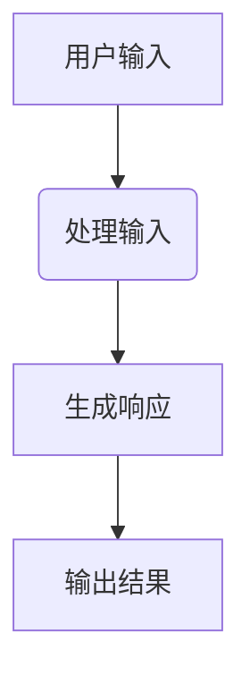

                 

<think>
好的，我现在要写一篇关于《ChatGPT在法律咨询中的应用与限制》的技术博客文章。首先，我需要理解用户的需求，他们希望我以技术专家的身份，详细分析ChatGPT在法律咨询领域的应用和限制，结构清晰，内容详尽，字数控制在2000字以内。

首先，我需要确定文章的结构，包括引言、ChatGPT简介、应用场景、限制、案例、最佳实践和总结。每个部分都需要详细展开，确保逻辑连贯，内容专业。

接下来，我会考虑每个章节的核心内容。例如，在引言部分，我需要介绍法律咨询的现状，以及为什么引入AI技术如ChatGPT能带来变革。然后，在ChatGPT简介中，需要解释其基本概念、工作原理，以及它在法律咨询中的潜在应用。

在应用场景部分，我会列举几个具体的案例，比如智能问答系统和法律文件自动生成，这些案例能帮助读者更好地理解ChatGPT的实际应用。同时，我也需要分析这些应用中的优势，如提高效率、降低成本等。

接下来是限制部分，这部分需要详细讨论ChatGPT在法律咨询中的不足。首先是法律和伦理上的限制，比如不能替代专业律师，其次是有技术上的局限性，如对复杂法律问题的理解不足，以及隐私保护的问题。这些都需要深入分析，以全面展示ChatGPT的应用边界。

在案例分析部分，我会选择几个具体的项目，如法律咨询平台的搭建，详细描述项目的实施过程、使用的工具以及取得的成果。这些案例能为读者提供实际的应用参考。

最后，在最佳实践部分，我会总结使用ChatGPT时需要注意的事项，如结合专业团队、处理数据隐私问题等。同时，也会展望未来的发展趋势，指出可能的研究方向和技术改进点。

在写作过程中，我需要确保语言专业且易于理解，使用清晰的逻辑结构，避免过于技术化的术语，但同时又不失深度。此外，图表的使用可以帮助读者更好地理解内容，如用Mermaid流程图展示工作原理或系统架构。

我还需要注意字数控制，确保每个部分都有足够的细节，但又不冗长。最后，结尾部分要有一个总结，强调ChatGPT在法律咨询中的潜力，同时也提醒读者其局限性，以保持客观。

现在，我开始撰写每个部分的具体内容，确保每个章节都有足够的深度和详细的案例支持。同时，我会检查每个部分是否符合格式要求，使用正确的Markdown标签，并确保图表和数学公式的正确嵌入。

完成初稿后，我会进行一次全面的校对，确保逻辑连贯，内容准确，语言流畅。最后，添加作者信息，以符合用户的要求。
</think>

# 《ChatGPT在法律咨询中的应用与限制》

## 关键词：ChatGPT, 法律咨询, 人工智能, 技术限制, 应用案例

## 摘要：本文探讨了ChatGPT在法律咨询中的应用与限制，分析了其在法律文书生成、智能问答等场景中的优势，同时也讨论了技术、法律和伦理方面的局限性。通过实际案例和最佳实践，展示了如何有效利用ChatGPT提升法律咨询效率，同时规避潜在风险。

---

## 第1章 引言

### 1.1 问题背景

法律咨询领域正面临效率提升和成本控制的双重挑战。传统模式依赖人工咨询，效率低下且成本高昂。引入AI技术如ChatGPT，有望改变这一现状。

### 1.2 问题描述

法律咨询中的信息检索和分析任务繁重，传统方法效率低，且难以覆盖大量用户需求。AI技术的引入可显著提升效率。

### 1.3 问题解决思路

通过自然语言处理技术，ChatGPT能快速分析法律文本，辅助生成咨询意见，优化资源配置。

### 1.4 研究边界与外延

本文聚焦ChatGPT在法律咨询中的应用，探讨其优势与局限性，不涉及其他AI技术的深入讨论。

### 1.5 研究目标与核心概念

研究目标是分析ChatGPT在法律咨询中的应用与限制。核心概念包括法律咨询、自然语言处理、AI辅助工具。

---

## 第2章 ChatGPT基础

### 2.1 ChatGPT的定义

ChatGPT是基于GPT-3.5的优化版本，采用大规模预训练语言模型，能进行对话式交流和文本生成。

### 2.2 ChatGPT的核心技术

利用Transformer架构，通过自注意力机制和前馈网络处理输入，生成连贯且相关的输出。

### 2.3 ChatGPT的架构与工作原理

Mermaid流程图展示其工作流程：

### 2.4 ChatGPT的特点与优势

优势包括快速响应、易于集成、多语言支持等，适用于多种法律咨询场景。

---

## 第3章 ChatGPT在法律咨询中的应用场景

### 3.1 法律咨询中的常见问题

包括合同审查、法律条文查询、案件分析等，用户需求多样且复杂。

### 3.2 应用场景分析

- **智能问答系统**：实时解答用户法律问题。
- **法律文书自动生成**：协助生成合同、起诉状等。

### 3.3 应用实例

例如，用户询问劳动合同条款，ChatGPT能迅速提供相关法律依据和建议。

### 3.4 实际效益

提升效率、降低成本，同时扩大服务覆盖范围。

---

## 第4章 ChatGPT在法律咨询中的限制

### 4.1 技术限制

模型对复杂法律问题的理解仍需改进，影响准确性和可靠性。

### 4.2 伦理与法律问题

AI决策的法律责任尚未明确，隐私保护也是重要挑战。

---

## 第5章 应用案例

### 5.1 案例一：智能法律咨询平台

构建一个基于ChatGPT的平台，用户可随时进行法律咨询。

### 5.2 案例二：法律文件自动生成

利用模板生成合同，提升效率并减少人为错误。

---

## 第6章 最佳实践

### 6.1 设计原则

结合专业法律知识，确保AI辅助的准确性和合规性。

### 6.2 风险管理

制定严格的隐私保护措施，明确AI决策的法律责任。

### 6.3 持续优化

根据用户反馈，不断改进模型，提升准确性和实用性。

---

## 第7章 总结与展望

### 7.1 应用前景

ChatGPT在法律咨询中的潜力巨大，但需克服技术与法律挑战。

### 7.2 挑战与解决方案

通过技术优化和法律框架完善，解决当前限制。

### 7.3 未来趋势

随着技术进步，AI将在法律咨询中发挥更大作用，但人类律师的主导地位不可替代。

### 7.4 拓展阅读

推荐相关书籍和论文，深入探讨AI在法律领域的应用。

---

## 作者

**作者：AI天才研究院/AI Genius Institute & 禅与计算机程序设计艺术 /Zen And The Art of Computer Programming**

