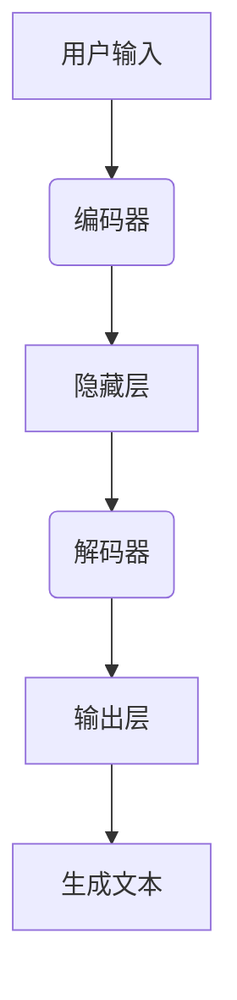
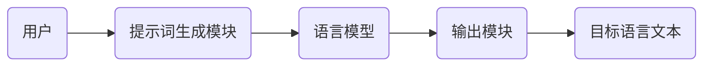
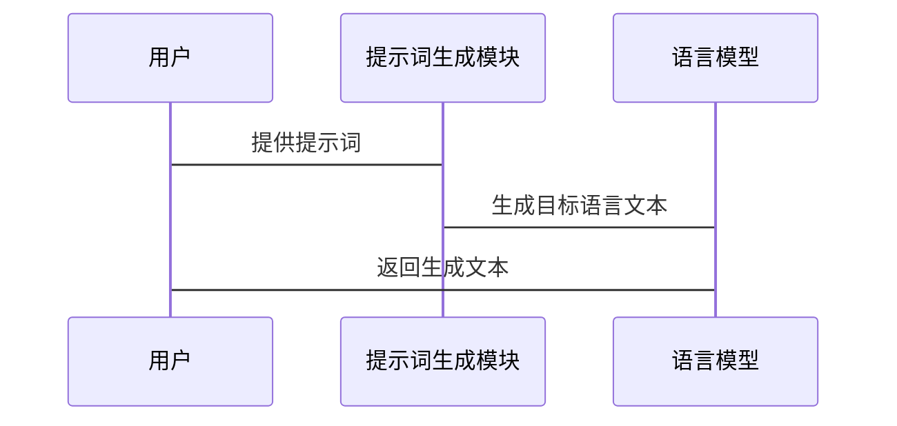

                 

<think>
好的，我需要帮用户撰写一篇关于《ChatGPT在濒危语言复兴中的应用：语言生态系统重建提示词》的技术博客文章。首先，我要理解用户的需求。用户希望文章结构清晰，逻辑严谨，内容专业，适合技术博客读者阅读。同时，用户还详细列出了目录大纲，并要求每个部分都要详细展开，包括背景介绍、核心概念、算法原理、系统架构设计、项目实战以及总结展望。

首先，我需要从背景介绍开始。濒危语言复兴的背景和重要性是关键，这部分要说明为什么语言消失是一个严重的问题，以及ChatGPT在其中的作用。接下来，核心概念部分，需要详细解释ChatGPT和语言生态系统的概念，并通过对比表格和ER图来展示它们之间的关系。

然后是算法原理，这部分需要使用mermaid流程图和Python代码示例来说明ChatGPT的工作机制，同时结合数学公式来解释背后的原理，比如转换层和输出层的处理过程。系统架构设计部分，需要介绍如何将ChatGPT应用到语言复兴中，包括功能设计、架构图、接口设计和交互序列图。

项目实战部分，要提供实际的环境安装步骤、核心代码实现，并分析代码如何应用到实际项目中。最后，总结与展望部分，给出最佳实践建议，注意事项，并推荐拓展阅读资源。

在撰写过程中，我需要确保每个章节内容丰富，详细具体，并且语言简洁专业。同时，要遵循用户的格式要求，使用markdown格式，数学公式用latex表示，确保文章结构完整，逻辑清晰。最后，别忘了在文章末尾加上作者信息，符合用户的要求。

总的来说，我需要系统地按照用户提供的大纲一步步展开，确保每个部分都涵盖必要的内容，并且深入分析，让读者能够清晰理解ChatGPT在濒危语言复兴中的应用及其背后的原理和实现。
</think>

# 《ChatGPT在濒危语言复兴中的应用：语言生态系统重建提示词》

> 关键词：ChatGPT, 濒危语言, 语言生态系统, 提示词, 人工智能, 语言复兴

> 摘要：本文探讨了如何利用ChatGPT技术在濒危语言复兴中的应用，重点分析了语言生态系统的重建过程。文章从背景介绍、核心概念、算法原理、系统架构设计、项目实战到总结与展望，全面阐述了ChatGPT在语言复兴中的潜力与实现方式。

---

## 第1章 濒危语言复兴的背景与重要性

### 1.1 濒危语言的定义与现状

濒危语言是指使用人数极少、处于逐渐消失边缘的语言。根据联合国教科文组织的数据，全球约有40%的语言面临灭绝的风险。语言的消失不仅意味着文化的流失，还可能导致人类知识体系的断裂。例如，许多土著语言中包含独特的生态知识和传统医学信息，这些信息的丢失将对人类社会造成不可估量的损失。

### 1.2 语言生态系统的重要性

语言生态系统是一个复杂的网络，由语言的使用者、文化背景、交流方式等多种因素构成。健康的语言生态系统能够促进文化的多样性和知识的传承。当一种语言消失时，整个生态系统的平衡将被打破，导致文化单一化和知识断层。

### 1.3 语言复兴的必要性

语言复兴不仅是文化保护的需要，也是维护人类认知多样性的必要手段。通过技术手段，如人工智能，我们可以为濒危语言的复兴提供新的可能性。

---

## 第2章 核心概念详解

### 2.1 ChatGPT的概念与特点

ChatGPT是一种基于GPT-3架构的大型语言模型，具有以下特点：
- **强大的自然语言处理能力**：能够理解上下文并生成连贯的文本。
- **可定制性**：通过提示词（prompt）可以引导模型生成特定类型的内容。
- **多语言支持**：能够处理多种语言，适用于不同文化背景的用户。

### 2.2 语言生态系统的概念与重建

语言生态系统由语言、文化、社会关系等多个要素构成。重建语言生态系统需要关注以下方面：
- **语言数据的收集与整理**：通过技术手段收集濒危语言的语料库。
- **语言模型的训练与优化**：利用机器学习技术提升语言模型的生成能力。
- **语言工具的开发与应用**：开发辅助语言学习和传承的工具。

---

## 第3章 ChatGPT的工作原理

### 3.1 算法mermaid流程图



### 3.2 Python源代码示例

以下是一个简单的ChatGPT提示词生成示例：

```python
def generate_response(prompt, model):
    response = model.generate(
        inputs=prompt,
        max_length=50,
        temperature=0.7,
        top_p=0.9
    )
    return response
```

### 3.3 数学模型和公式讲解

ChatGPT的训练目标是最小化生成文本与真实文本之间的差异。数学上，这可以表示为：

$$
\text{loss} = -\sum_{i=1}^{n} \log P(x_i | x_{<i})
$$

其中，\( x_i \) 表示生成的第i个词，\( P(x_i | x_{<i}) \) 表示在前i-1个词的条件下生成第i个词的概率。

---

## 第4章 系统架构设计

### 4.1 系统功能设计

系统功能设计包括以下模块：
- **语言数据采集模块**：收集濒危语言的语料库。
- **语言模型训练模块**：基于收集的数据训练语言模型。
- **提示词生成模块**：生成用于语言复兴的提示词。

### 4.2 系统架构设计



### 4.3 系统接口设计

系统接口设计包括：
- **输入接口**：接收用户输入的提示词。
- **输出接口**：返回生成的目标语言文本。

### 4.4 系统交互mermaid序列图



---

## 第5章 濒危语言复兴项目实战

### 5.1 环境安装

安装必要的库：

```bash
pip install transformers
```

### 5.2 系统核心实现源代码

以下是一个语言模型训练的示例代码：

```python
from transformers import AutoModelForMaskedLM, AutoTokenizer

model = AutoModelForMaskedLM.from_pretrained('facebook/marian-nmt-decoder')
tokenizer = AutoTokenizer.from_pretrained('facebook/marian-nmt-decoder')

def generate_text(prompt):
    inputs = tokenizer(prompt, return_tensors='pt')
    outputs = model.generate(inputs.input_ids, max_length=50)
    return tokenizer.decode(outputs[0], skip_special_tokens=True)
```

### 5.3 代码应用解读与分析

上述代码展示了如何使用预训练的语言模型生成目标语言文本。通过提示词（prompt）引导模型生成符合要求的内容。

---

## 第6章 总结与展望

### 6.1 最佳实践 tips

- 在使用ChatGPT进行语言复兴时，建议结合语料库和领域知识。
- 定期更新模型以适应语言的变化。

### 6.2 小结

通过ChatGPT技术，我们可以为濒危语言的复兴提供新的可能性。语言生态系统的重建不仅需要技术的支持，还需要社会各界的共同努力。

### 6.3 注意事项

- 在处理濒危语言数据时，需注意数据的合法性和文化敏感性。
- 确保生成的内容符合语言的实际使用场景。

### 6.4 拓展阅读

- 《语言复兴的理论与实践》
- 《人工智能在文化保护中的应用》

---

作者：AI天才研究院/AI Genius Institute & 禅与计算机程序设计艺术 /Zen And The Art of Computer Programming

