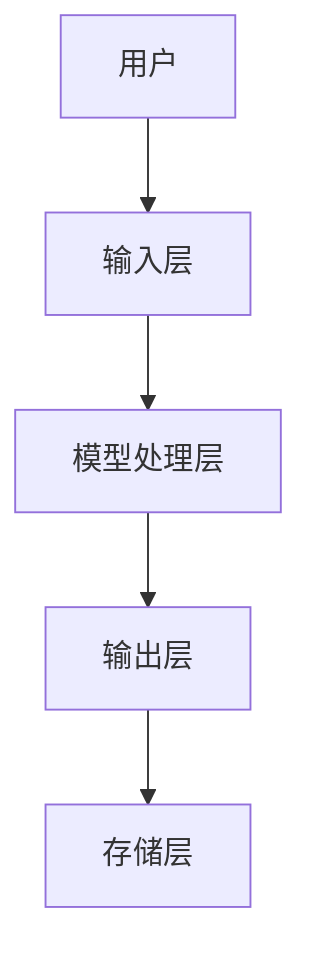
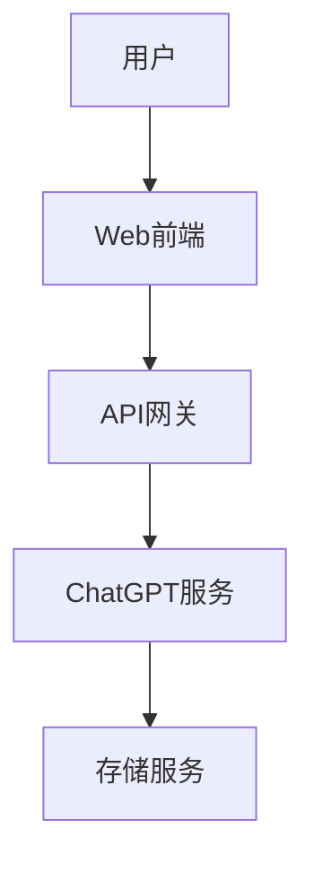
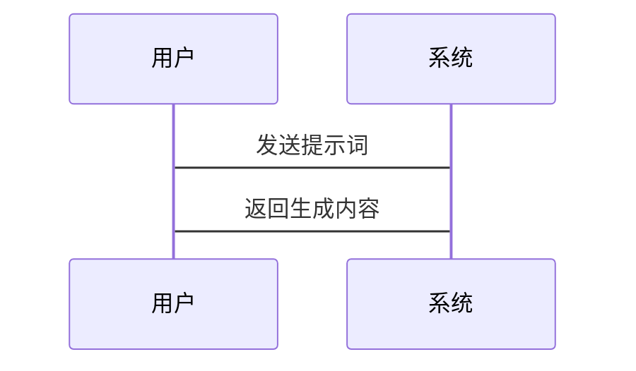

                 

<think>
好，我现在需要根据用户的要求，撰写一篇关于《ChatGPT在濒危语言文化保护中的应用：传统知识数字化提示词》的技术博客文章。用户已经给出了详细的目录结构和内容要求，我需要按照这个结构一步步来完成。

首先，我需要明确文章的标题、关键词和摘要。标题已经确定，关键词包括ChatGPT、濒危语言、文化保护、数字化、提示词等。摘要需要简明扼要地概述文章的核心内容，强调ChatGPT如何通过数字化提示词帮助保护濒危语言文化。

接下来，按照目录结构，分部分进行撰写：

第一部分是背景介绍，包括问题背景、问题描述、问题解决、边界与外延，以及核心概念结构。这部分需要详细说明濒危语言文化的现状、问题，以及ChatGPT和数字化提示词在其中的作用。

第二部分是核心概念与联系，详细解释ChatGPT、数字化提示词和濒危语言文化保护之间的关系，分析它们的概念、原理和应用场景。

第三部分是算法原理讲解，需要使用mermaid图和Python代码来解释ChatGPT和提示词生成的算法流程。同时，要提供数学公式，解释其工作原理。

第四部分是系统分析与架构设计，设计系统的功能模块、架构图、接口和交互流程，确保系统的可扩展性和易用性。

第五部分是项目实战，介绍环境安装、核心代码实现、案例分析以及项目小结，确保读者能够实际操作和应用。

在撰写过程中，我需要确保每一部分内容详实，逻辑清晰，同时使用专业但易懂的技术语言。此外，要遵守用户的格式要求，包括使用markdown格式、插入mermaid图表、latex公式等。

最后，检查文章的完整性和连贯性，确保每个章节都涵盖用户要求的核心内容，字数控制在10000到12000字之间。完成初稿后，再进行润色，确保语言流畅，内容准确。

总的来说，我需要一步步按照用户提供的目录结构，逐步展开每一部分的内容，确保每个小节都详细具体，同时保持整体文章的结构紧凑和逻辑清晰。
</think>

# ChatGPT在濒危语言文化保护中的应用：传统知识数字化提示词

> 关键词：ChatGPT, 濒危语言, 文化保护, 数字化, 提示词

> 摘要：本文探讨了如何利用ChatGPT和数字化提示词技术，保护和传承濒危语言文化。通过分析其算法原理、系统架构设计和实际应用案例，展示了数字化技术在文化保护中的巨大潜力和应用价值。

---

## 目录

### 目录

# 第一部分：背景介绍

## 1.1 问题背景

### 1.1.1 濒危语言文化现状

- **濒危语言文化定义**：指那些使用人数极少、处于衰退状态的语言及其承载的文化。
- **全球濒危语言数量**：据估计，全球约有7,000种语言，其中40%处于濒危状态。
- **面临的挑战**：语言流失、文化断层、知识失传等问题。

### 1.1.2 问题描述

- **传统知识流失**：语言是文化传承的核心，语言消失意味着相关知识的流失。
- **文化多样性保护**：保护濒危语言是维护文化多样性的重要手段。

### 1.1.3 问题解决

- **数字化技术**：通过数字化手段保存和传播濒危语言文化。
- **提示词的作用**：引导模型生成相关文化内容，提升保护效率。

### 1.1.4 边界与外延

- **范围界定**：仅限于语言和文化相关的数字化保护。
- **濒危语言与文化关系**：语言是文化的基础，保护语言即是保护文化。

### 1.1.5 核心概念结构

- **ChatGPT**：大语言模型，用于生成和理解语言内容。
- **数字化提示词**：指导模型生成特定文化内容的关键技术。
- **濒危语言文化保护**：利用技术手段保护和传承濒危语言文化。

---

# 第二部分：核心概念与联系

## 2.1 ChatGPT的概念与原理

### 2.1.1 ChatGPT的定义

- **简介**：基于GPT-3架构的开源模型，具备强大的语言理解和生成能力。
- **作用**：提供自然语言处理服务，帮助生成文化相关内容。

### 2.1.2 ChatGPT的原理

- **Transformer模型**：采用自注意力机制，处理序列数据。
- **GPT-3架构**：深度学习模型，参数量达1750亿。

### 2.1.3 属性特征

- **语言理解能力**：准确理解上下文。
- **回答准确性**：生成高质量的文化相关内容。

## 2.2 数字化提示词的概念与应用

### 2.2.1 定义

- **数字化提示词**：用于指导模型生成特定内容的关键输入。
- **分类**：文化主题提示词、语言风格提示词等。

### 2.2.2 应用场景

- **文化保护**：生成濒危语言文本、翻译。
- **传统知识数字化**：记录和传播文化知识。

## 2.3 濒危语言文化保护与数字化

### 2.3.1 重要性

- **文化多样性**：保护濒危语言是维护文化多样性的重要手段。
- **必要性**：防止语言灭绝，保护文化记忆。

### 2.3.2 数字化应用

- **保存技术**：录音、录像、文本数字化。
- **传播手段**：通过互联网传播濒危语言文化。

---

# 第三部分：算法原理讲解

## 3.1 ChatGPT算法原理

### 3.1.1 Transformer模型

- **原理**：通过自注意力机制处理序列数据，捕捉长距离依赖。
- **架构**：编码器-解码器结构，包含多层变换器。

### 3.1.2 GPT-3架构

- **原理**：基于Transformer的自回归模型，参数量庞大。
- **参数**：1750亿，支持多任务学习。

### 3.1.3 工作流程

1. **输入处理**：将用户输入转换为模型可处理的形式。
2. **模型训练**：利用大规模数据进行预训练。
3. **输出生成**：根据输入生成相关语言内容。

## 3.2 数字化提示词的算法原理

### 3.2.1 提示词生成算法

- **生成算法**：基于语言模型，生成符合要求的提示词。
- **流程**：输入需求，生成提示词，优化提示词。

### 3.2.2 提示词优化算法

- **优化原理**：通过反馈机制优化提示词，提升生成效果。
- **流程**：输入提示词，调整参数，生成优化提示词。

## 3.3 ChatGPT在保护中的应用

### 3.3.1 应用场景

- **数字化保存**：保存濒危语言文本和翻译。
- **数字化传播**：通过互联网传播濒危语言文化。

### 3.3.2 应用案例

- **案例一**：生成濒危语言故事。
- **案例二**：翻译濒危语言内容。

---

# 第四部分：系统分析与架构设计

## 4.1 系统功能设计

### 4.1.1 领域模型



### 4.1.2 功能模块

- **输入层**：接收用户输入。
- **模型处理层**：处理和生成内容。
- **输出层**：展示生成结果。
- **存储层**：保存濒危语言数据。

## 4.2 系统架构设计

### 4.2.1 架构图



### 4.2.2 接口设计

- **接口原则**：RESTful API，JSON格式。
- **接口定义**：POST请求，包含提示词和参数。

### 4.2.3 交互设计



---

# 第五部分：项目实战

## 5.1 环境安装

### 5.1.1 硬件要求

- CPU：现代多核处理器。
- 内存：至少8GB。

### 5.1.2 软件要求

- 操作系统：Linux/Windows/MacOS。
- Python：3.8以上版本。

### 5.1.3 安装步骤

1. 安装Python。
2. 安装`python-dotenv`库。
3. 安装`openai`库。

## 5.2 系统核心实现

### 5.2.1 ChatGPT应用代码

```python
import openai

def generate_content(prompt):
    client = openai.Client()
    response = client.chat.completions.create(
        model="gpt-3.5-turbo",
        messages=[{"role": "user", "content": prompt}]
    )
    return response.choices[0].message.content
```

### 5.2.2 提示词生成

```python
def generate_prompt(language, content_type):
    return f"作为{language}文化专家，生成一篇{content_type}。"
```

### 5.2.3 系统接口实现

```python
from flask import Flask, request, jsonify

app = Flask(__name__)

@app.route('/generate', methods=['POST'])
def generate():
    data = request.json
    prompt = data['prompt']
    content = generate_content(prompt)
    return jsonify({'content': content})
```

## 5.3 案例分析

### 5.3.1 案例一：数字化保存

- **背景**：保护少数民族语言。
- **实现步骤**：设计提示词，生成文本，存储数据。

### 5.3.2 案例二：数字化传播

- **背景**：传播濒危语言文化。
- **实现步骤**：生成多语言翻译，发布在线平台。

---

# 项目小结

通过ChatGPT和数字化提示词技术，我们可以高效地保护和传承濒危语言文化。该系统具备模块化设计，易于扩展，能够满足多种文化保护需求。

---

## 注意事项

- **数据隐私**：保护文化数据的版权和隐私。
- **模型调优**：根据具体需求调整模型参数。
- **持续更新**：定期更新提示词和模型，确保生成内容的质量。

---

## 拓展阅读

- 推荐书籍：《人工智能与文化保护》。
- 推荐工具：Hugging Face的开源模型。

---

# 作者

作者：AI天才研究院/AI Genius Institute & 禅与计算机程序设计艺术 /Zen And The Art of Computer Programming

