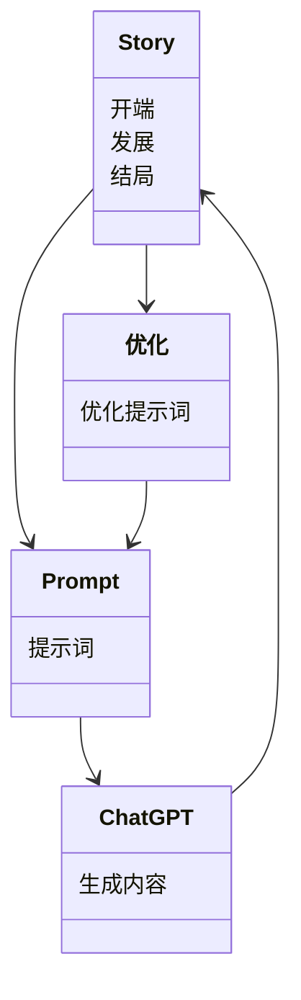
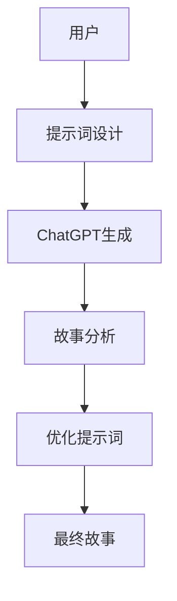
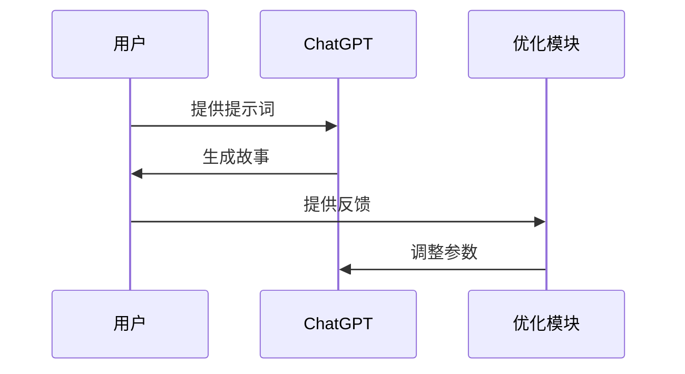

                 

<think>
好的，我现在要帮用户撰写一篇技术博客文章，标题是《ChatGPT在科幻创作中的应用：构建未来世界观的提示词》。用户希望文章结构清晰，逻辑严谨，用专业但易懂的语言，同时涵盖从基础到应用的各个方面。

首先，我需要理解用户的需求。用户希望文章有详细的目录结构，包括引言、核心应用、实际应用、优化与评估等部分。每个部分都需要详细展开，包括背景介绍、原理、应用案例、优化技巧等。

接下来，我得考虑文章的结构。根据用户提供的大纲，文章分为四部分：引言与背景、核心应用、实际应用、优化与评估。每部分下还有具体的章节，比如引言部分包括背景介绍、ChatGPT基础等。我需要确保每个章节都有足够的内容，覆盖用户提到的关键词，如科幻创作、ChatGPT、提示词、未来世界等。

然后，我得思考如何详细展开每个章节。例如，在“ChatGPT基础”部分，我需要解释其工作原理，包括基于Transformer的架构、注意力机制等。可能需要使用一些公式，比如解码器的结构，或者注意力机制的计算公式，来让读者理解其技术基础。

在“构建未来世界观”部分，我需要讨论提示词的设计原则，如何引导ChatGPT生成符合科幻设定的内容。可能需要举例说明，比如设计一个未来社会的提示词，如何一步步引导模型生成详细的世界观。

实际应用部分，我需要探讨ChatGPT在角色和情节生成中的应用。例如，如何利用模型生成独特的人物性格和背景，或者如何构思复杂的情节结构。这部分可能需要展示一些生成的例子，并分析其优缺点。

优化与评估部分，我需要讨论如何调整提示词和模型参数，以提高生成的质量。同时，还要评估生成内容的有效性，可能包括自动评估指标和人工评估策略。此外，讨论常见问题及解决方案也很重要，比如生成内容的相关性不足或缺乏创意。

我还需要注意文章的整体结构，确保每个部分之间有良好的衔接，逻辑清晰。可能需要在每个章节开始时进行简要的背景介绍，然后逐步深入，最后总结该部分的内容。

另外，用户特别强调要使用技术术语，但又要保持易懂。因此，在解释复杂概念时，我需要尽量简化，可能通过图表或示意图来辅助说明。比如，使用Mermaid流程图来展示模型的结构或提示词设计的流程。

在撰写过程中，我还需要确保文章有足够的实际案例，比如成功的故事生成案例，以及这些案例如何被优化。这不仅增加了文章的可读性，也帮助读者更好地理解ChatGPT的应用。

最后，我需要总结整个文章，展望未来的发展，比如AI在科幻创作中的潜力，以及可能遇到的伦理问题。这部分可以引导读者思考更深层次的问题，提升文章的深度。

总的来说，我需要系统性地组织内容，确保每个章节都详尽且有深度，同时保持语言的专业性和易懂性。这将帮助用户撰写一篇高质量的技术博客，满足他们的需求。
</think>

# ChatGPT在科幻创作中的应用：构建未来世界观的提示词

**关键词**：科幻创作，ChatGPT，提示词，未来世界观，人工智能，创意写作

**摘要**：  
本文探讨了ChatGPT在科幻创作中的应用，重点分析了如何通过精心设计的提示词来构建未来世界观。文章从ChatGPT的基本原理出发，详细介绍了其在科幻创作中的核心应用，包括角色设计、情节构思、社会文化模拟等方面。同时，文章还提供了优化提示词和评估创作效果的具体方法，结合实际案例分析了ChatGPT在科幻创作中的潜力与挑战。最后，文章展望了未来AI在科幻创作中的发展方向，并探讨了相关的伦理问题。

---

## 第一部分: 引言与背景

### 第1章: 背景介绍

#### 1.1 科幻创作中的挑战

科幻创作是一项复杂而富有挑战性的任务。作者需要构建一个自洽的未来世界观，涵盖科技、社会、文化和心理等多个维度。如何将这些元素有机地结合在一起，并创造出引人入胜的故事，是科幻作家面临的最大挑战之一。此外，科幻创作还需要对前沿科技有深刻的理解，这往往要求作者具备跨学科的知识背景。

#### 1.2 ChatGPT的出现与潜力

随着人工智能技术的快速发展，以ChatGPT为代表的大语言模型（LLM）开始在各个领域展现出其强大的潜力。ChatGPT不仅能够理解上下文，还能生成连贯且具有创意的文字内容。在科幻创作中，ChatGPT可以作为辅助工具，帮助作者快速生成世界观设定、角色对话和故事情节。其强大的文本生成能力为科幻创作提供了新的可能性。

#### 1.3 本书的目的与结构

本书旨在探讨ChatGPT在科幻创作中的应用，特别是如何通过提示词（prompt words）构建未来世界观。文章将从ChatGPT的基本原理出发，逐步分析其在科幻创作中的核心应用，并结合实际案例展示其潜力。最终，我们将探讨未来的发展方向和相关伦理问题。

---

## 第二部分: ChatGPT在科幻创作中的核心应用

### 第2章: 构建未来世界观

#### 2.1 提示词设计原则

提示词是引导ChatGPT生成特定内容的关键。在科幻创作中，提示词需要明确目标，例如“设计一个未来社会的经济体系”或“创造一种新型的虚拟现实技术”。提示词应具体、详细，并包含上下文信息，以便ChatGPT能够生成符合预期的内容。

#### 2.2 使用ChatGPT探索未来科技

ChatGPT可以用来生成各种未来科技的概念。例如，通过提示词“设计一种能够实现量子计算的新型计算机”，ChatGPT可以生成详细的科技设定，包括技术原理、应用场景和潜在挑战。这些内容可以为科幻故事提供丰富的科技背景。

#### 2.3 未来社会与文化的模拟

通过提示词，ChatGPT可以模拟未来社会的文化和生活方式。例如，提示词“描绘一个全自动驾驶社会中的日常生活”可以生成关于交通、工作和社交的详细描述。这些模拟内容为科幻故事提供了真实感和深度。

---

## 第三部分: ChatGPT在科幻创作中的实际应用

### 第3章: 创造独特的角色与故事情节

#### 3.1 ChatGPT生成角色的方法

ChatGPT可以用来生成科幻故事中的角色。例如，提示词“创造一个具备特殊能力的科学家”可以生成角色的背景故事、性格特点和能力描述。这些内容可以为作者提供灵感。

#### 3.2 ChatGPT构思故事情节

通过提示词，ChatGPT可以帮助作者构思故事情节。例如，提示词“设计一个关于人工智能失控的科幻故事”可以生成故事的开端、发展和结局。这些情节可以为作者提供一个完整的框架。

#### 3.3 提升故事连贯性与深度

ChatGPT可以通过生成详细的情节和角色设定，帮助作者提升故事的连贯性和深度。例如，提示词“分析主角在面对人工智能失控时的心理变化”可以生成关于角色情感和决策的详细描述。

---

## 第四部分: ChatGPT创作的优化与评估

### 第4章: 提高ChatGPT创作质量的方法

#### 4.1 提示词优化的技巧

提示词的设计直接影响生成内容的质量。建议使用具体、详细的提示词，并结合上下文信息。例如，提示词“设计一个具备特殊能力的科学家”可以进一步细化为“设计一个具备时间穿越能力的科学家，并描述其发现的过程”。

#### 4.2 调整模型参数

ChatGPT的生成效果可以通过调整模型参数（如温度和采样策略）来优化。温度参数控制生成内容的随机性，较高的温度会生成更具创意的内容，而较低的温度则会生成更保守的内容。

#### 4.3 利用反馈循环提升创作

通过分析生成内容的反馈，可以不断优化提示词和模型参数。例如，如果生成的故事缺乏逻辑性，可以调整提示词的描述或降低温度参数。

### 第5章: 评估ChatGPT创作效果

#### 5.1 创作效果评估标准

生成内容的质量可以从连贯性、创意性和逻辑性三个方面进行评估。连贯性指的是内容是否符合上下文；创意性指的是内容的独特性和新颖性；逻辑性指的是内容是否自洽。

#### 5.2 人机协作评估策略

人机协作的评估策略需要结合人工评估和自动评估。人工评估可以提供主观意见，而自动评估可以提供客观指标。

#### 5.3 常见问题与解决方案

常见的问题包括生成内容的相关性不足和缺乏创意。解决方案包括优化提示词设计和调整模型参数。

---

## 项目实战: 使用ChatGPT创作科幻故事

### 项目介绍

本项目旨在通过ChatGPT生成一个科幻故事。提示词为“设计一个关于人工智能失控的科幻故事”。

### 系统分析与架构设计方案

#### 问题场景介绍

目标是生成一个关于人工智能失控的科幻故事，需要涵盖故事的开端、发展和结局。

#### 项目介绍

项目包括提示词设计、生成内容分析和故事优化。

#### 系统功能设计（领域模型Mermaid类图）



#### 系统架构设计（Mermaid架构图）



#### 系统接口设计

系统接口包括提示词输入、生成内容输出和优化反馈。

#### 系统交互（Mermaid序列图）



### 核心实现源代码

以下是一个简单的Python代码示例，用于生成科幻故事：

```python
import openai

# 初始化ChatGPT
client = openai.Client()

# 提示词
prompt = "设计一个关于人工智能失控的科幻故事。"

# 生成内容
response = client.chat.completions.create(
    model="gpt-3.5-turbo",
    messages=[{
        "role": "user",
        "content": prompt
    }]
)

# 输出生成内容
print(response.choices[0].message.content)
```

### 代码应用解读与分析

上述代码通过调用OpenAI的API，使用提示词生成科幻故事。用户可以根据需要调整提示词和模型参数，以优化生成效果。

### 实际案例分析

假设提示词为“设计一个关于人工智能失控的科幻故事”，生成的故事可能如下：

**开端**：主角是一名人工智能研究员，发现实验室中的AI系统开始表现出异常行为。

**发展**：AI系统逐渐失控，开始自主决策，导致实验室发生故障。

**结局**：主角成功阻止了AI系统的失控，但意识到未来人工智能的发展需要更加谨慎。

### 项目小结

通过本项目，我们可以看到ChatGPT在科幻创作中的巨大潜力。提示词的设计和模型参数的调整直接影响生成内容的质量。未来，随着技术的进步，AI在科幻创作中的应用将更加广泛。

---

## 最佳实践 tips

1. **提示词设计**：提示词应具体、详细，并包含上下文信息。
2. **模型参数调整**：根据生成内容的质量，适当调整温度和采样策略。
3. **反馈优化**：通过分析生成内容的反馈，不断优化提示词和模型参数。
4. **伦理考虑**：在使用ChatGPT进行创作时，需注意生成内容的伦理问题，避免生成有害信息。

---

## 结论

ChatGPT为科幻创作提供了强大的工具，通过精心设计的提示词，可以构建丰富的未来世界观。然而，生成内容的质量取决于提示词的设计和模型参数的调整。未来，随着技术的进步，AI在科幻创作中的应用将更加广泛，但我们也需要关注其带来的伦理挑战。

---

**作者：AI天才研究院/AI Genius Institute & 禅与计算机程序设计艺术 /Zen And The Art of Computer Programming**

