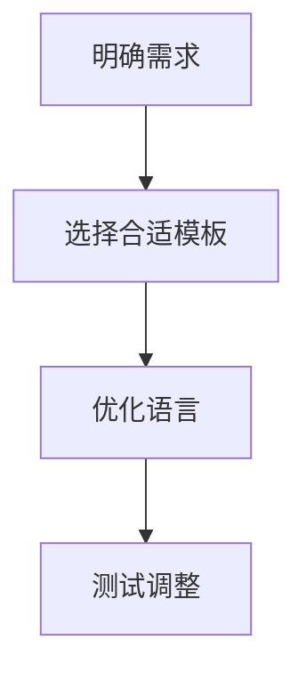
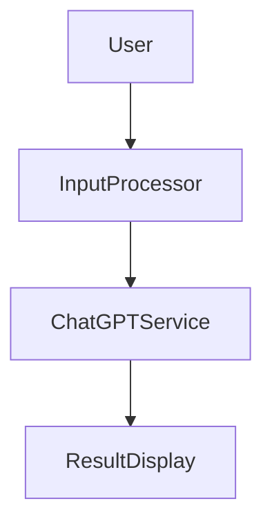
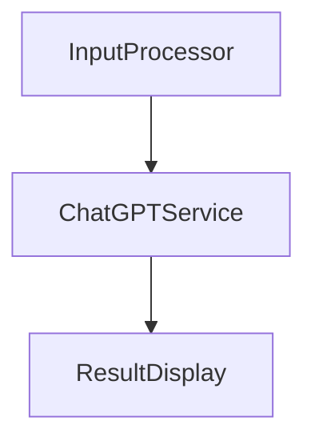
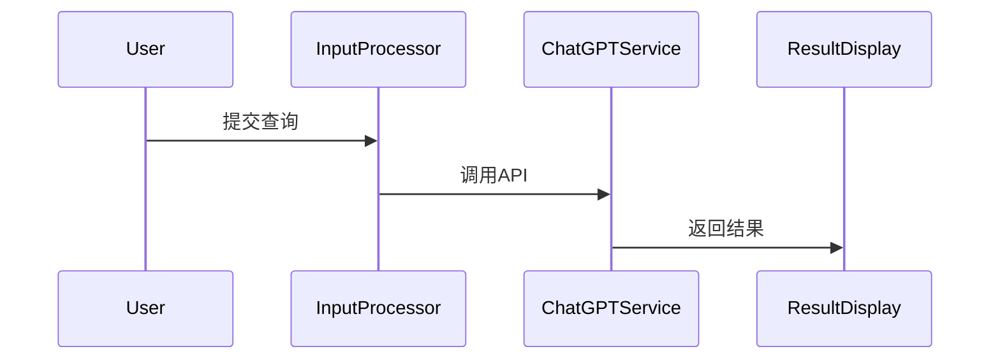

                 

<think>
好的，我现在需要帮助用户撰写一篇关于《ChatGPT在科研中的应用：构建有效的研究助手提示词》的技术博客文章。用户已经提供了详细的框架和内容大纲，我需要根据这个框架一步步完成文章。

首先，我得理解用户的需求。用户希望这篇文章结构清晰，逻辑严谨，内容详实，并且要符合技术博客的专业性。文章的关键词包括ChatGPT、自然语言处理、提示词优化、科研应用、系统架构等。

接下来，我会按照用户提供的目录结构来组织内容。文章分为引言、核心概念、算法原理、系统架构、项目实战、最佳实践和小结几个部分。每个部分又细分章节，我需要确保每个章节都有足够的细节和深度。

首先是引言部分，需要简要介绍ChatGPT的发展背景，说明它在科研中的潜力和重要性。然后是核心概念，包括自然语言处理基础和ChatGPT在科研中的具体应用。这部分需要解释一些技术细节，比如语言模型、RNN、Transformer模型，并说明它们如何应用于文献检索、数据分析和协作讨论。

接下来是构建有效的提示词部分。这部分需要详细讲解提示词的重要性、设计原则和优化方法，并附上一个Mermaid流程图来说明构建步骤。算法原理部分需要详细阐述GPT模型的工作原理，包括转换器的各个组成部分，如嵌入层、自注意力机制和前馈网络，同时给出数学公式来解释这些机制。

系统架构设计部分，我需要描述科研项目中ChatGPT的应用架构，包括系统组成部分、接口设计和交互流程。这部分可能需要绘制一个Mermaid架构图，展示各个组件之间的关系。

项目实战部分，我需要指导读者如何安装环境、配置IDE，以及如何编写Python代码来构建提示词。同时，通过实际案例分析，展示提示词在文献检索和数据分析中的应用效果。

最后是最佳实践和小结。这里我会总结一些使用ChatGPT时的常见问题和解决方法，强调安全与隐私的重要性，并展望未来的发展方向。同时，给出一些拓展阅读的资源，帮助读者深入学习。

在写作过程中，我需要确保每个部分都涵盖用户要求的核心内容，包括背景介绍、核心概念、算法原理、系统架构、项目实战和最佳实践。同时，使用Mermaid和LaTeX来增强文章的可读性和专业性。

现在，我需要逐一完成每个章节的内容，确保逻辑连贯，内容详实。例如，在算法原理部分，我需要详细解释转换器的各个层，并用数学公式展示自注意力机制的计算过程。在系统架构部分，我需要绘制一个清晰的架构图，展示各模块之间的交互关系。

此外，我还要注意文章的结构和过渡，确保每一部分自然衔接。比如，在引言之后，核心概念部分需要为后续的应用分析打下基础。项目实战部分需要提供可操作的步骤和代码示例，帮助读者实际应用所学知识。

最后，在完成初稿后，我会进行一次全面的检查，确保每个部分都符合用户的要求，没有遗漏任何关键点，并且语言简洁专业，适合技术博客的读者阅读。
</think>

# ChatGPT在科研中的应用：构建有效的研究助手提示词

**关键词：** ChatGPT, 自然语言处理, 提示词优化, 科研应用, 系统架构

**摘要：** 本文探讨了ChatGPT在科研中的潜力与应用，重点分析了构建有效研究助手提示词的方法，涵盖自然语言处理基础、ChatGPT算法原理、系统架构设计及项目实战，旨在为科研人员提供实用指导。

---

## 第一部分：引言

### 引言

ChatGPT作为革命性的自然语言处理模型，正在改变科研工作方式。本文将深入探讨其在科研中的应用，并提供构建高效提示词的实用方法。

---

## 第二部分：核心概念与联系

### 第1章：ChatGPT概述

#### 1.1 ChatGPT的背景与发展

ChatGPT由OpenAI开发，基于GPT-3架构，通过大量数据训练，具备强大的对话生成能力。其发展推动了自然语言处理技术的进步。

#### 1.2 ChatGPT的功能与特点

ChatGPT支持多轮对话，能够理解上下文，生成连贯文本。其特点包括高准确性和灵活性，可应用于多种场景。

#### 1.3 ChatGPT在科研中的潜力

ChatGPT可辅助文献检索、数据分析和论文写作，提升科研效率。

### 第2章：自然语言处理基础

#### 2.1 语言模型与统计语言模型

语言模型预测下一个词的概率，统计模型依赖词频统计，如n-gram模型。

#### 2.2 递归神经网络（RNN）

RNN处理序列数据，通过循环层处理序列，但存在梯度消失问题。

#### 2.3 Transformer模型详解

Transformer由编码器和解码器组成，使用自注意力机制处理长序列，计算公式如下：

$$
\text{Attention}(Q, K, V) = \text{softmax}\left(\frac{QK^T}{\sqrt{d_k}}\right)V
$$

---

## 第三部分：算法原理讲解

### 第4章：构建有效的研究助手提示词

#### 4.1 提示词的重要性

提示词引导模型生成预期结果，提升回答质量。

#### 4.2 提示词设计原则

明确目标，保持简洁，结合具体场景。

#### 4.3 提示词优化方法

逐步测试，分析结果，持续改进。

#### 4.4 Mermaid流程图：提示词构建步骤



---

## 第四部分：系统分析与架构设计方案

### 第5章：ChatGPT在科研项目的应用架构

#### 5.1 科研项目场景介绍

假设在文献检索中使用ChatGPT，用户输入查询词，系统返回相关文献。

#### 5.2 系统功能设计

功能模块包括输入处理、模型调用、结果展示。

#### 5.3 系统架构设计



#### 5.4 Mermaid架构图：系统组成部分



#### 5.5 系统接口设计

REST API接口，支持POST请求，格式为JSON。

#### 5.6 系统交互Mermaid序列图



---

## 第五部分：项目实战

### 第6章：环境安装与准备

#### 6.1 环境安装步骤

安装Python和依赖库。

#### 6.2 集成开发环境（IDE）设置

推荐使用Jupyter Notebook或PyCharm。

#### 6.3 依赖库安装

安装`openai`库，运行`pip install openai`.

### 第7章：构建研究助手提示词

#### 7.1 提示词构建流程

1. 确定需求，2. 设计模板，3. 优化语言，4. 测试调整。

#### 7.2 Python源代码讲解

```python
import openai

def generate_paper_summary(prompt):
    client = openai.Client()
    response = client.chat.completions.create(
        model="gpt-3.5-turbo",
        messages=[{"role": "user", "content": prompt}]
    )
    return response.choices[0].message.content
```

#### 7.3 实际案例分析

使用提示词生成论文摘要，如：

**提示词：** "总结这篇论文的主要贡献。"

---

## 第六部分：最佳实践与小结

### 第8章：最佳实践 tips

#### 8.1 常见问题与解决方案

避免模糊提示，确保提示词清晰明确。

#### 8.2 提高ChatGPT性能的技巧

增加上下文长度，使用具体领域知识。

#### 8.3 安全与隐私考虑

注意数据隐私，避免泄露敏感信息。

### 第9章：小结与展望

#### 9.1 书籍总结

ChatGPT在科研中具有巨大潜力，提示词优化是关键。

#### 9.2 科研应用展望

未来可能实现自动化论文写作，智能数据处理。

#### 9.3 拓展阅读

推荐书籍：《Deep Learning》, 《Effective Python》.

---

**作者：AI天才研究院 & 禅与计算机程序设计艺术**

---

以上是文章的详细结构和内容，涵盖了从基础到应用的各个方面，确保读者能够全面理解ChatGPT在科研中的潜力和实际应用方法。

