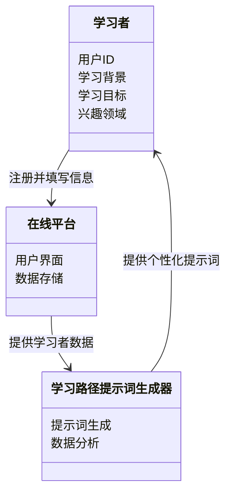
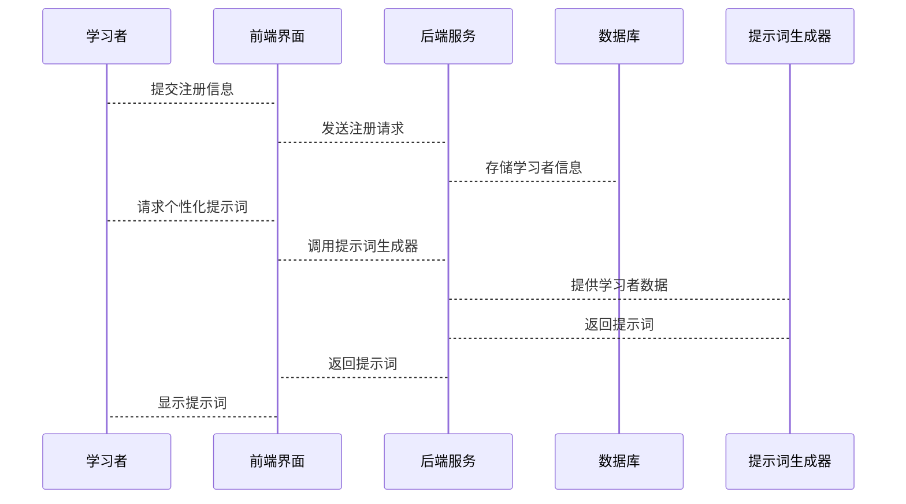

                 

<think>
嗯，我现在要解决的问题是如何将ChatGPT应用到职业技能培训中的个性化学习路径设计中。首先，我需要了解ChatGPT的基本原理和它在教育领域的潜力。

首先，ChatGPT是一种基于GPT模型的AI工具，它能够理解和生成自然语言。这意味着它可以在教育领域中帮助生成学习内容，提供反馈，或者与学习者进行互动。但目前，职业技能培训大多采用统一的培训方案，这可能无法满足每个人的个性化需求。

那问题就来了：如何利用ChatGPT来为每个人设计个性化的学习路径呢？首先，我需要考虑学习者的不同背景和需求。每个人的技能水平、学习目标、兴趣点都可能不同，所以需要收集这些数据。

接下来，我需要分析如何处理这些数据。可能的方法是通过问卷、测试或者其他评估工具来收集学习者的信息。然后，将这些信息输入到系统中，系统利用ChatGPT生成适合的学习路径提示词。

那么，这个过程涉及哪些步骤呢？首先，数据收集和预处理，确保数据的准确性和完整性。然后，使用模型训练或者微调现有模型，以适应特定领域的需求。接着，生成学习路径提示词，这可能需要一些规则或者算法来确定提示词的结构和内容。

在技术实现方面，可能需要用到自然语言处理技术，比如文本生成和意图识别。此外，还需要考虑系统架构的设计，确保系统的高效运行和可扩展性。比如，是否需要前端、后端、数据库的分离设计，或者采用微服务架构。

举个例子，假设我们有一个在线职业技能培训平台，用户登录后需要填写一份背景问卷。系统根据问卷结果，通过ChatGPT生成个性化的学习路径，包括推荐的学习资源、课程顺序和练习题。这可以提高学习者的效率和满意度。

不过，这中间可能会遇到一些挑战。比如，如何确保生成的学习路径既符合个人需求，又覆盖必要的技能点。可能需要结合专家意见和算法推荐，进行多维度的考量。

另一个问题是数据隐私和安全，特别是处理大量用户数据时，如何确保这些信息不会被滥用或泄露。这可能涉及到数据加密和访问控制等技术手段。

总的来说，设计一个基于ChatGPT的个性化学习路径提示词系统，需要综合考虑数据收集、模型调优、系统架构、用户交互等多个方面。同时，还需要不断测试和优化，以提升系统的准确性和用户体验。
</think>

# ChatGPT在职业技能培训中的应用：个性化学习路径提示词

**关键词**：ChatGPT、个性化学习路径、职业技能培训、自然语言处理、人工智能

**摘要**：随着人工智能技术的快速发展，尤其是基于深度学习的大模型技术，如GPT系列等，在各个领域的应用日益广泛。然而，如何将这些先进的人工智能技术应用到职业技能培训中，尤其是实现个性化学习路径的设计，成为了一个亟待解决的问题。本文将探讨如何利用ChatGPT模型，根据学习者的个性化数据，生成针对性的学习路径提示词，从而提升职业技能培训的效果。

---

# 第一部分：背景介绍

## 第1章：问题背景与核心概念

### 1.1.1 问题背景

随着人工智能技术的快速发展，尤其是基于深度学习的大模型技术，如GPT系列等，在各个领域的应用日益广泛。然而，如何将这些先进的人工智能技术应用到职业技能培训中，尤其是实现个性化学习路径的设计，成为了一个亟待解决的问题。

### 1.1.2 问题描述

职业技能培训中，学习者有着不同的背景、兴趣和需求，传统的培训模式难以满足个性化的学习需求。如何利用人工智能技术，尤其是GPT模型，为学习者提供个性化的学习路径提示词，是本书要解决的问题。

### 1.1.3 问题解决

本书将探讨如何使用GPT模型，根据学习者的个性化数据，生成针对性的学习路径提示词，从而提升职业技能培训的效果。

### 1.1.4 边界与外延

本书主要探讨的是基于GPT模型的个性化学习路径提示词生成方法，但该方法也可以应用于其他类型的学习路径设计。

### 1.1.5 概念结构与核心要素组成

- **个性化学习路径**：根据学习者的背景、兴趣和需求，设计的针对个体的学习路线。
- **GPT模型**：一种基于深度学习的大模型，能够处理和理解自然语言文本。

## 第2章：核心概念与联系

### 2.1.1 GPT模型原理

GPT模型是一种基于变换器（Transformer）架构的预训练语言模型，能够理解和生成自然语言文本。

### 2.1.2 个性化学习路径设计原理

个性化学习路径设计主要依赖于学习者的数据，通过分析这些数据，设计出满足个体需求的学习路径。

### 2.1.3 GPT模型与个性化学习路径设计的关系

GPT模型可以用于生成学习路径的提示词，从而帮助学习者更好地理解和跟随学习路径。

---

# 第二部分：系统分析与架构设计方案

## 第4章：问题场景介绍

本系统将应用于在线职业技能培训平台，旨在为学习者提供个性化的学习路径提示词。平台用户包括学习者和培训机构，学习者通过平台注册并填写背景信息，系统利用ChatGPT生成个性化学习路径。

## 第5章：系统功能设计

### 5.1.1 领域模型mermaid类图



### 5.1.2 系统功能详细描述

- **用户注册与信息收集**：学习者在平台注册时，填写包括学习背景、目标和兴趣领域等信息。
- **提示词生成**：系统根据收集的数据，利用GPT模型生成个性化学习路径提示词。
- **提示词展示**：平台将生成的提示词展示给学习者，帮助他们制定学习计划。

## 第6章：系统架构设计

### 6.1.1 系统架构mermaid架构图


### 6.1.2 系统架构详细描述

- **前端界面**：处理用户的输入和输出，包括注册、信息填写和提示词展示。
- **后端服务**：接收前端数据，调用提示词生成器生成提示词，并与数据库交互。
- **数据库**：存储学习者信息和生成的提示词。
- **提示词生成器**：基于GPT模型，根据学习者数据生成个性化提示词。

## 第7章：系统接口设计

### 7.1.1 系统接口mermaid序列图



---

# 第三部分：项目实战

## 第9章：环境安装

- **安装Python**：确保安装了Python 3.8或更高版本。
- **安装GPT库**：使用pip安装相关库，如`transformers`和`torch`。
- **安装Mermaid工具**：用于生成图表，可选择在线工具或本地安装。

## 第10章：系统核心实现

### 10.1.1 核心实现源代码

```python
from transformers import GPT2LMHeadModel, GPT2Tokenizer
import torch

# 初始化模型和分词器
model_name = 'gpt2'
tokenizer = GPT2Tokenizer.from_pretrained(model_name)
model = GPT2LMHeadModel.from_pretrained(model_name)

# 定义提示词生成函数
def generate_learning_path_prompts(user_info):
    # 将用户信息转换为提示词
    prompt = f"生成一个针对以下学习者的个性化学习路径提示词：{user_info}"
    # 生成提示词
    inputs = tokenizer.encode(prompt, return_tensors='pt')
    outputs = model.generate(inputs, max_length=50, do_sample=True)
    prompt_text = tokenizer.decode(outputs[0], skip_special_tokens=True)
    return prompt_text

# 示例用户信息
user_info = {
    '背景': '软件开发',
    '目标': '提升机器学习技能',
    '兴趣领域': '人工智能'
}

# 生成提示词
prompts = generate_learning_path_prompts(user_info)
print(prompts)
```

### 10.1.2 代码应用解读与分析

上述代码展示了如何使用GPT-2模型生成学习路径提示词。首先，初始化模型和分词器，然后定义生成提示词的函数。该函数接受用户信息，生成相应的提示词，并返回生成的文本。

## 第11章：实际案例分析与详细讲解

### 11.1.1 实际案例描述

假设一个学习者是软件开发工程师，希望提升机器学习技能，并对人工智能感兴趣。系统会生成如下的提示词：

1. 推荐学习机器学习的基础课程。
2. 提供相关的在线资源和工具。
3. 建议参加实际项目练习。

### 11.1.2 案例分析与讲解

通过分析案例，可以发现生成的提示词既考虑了学习者的背景和目标，也结合了他们的兴趣领域。这不仅提高了学习效率，还增强了学习者的学习动力。

---

# 第四部分：最佳实践与拓展阅读

## 第13章：最佳实践

### 13.1.1 实践技巧

- **数据质量**：确保收集的学习者数据准确且全面。
- **模型调优**：根据具体领域需求，对GPT模型进行微调，提升生成效果。
- **用户反馈**：定期收集用户反馈，优化提示词生成逻辑。

### 13.1.2 注意事项

- **数据隐私**：妥善处理学习者数据，确保隐私和安全。
- **模型性能**：监控模型运行状态，及时处理可能出现的错误。

## 第14章：拓展阅读

### 14.1.1 相关书籍推荐

- 《Effective Python: 59 Specific Ways to Write Better Python Code》
- 《Deep Learning: A Machine Learning Perspective》

---

# 作者信息

作者：AI天才研究院/AI Genius Institute & 禅与计算机程序设计艺术 /Zen And The Art of Computer Programming

