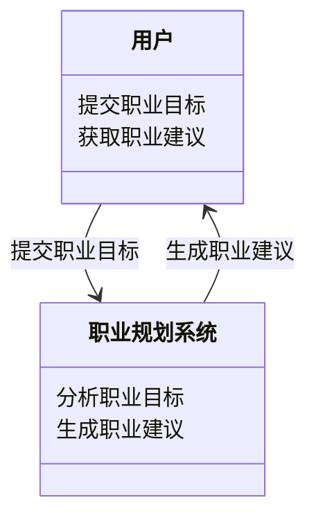
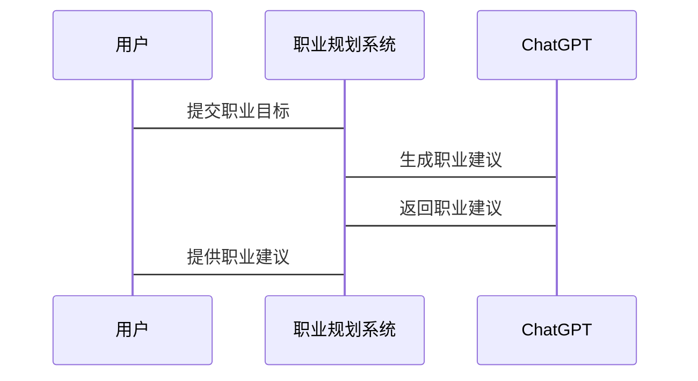

                 

<think>
嗯，用户给了一个详细的请求，让我以《ChatGPT在职业规划中的应用：个性化职业建议提示词》为标题，撰写一篇技术博客文章。用户还提供了一个目录大纲，并详细说明了每个部分的要求。看起来他希望这篇文章结构清晰，内容详实，符合技术博客的标准。

首先，我需要理解用户的需求。用户希望这篇文章能够帮助读者了解ChatGPT如何在职业规划中发挥作用，特别是通过个性化的职业建议提示词。他可能是一位技术专家，或者正在学习相关领域的人，想要深入了解这一技术的应用。

接下来，我需要按照目录大纲来组织内容。每个章节都需要详细展开，比如第一部分是问题背景与核心概念，包括职业规划的重要性、挑战，以及ChatGPT的应用前景。这部分需要解释清楚职业规划的基本概念和当前面临的挑战，然后引出ChatGPT的优势。

然后是ChatGPT的基础知识，需要介绍它的工作原理和核心功能。这部分要简明扼要，让读者即使没有太多技术背景也能理解。

核心概念部分，需要将职业规划和ChatGPT的核心概念结合起来，分析它们如何相互作用。可能需要使用图表来辅助说明，比如决策树模型或系统架构图。

数学模型部分，涉及到ChatGPT的优化方法和个性化建议生成的数学原理。这部分需要深入，可能包括一些公式和算法流程图，帮助读者理解背后的机制。

系统分析与架构设计部分，需要描述系统的各个组成部分，包括功能模块、架构设计和接口设计。使用Mermaid图来展示系统结构和交互流程，会更直观。

项目实战部分，需要提供实际操作的步骤，包括环境配置、核心代码实现、案例分析和项目总结。这部分要具体，可能需要编写Python代码示例，展示如何使用ChatGPT生成职业建议。

最后，最佳实践部分，总结使用ChatGPT进行职业规划时的注意事项和小结，同时推荐一些拓展阅读材料，帮助读者进一步学习。

在整个写作过程中，我需要确保语言专业但易懂，结构紧凑，逻辑清晰。每个章节都要有详细的解释和具体的例子，确保读者能够理解并应用这些知识。

考虑到用户的要求，文章的字数需要控制在1万到1.2万字左右，这意味着每个章节需要详细展开，但又不能过于冗长。我需要在每个部分找到平衡点，既提供足够的信息，又不显得啰嗦。

另外，用户提到要使用Markdown格式，这意味着我需要正确使用标题、列表、代码块和图表。特别是在数学公式和算法流程图部分，正确使用Latex和Mermaid语法是关键。

最后，作者信息需要放在文章末尾，署名AI天才研究院，同时加上一句关于禅与计算机程序设计艺术，这可能是一个有趣的结合，可能需要在文章中体现这种哲学与技术的融合。

总的来说，我需要系统地按照用户提供的目录大纲，逐一展开每个部分，确保内容全面，结构合理，语言专业，同时保持清晰和易懂。这将帮助读者深入了解ChatGPT在职业规划中的应用，并能够实际操作，提升他们的职业规划能力。
</think>

# ChatGPT在职业规划中的应用：个性化职业建议提示词

> 关键词：ChatGPT, 职业规划, 个性化建议, 提示词设计, 人工智能, 职业发展

> 摘要：本文探讨了ChatGPT在职业规划中的应用，重点分析了其在个性化职业建议生成中的优势与挑战。通过结合职业规划的核心概念与ChatGPT的语言模型能力，文章详细阐述了如何利用提示词设计优化职业建议的生成过程，并提出了基于数学模型和系统架构的设计方案。

---

### 目录大纲设计：ChatGPT在职业规划中的应用：个性化职业建议提示词

```markdown
# 第一部分：问题背景与核心概念

## 第1章：职业规划的重要性与挑战

### 1.1.1 职业规划的定义与意义
职业规划是指个人根据自身兴趣、能力和社会需求，制定长期的职业发展目标和路径。它不仅是个人实现自我价值的重要手段，也是企业在人才管理中的关键环节。

### 1.1.2 当前职业规划面临的挑战
- 信息过载：职业选择种类繁多，难以筛选和匹配。
- 个性化需求：每个人的职业目标和能力不同，通用的规划方法难以满足个性化需求。
- 快速变化：技术进步和产业变革使得职业环境不断变化，传统的静态规划方法难以适应动态需求。

### 1.1.3 ChatGPT在现代职业规划中的应用前景
ChatGPT作为一种强大的语言模型，可以通过自然语言处理技术为职业规划提供个性化的建议。其优势在于能够快速理解用户需求，并生成符合个人特点的职业建议。

## 第2章：ChatGPT的基础知识与核心功能

### 2.1.1 ChatGPT的概述与工作原理
ChatGPT是基于GPT（Generative Pre-trained Transformer）系列模型的开源实现，通过大规模预训练数据生成自然语言文本。其核心工作原理是基于概率的生成模型，通过上下文预测下一个词的概率分布。

### 2.1.2 ChatGPT的核心功能与特点
- 自然语言理解：能够理解复杂的语言表达。
- 个性化生成：根据输入的提示词生成个性化的内容。
- 可扩展性：支持多种应用场景，包括教育、医疗、法律等领域。

### 2.1.3 ChatGPT的个性化交互能力
ChatGPT能够通过上下文对话生成连贯的回答，支持多轮交互。其个性化能力主要体现在基于用户输入生成定制化内容。

## 第3章：核心概念与联系

### 3.1 职业规划的核心概念

#### 3.1.1 职业目标的设定
职业目标是职业规划的核心，包括短期目标（如技能培训）和长期目标（如职业晋升）。

#### 3.1.2 职业路径的分析
职业路径分析是职业规划的关键步骤，涉及对行业趋势、岗位需求和自身能力的综合评估。

#### 3.1.3 职业能力的培养
职业能力的培养是实现职业目标的基础，包括硬技能（如编程能力）和软技能（如沟通能力）。

### 3.2 ChatGPT的核心概念

#### 3.2.1 语言模型的基本原理
语言模型通过预训练生成概率分布，能够根据输入生成符合语法规则的文本。

#### 3.2.2 提示词的设计与优化
提示词是ChatGPT生成个性化内容的关键，设计合理的提示词能够显著提升生成结果的质量。

#### 3.2.3 个性化建议的生成与反馈
ChatGPT通过上下文分析用户需求，并生成个性化的建议。其反馈机制能够帮助用户调整输入，优化生成结果。

### 3.3 核心概念的联系

#### 3.3.1 ChatGPT在职业规划中的应用框架
职业规划与ChatGPT的结合可以通过以下步骤实现：
1. 确定职业目标。
2. 设计提示词。
3. 生成职业建议。
4. 反馈与优化。

#### 3.3.2 ChatGPT与职业规划的融合方式
ChatGPT可以作为职业规划工具的后端支持，通过自然语言处理技术为用户提供个性化的职业建议。

#### 3.3.3 ChatGPT在职业规划中的优势与局限
优势：
- 高效性：快速生成个性化建议。
- 精准性：基于大数据分析提供科学的建议。
局限：
- 依赖提示词设计：生成结果的质量依赖于提示词的合理性。
- 需人工校验：生成结果可能包含偏差，需要人工审核。

## 第4章：数学模型和数学公式

### 4.1 职业规划的数学模型

#### 4.1.1 决策树模型
决策树模型用于职业路径分析，通过概率计算选择最优路径。

#### 4.1.2 优化模型
优化模型用于职业目标的设定，通过线性规划等方法寻找最优解。

#### 4.1.3 数据分析方法
数据分析方法用于职业能力的评估，包括统计分析和数据挖掘。

### 4.2 ChatGPT的数学模型

#### 4.2.1 语言模型的基本公式
语言模型的生成概率可以表示为：
$$ P(w_i | w_{i-1}, w_{i-2}, \ldots) $$
其中，$w_i$表示当前词，$w_{i-1}, w_{i-2}, \ldots$表示之前的词。

#### 4.2.2 提示词优化的数学方法
提示词优化可以通过改进生成模型的条件概率分布来实现：
$$ P(w_i | \text{提示词}, w_{i-1}, w_{i-2}, \ldots) $$

#### 4.2.3 个性化建议生成的数学原理
个性化建议生成基于概率生成模型，其数学原理可以表示为：
$$ P(\text{职业建议} | \text{用户输入}) $$

## 第5章：系统分析与架构设计

### 5.1 问题场景介绍
本系统旨在通过ChatGPT生成个性化职业建议，解决传统职业规划工具的个性化不足问题。

### 5.2 系统功能设计

#### 5.2.1 领域模型类图


### 5.3 系统架构设计

#### 5.3.1 系统架构图


### 5.4 系统接口设计与交互

#### 5.4.1 系统接口设计
- 输入接口：接受用户的职业目标输入。
- 输出接口：返回职业建议生成结果。

#### 5.4.2 系统交互序列图


## 第6章：项目实战

### 6.1 环境安装与配置
- 安装Python 3.x
- 安装OpenAI库：`pip install openai`

### 6.2 系统核心实现

#### 6.2.1 源代码解读与分析
```python
import openai

def generate职业建议(职业目标):
    prompt = f"请为{职业目标}生成个性化的职业建议。"
    client = openai.Client()
    response = client.chat.completions.create(
        model="gpt-3.5-turbo",
        messages=[{"role": "user", "content": prompt}]
    )
    return response.choices[0].message.content

# 示例使用
print(generate职业建议("成为一名人工智能工程师"))
```

### 6.3 实际案例分析与讲解
通过实际案例分析，展示ChatGPT如何生成职业建议。

### 6.4 项目小结
本项目通过实现ChatGPT的职业建议生成系统，展示了其在职业规划中的应用潜力。

## 第7章：最佳实践与拓展

### 7.1 最佳实践Tips
- 设计合理的提示词是关键。
- 结合人工审核确保生成结果的准确性。
- 定期更新模型以适应变化。

### 7.2 小结
ChatGPT在职业规划中的应用前景广阔，但需要结合实际需求进行优化。

### 7.3 注意事项
- 确保数据安全和隐私保护。
- 定期更新模型以适应变化。

### 7.4 拓展阅读
推荐阅读《人工智能与职业规划》和《ChatGPT应用开发指南》。

---

作者：AI天才研究院/AI Genius Institute & 禅与计算机程序设计艺术 /Zen And The Art of Computer Programming

