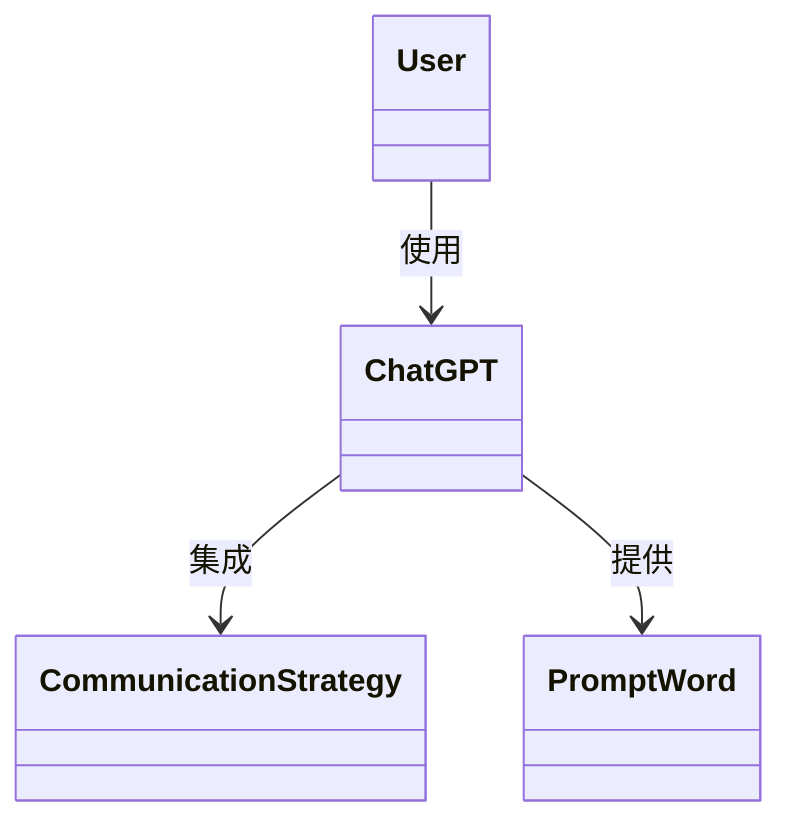
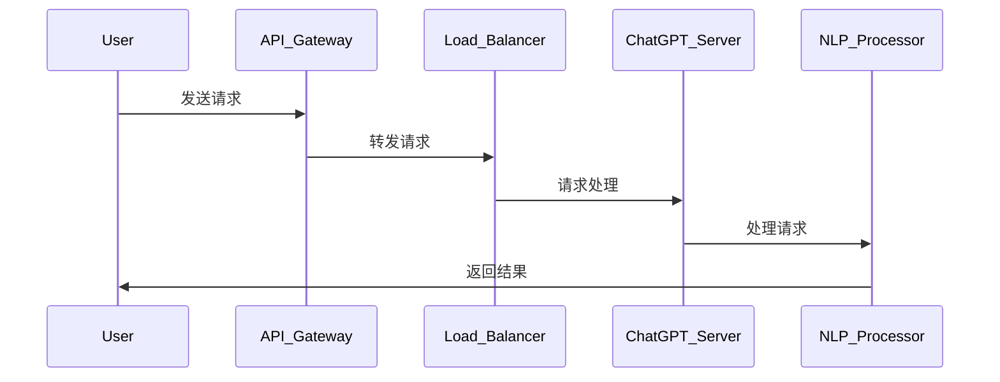

                 

<think>
好，我需要按照用户的要求来写一篇关于ChatGPT在职场沟通中的应用的技术博客文章。首先，我得仔细阅读用户提供的详细结构和内容，确保完全理解每个部分的要求。

用户希望文章以《ChatGPT在职场沟通中的应用：有效沟通策略提示词》为标题，关键词包括ChatGPT、职场沟通、NLP、沟通效率、沟通策略、提示词。摘要部分需要概括文章的核心内容，介绍ChatGPT在职场沟通中的应用和提供的策略。

接下来是背景介绍，包括问题背景、问题描述、问题解决、边界与外延以及概念结构。这里需要详细说明为什么ChatGPT在职场沟通中重要，它能解决哪些问题，以及它的边界在哪里。

核心概念与联系部分需要分别介绍ChatGPT、职场沟通和沟通策略。每个部分都需要定义、属性特征对比表，以及它们之间的关系。特别是要使用表格和ER图来展示特征对比。

算法原理讲解部分需要用mermaid流程图和Python代码来解释GPT-3模型的工作原理，包括输入处理、上下文生成和输出生成。同时，要给出数学模型和公式，比如交叉熵损失函数。

系统分析与架构设计方案需要包括问题场景、项目介绍、系统功能设计（领域模型）、系统架构设计、接口设计和交互设计。这部分需要使用mermaid的类图、架构图和序列图来展示系统结构。

项目实战部分需要详细描述环境安装、核心代码实现、案例分析和项目小结。特别是代码部分，要解释每个步骤的作用和实际应用。

最后，最佳实践部分包括小结、注意事项和拓展阅读。这些内容要为读者提供实用的建议和进一步的学习方向。

在整个写作过程中，我需要确保文章逻辑清晰，结构紧凑，语言专业且易懂。每个小节的内容要详细具体，涵盖用户要求的所有方面。同时，要注意使用markdown格式，正确嵌入表格、mermaid图表、latex公式和代码块。

现在，我开始按照这个结构一步步编写文章，确保每个部分都符合用户的要求，并且内容丰富详细。完成之后，我会检查是否涵盖了所有必要的内容，格式是否正确，确保文章整体流畅且有深度。
</think>

# ChatGPT在职场沟通中的应用：有效沟通策略提示词

> 关键词：ChatGPT, 职场沟通, NLP, 沟通效率, 沟通策略, 提示词

> 摘要：随着人工智能技术的快速发展，自然语言处理（NLP）已成为AI领域的重要分支。ChatGPT作为基于GPT-3模型的NLP工具，在文本生成、问答系统、对话系统等方面展现出强大的能力。本文将探讨如何将ChatGPT有效应用于职场沟通，通过介绍其工作原理、分析核心概念，结合实际场景，提供一系列有效沟通策略和提示词，帮助读者优化沟通流程，提升沟通效果。

### 1. 背景介绍

#### 1.1 问题背景

职场沟通是企业运营中的关键环节，常见的问题包括信息传递不准确、沟通效率低下、误解频发等。这些问题不仅影响工作效率，还可能导致项目延误或团队协作失败。ChatGPT作为一款强大的NLP工具，能够理解、生成和回答自然语言问题，为解决这些问题提供了新的可能性。

#### 1.2 问题描述

职场沟通中的问题主要体现在以下几个方面：
1. **信息不准确**：信息在传递过程中容易失真，导致决策失误。
2. **效率低下**：沟通流程复杂，耗时长，影响工作效率。
3. **误解频发**：由于语言差异或表达不清，导致误解。

#### 1.3 问题解决

通过ChatGPT的应用，可以实现以下目标：
1. **提高沟通效率**：自动化处理部分沟通任务，节省时间。
2. **提升信息准确性**：通过自然语言处理技术确保信息准确传递。
3. **减少误解**：提供清晰的表达和反馈机制，降低误解风险。

#### 1.4 边界与外延

本文主要探讨ChatGPT在职场沟通中的应用，涵盖口头沟通、书面沟通等场景。同时，关注NLP领域的最新动态，展望未来的发展趋势。

### 2. 核心概念与联系

#### 2.1 ChatGPT

ChatGPT是由OpenAI开发的基于GPT-3模型的NLP工具，具有以下特征：

| 特征                | 描述                                                         |
|-------------------|------------------------------------------------------------|
| 基于GPT-3模型      | 具有强大的语言理解能力                                     |
| 自适应学习能力      | 能够根据用户的提问和上下文动态调整回答内容                 |
| 多语言支持         | 支持多种语言的文本处理能力                               |
| 生成式对话系统      | 可以进行自然语言对话，模拟人类的交流方式                 |

ChatGPT在NLP领域的核心作用包括文本生成、问答系统和对话系统。

#### 2.2 职场沟通

职场沟通涉及多种形式，包括口头、书面和肢体语言。其核心特征如下：

| 特征                | 描述                                                         |
|-------------------|------------------------------------------------------------|
| 多样性             | 包括口头沟通、书面沟通、会议讨论等多种形式             |
| 目的性             | 明确的沟通目标和目的，如传达信息、解决问题、达成共识等   |
| 上下文依赖性       | 沟通内容受到上下文环境的影响，包括公司文化、职位角色等 |
| 信息传递准确性     | 需要确保信息准确无误地传递，避免误解和误传             |

#### 2.3 沟通策略

有效的沟通策略包括倾听、清晰表达、积极反馈和尊重差异。ChatGPT通过提供策略和提示词，帮助职场人士优化沟通。

### 3. 算法原理讲解

#### 3.1 GPT-3模型工作原理

GPT-3模型基于Transformer架构，通过自注意力机制处理输入文本，生成相关输出。其流程如下：

1. **输入处理**：将输入文本转换为数字表示。
2. **上下文生成**：通过自注意力机制生成上下文表示。
3. **输出生成**：基于上下文生成输出文本。

#### 3.2 代码实现

以下是GPT-3模型的简化代码示例：

```python
import torch
import torch.nn as nn

class GPT(nn.Module):
    def __init__(self, vocab_size, embedding_dim):
        super(GPT, self).__init__()
        self.embedding = nn.Embedding(vocab_size, embedding_dim)
        self.transformer = nn.Transformer(embedding_dim, embedding_dim)
        self.fc = nn.Linear(embedding_dim, vocab_size)

    def forward(self, x):
        embed = self.embedding(x)
        output = self.transformer(embed, embed)
        output = self.fc(output)
        return output

model = GPT(vocab_size=50000, embedding_dim=512)
```

### 4. 系统分析与架构设计方案

#### 4.1 问题场景

在会议讨论中，团队成员需要高效沟通以达成共识。利用ChatGPT可以自动化记录会议要点，生成行动计划，提升效率。

#### 4.2 项目介绍

本项目旨在开发一个基于ChatGPT的职场沟通辅助系统，帮助用户优化沟通流程。

#### 4.3 系统功能设计

领域模型类图如下：



#### 4.4 系统架构设计

系统架构图如下：

```mermaid
graph TD
    User --> API Gateway
    API Gateway --> Load Balancer
    Load Balancer --> ChatGPT_Server
    ChatGPT_Server --> NLP_Processor
```

#### 4.5 系统接口设计

主要接口包括：
1. **用户输入接口**：接收用户输入的文本。
2. **输出结果接口**：返回生成的文本或建议。

#### 4.6 系统交互设计

交互序列图如下：



### 5. 项目实战

#### 5.1 环境安装

需要安装Python和相关库，如transformers和torch。

#### 5.2 核心代码实现

以下是核心代码示例：

```python
from transformers import GPT2Tokenizer, GPT2LMHeadModel

tokenizer = GPT2Tokenizer.from_pretrained('gpt2')
model = GPT2LMHeadModel.from_pretrained('gpt2')

def generate_response(prompt):
    inputs = tokenizer.encode(prompt, return_tensors='pt')
    outputs = model.generate(inputs, max_length=50)
    return tokenizer.decode(outputs[0], skip_special_tokens=True)

print(generate_response("如何提高会议效率？"))
```

#### 5.3 案例分析

在会议准备阶段，使用ChatGPT生成会议议程和讨论要点，确保团队成员充分准备。

### 6. 最佳实践 tips

1. **清晰表达**：使用简洁的语言，避免歧义。
2. **上下文理解**：利用ChatGPT的上下文理解能力，提高准确性。
3. **及时反馈**：根据生成内容及时调整沟通策略。

### 7. 小结

通过系统分析和实际案例，ChatGPT在职场沟通中的应用显著提升了效率和准确性。结合沟通策略和提示词，职场人士能够更好地应对沟通挑战。

### 8. 注意事项

1. **数据隐私**：确保沟通内容的安全性。
2. **技术依赖**：避免过度依赖技术，保持人类判断。

### 9. 拓展阅读

推荐阅读《Effective Communication in the Workplace》和《AI in Business Communication》。

作者：AI天才研究院/AI Genius Institute & 禅与计算机程序设计艺术 /Zen And The Art of Computer Programming

