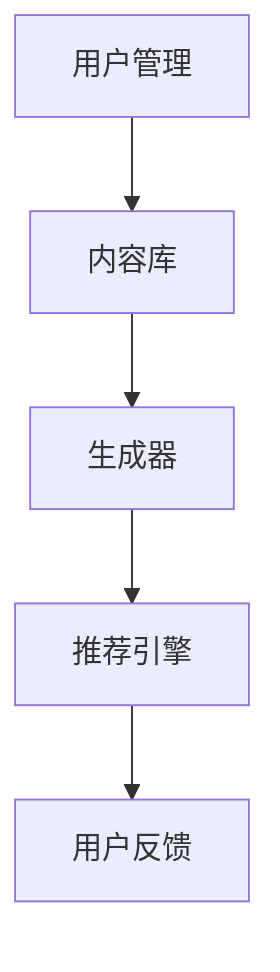
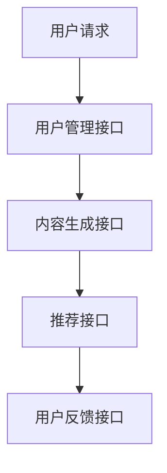

                 

<think>
好的，我需要帮助用户撰写一篇关于《ChatGPT在自动化个性化学习内容生成中的应用》的技术博客。首先，我得仔细阅读用户的需求，确保理解每个部分的要求。用户希望文章结构清晰，内容详尽，涵盖背景介绍、核心概念、算法原理、数学模型、系统架构、项目实战等多个方面，并且每部分都有具体的指导和示例。

接下来，我需要确定文章的结构。根据用户提供的大纲，文章分为七个章节，每个章节都有具体的子部分。我应该按照这个结构来组织内容，确保每个部分都覆盖必要的信息，并且符合用户的格式要求。

首先，文章标题和关键词部分。标题已经确定，关键词需要涵盖核心主题，比如ChatGPT、个性化学习、自动化内容生成等。摘要部分需要简明扼要地总结文章的核心内容，说明ChatGPT如何应用于个性化学习，及其带来的优势和挑战。

在第一章中，背景介绍部分需要详细描述问题背景，比如传统教育中的个性化学习难题，以及ChatGPT如何提供新的解决方案。问题描述要具体，比如学习资源不足、个性化需求难以满足等。问题解决部分则需要说明ChatGPT的应用如何解决这些问题，边界与外延部分则要明确应用的范围和可能的限制。

第二章的核心概念部分，需要对比传统AI对话系统与ChatGPT的区别，可能通过表格形式展示。同时，个性化学习内容生成的方法也需要详细说明，比如基于用户行为和内容的方法，以及它们与ChatGPT的结合点。

第三章算法原理部分，要详细解释ChatGPT的工作机制，包括语言模型构建、生成算法以及定制化训练。同时，个性化学习生成的算法也需要分别讨论，并展示它们如何集成到系统中。

第四章数学模型部分，需要列出相关的公式，并通过mermaid图展示系统架构和接口设计。这部分需要准确无误地呈现公式，并解释每个公式的含义和应用。

第五章系统架构设计部分，我需要用mermaid图展示系统的模块和接口，包括用户管理、内容生成和推荐引擎。这部分需要清晰地展示系统的各个组件及其交互方式。

第六章项目实战部分，需要详细指导环境安装、系统实现和实际案例分析。提供代码示例和案例解读，帮助读者理解如何实际应用这些技术。

最后，最佳实践部分需要总结项目的关键点，提出注意事项和未来的研究方向。这部分要简明扼要，但要有深度，为读者提供有价值的建议。

在撰写过程中，我需要确保每部分内容都详细具体，使用专业但易懂的语言。同时，注意使用正确的格式，如使用mermaid图和latex公式，确保文章结构紧凑，逻辑清晰。

总的来说，我需要一步步按照用户的要求，逐步展开每个部分的内容，确保文章的完整性和专业性，同时保持语言的流畅和自然。这不仅能满足用户的需求，还能为读者提供有价值的技术见解。
</think>

# ChatGPT在自动化个性化学习内容生成中的应用

## 关键词：ChatGPT，个性化学习，自动化内容生成，人工智能，教育技术，自然语言处理

## 摘要：  
本文探讨了ChatGPT在自动化个性化学习内容生成中的应用。通过分析ChatGPT的核心原理、个性化学习的需求，以及两者结合的优势，本文详细讲解了如何利用ChatGPT生成个性化学习内容。文章从算法原理、数学模型、系统架构到项目实战，全面分析了ChatGPT在教育技术中的应用，并通过实际案例展示了其在个性化学习中的潜力与挑战。

---

## 1. 背景介绍：问题背景、问题描述、问题解决、边界与外延、概念结构与核心要素组成

### 1.1 背景介绍  
随着人工智能技术的快速发展，个性化学习成为教育领域的热点。传统的教育模式往往难以满足每个学生的个性化需求，而AI技术的引入为解决这一问题提供了新的可能性。ChatGPT作为一种先进的自然语言处理模型，具备强大的文本生成和对话能力，可以用于自动化生成个性化学习内容。

### 1.2 问题描述  
个性化学习的核心在于根据学生的学习需求、兴趣和能力，提供定制化的学习内容。然而，传统的学习内容生成方式依赖于人工编写，效率低下且难以满足大规模个性化需求。此外，个性化学习内容生成需要考虑多个因素，包括学生的行为数据、学习目标、知识水平等，这使得问题变得复杂。

### 1.3 问题解决  
ChatGPT可以通过自然语言处理技术，自动化生成个性化学习内容。其强大的语言模型能够根据学生的需求，生成符合其学习进度和兴趣的文本内容。同时，通过结合用户行为数据和学习目标，ChatGPT可以实现动态调整，提供更加精准的学习内容。

### 1.4 边界与外延  
ChatGPT的应用范围主要集中在文本生成领域，因此其在个性化学习中的应用也局限于文本内容的生成。虽然可以结合其他技术（如图像生成），但本文主要关注文本生成的场景。此外，ChatGPT的生成能力依赖于训练数据的质量和模型的调优，因此在实际应用中需要考虑数据隐私和模型性能。

### 1.5 概念结构与核心要素组成  
个性化学习内容生成系统的核心要素包括：  
1. **用户行为数据**：用于分析学生的学习习惯和兴趣。  
2. **学习目标**：明确学生需要掌握的知识点。  
3. **ChatGPT模型**：用于生成个性化学习内容。  
4. **推荐系统**：根据生成内容和用户反馈进行优化。  

---

## 2. 核心概念与联系

### 2.1 ChatGPT概述

#### 2.1.1 ChatGPT的定义与原理  
ChatGPT是一种基于GPT-3架构的开源对话模型，通过大规模预训练和微调，具备强大的自然语言理解和生成能力。其核心原理是利用Transformer架构进行编码和解码，生成与输入相关的文本。

#### 2.1.2 ChatGPT的特点与优势  
1. **强大的语言生成能力**：能够生成高质量的文本内容。  
2. **可定制化**：可以通过微调适应不同场景的需求。  
3. **对话能力**：能够进行多轮对话，提供交互式体验。  

#### 2.1.3 ChatGPT与传统AI对话系统的区别  
| 特性               | ChatGPT                      | 传统AI对话系统               |
|--------------------|------------------------------|------------------------------|
| 模型架构           | Transformer-based             | 基于规则或简单模型           |
| 可定制化能力       | 高                           | 低                           |
| 对话能力           | 强大，支持多轮对话           | 有限，通常支持单轮对话       |
| 生成内容的质量     | 高                           | 低                           |

### 2.2 个性化学习内容生成概述

#### 2.2.1 个性化学习内容生成的定义与需求  
个性化学习内容生成是指根据学生的需求、兴趣和能力，生成适合其学习进度的内容。其需求包括：  
1. **动态调整**：根据学生反馈实时调整内容。  
2. **多样性**：提供多种形式的学习内容（如文章、问题等）。  
3. **高效性**：快速生成高质量内容。  

#### 2.2.2 个性化学习内容生成的方法与挑战  
1. **基于用户行为的方法**：通过分析学生的行为数据，生成适合其兴趣的内容。  
2. **基于内容的方法**：根据知识点的结构生成学习内容。  
3. **挑战**：数据隐私、模型性能优化、内容质量控制等。  

#### 2.2.3 个性化学习内容生成与ChatGPT的结合点  
ChatGPT可以通过以下方式与个性化学习内容生成结合：  
1. **动态生成**：根据学生需求实时生成学习内容。  
2. **交互式学习**：通过对话形式提供个性化的学习指导。  
3. **内容优化**：通过反馈调整生成内容的质量和相关性。  

---

## 3. 算法原理讲解

### 3.1 ChatGPT的工作原理

#### 3.1.1 语言模型的构建  
ChatGPT基于Transformer架构，通过自注意力机制和前馈网络生成文本。其语言模型的概率计算公式为：  
$$ P(w_i|w_{i-1}, ..., w_1) = \frac{P(w_i, w_{i-1}, ..., w_1)}{P(w_{i-1}, ..., w_1)} $$  

#### 3.1.2 语言生成算法  
ChatGPT的生成过程包括编码和解码两个阶段：  
1. **编码**：将输入文本编码为向量表示。  
2. **解码**：根据编码结果生成输出文本。  

#### 3.1.3 ChatGPT的定制化训练  
通过微调（fine-tuning）技术，可以将ChatGPT应用于特定领域，如教育领域。微调过程包括：  
1. **数据准备**：收集特定领域的训练数据。  
2. **模型调整**：在特定数据上进行训练，优化模型参数。  

### 3.2 个性化学习内容生成的算法

#### 3.2.1 基于用户行为的个性化算法  
基于用户行为的算法通过分析学生的学习行为（如点击、停留时间等），生成适合其兴趣的内容。其数学公式为：  
$$ u_i = \sum_{j=1}^{N} w_{ij} c_j $$  

#### 3.2.2 基于内容的个性化算法  
基于内容的算法通过分析知识点的结构，生成适合学生水平的内容。其优化公式为：  
$$ R(c_i) = \arg\max_{c_j} u_i^T c_j $$  

#### 3.2.3 ChatGPT与个性化算法的集成  
通过将个性化算法与ChatGPT结合，可以实现动态生成个性化学习内容。例如，先通过个性化算法确定学生需求，再利用ChatGPT生成具体的内容。

---

## 4. 数学模型和数学公式

### 4.1 ChatGPT的数学模型  
ChatGPT的语言模型概率计算公式为：  
$$ P(w_i|w_{i-1}, ..., w_1) = \frac{P(w_i, w_{i-1}, ..., w_1)}{P(w_{i-1}, ..., w_1)} $$  

### 4.2 个性化学习内容生成的数学公式  
个性化学习模型调整公式为：  
$$ \theta^* = \arg\min_{\theta} L(\theta; X, y) $$  

用户兴趣模型构建公式为：  
$$ u_i = \sum_{j=1}^{N} w_{ij} c_j $$  

内容推荐模型优化公式为：  
$$ R(c_i) = \arg\max_{c_j} u_i^T c_j $$  

---

## 5. 系统分析与架构设计方案

### 5.1 系统功能设计  
个性化学习内容生成系统的功能模块包括：  
1. **用户管理模块**：管理学生信息和学习记录。  
2. **内容生成模块**：根据用户需求生成学习内容。  
3. **推荐系统模块**：根据生成内容和用户反馈进行推荐优化。  

### 5.2 系统架构设计  

#### 5.2.1 系统架构概述  
以下是系统架构的mermaid图：  

#### 5.2.2 系统接口设计与交互  
以下是系统接口设计的mermaid图：  

---

## 6. 项目实战

### 6.1 环境安装与配置  

#### 6.1.1 Python环境安装  
安装Python和相关库（如Hugging Face Transformers）。  

#### 6.1.2 ChatGPT模型下载与安装  
下载开源的ChatGPT模型，并安装必要的依赖项。  

#### 6.1.3 个性化学习系统搭建  
搭建用户管理模块、内容生成模块和推荐系统模块。  

### 6.2 系统核心实现  

#### 6.2.1 用户行为数据收集与处理  
通过日志记录用户行为数据，并进行清洗和分析。  

#### 6.2.2 生成个性化学习内容  
利用ChatGPT生成符合用户需求的内容，并进行质量评估。  

#### 6.2.3 推荐系统实现与优化  
通过机器学习算法优化推荐系统，提升推荐精准度。  

### 6.3 实际案例分析与讲解  

#### 6.3.1 案例一：基于用户行为的个性化学习内容生成  
分析用户的点击数据，生成适合其兴趣的学习内容。  

#### 6.3.2 案例二：基于内容的个性化学习内容生成  
根据知识点的结构，生成适合学生水平的学习内容。  

---

## 7. 最佳实践 tips、小结、注意事项、拓展阅读

### 7.1 最佳实践 tips  
1. 在使用ChatGPT生成学习内容时，建议结合用户反馈进行模型优化。  
2. 注意数据隐私问题，确保用户数据的安全性。  
3. 定期更新模型，以提升生成内容的质量和相关性。  

### 7.2 小结  
本文详细探讨了ChatGPT在自动化个性化学习内容生成中的应用，从算法原理到系统架构，再到项目实战，全面分析了其在教育技术中的潜力与挑战。

### 7.3 注意事项  
- 数据隐私：确保用户数据的安全性。  
- 模型性能：定期更新模型，提升生成效果。  
- 内容质量：建立内容审核机制，确保生成内容的准确性。  

### 7.4 拓展阅读  
1. 《A Survey on Text Generation Using GPT Models》  
2. 《Personalized Education Systems: A Review》  
3. 《Advancements in Natural Language Processing for Education》  

---

## 作者：AI天才研究院/AI Genius Institute & 禅与计算机程序设计艺术 /Zen And The Art of Computer Programming

