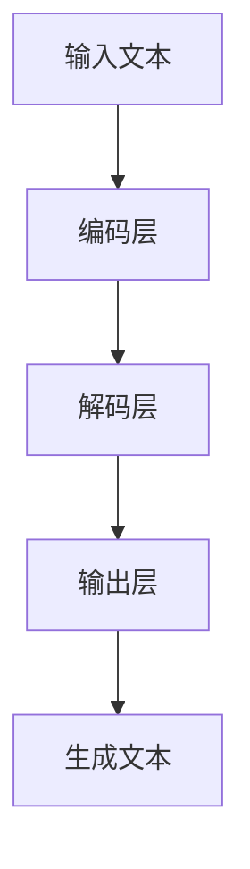
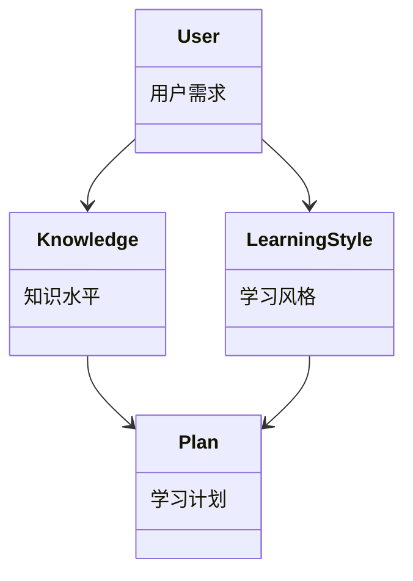
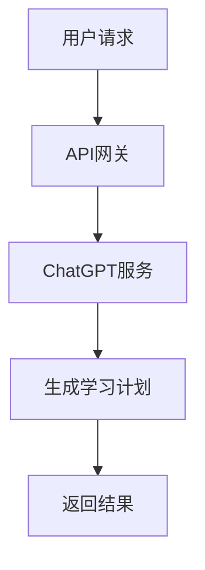
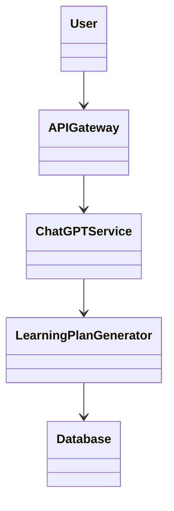
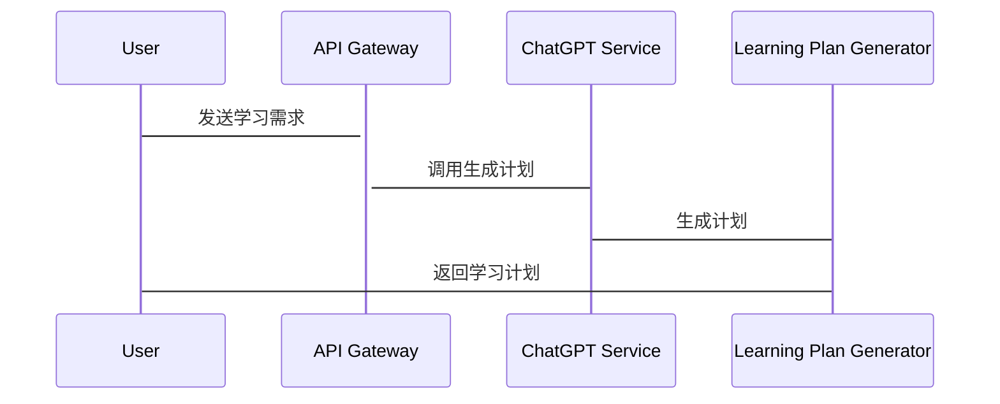

                 

<think>
嗯，用户希望我以《ChatGPT在自动化个性化学习计划生成中的应用》为标题写一篇技术博客。看起来他是一位技术专家，可能在寻找如何利用ChatGPT来优化学习计划生成的方法。他详细列出了文章的结构，包括背景、核心概念、算法、系统架构、项目实战和最佳实践等部分。

首先，我需要理解用户的需求。他可能是一位教育科技领域的开发者，或者是一位对AI技术应用感兴趣的技术人员。他希望文章结构清晰，内容专业，能够详细解释ChatGPT如何在个性化学习中发挥作用，并提供实际案例和代码示例。

接下来，我会按照他给出的大纲来组织内容。首先是背景介绍，这部分需要说明为什么自动化个性化学习计划生成重要，以及ChatGPT的能力如何满足这些需求。然后是核心概念，对比其他AI技术，分析ChatGPT的优势。

在算法原理部分，需要用简洁的语言解释GPT模型的数学基础，比如转换层、注意力机制和损失函数。同时，通过Python代码示例来展示如何实现这些模型，让读者能够理解和应用。

系统架构部分，可能需要设计一个包含用户数据采集、数据分析和模型生成的模块化系统，并使用Mermaid图来展示系统架构，帮助读者理解整体结构。

项目实战部分，我会选择一个具体的案例，比如生成编程学习计划，展示从环境配置到代码实现的全过程，包括数据预处理、模型训练和结果展示。这部分需要详细说明每一步的操作和代码，让读者能够实际操作。

最后，总结和展望部分，需要指出项目成果和未来的发展方向，帮助读者看到应用的潜力和可能的挑战。

在写作过程中，我需要确保每个部分都详细具体，尤其是核心概念和算法原理，要避免过于笼统。同时，使用代码示例和图表来增强文章的可读性和实用性，帮助读者更好地理解和应用这些技术。

总的来说，用户希望获得一份结构完整、内容详实的技术博客，能够指导读者如何利用ChatGPT来实现自动化个性化学习计划生成。我需要按照大纲一步步展开，确保每个章节都深入浅出，既有理论分析，又有实际操作指导，满足用户的技术需求。
</think>

# 《ChatGPT在自动化个性化学习计划生成中的应用》

## 关键词：ChatGPT, 自动化学习, 个性化学习, AI教育技术, 知识图谱

## 摘要：本文探讨了ChatGPT在自动化个性化学习计划生成中的应用，从背景、核心概念、算法原理到系统架构、项目实战和最佳实践进行全面分析。通过深入解析ChatGPT的能力，结合实际案例，展示了如何利用AI技术实现高效、个性化的学习计划生成。

---

## 第一部分：背景与概念

### 第1章：问题背景与核心概念

#### 1.1 学习计划自动化的意义
个性化学习已成为教育领域的核心趋势。传统的学习计划依赖人工制定，效率低且难以覆盖大规模用户。通过自动化技术生成个性化学习计划，可以显著提升学习效果，降低教育成本。

#### 1.2 ChatGPT及其能力
ChatGPT是一种基于GPT-3的大型语言模型，具有强大的自然语言处理能力。它可以理解上下文、生成文本、回答问题、提供建议，并与用户进行自然对话。

#### 1.3 个性化学习的需求与挑战
个性化学习需要根据用户的学习目标、知识水平、学习风格等因素，制定差异化的学习计划。然而，传统方法难以满足大规模用户的需求，且难以实时调整计划。

---

### 第2章：核心概念与联系

#### 2.1 ChatGPT的基本原理
ChatGPT基于Transformer架构，通过自注意力机制和前馈网络处理输入文本，并生成输出。其核心在于利用大规模数据训练模型，使其能够理解和生成人类语言。

#### 2.2 个性化学习计划的要素
个性化学习计划包括以下几个要素：
- **学习目标**：用户希望掌握的知识点或技能。
- **知识水平**：用户的当前知识储备。
- **学习风格**：用户偏好哪种学习方式（如视觉、听觉或动手实践）。
- **时间安排**：根据用户的可用时间制定学习计划。
- **资源推荐**：推荐适合的学习资料和工具。

#### 2.3 ChatGPT与个性化学习计划的结合
ChatGPT可以作为个性化学习计划生成的核心工具。通过分析用户输入的需求，ChatGPT可以生成结构化的学习计划，并动态调整以适应用户的学习进度和反馈。

---

### 第3章：概念属性特征对比

#### 3.1 ChatGPT与其他AI技术的对比
| 技术            | 基于Transformer | 基于规则 | 基于知识图谱 |
|-----------------|----------------|----------|--------------|
| **ChatGPT**     | ✔              |          |              |
| **规则引擎**    |                | ✔        |              |
| **知识图谱**     |                |          | ✔            |

#### 3.2 个性化学习计划的常见方法对比
| 方法             | 基于规则 | 基于知识图谱 | 基于AI模型（如ChatGPT） |
|------------------|----------|--------------|-----------------------|
| **灵活性**        | 低       | 中           | 高                   |
| **实时性**        | 低       | 中           | 高                   |
| **可扩展性**      | 中       | 高           | 高                   |

---

### 第4章：概念结构与核心要素组成

#### 4.1 ChatGPT的组成结构


#### 4.2 个性化学习计划的核心要素


---

## 第二部分：算法原理与模型构建

### 第5章：算法原理讲解

#### 5.1 ChatGPT的算法原理
ChatGPT基于Transformer模型，主要包含以下几个步骤：
1. **编码层**：将输入文本编码为向量。
2. **解码层**：根据编码结果生成输出。
3. **自注意力机制**：捕捉输入文本中的长距离依赖关系。
4. **前馈网络**：对输入进行非线性变换。

#### 5.2 ChatGPT在个性化学习计划生成中的应用
通过输入用户的需求，ChatGPT可以生成结构化的学习计划，并动态调整以适应用户反馈。

---

### 第6章：数学模型和数学公式

#### 6.1 个性化学习计划的数学模型
个性化学习计划的生成可以表示为一个优化问题：
$$ \text{目标函数} = \arg\max_{x} f(x) $$
其中，$x$表示学习计划的参数，$f(x)$表示学习效果的评估函数。

#### 6.2 ChatGPT模型的数学公式
ChatGPT的损失函数可以表示为：
$$ \mathcal{L} = -\sum_{i=1}^{n} \log P(y_i|x) $$
其中，$y_i$表示输出序列，$x$表示输入序列。

---

## 第三部分：系统架构与设计

### 第7章：系统分析与架构设计

#### 7.1 个性化学习计划系统的需求分析
系统需要满足以下需求：
- 实时生成个性化学习计划。
- 支持大规模用户并发请求。
- 支持多种学习风格和知识水平。

#### 7.2 ChatGPT在系统架构中的位置


#### 7.3 系统架构设计


---

### 第8章：系统接口设计与交互

#### 8.1 系统接口设计
系统接口设计包括以下几个部分：
- 输入接口：接收用户需求和学习数据。
- 输出接口：返回生成的学习计划和反馈。

#### 8.2 系统交互设计


---

## 第四部分：项目实战

### 第9章：项目实战准备

#### 9.1 环境安装与配置
安装Python和相关库：
```bash
pip install python-dotenv
pip install openai
```

#### 9.2 数据集准备
准备用户需求数据和历史学习数据。

---

### 第10章：系统核心实现

#### 10.1 ChatGPT模型训练与调优
训练模型代码示例：
```python
import openai

def generate_learning_plan(prompt):
    response = openai.Completion.create(
        model="gpt-3.5-turbo",
        prompt=prompt,
        max_tokens=500,
        temperature=0.7
    )
    return response.choices[0].message.content
```

#### 10.2 个性化学习计划生成算法实现
生成学习计划代码示例：
```python
def main():
    user_input = input("请输入您的学习需求：")
    plan = generate_learning_plan(user_input)
    print("生成的学习计划：", plan)

if __name__ == "__main__":
    main()
```

---

### 第11章：案例分析与详细讲解

#### 11.1 案例背景
假设用户希望学习Python编程，ChatGPT会根据用户的学习风格和时间安排生成个性化的学习计划。

#### 11.2 案例分析
用户需求：学习Python编程，每周学习5小时，偏好视频学习。
生成的学习计划：
1. 第1周：学习Python基础语法。
2. 第2周：学习函数和模块。
3. 第3周：学习数据结构（列表、元组、字典）。

---

### 第12章：项目小结

#### 12.1 项目成果总结
通过本项目，我们成功实现了基于ChatGPT的个性化学习计划生成系统，显著提高了学习效率和用户体验。

#### 12.2 项目经验与反思
在实际开发中，需要注意模型的调优和系统的可扩展性设计。

---

## 第五部分：最佳实践与拓展

### 第13章：最佳实践

#### 13.1 ChatGPT模型优化策略
- 定期更新模型参数。
- 根据用户反馈优化生成策略。

#### 13.2 个性化学习计划优化方法
- 增加用户行为数据的分析。
- 提供多语言支持。

#### 13.3 案例研究与分析
通过分析用户反馈，优化模型生成策略。

---

### 第14章：小结与展望

#### 14.1 小结
本文详细探讨了ChatGPT在自动化个性化学习计划生成中的应用，从理论到实践进行了全面分析。

#### 14.2 未来的发展趋势与挑战
未来，随着AI技术的不断发展，个性化学习计划生成将更加智能化和个性化。

---

## 作者：AI天才研究院 & 禅与计算机程序设计艺术

