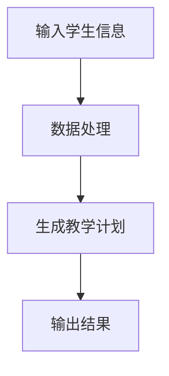
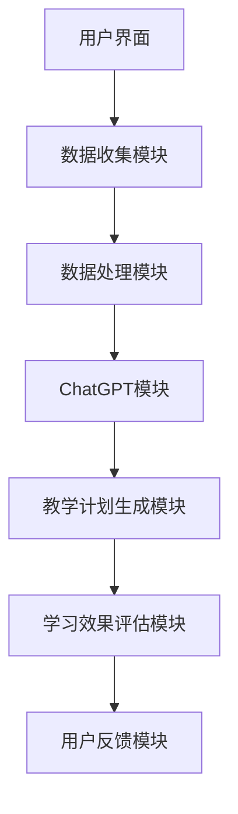

                 

<think>
嗯，我现在要写一篇关于《ChatGPT在自动化个性化教学计划生成中的应用》的技术博客。让我先理清楚这个主题，然后一步步展开思考。

首先，背景介绍部分，我需要说明为什么个性化教学计划生成如此重要，以及为什么ChatGPT在这里有潜力。我得提到当前教育中的问题，比如教师难以处理大量学生的个性化需求，这导致了效率低下和资源浪费。然后，我需要介绍ChatGPT的基本概念和特点，强调其自然语言处理能力和高效生成内容的优势。

接下来，在核心概念部分，我需要详细解释个性化教学计划是什么，它与传统教学计划有何不同。然后，通过一个对比表格，展示个性化教学计划和ChatGPT在生成方式、灵活性和个性化程度上的区别。此外，ER实体关系图可以帮助读者理解学生如何与教师、课程相关联，以及如何通过系统来生成个性化计划。

算法原理部分，我需要详细说明ChatGPT生成个性化教学计划的流程。这可能包括输入数据、数据处理、生成计划和输出结果等步骤。为了更直观，我可以画一个流程图，展示这些步骤之间的关系。同时，提供一个Python代码示例，展示如何调用ChatGPT API来生成计划。数学模型部分，我需要将教学计划生成过程用公式表示，说明输入和输出的关系。

系统分析与架构设计部分，我需要描述系统的整体架构，包括各个模块的交互。这可能包括用户界面、数据收集、处理、ChatGPT调用、计划生成、效果评估和反馈模块。用mermaid图来展示系统架构，可以让结构更清晰。另外，系统接口设计也很重要，需要说明各个模块之间的接口如何交互。

在项目实战部分，我需要详细说明如何安装必要的环境，比如Python和相关库。然后，给出核心代码实现，解释每部分的功能。例如，数据预处理模块如何清洗和转换数据，ChatGPT模块如何生成计划，效果评估模块如何分析结果。实际案例分析可以帮助读者理解系统如何在实际中应用，比如一个数学成绩不好的学生，系统会如何生成补习计划。

最后，我需要总结项目的优势，比如高效性、个性化和可扩展性。同时，提出改进建议，如引入机器学习模型来提高准确性，或者考虑数据隐私问题。最佳实践部分，我可以分享一些实用的小技巧，比如如何处理数据噪音，或者如何优化生成的计划。

注意事项部分，我需要提醒读者在实际应用中可能遇到的问题，比如数据隐私、模型局限性以及评估指标的客观性。最后，拓展阅读部分，可以推荐相关的论文或书籍，帮助读者深入了解生成式AI和个性化教育。

总的来说，我需要确保文章结构清晰，内容详实，每个部分都深入浅出，同时结合实际案例和代码示例，让读者能够理解和应用这些技术。现在，我需要按照这个思路一步步展开，确保每个部分都涵盖必要的信息，并且符合技术博客的专业性和可读性。
</think>

# ChatGPT在自动化个性化教学计划生成中的应用

## 关键词：个性化教学、ChatGPT、自然语言处理、教育技术、人工智能

## 摘要：ChatGPT作为一种强大的自然语言处理模型，正在被应用于教育领域，以实现个性化教学计划的自动化生成。本文详细探讨了ChatGPT在个性化教学中的应用背景、核心概念、算法原理、系统架构以及实际应用案例。通过分析教学计划生成的流程，展示了ChatGPT如何帮助教师和学生提高学习效率，同时解决了传统教育体系中的个性化教学难题。

---

## 第一部分：背景介绍

### 1. ChatGPT与个性化教学

#### 1.1 问题背景

- **问题描述**：当前教育体系中，学生个体差异显著，教师难以提供针对每个学生的个性化教学计划。
- **问题解决**：利用人工智能技术，特别是ChatGPT，实现自动化生成个性化教学计划。

#### 1.2 ChatGPT的基本概念与特点

- **定义**：ChatGPT是由OpenAI开发的基于GPT-3的聊天机器人，具备强大的自然语言处理能力。
- **特点**：
  - 高效生成自然语言文本。
  - 能够理解上下文并提供相关反馈。
  - 可扩展性强，适用于多种应用场景。

#### 1.3 ChatGPT在个性化教学中的应用前景

- **潜在应用领域**：教学计划生成、学习路径规划、学习效果评估。
- **优势**：高效、精准、个性化。
- **挑战与机遇**：数据隐私、算法伦理、个性化教学效果评估。

---

### 2. 个性化教学计划生成的核心概念与联系

#### 2.1 核心概念

- **个性化教学计划**：根据学生个性、能力、兴趣定制的学习计划。
- **ChatGPT**：用于生成个性化教学计划的聊天机器人。

#### 2.2 概念属性特征对比表格

| 特征               | 个性化教学计划       | ChatGPT            |
|--------------------|----------------------|--------------------|
| **生成方式**       | 人工制定             | 自动生成           |
| **灵活性**          | 较低                | 较高               |
| **个性化程度**      | 低                 | 高                 |

#### 2.3 ER实体关系图架构

```mermaid
erDiagram
  学生 ||--|{ 个性化教学计划 }|| 教师
  学生 ||--|{ 学习成绩 }|| 课程
```

---

## 第二部分：算法原理与实现

### 3. ChatGPT生成个性化教学计划的算法原理

#### 3.1 算法原理

- **输入**：学生个人信息、学习数据。
- **输出**：个性化教学计划。

#### 3.2 ChatGPT算法流程图



#### 3.3 Python源代码实现

```python
def generate_lesson_plan(student_info):
    # 数据处理
    processed_data = process_data(student_info)
    
    # 生成教学计划
    lesson_plan = chatgpt.generate_plan(processed_data)
    
    # 输出结果
    return lesson_plan
```

#### 3.4 算法原理的数学模型和公式

$$
\text{教学计划} = f(\text{学生特征}, \text{学习数据})
$$

---

### 4. 数学模型和数学公式详细讲解与举例说明

#### 4.1 学生特征向量表示

$$
\text{学生特征向量} = \begin{pmatrix}
\text{学习能力} \\
\text{兴趣爱好} \\
\text{学习进度}
\end{pmatrix}
$$

#### 4.2 学习数据矩阵表示

$$
\text{学习数据矩阵} = \begin{pmatrix}
\text{课程1成绩} & \text{课程2成绩} & \ldots & \text{课程n成绩}
\end{pmatrix}
$$`

#### 4.3 教学计划生成公式

$$
\text{教学计划} = \text{权重矩阵} \cdot \text{学生特征向量} + \text{学习数据矩阵}
$$`

---

## 第三部分：系统分析与架构设计

### 5. 个性化教学计划生成系统的设计与实现

#### 5.1 问题场景介绍

- **项目介绍**：基于ChatGPT的个性化教学计划生成系统。
- **系统功能设计**：教学计划生成、学习效果评估。

#### 5.2 系统架构设计



#### 5.3 系统接口设计


---

## 第四部分：项目实战

### 5. 个性化教学计划生成系统的设计与实现

#### 5.1 环境安装

- **Python 3.8+**
- **安装依赖**：`pip install openai python-dotenv`

#### 5.2 核心代码实现

```python
import openai

def process_data(student_info):
    # 数据清洗和转换
    return processed_data

def generate_plan(processed_data):
    # 调用ChatGPT API生成计划
    client = openai.Client()
    response = client.chat.completions.create(
        model="gpt-3.5-turbo",
        messages=[{
            "role": "user",
            "content": f"Based on the student info {processed_data}, generate a personalized lesson plan."
        }]
    )
    return response.choices[0].message.content

def evaluate_effectiveness(plan, student_info):
    # 评估学习效果
    pass
```

#### 5.3 实际案例分析

- **案例分析**：某学生数学成绩较差，系统生成针对性的补习计划。

---

## 第五部分：总结与展望

### 5.1 项目总结

- **优势**：高效、个性化、可扩展。
- **改进建议**：引入机器学习模型、优化数据隐私保护。

### 5.2 最佳实践 tips

- **小结**：ChatGPT在教育领域的应用前景广阔。
- **注意事项**：数据隐私、模型局限性、评估指标的客观性。

### 5.3 拓展阅读

- **推荐论文**：《The Role of AI in Personalized Education》
- **推荐书籍**：《Teaching 2030: What We Should Be Learning》

---

## 作者：AI天才研究院/AI Genius Institute & 禅与计算机程序设计艺术 /Zen And The Art of Computer Programming

