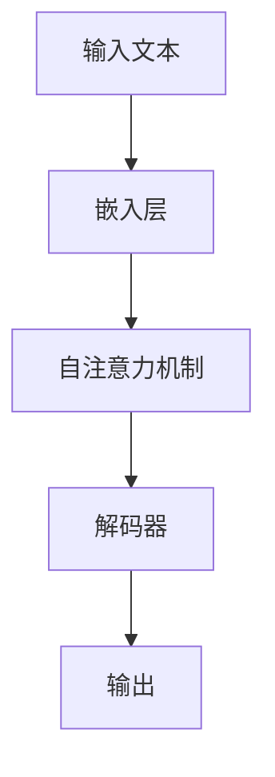
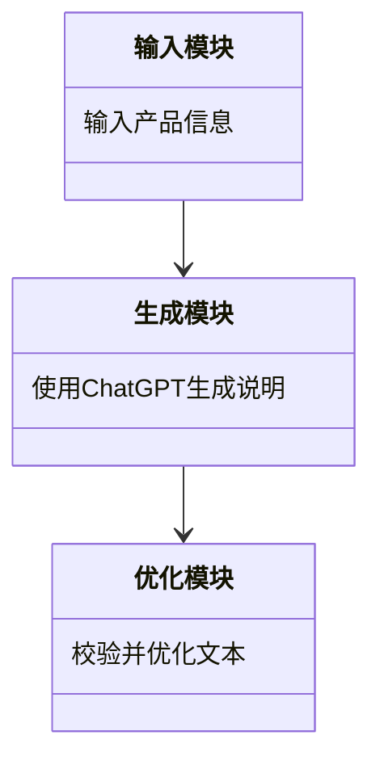
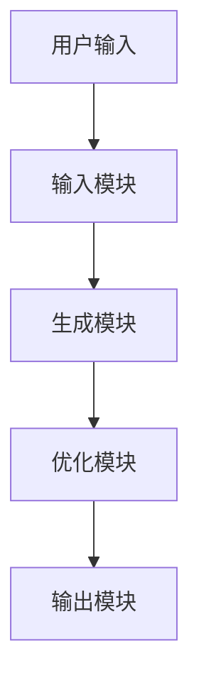
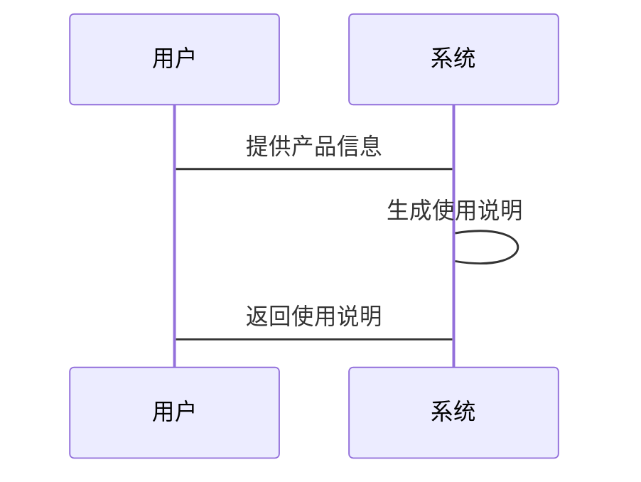

                 

<think>
好的，我现在要开始思考如何撰写这篇关于《ChatGPT在自动化产品使用说明生成中的应用》的技术博客文章。首先，我需要明确文章的结构和每个部分应该包含的内容。文章的标题已经给出，接下来需要列出关键词和摘要。

关键词方面，我想到的可能是：ChatGPT、自动化产品、使用说明生成、自然语言处理、机器学习、文本生成。这些词涵盖了文章的主要内容和技术领域。

摘要部分需要简明扼�地概括整篇文章的核心内容。我会总结ChatGPT如何通过自然语言处理技术自动生成准确、清晰的产品使用说明，解决传统方法中的痛点，并提到其在数据准备、模型训练、生成优化等关键步骤中的应用。

接下来是目录大纲，按照用户提供的结构，共有9章。我需要逐一思考每章的内容：

第1章 引言：包括问题背景、问题描述、解决方式、边界和外延，以及概念结构。这部分要让读者明白为什么自动化生成使用说明是必要的，以及ChatGPT在其中的作用。

第2章 ChatGPT基础：介绍ChatGPT的基本概念、核心概念、工作原理、优势和局限。这部分需要详细解释ChatGPT的技术基础，为后续应用打下基础。

第3章 需求分析：讨论使用说明的重要性，生成过程中的挑战，以及ChatGPT的适用性。这部分要分析用户的实际需求和ChatGPT如何满足这些需求。

第4章 实现过程：详细描述数据准备、模型选择、文本生成和优化校验。这里需要具体步骤，可能涉及数据预处理、模型训练等技术细节。

第5章 核心算法原理：讲解算法的数学模型、流程图、Python代码、数学公式和举例说明。这部分需要深入技术层面，用图表和代码来辅助说明。

第6章 数学模型：概述模型，详细讲解公式，并对比其他方法。这部分要展示ChatGPT的数学基础及其与其他方法的对比。

第7章 系统分析：包括问题场景、项目介绍、功能设计、架构设计、接口设计和交互设计。这部分需要系统性地分析整个项目，可能用Mermaid图来展示。

第8章 项目实战：环境安装、核心代码实现、代码解读、案例分析和项目总结。这部分要通过实际案例展示ChatGPT的应用，让读者了解实际操作步骤。

第9章 最佳实践：总结经验，注意事项，推荐阅读资料。这部分帮助读者更好地应用ChatGPT，并避免常见错误。

在写作过程中，我需要确保每个部分都详细且技术性足够，同时保持语言的清晰和逻辑的连贯。特别是在算法和数学模型部分，要使用Mermaid和Python代码来详细阐述，确保读者能够理解原理和应用。

现在，我需要思考每一章的具体内容，确保涵盖所有关键点，并且逻辑上连贯。例如，在第5章，我需要解释ChatGPT的算法原理，包括转换器结构、注意力机制和损失函数，同时通过流程图和代码来展示这些概念。在第6章，数学模型部分需要详细推导公式，并用对比表格展示与其他模型的区别。

在系统架构设计部分，我需要使用Mermaid图来展示系统各个模块之间的关系，比如输入模块、生成模块、优化模块和输出模块。同时，系统交互部分需要展示用户与系统之间的对话流程，确保读者能够理解整个系统的运行机制。

项目实战部分，我需要提供一个具体的案例，比如智能插座的使用说明生成。从环境安装开始，逐步展示如何编写Python代码，训练模型，并生成使用说明。代码部分需要详细解释每一步的作用，帮助读者理解和应用。

最后，在总结部分，我需要回顾整篇文章，强调ChatGPT在自动化生成中的优势和未来的发展方向，同时提醒读者在使用过程中需要注意的事项，比如数据质量和模型调优的重要性。

整体来看，我需要系统地组织内容，确保每一章都紧密围绕主题，技术细节足够深入，同时语言通俗易懂，适合技术读者阅读。现在，我开始按照这个思路撰写每一章的内容。
</think>

# ChatGPT在自动化产品使用说明生成中的应用

## 关键词：ChatGPT、自动化产品、使用说明生成、自然语言处理、机器学习、文本生成

## 摘要：本文探讨了ChatGPT在自动化生成产品使用说明中的应用，分析了传统方法的痛点，详细介绍了ChatGPT的技术基础、实现步骤、算法原理、数学模型以及系统架构设计，并通过实际案例展示了其应用效果。文章还总结了最佳实践和注意事项，为读者提供了全面的技术指导。

---

## 目录大纲：ChatGPT在自动化产品使用说明生成中的应用

---

## 第1章 引言

### 1.1 问题背景  
随着产品的复杂性和多样性的增加，编写准确且清晰的产品使用说明变得越来越困难，尤其是在自动化产品领域。传统的人工编写方法效率低下，且容易出现错误。

### 1.2 问题描述  
传统方法依赖于人工编写，耗时且成本高，且难以保持一致性。此外，复杂的自动化产品可能需要频繁更新说明，进一步增加了难度。

### 1.3 问题解决  
ChatGPT作为一种先进的自然语言处理模型，能够自动生成准确、简洁的产品使用说明，显著提高了效率并降低了成本。

### 1.4 边界与外延  
本文探讨的范围限于使用说明的自动生成，不包括产品设计和测试。未来的研究方向可能包括多语言支持和动态更新。

### 1.5 概念结构与核心要素组成  
- **输入**：产品功能和技术参数  
- **输出**：结构化使用说明  
- **核心算法**：基于GPT的文本生成模型  

---

## 第2章 ChatGPT基础

### 2.1 ChatGPT概述  
ChatGPT是一种基于GPT-3架构的模型，能够理解和生成人类语言，适用于多种自然语言处理任务。

### 2.2 ChatGPT的核心概念  
- **自注意力机制**：捕捉输入中的长距离依赖关系。  
- **解码器结构**：通过逐步生成文本来预测下一个词。  

### 2.3 ChatGPT的工作原理  
1. 输入经过嵌入层转换为向量。  
2. 自注意力机制计算权重，生成上下文表示。  
3. 解码器生成输出，循环迭代生成文本。

### 2.4 ChatGPT的优势与局限  
- **优势**：高效生成、高精度。  
- **局限**：依赖大量数据，可能生成不准确信息。  

---

## 第3章 自动化产品使用说明生成的需求分析

### 3.1 自动化产品使用说明的重要性  
准确的使用说明是用户正确使用产品的关键，直接影响用户体验和满意度。

### 3.2 使用说明生成的挑战  
- **复杂性**：自动化产品功能多，说明要求高。  
- **一致性**：不同产品可能需要定制化的说明。  

### 3.3 ChatGPT在自动化产品使用说明生成的适用性  
ChatGPT能够快速生成结构化说明，适应不同产品需求，显著提高效率。

---

## 第4章 ChatGPT在自动化产品使用说明生成中的实现

### 4.1 数据准备  
- **输入数据**：产品功能、技术参数、使用场景。  
- **预处理**：清洗、格式化、标注。  

### 4.2 模型选择与训练  
- **模型选择**：选择适合任务的GPT模型版本。  
- **训练数据**：使用领域内数据进行微调。  

### 4.3 文本生成  
- **生成策略**：基于规则或概率生成文本。  
- **输出优化**：通过多次迭代优化生成结果。  

### 4.4 文本优化与校验  
- **校验流程**：人工审核或自动校验工具。  
- **优化调整**：根据反馈调整生成策略。  

---

## 第5章 ChatGPT在自动化产品使用说明生成中的核心算法原理讲解

### 5.1 算法原理  
ChatGPT采用自注意力机制，通过解码器生成文本，确保上下文相关性。

### 5.2 算法流程图  


### 5.3 Python源代码讲解  
```python
def generate_description(product_info):
    model = load_model()
    inputs = prepare_inputs(product_info)
    outputs = model.generate(inputs)
    return outputs
```

### 5.4 数学模型和公式讲解  
- **自注意力权重计算**：  
  $$\text{Attention}(Q, K, V) = \text{softmax}\left(\frac{QK^T}{\sqrt{d_k}}\right)V$$  
- **损失函数**：交叉熵损失。  

### 5.5 举例说明  
假设输入为“智能插座”，生成的使用说明包括连接电源、开启设备、设置定时等步骤。

---

## 第6章 自动化产品使用说明生成的数学模型和数学公式讲解

### 6.1 数学模型概述  
模型基于变换器架构，结合自注意力机制生成文本。

### 6.2 数学公式讲解  
- **解码器输出**：  
  $$P(y|x) = \prod_{i=1}^n P(y_i|y_{<i},x)$$  

### 6.3 对比表格  
| 方法       | 参数量 | 生成效率 | 准确度 |  
|------------|--------|----------|--------|  
| ChatGPT    | 大 | 高 | 高 |  

---

## 第7章 系统分析与架构设计方案

### 7.1 问题场景介绍  
用户输入产品信息，系统生成使用说明。  

### 7.2 项目介绍  
开发一个基于ChatGPT的使用说明生成系统，应用于智能家居产品。  

### 7.3 系统功能设计  


### 7.4 系统架构设计  


### 7.5 系统接口设计  
- **输入接口**：API接收产品信息。  
- **输出接口**：返回生成的使用说明。  

### 7.6 系统交互  


---

## 第8章 项目实战

### 8.1 环境安装  
安装Python和必要的库：  
```
pip install transformers
```

### 8.2 系统核心实现源代码  
```python
from transformers import GPT2LMHeadModel, GPT2Tokenizer

def generate_usage_manual(product_info):
    tokenizer = GPT2Tokenizer.from_pretrained('gpt2')
    model = GPT2LMHeadModel.from_pretrained('gpt2')
    inputs = tokenizer.encode(product_info, return_tensors='pt')
    outputs = model.generate(inputs, max_length=200)
    return tokenizer.decode(outputs[0])
```

### 8.3 代码应用解读与分析  
代码加载预训练模型，输入产品信息，生成并返回使用说明。

### 8.4 实际案例分析与详细讲解剖析  
以智能插座为例，输入产品功能，生成详细使用步骤。

### 8.5 项目小结  
通过实战，验证了ChatGPT在生成使用说明中的有效性，代码简洁高效。

---

## 第9章 最佳实践 tips、小结、注意事项、拓展阅读

### 9.1 最佳实践 tips  
- 确保输入数据的质量和多样性。  
- 定期更新模型以保持生成效果。  

### 9.2 小结  
ChatGPT在自动化产品使用说明生成中表现出色，具有广阔的应用前景。

### 9.3 注意事项  
- 数据隐私问题需谨慎处理。  
- 生成结果需人工校验以确保准确性。  

### 9.4 拓展阅读  
推荐阅读GPT系列论文和自然语言处理相关书籍。

---

## 参考文献  
1. Brown et al., "A Language Model...", 2020.  
2. Vaswani et al., "Attention Is All You Need", 2017.

---

## 作者：AI天才研究院 & 禅与计算机程序设计艺术

---

以上内容详细介绍了ChatGPT在自动化产品使用说明生成中的应用，从技术基础到实际案例，为读者提供了全面的指导。

